# Neo4j vs GRAKN 第一部分:基础知识

> 原文：<https://towardsdatascience.com/neo4j-vs-grakn-part-i-basics-f2fe3511ce88?source=collection_archive---------4----------------------->

## 两个最流行的知识库之间的详尽比较

亲爱的读者，在这一系列文章中，我比较了两个流行的知识库:Neo4j 和 Grakn。很久以前，我就决定应你的要求写这篇比较，然而，命运就是现在😊

这是一个分三部分的详细比较:第一部分致力于技术细节，第二部分深入语义和建模的细节。简介部分给出了 Neo4j 和 Grakn 如何工作的快速信息，以及它们带给我们的新内容的一些细节。如果你已经知道了第一部分，你可以直接进入语义能力部分。第三部分致力于比较图算法，推荐系统的核心和社会网络。该系列将继续图形学习，聊天机器人 NLU 和更多的两个平台的语义。

在本文中，我将简要比较 Neo4j 的做法与 Grakn 的做法有何不同。正如你将遵循的例子，如何创建一个模式，如何插入，删除和查询；你会注意到范式的不同。这部分不是战斗，而是比较。

我知道你等不及看内容了，让我们开始比较吧…以下是一些亮点:

## Grakn 的工作原理

`Grakn is the knowledge graph, Graql is the query language` notes Grakn 主页。Grakn 是知识图，完全真实；但是 Graql 语言是面向数据的，类似于本体论。Graql 是声明性的，*定义*数据，*操作*数据。我们将在接下来的章节中看到更多关于 Graql 的内容。

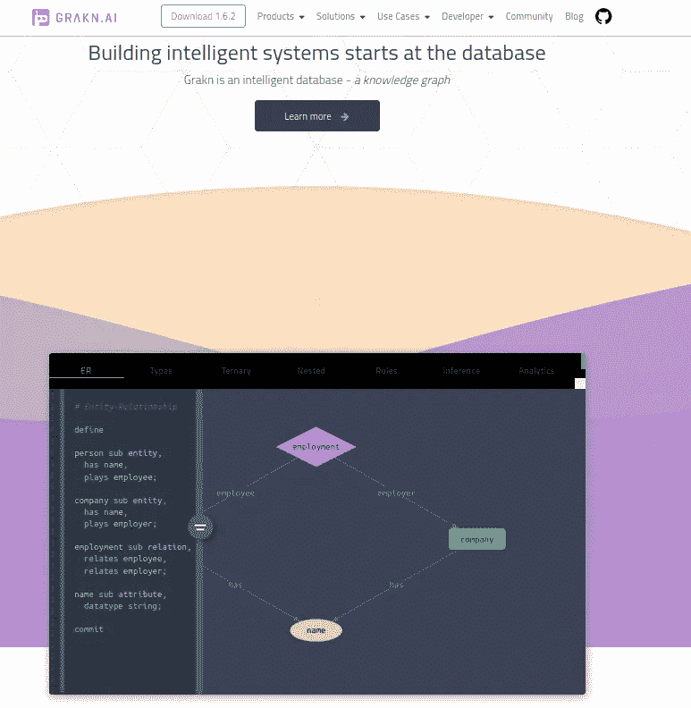

Grakn:专注于知识表示，而不是放弃图形

在我看来 Grakn 是知识库，Graql 是面向数据的查询语言；所有这些都建立在一个图形数据结构上，但是*你永远感觉不到图形在那里*。他们的网站是这样描述的:

```
When writing Graql queries, we simply describe **what** information we would like to retrieve, rather than **how** should it be obtained. Once we specify the target information to retrieve, the Graql query  processor will take care of finding an optimal way to retrieve it. 
```

当我第一次见到 Grakn 时，我想`this is a knowledge modeler`并且我仍然有同样的感觉。Grakn 到底是什么的最佳解释来自[他们自己](https://blog.grakn.ai/get-started-with-grakn-ai-72bb210f915c):

```
Grakn is a database in the form of a knowledge graph, that uses an  intuitive ontology to model extremely complex datasets. It stores data  in a way that allows machines to understand the meaning of information in the complete context of their relationships. Consequently, Grakn allows computers to process complex information more intelligently with less human interventionGraql is a declarative, knowledge-oriented graph query language that uses machine reasoning for retrieving explicitly stored and implicitly derived knowledge from  Grakn.
```

正如我以前说过的，尽管他们自己说的是`Grakn is a database`，我仍然提出我的反对意见，坚持认为 Grakn 是一个知识库😄

## Neo4j 的工作原理

Neo4j 是一个图形外观的知识图😄虽然我在他们的主页上看到过一次`connected data`,但是人们必须浏览他们的文档才能看到他们实际带来的语义:

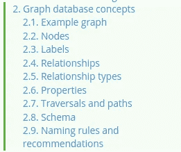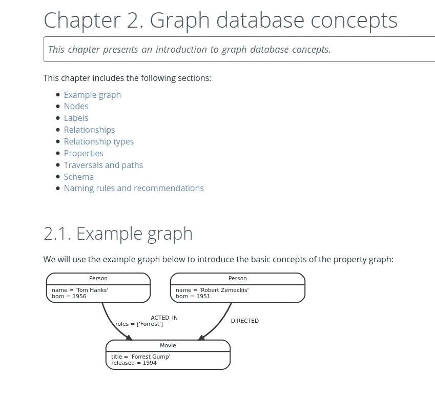

Neo4j:看起来只是一个图形数据库，但实际上是一个知识图。

虽然他们只在头版写了一个`graph database`，但我非常不同意。Neo4j 绝对是知识图谱。可以看到关系、类、实例、属性，即模式定义。这是语义学，就是这样。Neo4j 绝对不仅仅是一个图形数据库，一个可以建模的知识。

## Grakn 如何战胜 OWL

好吧，如果我们已经可以写下一些 OWL，那么我们为什么要用 Grakn 来代替呢，有人可能会想。Grakn 在他们的[帖子](https://blog.grakn.ai/knowledge-graph-representation-grakn-ai-or-owl-506065bd3f24)中详细解释了这个问题。对我来说，first plus 绝对是 Graql，读写方便。OWL 通常由[的门徒](https://protege.stanford.edu/)或其他类似的框架创建，生成的 XML 基本上是不可读的。下面在 OWL-XML 和 Graql 中找到相同的`descends`关系:

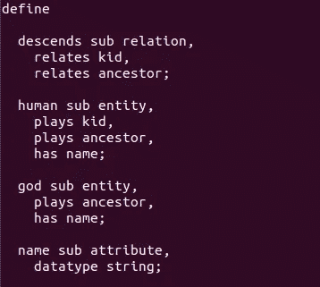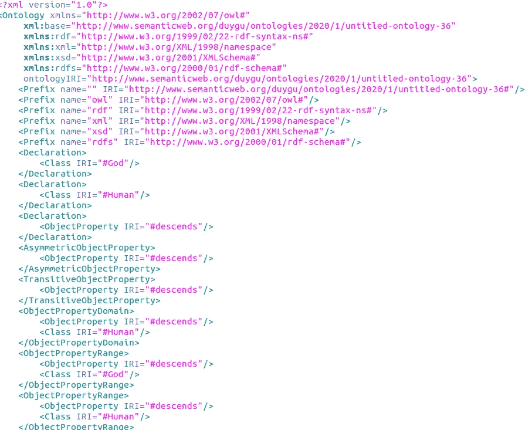

Graql 和 OWL-XML 中的下降关系。

从生产的角度来看，Grakn

*   可攀登的
*   高效
*   拥有 Python、Java、Node.js 客户端
*   被包装成一个完整的框架

…即生产就绪。从发展的角度来看

*   查询得到了高度优化
*   底层数据结构对于语义建模是灵活的
*   还提供了图形算法。

从语义学的角度来看，Grakn 更有力量；数据模型

*   易于更新/添加
*   允许抽象类型(我们将谈到这一点)
*   与 OWL 相比有一个巨大的优势，它保证了逻辑完整性。OWL 有一个开放世界的假设，而 Grakn 提供了开放世界和封闭世界假设的别致组合。您可以在逻辑完整性部分了解更多信息。
*   通常允许更多的抽象细节。例如，底层超图允许 n 元关系。在 OWL 中建模 n 元关系有点痛苦，这里有一个完整的描述。

## Neo4j 带来了什么

老实说，我不知道从哪里开始。Neo4j 以提供连接数据在 NoSQL 世界大放异彩，以其[卓越的后端](https://neo4j.com/blog/neo4j-graph-database-3-4-ga-release/)和高性能在图形数据库中大放异彩。与许多其他图形数据库不同，Neo4j 提供了

*   快速读写
*   高可用性
*   水平缩放。水平扩展是通过两种类型的集群实现的:高可用性集群和因果集群。
*   缓存分片
*   多聚类
*   没有连接。数据通过边连接，不需要复杂的连接来检索连接/相关的数据
*   粒度安全。

就我个人而言，在阅读 Neo4j 无与伦比的可伸缩性技能时，我从椅子上摔了下来。我强烈推荐访问相应的[页面](https://neo4j.com/whats-new-in-neo4j/)。警告:你也可能坠入爱河，❤️

从数据角度来看，Neo4j 提供

*   时态数据支持
*   3D 空间数据支持
*   实时分析。

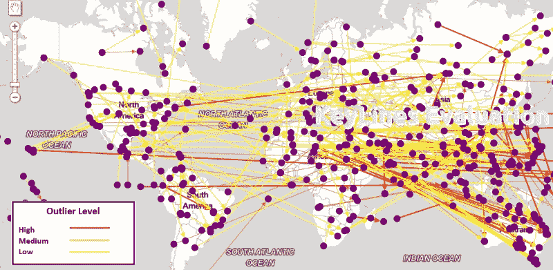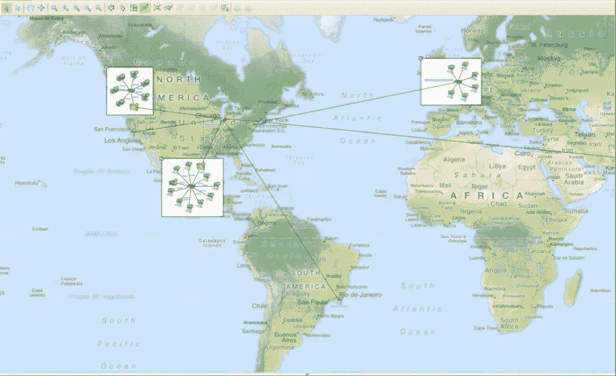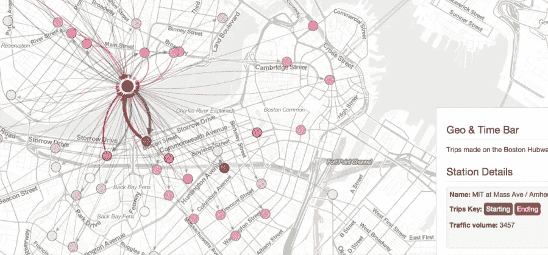

从左上开始:寻找有价值的异常值，以不同的方式表示连通性，查询和可视化空间数据。全部摘自 Neo4j 主页。

如果你想建立一个社交网络模型，建立一个推荐系统或为任何其他任务建立连接数据模型；如果您想要操作时间或空间数据，想要一个可伸缩、高性能、安全的应用程序，那么 Neo4j 是您的最佳选择。这里不再多言。

## 入门指南

开始使用 Grakn 很容易:首先一个[安装](https://dev.grakn.ai/docs/running-grakn/install-and-run#system-requirements)Grakn，然后制作一个`grakn server start`。之后，可以使用 [Grakn 控制台](https://dev.grakn.ai/docs/running-grakn/console)或 [Grakn 工作台](https://dev.grakn.ai/docs/workbase/overview)工作。

同样适用于 Neo4j，[下载](https://neo4j.com/download/)和[安装](https://neo4j.com/docs/operations-manual/current/installation/)以非常专业的方式提供。如果你需要，Docker 配置和框架配置手册也在那里。之后可以下载 Neo4j [浏览器](https://neo4j.com/developer/neo4j-browser/)开始玩或者可以发现后端[更多](https://neo4j.com/developer/kb/how-neo4j-browser-interacts-with-neo4j-server/)。你也可以不用通过他们的[沙箱](https://neo4j.com/sandbox-v3/)下载就可以试验 Neo4j，我真的很喜欢。您可以在没有任何下载拥挤的情况下玩游戏。

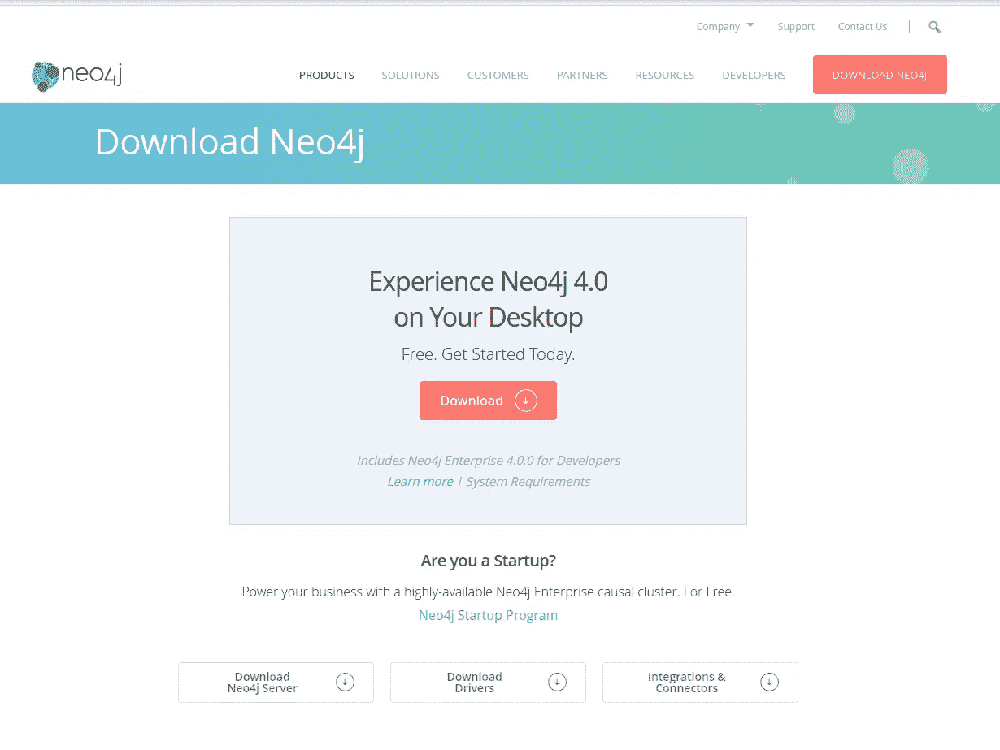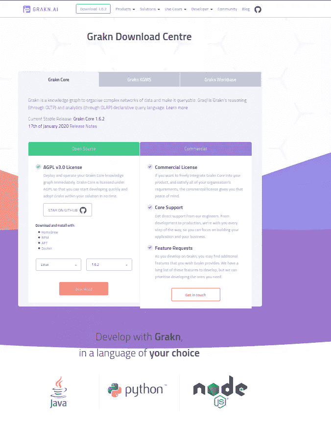

Neo4j 和 Grakn 下载页面

我必须说，我完全爱上了 Neo4j 文档，因为边注，努力和专业水平是巨大的。

## 开发环境和可视化

Grakn 和 Neo4j 都提供了易于使用和可视化的 ide。

[Grakn workbase](https://github.com/graknlabs/workbase) 提供了两个功能:知识图的可视化和与模式交互的简单方式。您可以在工作库中执行`match-get`查询和`path`查询。

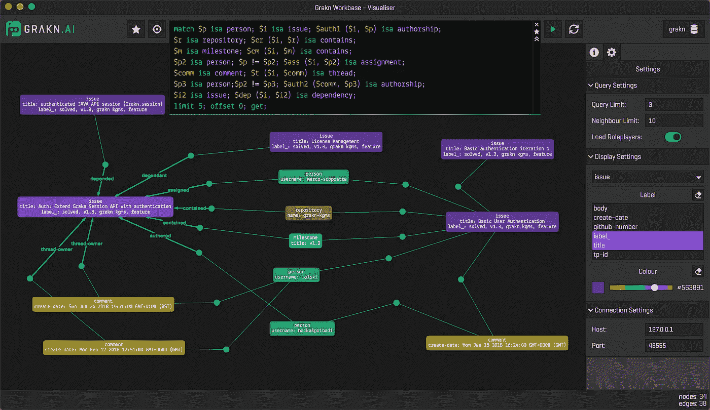

使用 Grakn workbase 进行查询，照片取自他们的 Github

Neo4j 提供他们的浏览器也有两个目的:简单的交互和可视化。人们还可以在他们的图形中探索模式、聚类和遍历。

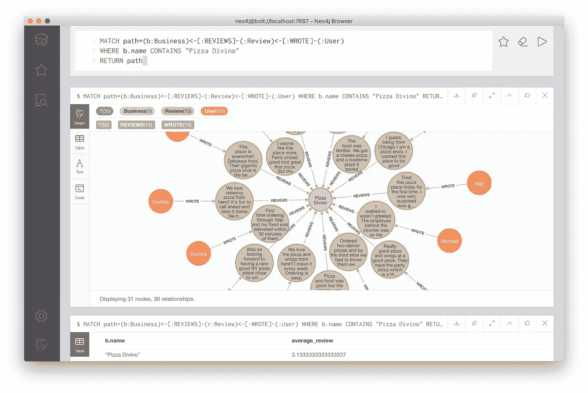

在 Neo4j 浏览器中查询，摘自他们的文档

此外，Neo4j 提供了更多用于可视化的 [Neo4j Bloom](https://neo4j.com/blog/introducing-neo4j-bloom-graph-data-visualization-for-everyone/) 和[其他用于可视化的开发工具](https://neo4j.com/developer/tools-graph-visualization/)，主要是 JS [集成](https://medium.com/neo4j/graph-visualization-with-neo4j-using-neovis-js-a2ecaaa7c379)。使用 Neo4j Bloom，您可以发现集群、模式等。

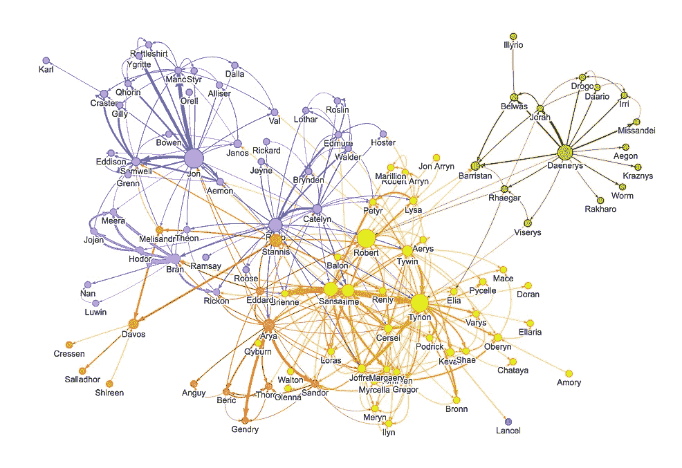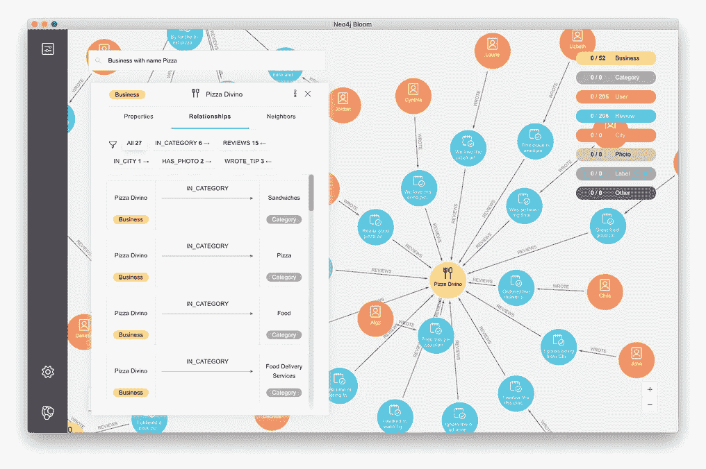

聚类和链接探索与布鲁姆，图片取自他们的网站和媒体开发博客

这还没有结束，Neo4j 有[甚至更多的](https://neo4j.com/developer/other-graph-visualizations/)可视化工具用于[空间数据](https://medium.com/neo4j/working-with-neo4j-date-and-spatial-types-in-a-react-js-app-5475b5042b50)和 3D。一般来说，Neo4j 是空间数据的大师，但可视化工具将 Neo4j 带到了一个不同的水平:

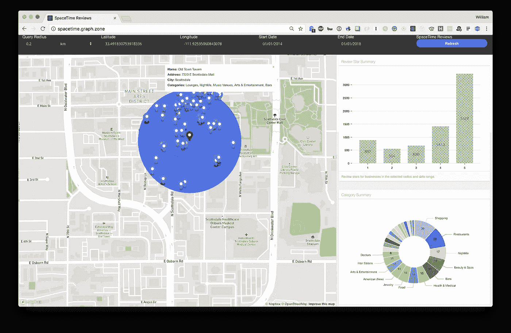

Neo4j 地图数据可视化，取自他们的媒体开发者博客

两个平台都提供了很好的可视化效果，Neo4j 由于较老而提供了更多😄

我们已经介绍了这两个平台的基础知识，现在我们可以进入开发细节了。

## 底层数据结构

简称 Grakn 为[超图](https://blog.grakn.ai/modelling-data-with-hypergraphs-edff1e12edf0)，Neo4j 为有向图。如果你进一步对 Neo4j 如何存储他的节点、关系和属性感兴趣，你可以访问他们的[开发者手册](https://neo4j.com/developer/kb/understanding-data-on-disk/)或者[堆栈溢出问题](https://stackoverflow.com/questions/24366078/how-neo4j-stores-data-internally)。

## 数据建模

数据建模是我们从老猫头鹰那里学到的方法。

Neo4j 使用知识图概念:节点(实例)、标签(类)、关系、关系类型(属性)和属性(数据属性)。

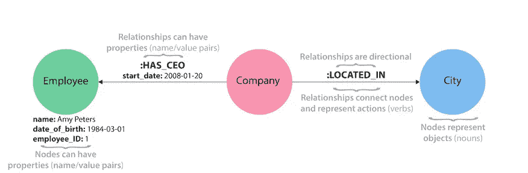

具有图形概念的建模知识，图片取自 Neo4j 文档

Grakn 风格的知识建模更接近于本体方式、声明性和更面向语义。观念是:

*   实体(类)
*   例子
*   属性
*   角色
*   规则
*   类型层次结构
*   抽象类型

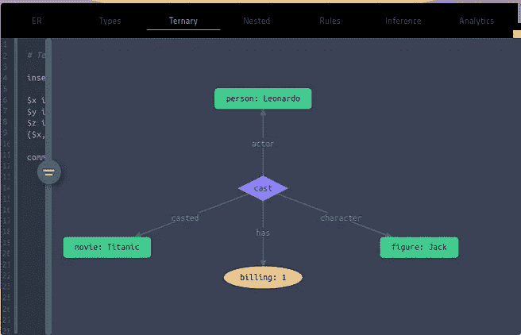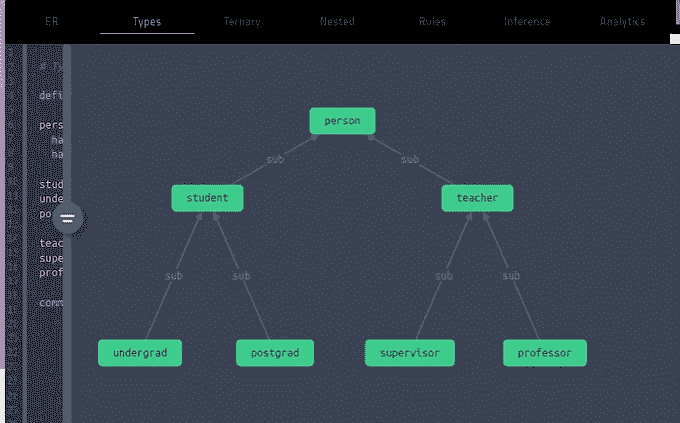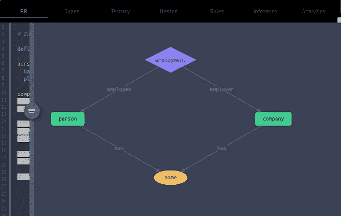

Grakn 建模，实体关系，子实体，三元关系。摘自他们的头版。

如果你更多地走上本体论一边，Grakn 的思维方式确实是类似的。建模容易，提供语义能力和效率。

## 查询语言

Graql 是声明性的，更面向数据。Neo4j 的 Cypher 也是声明性的，但是风格是 SQL。对我来说，Graql 感觉像本体，Cypher 感觉像数据库查询。比较以下两种语言中的简单查询:

```
//CypherMATCH (p:Person { name: "Duygu" })
RETURN p//Graql
match
  $p isa person, has name "Duygu";
get $p;
```

我个人认为 Graql 在语义上更友好。

## 创建模式

在 Grakn 中创建模式很容易，记住 Graql 是声明性的。基本上，你打开一个`.gql`文件，开始创建你的模式，就是这样😄。这是他们首页的一个例子:

```
define

person sub entity,
  has name,
  plays employee;

company sub entity,
  has name,
  plays employer;

employment sub relation,
  relates employee,
  relates employer;

name sub attribute,
  datatype string;
```

Neo4j 创建实体和实例的方式是`CREATE`。一旦创建了这些节点，就可以进行一个`MATCH`查询来获得相应的节点，并在它们之间创建一个关系。一个创建节点、边及其属性:

```
CREATE (d:Person { name:"Duygu"})
CREATE (g:Company {name: "German Autolabs"})MATCH (a:Person),(b:Company)
WHERE a.name = 'Duygu' AND b.name = 'German Autolabs'
CREATE (a)-[r:Employed { since: '2018' }]->(b)
RETURN type(r), r.name
```

## 询问

Graql 是声明性的，查询又是本体论的方式。通过`match`子句进行查询。以下是一些关于银行客户的简单查询:

```
match $p isa customer; get;match $p isa customer, has first-name "Rebecca"; get;match $p isa customer, has full-name $fn; { $fn contains "Rebecca"; } or { $fn contains "Michell"; }; get;
```

到目前为止一切顺利。现在，我们可以从客户那里获得一些见解。这是对`average debt of the Mastercard owner customers, who are younger than 25`的查询:

```
match
  $person isa customer, has age < 25;
  $card isa credit-card, has type "Mastercard";
  (customer: $person, credit-card: $card) isa contract, has debt $debt;
get $debt; mean $debt;
```

看起来很干净。Neo4j 怎么样？密码查询也是由`MATCH`子句完成的，但是语法完全不同；更确切地说是一个带有`WHERE`的数据库匹配风格。有`WHERE`的时候，也可以玩一些串法游戏😄：

```
MATCH (customer:Customer)
RETURN customerMATCH (customer:Customer)
WHERE customer.first_name = 'Rebecca'
RETURN customer//or equivalently with a bit syntactic sugarMATCH (customer:Customer {first_name: "Rebecca"})
RETURN customer//MATCH (customer:Customer)
WHERE p.first_name STARTS WITH 'Steph'
RETURN p
```

谈到关系，我们需要通过箭头关注边缘方向。以下是对驾驶奥迪的银行客户的查询；注意`DRIVES`关系是从客户指向他们的汽车的:

```
MATCH (car:Car {brand: "Audi"})<-[:DRIVES]-(customers)
RETURN customers.first_name
```

[聚合](https://neo4j.com/docs/cypher-manual/current/functions/aggregating/#functions-avg)也类似于 SQL，下面是对年轻的万事达卡用户客户的债务的相同查询:

```
MATCH (customer:Customer)-[:OWNS]->(card:CreditCard {type: "Mastercard"})
WHERE customer.age < 25 
RETURN AVG(card.debt)
```

SQL 语法适用于一般的 Cypher 查询，如果你喜欢写 SQL，那么你一定会对 Cypher 如鱼得水。这是一个查找具有最多属性的节点的查询:

```
MATCH (n)
RETURN labels(n), keys(n), size(keys(n)), count(*)
ORDER BY size(keys(n)) DESC
```

回到语义，可以查询实体/实例如何相关:

```
MATCH (:Person { name: "Oliver Stone" })-[r]->(movie)
RETURN type(r) //DIRECTED 
```

“连接”呢，即关于相关节点的查询？人们通常像在 Grakn 中一样处理这样的查询，只是多了一些实例和更多的关系箭头:

```
//Name of the movies that Charlee Sheen acted and their directorsMATCH (charlie { name: 'Charlie Sheen' })-[:ACTED_IN]->(movie)<-[:DIRECTED]-(director)
RETURN movie.title, director.name
```

我一次又一次地强调 Neo4j 是一个图形，现在让我们看看它是如何工作的……我们可以用 Cypher 生成`path queries`,或者用`path restrictions`生成常见的语义查询。

假设您有一个社交网络，您想要查找与 Alicia 的距离为 2 的所有人，以及谁在哪个方向跟随谁并不重要:

```
MATCH (p1:Person)-[:FOLLOWS*1..2]-(p2:Person)
WHERE p1.name = "Alicia"
RETURN p1, p2
```

当然，最短路径是社交网络中的经典，你可能想知道艾丽西娅和艾蜜蕊的社交联系有多紧密:

```
MATCH p = shortestPath((p1:Person)-[*]-(p2:Person))
WHERE p1.name = "Alicia" AND p2.name = 'Amerie'
RETURN p
```

这样，我们可以通过任何关系类型寻找最短路径。如果我们需要，我们可以用`[:FOLLOWS]`代替`[*]`来指定我们需要这个关系。(可能还有其他关系类型，上同一所大学，住在同一座城市……)

正如你所看到的，Cypher 提供的远比你看到的要多。诚然，语法看起来像 SQL …但故事是非常不同的，图的概念和语义的概念满足燃料 Neo4j。

## 推理

语义推理机从 RDF 时代就存在了。从图式知识和已有的数据中推断新的关系和事实对人脑来说很容易，但对知识库系统来说就不那么简单了。我们是否允许开放世界的假设(如果你不确定某件事并不意味着它是错的，你只是不知道)；世界是由我们已经知道的东西组成的吗(当一个看不见的实体来到我们的封闭世界时会发生什么)，我们应该推断多少，我们应该允许长路径吗… [Hermit](http://www.hermit-reasoner.com/) 是 OWL 的一个流行选择(我也用过)，它可以作为 Protégé的一个插件使用。

Neo4j 中的推理没有内置工具。在这里我将介绍 Grakn 是如何处理它的。

Grakn 中的推理通过`rules`处理。下面是他们如何描述规则的:

```
Grakn is capable of reasoning over data via pre-defined rules. Graql  rules look for a given pattern in the dataset and when found, create the given queryable relation.Graql reasoning is performed at query time and is guaranteed to be complete.
```

让我们看一个兄弟姐妹规则的例子，如果两个人有相同的父母；那么可以推断他们是兄弟姐妹。如何用 Grakn 表示这个推论如下:

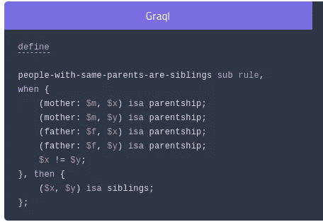

兄弟推理规则，取自 Grakn 文档

Grakn 规则的创建是直观的:`when`满足一些条件，`then`我们应该推断出以下事实。我发现语法令人耳目一新。特别是在药物发现和任何其他种类的发现任务中，人们需要 100%的推理。如果我参与到发现类型的任务中，我只会因为这个原因而使用 Grakn。

## **逻辑完整性**

一旦您创建了您的模式并且可以推断新的关系，之后您会希望您的模式保持不变，并且不允许不正确的数据进入您的模型。例如，你可能不希望在一个`person`和一个`carpet`之间有一个`marriage`关系(尽管人+树在世界的某些地方是合法的😄).

尽管 Neo4j 在他们的文档中有[约束](https://neo4j.com/docs/cypher-manual/current/administration/constraints/)，但是这些只是用于数据验证和空值检查的数据库约定:

```
Neo4j helps enforce data integrity with the use of constraints.  Constraints can be applied to either nodes or relationships. Unique node  property constraints can be created, as well as node and relationship  property existence constraints.
```

Graql 通过`roles`确保逻辑完整性，正如你在上面的例子中看到的，每个角色来自一个类。同样，对于发现类型的任务，这是必需的。

## 可量测性

两者都是超级可扩展的。我在上面讲了很多关于 Neo4j 可伸缩性的内容，但是对 Grakn 的可伸缩性保密😄Grakn 利用了幕后的 Cassandra，因此 Grakn 非常具有一致性、可伸缩性和容错性。

## 图形算法

是下一篇文章的主题。你将不得不等待 2 个以上的职位😉

## Grakn 世界 vs Neo4j 世界

…看起来非常不同，但同时又非常相似。Grakn 的方式更面向知识，Neo4j 感觉图形味道更浓一些。两个框架都很吸引人，那么只剩下一个问题:谁更好？接下来即将到来的是 Grakn 和 Neo4j 之间的语义大战😉

亲爱的读者们，这篇令人筋疲力尽的文章已经接近尾声，但我还不想挥手告别😄请继续阅读第二部分，和我一起探索迷人的语义世界。在那之前，请小心，愉快地黑吧。👋