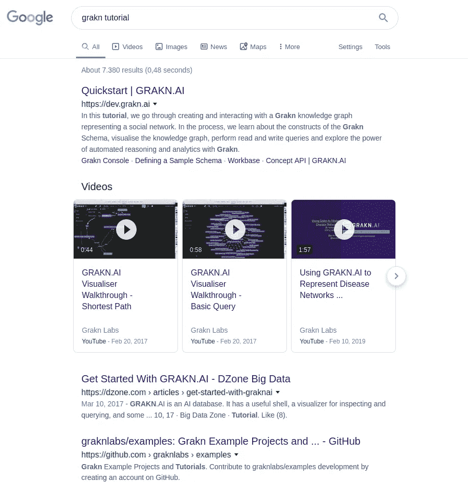
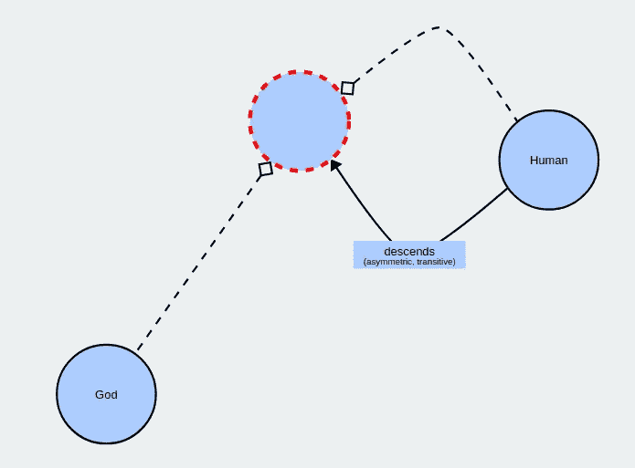
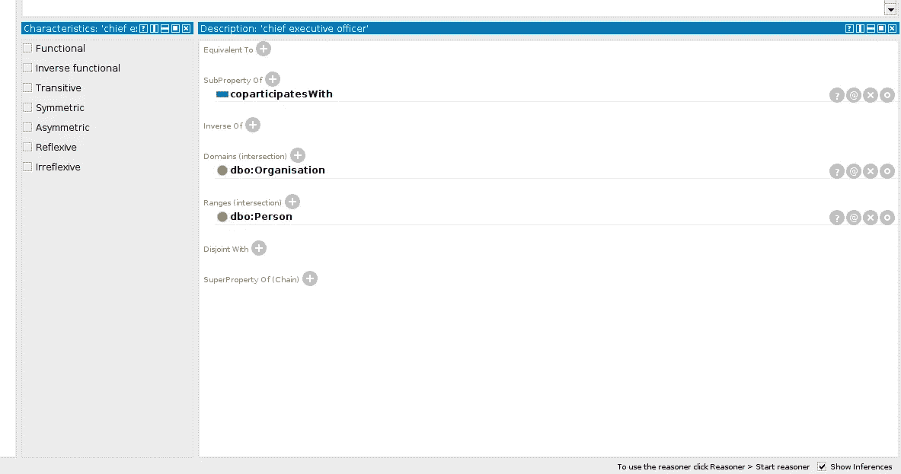
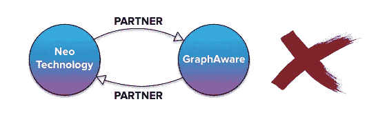
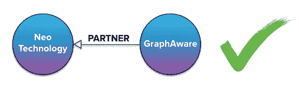

# Neo4j vs GRAKN 第二部分:语义

> 原文：<https://towardsdatascience.com/neo4j-vs-grakn-part-ii-semantics-11a0847ae7a2?source=collection_archive---------13----------------------->

## 语义之战:谁对数据建模更好？

亲爱的读者，在这一部分，我将带你进入语义学的世界。在第一部分中，我们从总体上比较了 Grakn 和 Neo4j 世界，以了解范式差异如何导致不同的做事方式。在本文中，Grakn 和 Neo4j 将在建模和表示能力方面展开竞争，这是一场旨在征服语义世界的肉搏战😄

在我职业生涯的早期，我从事知识工程(我从事搜索引擎维基化组件)。让我惊讶的是，在过去的 10 年里，知识图在可伸缩性、语言支持、开发者/用户界面、高效存储方面有了巨大的改进；但是就语义表达能力而言，没有什么能改变那么多。仍然有实例、关系、阶级和我们，那些努力尝试赋予意义的人。不管你是初学者还是更高级的，都没有区别。我们都知道这样一个事实:对任何一种语义收费都是困难的。这完全是另一个故事，我将在图形学习和知识库支持的聊天机器人帖子(即将推出)中详细介绍。

我不会让你等太久，让战斗开始吧:

# 1.文档和社区

对于任何开源项目来说，最重要的是文档和社区支持。

Neo4j 提供了[文档、](https://neo4j.com/developer/get-started/) [视频教程、](https://neo4j.com/graphacademy/online-training/introduction-to-neo4j/) [一个胖 Github](https://github.com/neo4j) 、一个[社区](https://community.neo4j.com/)和一个 [Stackoverflow 存档](https://stackoverflow.com/questions/tagged/neo4j)。如果我搜索`Neo4j tutorial`和`GRAKN tutorial`，我会看到:



看起来相当棒

Grakn 提供了[文档](https://dev.grakn.ai/docs/general/quickstart)，[教程](https://www.youtube.com/channel/UCwSkFrXPcQT2zo3XVWWFhUw)，[充满示例的 Github repo，](https://github.com/graknlabs/grakn) [一个社区](https://grakn.ai/community)以及自己的 [Stackoverflow 空间](https://stackoverflow.com/questions/tagged/grakn)。我看到了精彩的文档和社区对这两者的支持。

Neo4j: 10/10，Grakn: 10/10

# 2.语言支持

Grakn 提供 Java、Node.js 和 Python 客户端，涵盖了现代开发栈的相当一部分。Neo4j 在这方面提供了更多的变化；他们正式支持的驱动程序。NET、Java、JavaScript、Go 和 Python。Ruby、PHP、Erlang 和 PERL 驱动程序由社区贡献者提供。我发现 Grakn 的语言支持对于现代开发来说足够且体面；然而，Neo4j 因其提供的多样性而大放异彩。Neo4j 相对轻松地赢得了这一轮。不支持 C++，我各扣一分😄

Neo4j: 9/10，Grakn: 8/10

# 3.OWL 导入

如果一个人从事知识表示或关联数据方面的工作，很可能他已经拥有大量 OWL 格式的本体资源。Grakn 没有直接导入 OWL 文件的方法，必须解析文件并创建自己的 Grakn 本体。更多关于这个问题的消息来自他们自己的口:【https://discuss.grakn.ai/t/migrating-owl-to-grakn/556】T2，尽管他们有一个 XML 导入器。加载器是 JSON、CSV 和 XML。

来到 Neo4j 情况就有点不一样了。Neo4j 团队似乎花了很大力气给他们的图形方法带来更多语义，并构建了`neosemantics`。这个[贡献](https://github.com/neo4j-labs/neosemantics)包括了关于 [RDF 导入](https://neo4j.com/docs/labs/nsmntx/current/import/)、 [OWL 导入](https://neo4j.com/docs/labs/nsmntx/current/importing-ontologies/)的综合页面以及对它们的推理/推论。我觉得这种努力令人印象深刻。`Neo4j`还如预期支持 XML、CSV、JSON 导入。你也可以阅读[这篇文章](https://lju-lazarevic.github.io/ImportingRDFSOWL.html)了解更多猫头鹰& Neo4j duo，我真的很喜欢它。

Neo4j: 8/10 表示努力，Grakn: 8/10 表示提供了一种本体语言

# 4.语义关系

OWL 支持许多属性特征，包括自反性、非自反性、传递性、对称性、非对称性……如果你想建立一个*友谊网络*你需要*对称性*(友谊是相互的，如果 Carry 是 Barry 的朋友，Barry 当然是 Carry 的朋友)；如果你需要一个希腊神话的模型，你需要*及物性*:奥德修斯是赫尔墨斯的曾孙，特勒戈诺斯是奥德修斯和泰坦喀尔刻的儿子，那么显然特勒戈诺斯是赫尔墨斯的后代。



下降关系:传递和不对称。猫头鹰风格，在被保护人内部拍摄的照片

这是 OWL 在游戏中发挥其全部语义力量的地方，使自己区别于 RDFS 和其他三联商店或图形信息持有者。OWL 从来没有像 T2 一样成为一个裸露的信息容器，它允许开发者对有意义的现实世界关系进行建模。



OWL 支持的酒店特征，在被保护人内部拍摄的照片

语义关系是充分发挥语义力量的必要条件。我尝试了一下如何定义与 Grakn 的对称关系:

```
friendship isa relation-type
  relates friend;person isa entity-type,  
  plays-role friend;
```

定义传递关系有点棘手，但是[可行](https://stackoverflow.com/questions/58802094/how-to-define-a-transitive-relation-in-graql)😉Grakn 的思维方式通常侧重于本体和知识表示(即使底层存储是一个图)，如果您熟悉 OWL，Grakn 会有宾至如归的感觉。

来到 Neo4j 思维方式，Neo4j 是知识图，他喜欢做图。那么在这一点上，人们应该只把*关系看作是边。我看不出在创建时间上限制关系的直接方法。Neo4j 通常不允许无方向的边，然后创建一个具有任意方向的关系，并在查询时丢弃边方向[，就像这样](https://graphaware.com/neo4j/2013/10/11/neo4j-bidirectional-relationships.html):*



出于效率和空间原因，创建具有任意方向的边。摘自上面的链接。

查询看起来像:

```
//find all partner companies of Neo4j MATCH (neo)-[:PARTNER]-(partner) which is union of MATCH (neo)-[:PARTNER]->(partner)  (edge is directed to partner)
and
MATCH (neo)<-[:PARTNER]-(partner)  (edge is directed to neo)(notice the edge directions)
```

传递关系和传递性在 Neo4j 中非常重要😉我们在图形算法的文章中探讨了这个问题。更多关于 Neo4j 的关系，你可以[访问](https://medium.com/neo4j/graph-data-modeling-all-about-relationships-5060e46820ce)。

我们已经看到 Grakn 喜欢做超图。与 Neo4j 不同，超图提供了一个宽松的节点/边概念，并允许 Grakn 关系涉及两个以上的角色。

```
define

law-suit sub relation,
  relates court,
  relates judge,
  relates DA,
  relates defendant;person sub entity,
  has name,
  plays judge,
  plays DA,
  plays defendant;name sub attribute,
  datatype string;
```

你可以在 Grakn [博客](https://blog.grakn.ai/modelling-data-with-hypergraphs-edff1e12edf0)上阅读更多关于这个主题的内容。这是对真实世界数据建模的一个非常重要的特性，否则人们必须经历许多不必要的痛苦，类似于 [OWL ways](https://www.w3.org/TR/swbp-n-aryRelations/) 。

# 5.推理者

Grakn 中的推理通过`inference rules`工作。如何定义规则相当简单，在模式创建期间创建推理规则集。根据文档，规则不是直接存储在图中，而是根据查询时间进行推断。推理规则看起来像

```
define rule-id sub rule,
  when LHS then RHS;
```

显而易见的是:如果满足左侧*的条件*，那么请推断右侧*的条件*。让我们看一个例子，这是人们如何自然地定义一个 being [siblings](https://dev.grakn.ai/docs/schema/rules) 关系:

```
define

people-with-same-parents-are-siblings sub rule,
when {
    (mother: $m, $x) isa parentship;
    (mother: $m, $y) isa parentship;
    (father: $f, $x) isa parentship;
    (father: $f, $y) isa parentship;
    $x != $y;
}, then {
    ($x, $y) isa siblings;
};
```

RHS 可以描述一个推断的关系，或者一个实体的一些属性。例如，在这个如何推断城市大洲的例子中，RHS 是关于实体-属性关系的推断，即`has:`

```
city-in-continent sub inference-rule,
when { 
(contains-city: $country1, in-country: $city1) isa has-city;           $country1 has continent $continent1;
}then 
{ 
$city1 has inf-continent $continent1; 
};
```

如你所见，人们可以推断实体、属性和关系，也就是节点、属性和边。我真的很喜欢 Grakn 的方式，Graql 的语义美在这一点上闪闪发光。效率对我的观察也很好。如果想了解更多，可以跳转到[这篇帖子](https://blog.grakn.ai/inference-made-simple-f333fd8abce4)。

如你所见，推理是 Graql 的核心部分，不幸的是 Cypher 没有内置推理。Neo4j 仍然没有放弃，并且[新语义](https://github.com/neo4j-labs/neosemantics)再次发挥作用以获得更多语义。正如在[文档](https://neo4j.com/docs/labs/nsmntx/current/inference/)中所描述的，可以推断出`WHERE`子句中导入的本体的节点和关系:

```
CALL semantics.inference.nodesLabelled('Crystallography',  
     { catNameProp: "dbLabel", catLabel: "LCSHTopic", subCatRel:     "NARROWER_THAN" }) 
YIELD node
RETURN node.identifier as id, node.title as title, labels(node)   as categories
```

不幸的是，在 Neo4j 图表上，我看不到简单直接的推理方式。这并不奇怪，因为 Neo4j 喜欢做一个图表。实际上，这里的比较根本不适用。

Neo4j: 4/10 为努力；Grakn: 10/10 完美推理。格拉克无疑是这里的赢家。

# 6.语义力量

正如我多次写 Neo4j 喜欢做图；他们的正式名称是一个*图形数据库。*另一方面，Grakn 喜欢成为*知识图*并且更加面向知识；他们仍然没有牺牲语义，提供一种本体语言来创建和查询图形。我真的很喜欢 Graql 面向语义，它隐藏了底层的图形，使它看起来像只是本体编写和推理。这是纯粹的美。如果你像我一样站在语义学的角度，你会喜欢这种烟雾和镜子。

Cypher 看起来像一个简单的数据库查询(尽管它包含很多语义并提供路径查询)。这感觉就像为您的旧日志数据库编写 SQL 查询，虽然它非常正确和高效，但并不令人兴奋。

在建模关系类别中，Grakn 凭借支持`n-ary`关系胜出。老实说，我很惊讶为什么以前没有人实现`n-ary`关系，把我们从巨大的痛苦中拯救出来。

另一个巨大的优势是，Grakn 提供了逻辑完整性，这是 NoSQL 和图形数据库普遍缺乏的，Neo4j 也是如此。同时，它可以像 Neo4j 提供的 NoSQL 一样水平扩展。这两个平台的水平扩展能力给我留下了非常深刻的印象，而没有从语义上妥协；但是 Grakn 以其逻辑完整性赢得了我的心。

我不会坚持太久的，胜利者是格拉克。我发现 Grakn 在语义上比 Graql 更具表现力，能够以一种有机的方式表达子类和子关系，定义抽象实体、属性和关系的能力，允许 n 元关系，有一个内置的推理机…使 Grakn 成为这里的赢家。

neo4j:7/10；2010 年 9 月

# 8.文本支持

这一节是根据我的口味加的，因为我喜欢文字，你懂的😉(抱歉地理编码/空间人，这是我的博客😅)

Grakn `match`支撑`regex` 和`contains`。典型的查询可能如下所示:

```
match $phone-number contains "+49"; get;match $x like "eat(ery|ing)"; get;
```

非常方便的方法`startswith`和`endswith`根本没有实现，我有点不高兴(不要说用`^`写一个正则表达式，所有的美都在于方法的名字)。

另一方面，Neo4j 的`[WHERE](https://neo4j.com/docs/cypher-manual/current/clauses/where/)`支持`regex`、`contains`、`startswith`和`endswith`。人们可以这样询问:

```
MATCH (n)
WHERE n.name STARTS WITH 'Mar'
RETURN n.name, n.age
```

虽然方法非常相似，但我非常喜欢文档中对字符串方法的强调。Neo4j 在这里征服我的心。

Neo4j: 10/10，Grakn:9/10；由于以上原因，我的评价可能不太客观😄

# 获胜者是…

Grakn。

Neo4j 和 Cypher 竞争很激烈，但是激烈到没有足够的语义来打倒 Grakn 和 Graql。

# 下一步是什么

亲爱的读者们，我们到达了比赛的终点；我希望你喜欢这场血腥的战斗。接下来是图形算法的对比，猜猜谁是杀手对手😄我们将通过构建两个推荐系统来探索图算法，一个在 Grakn 中，另一个在 Neo4j 中。同时你可以访问我的其他文章，也可以在[https://duy gua . github . io](https://duygua.github.io)上访问我。在那之前保持快乐和和谐👋