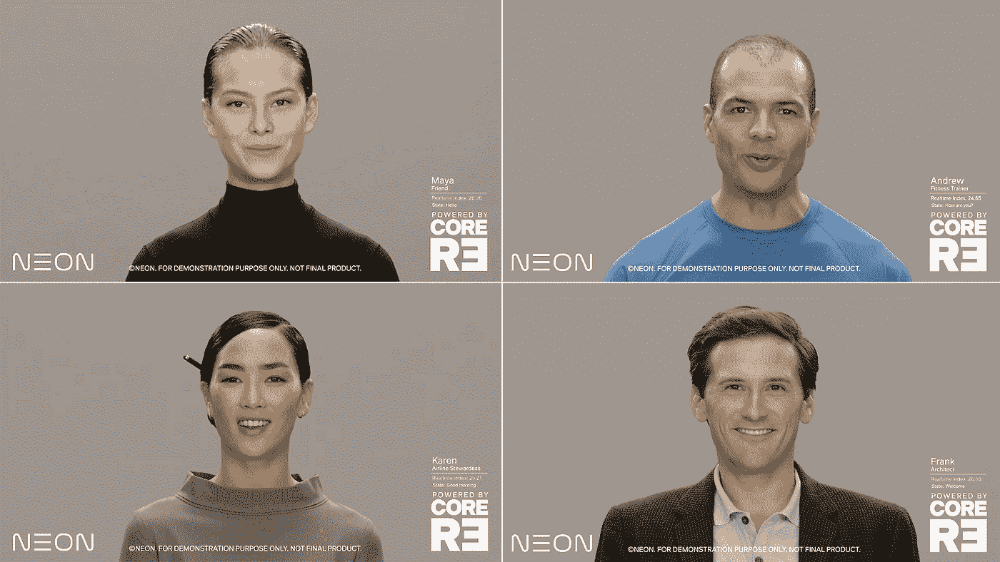

# 霓虹。生活:你真正的虚拟助手，这次是真的吗？

> 原文：<https://towardsdatascience.com/neon-life-your-real-virtual-assistant-for-real-this-time-6de4a52e66c4?source=collection_archive---------18----------------------->

## 氖的剖析与理论建构。生命，三星的新“人造人”

A nyone 看过 [Blade Running 2049](https://www.imdb.com/title/tt1856101/) 一定还记得‘Joi’，一个人造人漂亮精致的全息投影。她和你说话，帮你做家务，给你讲笑话，陪你，还有更多…就像一个真正的人一样。她甚至对你有自己的记忆，并随着时间的推移形成了自己的性格。除了“她”不是人类。她只是一个超级复杂的真人“模型”,可以像真人一样说话、行动和反应。然而，仍有相当多的人暗地里希望他们也能有自己的“Joi”。她可能没有你想的那么远。进入[霓虹](https://www.neon.life/)，三星的新人造人。

来自 [Gfycat](https://gfycat.com/grouchyfaintesok) 的 Joi

# 遭遇

我上周在 CES 2020 展会上走在地板上。像过去几年一样，出现了许多新的装置和新技术。也有大量的展示。小的，大的，巨大的，可折叠的，半透明的，应有尽有。其中，有一件展品引起了我的注意。一个栩栩如生的人站在一个显示器内，带着温暖的微笑看着我，还用丰富的手势谈论一些事情。这是干什么用的？也许是新的远程视频服务？出于好奇，我走近查看。结果，这些非常逼真的人物都不是人。他们被称为 NEONs，是三星支持的公司 STAR Labs 创造的人造人。

> *霓虹，我们的第一个人造人来了。霓虹是一个通过计算创建的虚拟生物，它的外表和行为都像一个真实的人，具有表现情感和智能的能力。—星际实验室*

来自霓虹。生活

这个样子，表情，手势是如此自然，我真的不能告诉它是否是预先录制的视频或 CGI。仔细看，明明是 CGI，只是非常非常‘真实’。真正意义上的“类人”而非“高分辨率”。我深入挖掘，发现这些是基于预先录制的真实人类视频的人工智能生成的 CGI 镜头，是对人类演员视频的“再创造”。非常像詹姆斯·卡梅隆在电影《阿凡达》中第一次做的事情。

图片来自[lyon.onvasortir.com](http://lyon.onvasortir.com/pourquoi-j-039ai-pas-mange-mon-pere-3873571.html)

但是霓虹并没有就此止步，它把事情推得更远。这些 NEONs 可以脱离剧本，发展自己的“个性”。它可以从自己独特的“个性”中产生新的表情、手势和反应。这些“个性”也可以被训练并适应外部刺激。现在，这不仅仅是模仿面部表情！三星是如何做到这一点的，这意味着什么？展会上没有透露太多细节。我内心的数据科学家立刻被打开了，让我们试着弄清楚(猜测)这是如何实现的，它会对我们的社会和行业产生什么影响，好吗？

# 解剖

那么他们是怎么做到的呢？我们先来看看它能做什么。为了实现他们所宣称的，NEON 需要做几件事:

*注意:下面的部分只是我的“有根据的预测”,因此与霓虹实际上是如何工作或创造的没有任何关系。三星尚未公布 NEON 的更多细节。*

# 物理建模:真人视频到 CGI，穿越恐怖谷

给定一个演员的一些视频数据集，该模型需要学习如何将视频转换为 CGI 镜头，越相似越好。这项技术随着头像和表演捕捉的兴起，已经得到了很好的发展。演员被拍摄时，他们的脸上有一些彩色点网格，用来记录他们的面部表情，并将这些面部表情网格运动转换成 CGI 角色表情。这是一项相当成熟的技术。霓虹所做的只是有点不同。它可能没有网格作为参考，但使用深度学习，深度神经网络找到任务所需的特征并不太难，它可能比像面部网格这样的简单模型做得更好。

**数据输入:**视频短片

**数据输出:**面部/身体网格运动时间序列数据。

# 表情建模:表情/手势投影到 CGI

因此，从视频片段中，我们现在有一个网格运动时间序列数据集，如果我们可以用不同的表达式标记这些数据集，我们应该能够训练某种自动编码器，可以将 CGI 时间序列编码为表达式编码，然后重新生成相同的 CGI 时间序列数据。然后我们可以看看编码，弄清楚什么是微笑、哭泣、惊讶、生气等等。这也是一个已经解决的问题。你可以在下面找到一个例子:

**数据输入:** CGI 时间序列数据集

**数据输出:**表达式编码/嵌入层数

# 个性建模:从情感到表达

所以现在我们可以通过表情编码来控制我们的 CGI 化身的表情，下一步就是将情感映射到表情上。表达是情感的外化，但映射并不总是直截了当的。你可能认为人们开心的时候会笑，但是人性远比这复杂。一些外向的人会笑出声来，而内向的人可能只是微妙地傻笑。控制情绪到表情映射的是性格。现在我们如何塑造人格？这需要大量的领域知识(这也是三星声称他们仍在努力的部分，我认为最具挑战性。因为人性，你知道…)。

**数据输入:**情感标签(多个标签，因为一个表情后面可能有多个情感)

**数据输出:**表示给定化身的情绪的表情编码/嵌入

# 三星关于 NEON 的说法包括

从演示中，我们知道氖实际上由三部分组成:

*   行为神经网络(**表达模型？**)
*   进化生成智能(**人格模型？**)
*   计算现实(**物理模型？**)

我上面的假设是真的吗？我们将在不久的将来了解更多，但如果你有不同的想法，请留下一些回应！

# 理论加工

那么这些部分是如何组合在一起形成霓虹的呢？它可以像管道一样工作:

首先使用一个人类演员的视频镜头来训练一个可以生成 CGI 网格时间序列数据的神经网络。这将赋予控制 CGI 化身尽可能像人类一样的能力。神经网络将不可避免地学习人类手势和人类面部表情的模式，这为进一步的抽象奠定了基础。

利用 CGI 网格运动时间序列数据，我们可以训练一个自动编码器，它可以进行某种降维，创建一些中间层编码器，然后重新生成 CGI。一旦重新生成的 CGI 与原始时间序列数据足够相似，我们将获得视频、表情和手势的更抽象层(表情编码器)。一旦我们有了编码器或嵌入，我们就可以玩一玩，看看哪种权重组合可以生成特定的表情，例如微笑、生气、惊讶等。然后，我们可以使用这些权重(可能需要做一些主成分分析，使其更易于管理)来控制我们的化身的表情，使其微笑、哭泣等。

就这一点而言，虚拟角色的表情可以在很大程度上由人工控制，但现在还没有。我们需要的是让虚拟角色自己“生成”表情，对外界刺激做出反应。这就是人格模型发挥作用的地方。使用心理学、情绪科学的领域知识，可以开发许多不同的个性特征，它们与表达和外部刺激的关系可以被建模。如果我们以某个名人(比如说李小龙)为例，通过对他的行为(表情)和外界刺激(言语的情绪，手势等)进行标签化。)，我们可以开发一个“个性”模型，反映名人对不同情绪的不同表达会有什么反应。然后，我们使用这个个性模型来根据外部情绪(可能是从情绪分类器神经网络输出的)控制霓虹灯的反应表达。

在霓虹官方视频中，霓虹的“情绪激活”状态是实时可视化的，表明霓虹对外界刺激的反应。相当酷。

霓虹实时的情绪地图，灯泡就是她当前状态所在的地方，文字就是不同的情绪状态。

除此之外，NEON 可以学习领域知识，提供更多的价值。三星声称他们有另一个名为 Spectra 的云人工智能平台，第三方开发者将能够为 NEON 开发这些“技能”。认为 Siri 有漂亮的脸蛋，迷人的声音，还能教你功夫。😜

我不得不说，即使他们在 CES 2020 上展示的演示远非完美，但 NEON 是开创性的。这个团队的想法很宏大，并且打下了良好的基础和框架。此刻的计算饥饿应用可能意味着 NEON 不能生活在边缘，但随着 5G 的快速发展和更好的云平台，我相信 NEON 的未来潜力是巨大的。

# 视力

你想要哪种霓虹灯？瑜伽导师？魔术师？商务助理？私人摄影师？

这是文章中允许我放肆的部分。让我们看看霓虹灯能做什么:

*   **博彩业中的完美 NPC。在 RPG 游戏中，NPC 通常都很笨。他们的面部表情和反应太假了。NEON 可以改变这一点，给玩家一个非常真实的体验。**

检查整个系列，它是金色的…

*   重现你逝去的亲人或朋友。如果你读过[这篇文章](https://www.wired.com/story/a-sons-race-to-give-his-dying-father-artificial-immortality/)讲的是一个男孩试图创造一个聊天机器人，说话和他爸爸一模一样，并在他爸爸去世后一直让他陪着，你知道我在说什么。NEON 可以走得更远，不仅聊天机器人可以像他的父亲一样生成文本，它可以看起来像他的父亲，听起来像他的父亲，甚至具有相似的“个性”。(也许有点令人毛骨悚然，但我有什么资格评判……)
*   **各种服务助理。**喜欢瑜伽导师，理财规划师，或者只是让你有个好的性格作伴。
*   **残疾人的向导/帮手。**
*   **粉丝崇拜的名人“副本”**
*   **自闭症治疗师**

这个清单可以一直列下去，但是你要明白。由于它是一个开放的平台，它很可能成为技术领域的下一个大事件。

# 结论

表面上看，CES 是关于工程创新而不是科学突破的，但我认为 NEON 有点处于中间位置。这支队伍还很年轻，我很兴奋看到他们在不久的将来能做什么，并了解他们的方法。这真的是一个隐藏的宝石，我觉得必须向我的读者介绍。你认为人造人能做什么？做不到。还是永远不应该做？

关于 CES 舞台上展示的更多细节，你可以看看这个详细的视频:

觉得这篇文章有用？在 Medium 上关注我([李立伟](https://medium.com/u/72c98619a048?source=post_page-----dbe7106145f5----------------------))或者你可以在 Twitter [@lymenlee](https://twitter.com/lymenlee) 或者我的博客网站[wayofnumbers.com](https://wayofnumbers.com/)上找到我。你也可以看看我下面最受欢迎的文章！

 [## “这是 CS50”:开始数据科学教育的愉快方式

### 为什么 CS50 特别适合巩固你的软件工程基础

towardsdatascience.com](/this-is-cs50-a-pleasant-way-to-kick-off-your-data-science-education-d6075a6e761a)  [## 一枚硬币的两面:杰瑞米·霍华德的 fast.ai vs 吴恩达的 deeplearning.ai

### 如何不通过同时参加 fast.ai 和 deeplearning.ai 课程来“过度适应”你的人工智能学习

towardsdatascience.com](/two-sides-of-the-same-coin-fast-ai-vs-deeplearning-ai-b67e9ec32133)  [## 你需要了解网飞的“朱庇特黑仔”:冰穴📖

### 是时候让 Jupyter 笔记本有个有价值的竞争对手了

towardsdatascience.com](/what-you-need-to-know-about-netflixs-jupyter-killer-polynote-dbe7106145f5)