# NeRF:将场景表示为用于视图合成的神经辐射场

> 原文：<https://towardsdatascience.com/nerf-representing-scenes-as-neural-radiance-fields-for-view-synthesis-ef1e8cebace4?source=collection_archive---------14----------------------->

## ECCV-2020 口头论文评论

从 2D 图像绘制三维模型是计算机视觉领域的一个挑战性问题。即使我们对每个图像都有摄像机位置监控，以前的 3D 渲染模型也不足以在实践中使用。在 ECCV 被选为口头论文的 NeRF 提出了一种最先进的方法，该方法利用 2D 图像及其相应的相机位置来构建 3D 模型。

视频 1。NeRF 作者的官方视频，经常被作者推荐观看。

# 术语

1.  **射线**:从摄像机中心连接的线，由摄像机位置参数决定，在特定方向上，由摄像机角度参数决定。
2.  **颜色**:每个 3D 体所具有的 RGB 值。
3.  **体积密度**:决定它对最终色彩决定的影响程度。
4.  **光线颜色**:我们跟随光线时可以观察到的 RGB 值。公式 1 给出了正式定义。

# 什么是 NeRF？

NeRF 是第一篇介绍神经场景表示的论文。它有利于渲染真实物体的高分辨率真实感新视图。本文的主要思想是预测沿光线的颜色值和不透明度值，这由五个外部相机参数(3 个相机位置，两个相机角度)确定。

最终，使用估计的颜色和不透明度，NeRF 确定光线的预期颜色(等式 1)。对于实际实施，NeRF 将整数近似为有限和(等式 2)，称为**分层采样**。实验中的样本数为 64，128，256。

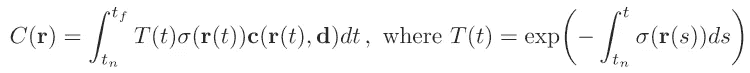

等式 1。输入光线的预期颜色。

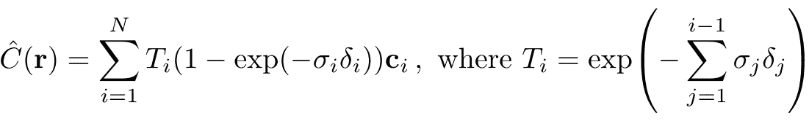

等式 2。方程式 1 的近似值。

NeRF 架构不需要保留每个特性；因此，NeRF 是由 MLP 而不是 CNN 组成的。它还使用两种技术来提高其性能:**位置编码**和**分层体积采样**。

# 位置编码

NeRF 没有使用五个简单的相机参数，而是使用位置编码，这种编码经常在 NLP(自然语言处理)中使用。在颜色和几何图形的高频变化中，使用简单输入通常表现不佳。位置编码便于网络通过容易地将输入映射到更高维空间来优化参数。 **NeRF 表明，使用高频函数映射原始输入能够更好地拟合包含高频变化的数据。**消融研究是这一论点的证据(表 1)。

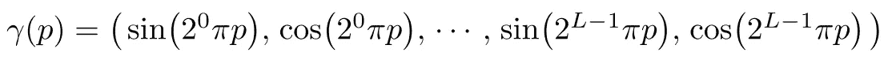

等式 3。位置编码。

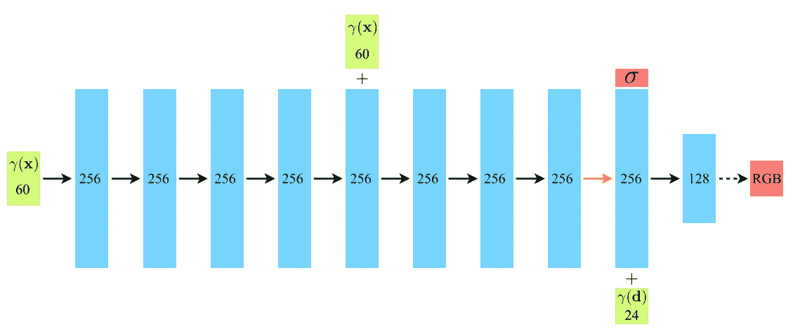

图一。NeRF 的整体架构，它使用位置编码而不是简单的输入。

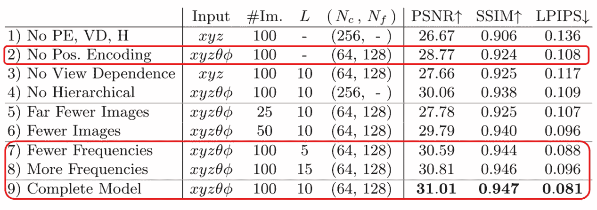

表 1。位置编码的效果。使用位置编码提高了每个指标的性能。

# 分层体积取样

NeRF 提出了一个层次结构。整个网络架构由两个网络组成:一个是**粗网**，另一个是**细网**。

粗糙网络使用 N_c 个采样点来评估光线的预期颜色。顾名思义，它首先从粗采样开始优化。等式 4 是粗略网络的正式定义。

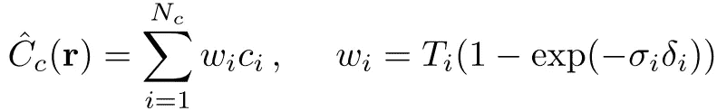

等式 4。粗糙网络

精细网络使用 N_c + N_f = N 个采样点来评估光线的预期颜色。这个等式与等式 2 相同。表 2 显示了关于等级结构影响的消融研究。然而，依我拙见，表 2 中的(4)和(7)之间的比较并不公平。是因为(4)和(7)之间的 N_c + N_f 不一样。如果(4)中的 N_f 值是 192(=128 + 64)，这可能是一个更公平的比较。

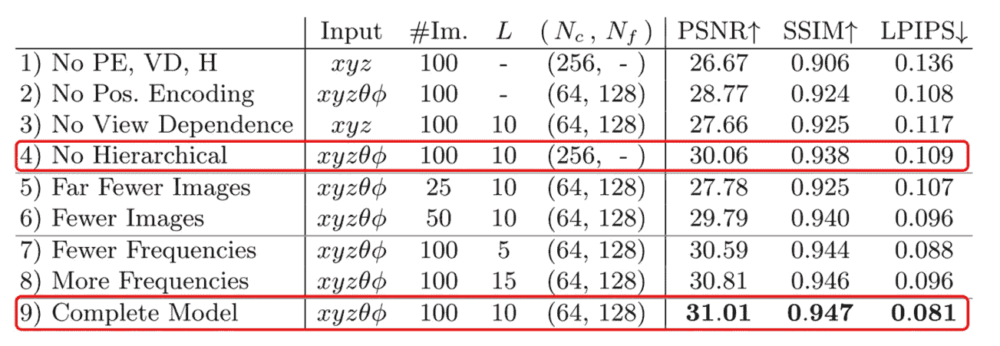

表二。等级结构效应的烧蚀研究。

# 损失函数

该网络的最终目标是正确预测光线的预期颜色值。由于我们可以使用地面真实 3D 模型来估计地面真实光线颜色，因此我们可以使用具有 RGB 值的 L2 距离作为损失。好在每一步都是可微的；因此，我们可以通过光线的预测 RGB 值来优化网络。

作者设计损失函数以实现两个目标。

1.  很好地优化了粗网络。
2.  好好优化精细网络。

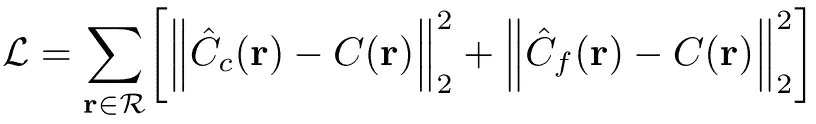

等式 5。损失函数

# 结果

## -评估指标

**PSNR** (峰值信噪比):PSNR 越高，MSE 越低。较低的 MSE 意味着地面真实图像和渲染图像之间的差异较小。因此，PSNR 越高，模型越好。

**SSIM** (结构相似度指标):检查与地面真实图像模型的结构相似度。SSIM 越高，模型越好。

**LPIPS** (学习感知图像块相似度):确定与感知视图的相似度；使用 VGGNet。LPIPS 越低，型号越好。

## -实验结果(定量结果)

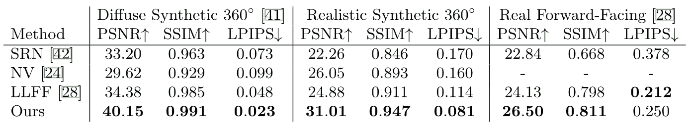

表二。实验结果

NeRF 在所有任务中都实现了一流的性能。

## -可视化(定性结果)

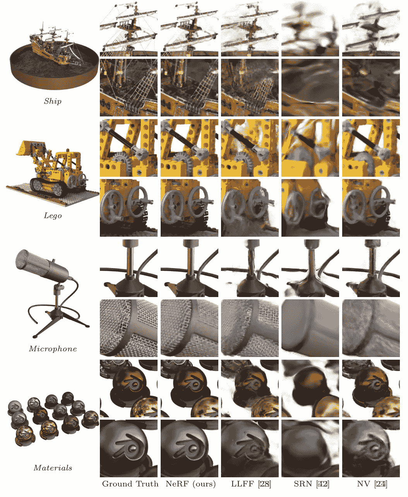

图二。用可比较的模型可视化 NeRF。

*   NeRF 还解决了**视图依赖问题**模型根据视图有不同的颜色。如图 3 所示，与其他模型不同，NeRF 架构会自动学习视图相关的颜色值。

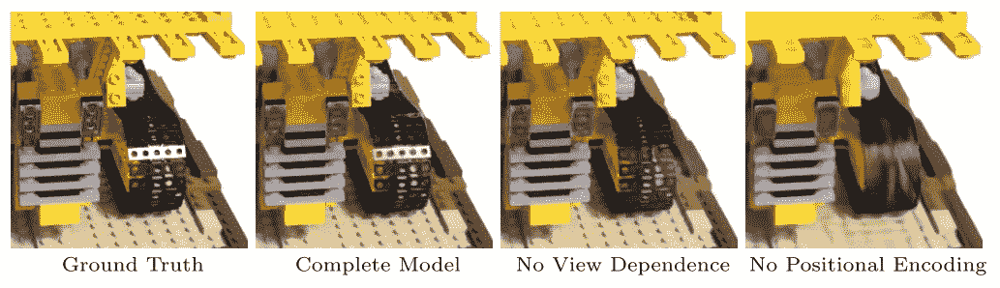

图 3。NeRF 的视图相关结果。

# 结论

NeRF 证明，将场景表示为 5D 神经辐射场比以前占主导地位的训练深度卷积网络输出离散体素表示的方法产生更好的渲染。作者期望 NeRF 模型可以用不同的结构进一步优化。此外，NeRF 的可解释性不如以前的方法，如体素和网格。

论文链接:[https://arxiv.org/abs/2003.08934](https://arxiv.org/abs/2003.08934)

NeRF 官方链接:【https://www.matthewtancik.com/nerf 

随时联系我！" jeongyw12382@postech.ac.kr "