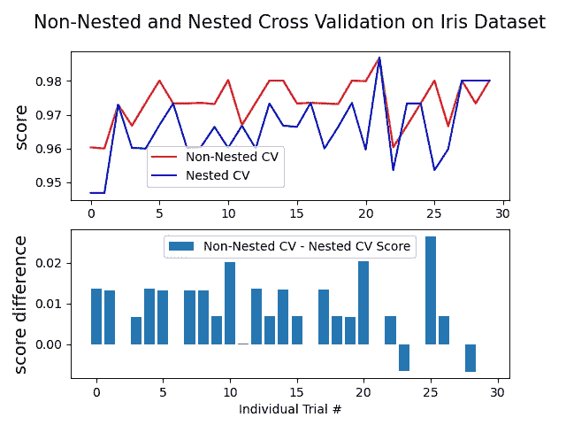
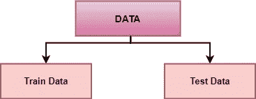
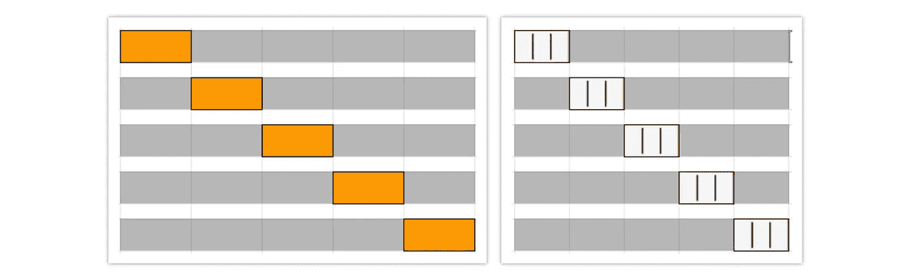

# 嵌套交叉验证—超参数优化和模型选择

> 原文：<https://towardsdatascience.com/nested-cross-validation-hyperparameter-optimization-and-model-selection-5885d84acda?source=collection_archive---------8----------------------->

## 深入研究嵌套交叉验证

图片由[穆罕默德·哈桑](https://pixabay.com/users/mohamed_hassan-5229782/?utm_source=link-attribution&amp;utm_medium=referral&amp;utm_campaign=image&amp;utm_content=3239623)来自 [Pixabay](https://pixabay.com/?utm_source=link-attribution&amp;utm_medium=referral&amp;utm_campaign=image&amp;utm_content=3239623)

**交叉验证**也被称为**抽样外技术**是数据科学项目的一个基本要素。这是一个重采样程序，用于**评估机器学习模型**并评估该模型在独立测试数据集上的表现。

**超参数优化或调整**是为机器学习算法选择一组超参数的过程，该算法对特定数据集表现最佳。

交叉验证和超参数优化都是数据科学项目的一个重要方面。交叉验证用于评估机器学习算法的性能，超参数调整用于找到该机器学习算法的最佳超参数集。

没有嵌套交叉验证的模型选择使用相同的数据来调整模型参数和评估模型性能，这可能导致模型的乐观偏置评估。由于信息泄露，我们对训练或测试数据中的错误估计很差。为了解决这个问题，嵌套交叉验证应运而生。

使用支持向量分类器比较虹膜数据集的非嵌套和嵌套 CV 策略的性能。你可以观察下面的性能图，从[这篇文章](https://scikit-learn.org/stable/auto_examples/model_selection/plot_nested_cross_validation_iris.html)。

[来源](https://scikit-learn.org/stable/auto_examples/model_selection/plot_nested_cross_validation_iris.html):sci kit-了解嵌套与非嵌套交叉验证

# 什么是嵌套交叉验证及其实现？

**嵌套交叉验证** ( **Nested-CV** )嵌套交叉验证和超参数调整。它用于评估机器学习算法的性能，还用于估计底层模型及其超参数搜索的泛化误差。

除了嵌套循环外，还有几种循环策略，阅读下面提到的文章以了解更多关于不同循环程序的信息。

 [## 了解 8 种交叉验证

### 交叉验证及其类型的深入解释

towardsdatascience.com](/understanding-8-types-of-cross-validation-80c935a4976d) 

## 第 1 步:列车测试分离:

将给定的预处理数据集分割成**训练**和**测试**数据，训练数据可用于训练模型，测试数据被隔离以评估最终模型的性能。

(图片由作者提供)，将数据分为训练和测试数据

这不是一个强制步骤，整个数据可以用作训练数据。将数据分为训练数据和测试数据对于观察未知测试数据的模型性能至关重要。用测试数据评估最终模型表明了该模型对于未来未知点的性能。

## 第二步:外部简历:

基于机器学习算法在嵌套交叉验证的外环上的性能来选择机器学习算法。 **k 倍**交叉验证或 **StaratifiedKfold** 过程可以根据数据的不平衡性在外环实现，将数据平均分成 k 倍或组。

*   **k 倍 CV:** 此程序将数据分割成 k 倍或组。(k-1)组将被分配用于培训，其余组用于验证数据。对 k 个步骤重复该步骤，直到所有组都参与了验证数据。
*   **StatifiedKfold CV:** 该程序类似于 k-fold CV。这里，数据集被划分成 k 个组或折叠，使得验证和训练数据具有相同数量的目标类标签实例。这确保了一个特定的类不会过度出现在验证或训练数据中，尤其是当数据集不平衡时。

(图片由作者提供)，**左:** k-fold 交叉验证，**右:**分层 k-fold 交叉验证，每个 fold 都有相同的目标类实例

根据数据集的不平衡程度，可以为外部 CV 选择 k-fold 或 Stratifiedkfold CV。

## 第三步:内部简历:

然后，将内部 CV 应用于来自外部 CV 的(k-1)个折叠或组数据集。使用 GridSearch 优化参数集，然后用于配置模型。然后使用最后一个折叠或组来评估从 GridSearchCV 或 RandomSearchCV 返回的最佳模型。该方法重复 k 次，通过取所有 k 个分数的平均值来计算最终 CV 分数。

## 步骤 4:调整超参数:

Scikit-learn 包提供了 [GridSearchCV](https://scikit-learn.org/stable/modules/generated/sklearn.model_selection.GridSearchCV.html) 和[randomsearccv](https://scikit-learn.org/stable/modules/generated/sklearn.model_selection.RandomizedSearchCV.html)实现。这些搜索技术通过调整给定的参数返回最佳的机器学习模型。

## 第五步:拟合最终模型:

现在，您已经有了最佳模型和一组超参数，它们对该数据集表现最佳。您可以针对看不见的测试数据评估模型的性能。

# Python 实现:

> 信用卡欺诈数据集用于从 [Kaggle](https://www.kaggle.com/mlg-ulb/creditcardfraud) 下载的以下实现中。

(作者代码)

## 嵌套 CV 的成本:

使用 Nested-CV 极大地增加了模型的训练和评估。如果为非嵌套 CV 训练 n*k 个模型，那么要训练的模型的数量增加到 k*n*k

# 结论:

当同一个数据集用于使用 CV 调整和选择模型时，很可能会导致对模型性能的乐观偏见评估。因此，嵌套 CV 比非嵌套 CV 更常用，因为它有助于克服偏差。

使用 nested-CV 极大地增加了模型评估的数量，从而增加了时间复杂度。当数据集太大或者您的系统功能不强大时，不建议使用它。

> 感谢您的阅读