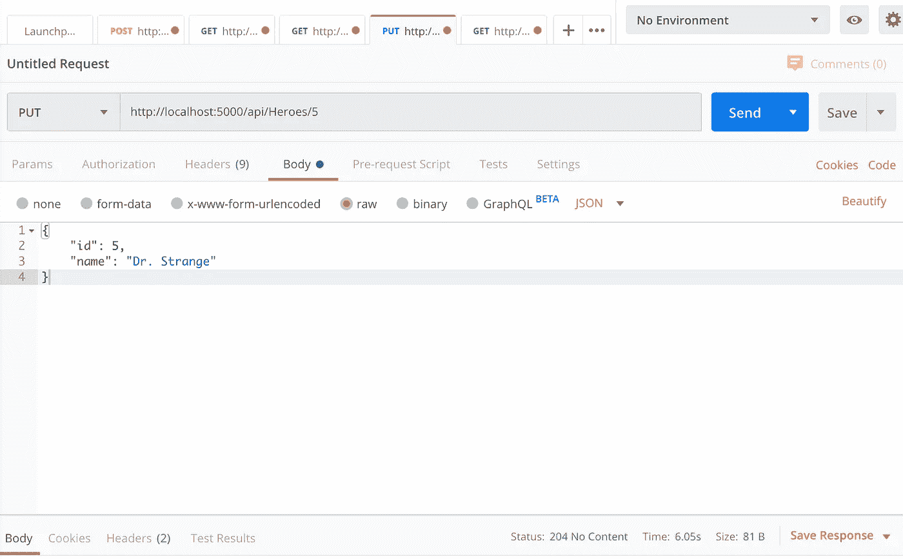
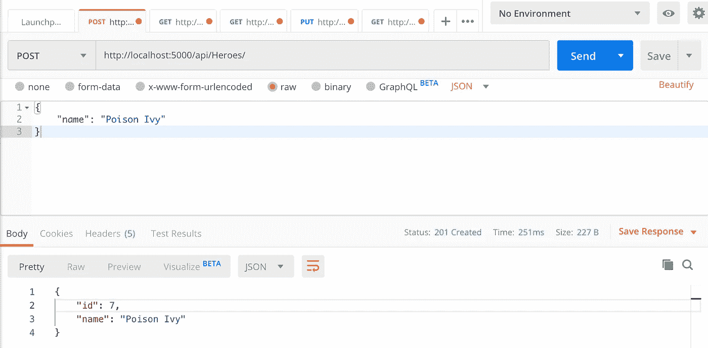

# 。NET 核心 API —深入研究 C#

> 原文：<https://towardsdatascience.com/net-core-api-dive-into-c-27dcd4170066?source=collection_archive---------23----------------------->

## 为英雄角之旅教程构建一个后端 web 服务器


[张](https://unsplash.com/@archaique?utm_source=unsplash&utm_medium=referral&utm_content=creditCopyText)在 [Unsplash](https://unsplash.com/s/photos/dive?utm_source=unsplash&utm_medium=referral&utm_content=creditCopyText) 上的照片

如果你一直跟随[系列大纲](https://medium.com/@richardpeterson320/net-core-api-for-the-angular-tour-of-heroes-app-5895a36d2129)，并且有一个[工作数据库](https://medium.com/@richardpeterson320/net-core-api-for-the-angular-tour-of-heroes-app-5895a36d2129)，一个[角游英雄 App](https://angular.io/tutorial) ，一个[通用。我们现在已经进入了这个系列的核心部分，为我们的。NET API。](https://docs.microsoft.com/en-us/aspnet/core/tutorials/first-web-api?view=aspnetcore-3.1&tabs=visual-studio)

要继续学习，您可以下载。NET API+Docker MSSQL DB+Angular app 来自[我的 GitHub repo。](https://github.com/rchardptrsn/TourOfHeroes-dotNETCore)

本文中我们将遵循的流程是:

1.  连接字符串和 Startup.cs
2.  模型
3.  脚手架控制器
4.  控制器路由
5.  邮递员测试
6.  克-奥二氏分级量表
7.  修改角度应用程序

# 我们开始吧！

如果你没有看过这个系列的[介绍](https://medium.com/@richardpeterson320/net-core-api-for-the-angular-tour-of-heroes-app-5895a36d2129)，我强烈推荐。如果你刚入门，已经有了一个通用的 API，那太好了！如果从头开始，只需从命令行运行:

```
dotnet new webapi -n Heroes.API
```

这将创建一个样本。用假天气预报数据的 NET 核心 API。我有**。NET Core 3.0.2** 安装在我的机器上，所以所有的依赖项都将针对 3.0.2。

从示例 API 中，删除`WeatherForecast.cs`和`WeatherForecastController.cs`。

# 导入包

我们需要几个包裹来装我们的。NET 核心应用程序来工作。您可以使用 NuGet 软件包管理器或从命令行安装这些软件包:

```
dotnet add package Microsoft.EntityFrameworkCore --version 3.0.2
dotnet add package Microsoft.EntityFrameworkCore.SqlServer --version 3.0.2
dotnet add package Microsoft.VisualStudio.Web.CodeGeneration.Design --version 3.0.0
dotnet add package Microsoft.EntityFrameworkCore.Design --version 3.0.2
```

# 模型

在名为 Model 的目录下新建一个文件夹，在 Model 文件夹下新建一个名为`Hero.cs`的 C#类。

该模型将定义数据库和应用程序中数据的属性，因此我们只需添加`id`和`name`的值。

## 英雄。API/Model/Hero.cs

```
namespace Heroes*.*API*.*Model{
    *public* class HeroValue
    {
        *public* int id { get; set; }
        *public* string name { get; set; }
    }
}
```

现在，我们需要添加一个数据库上下文来管理。NET 核心数据模型和数据库。我们将我们的上下文类命名为`HeroesContext`，它将从 DbContext 继承。`HeroesContext`将包含一个 DbSet `HeroValues`，它对应于我们在 SQL 中的表名。

创建一个名为`Data`的文件夹，并添加一个名为`HeroesContext.cs`的新 C#文件。将以下代码添加到您的`HeroesContext.cs`中。

## 英雄。API/Data/HeroesContext.cs

```
using Microsoft.EntityFrameworkCore;
using Heroes.API.Model;namespace Heroes.API.Data
{ public class HeroesContext : DbContext
    {
        public HeroesContext (DbContextOptions<HeroesContext> options)
            : base(options)
        {
        } public DbSet<HeroValue> HeroValue { get; set; }
    }
}
```

我们还需要在我们的`Startup.cs`文件中添加一个对 DbSet 的引用，这样。NET 知道使用`HeroesContext`作为与数据库交互的上下文。我们还将把数据库的连接字符串添加到我们的`appsettings.json`文件中。

将这个添加到您的`public void ConfigureServices`下的`Startup.cs`文件中。在我们的例子中，我们使用 [Docker MSSQL 数据库](/build-a-mssql-docker-container-800166ecca21)进行测试和开发。

```
services.AddDbContext<HeroesContext>(options =>
options.UseSqlServer(Configuration.GetConnectionString("DockerDB")));
```

将“DockerDB”连接字符串添加到`appsettings.json`。

```
"ConnectionStrings": {
    "DockerDB": "Server=localhost,1433;Database=heroes;User ID=SA;Password=Password1!"
  }
```

# 脚手架控制器

为了创建`HeroesController`，我们将使用 aspnet-codegenerator 工具为我们搭建控制器。

首先，我们必须从命令行安装该工具。然后，从项目的根目录中，运行`aspnet-codegenerator`。

```
# Install the tooldotnet tool install --global dotnet-aspnet-codegenerator --version 3.0.0# Run the aspnet-codegeneratordotnet aspnet-codegenerator controller -name HeroesController -async -api -m HeroValue -dc HeroesContext -outDir Controllers
```

完成后，您将看到在控制器文件夹下创建了一个名为 HeroesController 的新文件。打开它可以看到为您创建的基本控制器。这个工具对于把你的控制器的基本结构安排到位是非常有用的。现在，让我们编辑控制器，以匹配来自我们的 Angular 应用程序。

使用代码生成器有一个意想不到的副作用。它为 DbContext 名称的**configure services:**`services.AddDbContext`中的连接字符串的`Startup.cs`添加了一个值，这是有意义的，但不是我们想要在这个开发环境中用于连接字符串的值。替换“HeroesContext”的连接字符串值，使您的`services.AddDbContext`再次看起来像这样:

```
services.AddDbContext<HeroesContext>(options =>
options.UseSqlServer(Configuration.GetConnectionString("DockerDB")));
```

说到这里，在`Startup.cs`的**配置**方法中，让我们将**注释掉** *app。usehttps redirection()；。我们的应用程序不需要它。*

# 控制器方法

在我们的控制器中，我们将有 5 个基本方法来与数据库交互，并将值返回给 Angular 应用程序。这 5 个方法由从 Angular 到。NET app。搞什么。NET app 寻找的是带有提供的路由的 HTTP 请求。这些路线是:

1.  *GET: api/Heroes —* 这个方法将返回数据库中的所有英雄
2.  *GET: api/Heroes/5 —* 这个方法将从数据库中返回一个特定的英雄。在这种情况下，它将返回 Id 为 5 的英雄。
3.  *PUT: api/Heroes/5 —* 这个方法会更新一个特定英雄的信息。
4.  *POST: api/Heroes —* 这个方法会向数据库发布一个新的英雄。
5.  *DELETE: api/Heroes/5—* 这个方法将从数据库中删除一个特定的英雄。

让我们从头开始。

## 获取:API/英雄

Angular app 会用这个路由从. NET 中获取所有英雄的 IEnumerable 列表对象，这个方法对应 Angular' `hero.service.ts`中的`getHeroes()`方法。

用下面的代码替换第一个 GET 方法，这在很大程度上得益于微软文档为控制器添加了一个[搜索功能。](https://docs.microsoft.com/en-us/aspnet/core/tutorials/first-mvc-app/search?view=aspnetcore-3.1)记住，Angular 应用程序对几个不同的组件使用 GET: api/Heroes 请求。它需要能够返回英雄仪表板，英雄列表页面的列表，也可以在仪表板上的搜索框中搜索英雄。

我们通过一个异步 ActionResult <ienumerable>来实现这一点，它从 GET 请求中的查询字符串获得信息。该查询可以是 no information，返回所有英雄，也可以是 search string，只返回名字中包含该字符串的英雄。</ienumerable>

```
// *GET: api/Heroes*[HttpGet]
public async Task<ActionResult<IEnumerable<HeroValue>>> GetHeroValue([FromQuery] string name)
{
    // Define a LINQ query
    var heroquery = from h in _context.HeroValue select h;

    // If the string is not empty, find items 'h' whose name contains the query string
    if (!String.IsNullOrEmpty(name))
    {
        heroquery = heroquery.Where(
            h => h.name.Contains(name));
    }// Return an asynchronous list of heroes that satisfy query
    return await heroquery*.OrderBy*(num => num*.id*).*ToListAsync*();
}
```

让我们使用 Postman 测试 GET 控制器方法。Postman 提供了一种用户友好的方式来测试您的 API。首先，启动你的 Docker 数据库。运行您的。NET 核心 API，方法是从 API 的根目录运行`dotnet watch run`。当 API 启动并监听端口 5000 时，在 Postman 中，我们将发送 2 个请求来测试我们想要的结果:

1.  向`[http://localhost:5000/api/Heroe](http://localhost:5000/api/Heroes,)s`发出`GET`请求。观察返回状态为`200 OK`的 JSON 数组。这将满足我们的仪表板和英雄列表的 GET 请求。
2.  对`[http://localhost:5000/api/Heroes/?name=wonde](http://localhost:5000/api/Heroes/?name=wonder)r`的`GET`请求。观察`"id": 1, "name": "Wonder Woman\r"`的返回值

恭喜你。您有一个工作的 API！我们建出来按 Id 找英雄吧。

## *GET: api/Heroes/5*

这是我们的 aspnet-codegenerator 真正闪光的地方。我们不需要对这个控制器方法做任何改动。它已经准备就绪，代码已经生成。它只是在路线中找到传递给它的具有匹配 id 的英雄。你的方法应该是:

```
[HttpGet("{id}")]
public async Task<ActionResult<HeroValue>> GetHeroValue(int id)
{
    var heroValue = await _context.HeroValue.FindAsync(id); if (heroValue == null)
    {
        return NotFound();
    } return heroValue;
}
```

在邮递员中测试:

*   对`[http://localhost:5000/api/Heroes/2](http://localhost:5000/api/Heroes/2)`运行一个`GET`请求，观察一个 JSON 结果“id”:5，“name”:“Bat Man \ r”。

## *PUT: api/Heroes/5*

这也是 aspnet-codegenerator 为我们完美搭建的一个方法。只需运行一个邮差测试来进行测试:

*   向`[http://localhost:5000/api/Heroes/5](http://localhost:5000/api/Heroes/5)`运行一个`PUT`请求。在请求的 Body 下，将 TEXT 更改为 JSON，并填写请求正文，如下所示:

```
{
    "id": 5,
    "name": "Dr. Strange"
}
```



如果成功，您将收到请求状态`204 No Content`。

## *岗位:API/英雄*

你需要能够发布新的英雄到数据库。此外，您的 API 需要为新英雄创建 Id，Angular 只提供名称。您的 API 使用 DbSet `_context.HeroValue`的当前上下文来访问数据库中的值。使用。Max 找到数据库中最高的 Id，用 1 枚举，并将这个新 Id 分配给`herovalue.id`。然后用`.Add`和`.SaveChangesAsync`将新的保存到数据库，并返回一个 *CreatedAtAction* 结果，产生一个状态 201 Created 响应。

```
[HttpPost]
public async Task<ActionResult<HeroValue>> PostHeroValue(HeroValue heroValue)
{

    if (heroValue == null)
    {
        return BadRequest();
    } // Generate Hero Id
    //[https://github.com/lohithgn/blazor-tour-of-heroes/blob/master/src/BlazorTourOfHeroes/BlazorTourOfHeroes.Server/Controllers/HeroesController.cs](https://github.com/lohithgn/blazor-tour-of-heroes/blob/master/src/BlazorTourOfHeroes/BlazorTourOfHeroes.Server/Controllers/HeroesController.cs)
    // Grab the current context of the DbSet HeroValue
    // Find the max id
    // increase by 1
    heroValue.id = _context.HeroValue.Max(h => h.id) + 1;
    _context.HeroValue.Add(heroValue);
    await _context.SaveChangesAsync(); return CreatedAtAction("GetHeroValue", new { id = heroValue.id }, heroValue);
}
```

在邮递员中测试:

向`[http://localhost:5000/api/Heroes/](http://localhost:5000/api/Heroes/)`发送一个`POST`请求，JSON 主体为:

```
{
 "name": "Poison Ivy"
}
```



观察`Status: 201 Created`。成功！

## *删除:api/Heroes/5*

最后，你需要能够删除英雄。这是在 angular 向 API 发送一个 HTTP DELETE 请求时完成的，该请求带有要删除的 hero Id。幸运的是，我们的 DELETE 方法是由 aspnet-codegenerator 完美地生成的。

```
[HttpDelete("{id}")]
public async Task<ActionResult<HeroValue>> DeleteHeroValue(int id)
{
    var heroValue = await _context.HeroValue.FindAsync(id);
    if (heroValue == null)
    {
        return NotFound();
    } _context.HeroValue.Remove(heroValue);
    await _context.SaveChangesAsync(); return heroValue;
}
```

## 关于控制器方法的思考

aspnet-codegenerator 确实帮了我们大忙。我们真正需要考虑的方法只有`GET: api\Heroes`中的搜索功能和`POST: api\Heroes`的 Id 生成器。现在我们有了一个可以从 Postman 测试的功能控制器，我们将添加代码来允许跨源资源共享，更好的说法是 CORS。

# 跨产地资源共享— CORS

Mozilla 文档给了我们一个关于 CORS 的很好的定义。

> **跨源资源共享** ( [CORS](https://developer.mozilla.org/en-US/docs/Glossary/CORS) )是一种机制，它使用额外的 [HTTP](https://developer.mozilla.org/en-US/docs/Glossary/HTTP) 头来告诉浏览器，让运行在一个[源](https://developer.mozilla.org/en-US/docs/Glossary/origin)的 web 应用程序访问来自不同源的选定资源。

我们有一个 angular 应用程序运行在一个端口上。NET API 运行在另一个端口上。NET 不喜欢另一个应用程序未经许可访问它的资源。我们需要使它能够接收来自特定位置的请求，即 angular 应用程序的本地主机端口。

在 ConfigureServices 类上方，创建一个只读字符串:

`*readonly* string MyAllowSpecificOrigins = “_myAllowSpecificOrigins”;`

在 ConfigureServices 类中，添加`AddCors`服务。您的 ConfigureServices 类应该如下所示:

```
public void ConfigureServices(IServiceCollection services)
{
    services.AddCors(options =>
    {
        options.AddPolicy(MyAllowSpecificOrigins,
        builder =>
        {
            builder.WithOrigins("[http://localhost:4200](http://localhost:4200)")
                                .AllowAnyHeader()
                                .AllowAnyMethod();
        });
    });
    services.AddControllers();
    services.AddDbContext<HeroesContext>(options =>
            options.UseSqlServer(Configuration.GetConnectionString("DockerDB")));
}
```

我们正在创建一个构建器，只允许来自`[http://localhost:4200](http://localhost:4200)`的请求，我们的 angular 应用程序正在该端口运行。此外，从该端口，我们允许任何头和任何方法访问我们的可用资源。NET API。

我们需要为 CORS 做的最后一件事是将我们刚刚创建的服务添加到我们在`Startup.cs`中的 **Configure** 方法中。将此添加到您的配置方法中:

```
app*.UseCors*(MyAllowSpecificOrigins);
```

你的 API 完成了！现在我们只需将 angular 应用指向您的 API 端点。

# 回到 Angular 应用程序

我们已经非常接近完成了！只需要对 angular 应用程序进行一些更改，它就可以从我们的 API 请求数据。

# 应用程序模块

我们需要禁用您在英雄之旅教程中构建的内存 web api。在`app.module.ts`中注释掉这些导入

```
//*import { HttpClientInMemoryWebApiModule } from 'angular-in-memory-web-api';*//*import { InMemoryDataService }  from './in-memory-data.service';*
```

然后，注释掉`@ngModule() imports`下的导入

```
// *HttpClientInMemoryWebApiModule.forRoot(InMemoryDataService, { dataEncapsulation: false })*
```

# hero.service.ts

我们的公共 HeroService 类包含我们的 angular 应用程序与。NET API。我们应该首先更改 heroesURL 以匹配我们的 API 正在监听的端点:

```
*private* *heroesUrl* = 'http://localhost:5000/api/Heroes';
```

我必须更改 HeroService 类的另一件事是为 updateHero 添加一个 const URL。传递的 URL 不正确，导致 405 方法不允许错误。将 URL 添加到 updateHero 类中，使您的类如下所示:

```
updateHero (hero: Hero): Observable<any> { // Create the route - getting 405 Method not allowed errors
    const url = `${this.heroesUrl}/${hero.id}`; return this.http.put(url, hero, this.httpOptions).pipe(
        tap(_ => this.log(`updated hero id=${hero.id}`)),
        catchError(this.handleError<any>(`updateHero`))
    );
}
```

现在从 Angular 应用程序的根目录运行`ng serve --open`。成功！

就这样，您已经构建了一个. NET API！

您可以下载完整版本的。NET API+Docker MSSQL DB+Angular app 来自[我的 GitHub repo。](https://github.com/rchardptrsn/TourOfHeroes-dotNETCore)

感谢您的阅读！