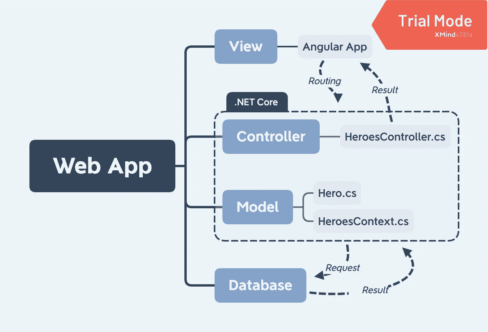

# 。英雄角游 App 的 NET 核心 API 简介

> 原文：<https://towardsdatascience.com/net-core-api-for-the-angular-tour-of-heroes-app-5895a36d2129?source=collection_archive---------27----------------------->

## 从本地开发到云部署的史诗之旅！


亚历克斯·阿扎巴赫在 [Unsplash](https://unsplash.com/s/photos/bridge?utm_source=unsplash&utm_medium=referral&utm_content=creditCopyText) 上的照片

# 继续之前:

本文假设你已经搭建了 Angular 官方教程——英雄之旅 app。如果你还没有建立这个，你应该检查从这里下载的[角度文件](https://angular.io/tutorial)或[。](https://angular.io/generated/zips/toh-pt6/toh-pt6.zip)其他一切都将在本系列文章中处理！

# 我们将完成什么

在这个系列中，我们将开始一次神奇的探索。NET Core，Angular，Docker，Azure，Azure SQL Server。

我们将熟悉一些技术，比如 Docker 容器、C#、JavaScript、SQL 和 Azure 命令行界面。

这些文章的最终结果将是一个带有. NET 核心 API 的前端，它与 Azure SQL server 对话，所有这些都托管在 Azure 上。

# 系列大纲

1.  这篇文章 MVC 的环境设置和解释。
2.  [微软 SQL 服务器(mssql)的本地 Docker 设置。](https://medium.com/@richardpeterson320/build-a-mssql-docker-container-800166ecca21)
3.  [建造。NET API。](/net-core-api-dive-into-c-27dcd4170066)
4.  [将您的 API 部署到 Azure。](/deploy-a-net-api-to-azure-84ea79d42d1a)
5.  [将您的 Angular 应用程序部署到 Azure。](https://medium.com/swlh/deploy-an-angular-app-to-azure-955f0c750686)

# 开始所需的工具

1.  Visual Studio 代码[(是免费的)](https://code.visualstudio.com/)
2.  Angular CLI [(应该已经从英雄之旅教程中设置好了)](https://angular.io/guide/setup-local)
3.  。NET Core — [该 API 将使用版本 3.0.2](https://dotnet.microsoft.com/download/dotnet-core/3.0)
4.  邮递员— [用于测试 API](https://www.postman.com/downloads/)
5.  Docker — [用于本地开发数据库，以及封装我们的应用](https://www.docker.com/products/docker-desktop)

使用我的 GitHub repo 跟进。

# 我们开始吧！


安德里亚·莱奥帕尔迪在 [Unsplash](https://unsplash.com/s/photos/running-mountain?utm_source=unsplash&utm_medium=referral&utm_content=creditCopyText) 上拍摄的照片

# 测试 Angular 应用

首先，从应用程序的根目录运行`ng serve --open`，启动英雄之旅 Angular 应用程序。您应该看到应用程序运行在端口 4200 上。

当你创建最初的应用程序时，它有一个内置的网络服务器[来模拟真实的服务器。我们将用 C#编写的 web API 替换这个人工服务器。NET 框架。让我们关闭应用程序，开始使用 API。](https://angular.io/tutorial/toh-pt6')

# 使用创建一个 web API。网络核心 CLI

确保。运行`dotnet --version`安装 NET Core CLI。的。NET Core CLI 有许多模板可供选择。用`dotnet new -h`检查这些选项标志。你看到 ASP.NET 核心 Web API 的模板了吗？它的简称是 webapi。通过运行以下命令从命令行创建 API:

```
dotnet new webapi -n Heroes.API
```

你应该会得到一个`Restore succeeded`的结果。输入`cd Heroes.API`进入新目录。检查`ls`以查看已经创建的文件夹和文件，并通过键入(带句点)`code .`启动该目录中的 VS 代码。

让我们通过运行`dotnet run`来确保 API 启动。在 web 浏览器中，导航到[https://localhost:5001/weather forecast](https://localhost:5001/weatherforecast)并接受不安全的目的地，以查看您的 API 以 JSON 格式返回的示例输出。这很好，因为它让你知道。NET 核心 API 通过使用模型和控制器来工作。我们将创建自己的**模型**和**控制器**，还将添加一个数据库**上下文**。

# 模型-视图-控制器

MVC 是一种 web 开发理念，它建议将应用程序的各个部分分离成逻辑组件。这使得你可以单独构建每一个部分，并确认其工作正常，然后将你的部分连接成一个完整的整体。来自 FreeCodeCamp.org 的这篇文章很好地解释了 MVC 就像在酒吧里点一杯酒。饮料菜单就是视图，你向调酒师(控制器)提出请求，调酒师根据配料和说明(模型)制作饮料，并把你完成的饮料返回给吧台(视图)。

在我们的应用程序中，这意味着:

1.  ***视图***:Angular app 会接收输入，发出请求，显示数据。
2.  ***控制器:*** C#类，接受传入的请求，解密请求的路由，并根据接收到的路由使用指定的模型与数据库进行交互。
3.  ***MODEL:*** C#类，定义传递给数据库或从数据库中检索的数据。这将意味着定义像 id 是一个整数，name 是一个字符串这样的东西，这样 C#就可以用 SQL 可以解释的方式传递这些值。数据库上下文对模型很重要



由作者创建

微软已经发布了关于。NET Core，我强烈推荐查看:

1.  [教程:用 ASP.NET 核心创建一个 web API。](https://docs.microsoft.com/en-us/aspnet/core/tutorials/first-web-api?view=aspnetcore-3.1&tabs=visual-studio-code)
2.  [用 ASP.NET 核心 MVC 创建一个 web 应用](https://docs.microsoft.com/en-us/aspnet/core/tutorials/first-mvc-app/?view=aspnetcore-3.1)

# 下一步:数据库

此时，您应该有两个资源:

1.  一个工作角度的英雄之旅应用程序。
2.  一个仿制药。NET 核心 API。

我们需要创建一个可以处理来自 API 控制器的请求的数据库。我们最终将迁移到托管的 Azure SQL 数据库，但现在，让我们启动一个 Microsoft SQL 服务器的本地 Docker 容器。这个容器是 SQL Server 的一个轻量级版本，我们可以轻松地进行开发。

前往[构建一个 MSSQL Docker 容器](https://medium.com/@richardpeterson320/build-a-mssql-docker-container-800166ecca21)来设置数据库！

# 构建一个. NET API 来处理来自 Angular 的请求

打造你的。NET API，在 aspnet-codegenerator 的帮助下。该应用程序将处理对这些路线的 API 请求:

1.  *GET: api/Heroes —* 该方法将返回数据库中的所有英雄
2.  *GET: api/Heroes/5 —* 这个方法将从数据库中返回一个特定的英雄。在这种情况下，它将返回 Id 为 5 的英雄。
3.  *PUT: api/Heroes/5 —* 这个方法会更新一个特定英雄的信息。
4.  *POST: api/Heroes —* 这个方法将向数据库发布一个新的英雄。
5.  *DELETE: api/Heroes/5 —* 这个方法将从数据库中删除一个特定的英雄。

在本文结束时，您将拥有 Angular 应用程序的本地版本。NET API 和数据库。

# 云部署

最后，您将[创建一个 Azure SQL server 并部署您的。NET API](/deploy-a-net-api-to-azure-84ea79d42d1a) 到 Azure 远程 git repo，并与 web 应用一起提供服务。

然后你将[把你的 angular 应用](https://medium.com/swlh/deploy-an-angular-app-to-azure-955f0c750686)作为 Docker 容器 web 应用部署到 Azure。

感谢您的阅读！