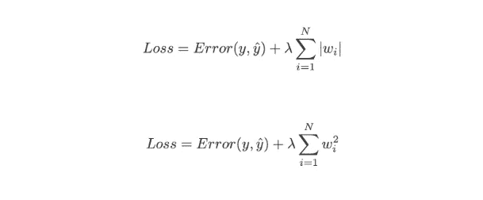

# 网飞数据科学面试练习题

> 原文：<https://towardsdatascience.com/netflix-data-science-interview-practice-problems-540f2e606c42?source=collection_archive---------53----------------------->

## 一些网飞面试问题的预演！

[自由股票](https://unsplash.com/@freestocks?utm_source=unsplash&utm_medium=referral&utm_content=creditCopyText)在 [Unsplash](https://unsplash.com/s/photos/netflix?utm_source=unsplash&utm_medium=referral&utm_content=creditCopyText) 上的照片

网飞是世界上最精英的科技公司之一，所以他们的数据科学面试问题更具挑战性也就不足为奇了。以下是之前在网飞的数据科学面试中被问到的几个面试问题，以及我对这些问题的回答。

# 问:为什么整流线性单位是一个很好的激活函数？

由作者创建

整流线性单元，也称为 ReLU 函数，已知是比 sigmoid 函数和 tanh 函数更好的激活函数，因为它执行梯度下降更快。请注意，在左侧的图像中，当 x(或 z)非常大时，斜率非常小，这会显著降低梯度下降的速度。然而，这不是 ReLU 函数的情况。

# 问:正规化有什么用？L1 正则化和 L2 正则化有什么区别？

L1 和 L2 正则化都是用于减少训练数据过拟合的方法。最小二乘法使残差平方和最小，这可能导致低偏差但高方差。

L1 vs L2 正规化

**L2 正则化**，也称为**岭回归**，最小化残差平方和加上λ乘以斜率平方。这个附加项被称为岭回归损失。这增加了模型的偏差，使得对训练数据的拟合更差，但是也减少了方差。
如果取岭回归罚分，用斜率的绝对值代替，那么就得到**套索回归**或 **L1 正则化**。
L2 不太稳健，但有一个稳定的解决方案，并且总是有一个解决方案。L1 更稳健，但是具有不稳定的解，并且可能具有多个解。

# 问:在线学习和批量学习有什么区别？

**批量学习**，也称为离线学习，就是你学习一组组的模式。这是大多数人都熟悉的学习类型，在这种情况下，您可以获取一个数据集，然后一次性在整个数据集上构建一个模型。

**另一方面，在线学习**是一种一次吸收一个观察数据的方法。在线学习是数据高效的，因为数据一旦被消费就不再需要，这在技术上意味着你不必存储你的数据。

# 问:在查询数据集时，如何处理空值？还有其他方法吗？

有多种方法可以处理空值，包括:

*   您可以完全忽略空值行
*   您可以用集中趋势的度量值(平均值、中值、众数)替换空值，或者用新的类别替换空值(如“无”)
*   您可以根据其他变量预测空值。例如，如果某一行的 weight 值为空，但它的 height 值为空，则可以用该给定高度的平均重量替换该空值。
*   最后，如果您正在使用自动处理空值的机器学习模型，则可以保留空值。

# 问:如何防止模型的过度拟合和复杂性？

对于那些不知道的人来说，**过度拟合**是一种建模错误，当一个函数与数据过于接近时，会导致新数据引入模型时出现高水平的错误。

有多种方法可以防止模型过度拟合:

*   **交叉验证**:交叉验证是一种用于评估模型在新的独立数据集上表现如何的技术。交叉验证最简单的例子是将数据分成两组:定型数据和测试数据，其中定型数据用于构建模型，测试数据用于测试模型。
*   **正则化**:当模型具有更高次的多项式时，会发生过拟合。因此，**正则化**通过惩罚高次多项式来减少过拟合。
*   **减少特征的数量**:您也可以通过简单地减少输入特征的数量来减少过度拟合。您可以通过手动移除特征来实现这一点，或者您可以使用一种称为主成分分析的技术，该技术将高维数据(例如 3 维)投影到较小的空间(例如 2 维)。
*   **集成学习技术**:集成技术通过 bagging 和 boosting 将许多弱学习者转化为强学习者。通过装袋和增压，这些技术比它们的替代技术更容易过度适应。

# 问:对于我们正在考虑的新功能，你会如何设计实验？什么样的指标是重要的？

作者创建的图像

我会进行 A/B 测试，以确定新特性的引入是否会在我们关心的给定指标上带来统计上的显著改进。度量标准的选择取决于功能的目标。例如，可以引入一个功能来提高转换率、web 流量或保留率。

首先，我会制定我的零假设(特征 X 不会改善度量 A)和我的替代假设(特征 X 会改善度量 A)。

接下来，我会通过随机抽样来创建我的控制组和测试组。因为 t 检验天生就考虑样本量，所以我不打算指定一个必要的样本量，虽然越大越好。

一旦我收集了我的数据，根据我的数据的特点，我会进行 t 检验，韦尔奇的 t 检验，卡方检验，或贝叶斯 A/B 检验，以确定我的控制组和测试组之间的差异是否有统计学意义。

# 感谢阅读！

如果你喜欢我的工作并想支持我，我会非常感谢你在我的社交媒体频道上关注我:

1.  支持我的最好方式就是在**媒体**T2 上关注我。
2.  在**推特** [这里](https://twitter.com/terence_shin)关注我。
3.  点击这里订阅我的新 **YouTube 频道** [。](https://www.youtube.com/channel/UCmy1ox7bo7zsLlDo8pOEEhA?view_as=subscriber)
4.  在 **LinkedIn** 这里[关注我](https://www.linkedin.com/in/terenceshin/)。
5.  在我的**邮箱列表** [这里](https://forms.gle/UGdTom9G6aFGHzPD9)报名。
6.  查看我的网站[terenceshin.comT21](https://terenceshin.com/)。