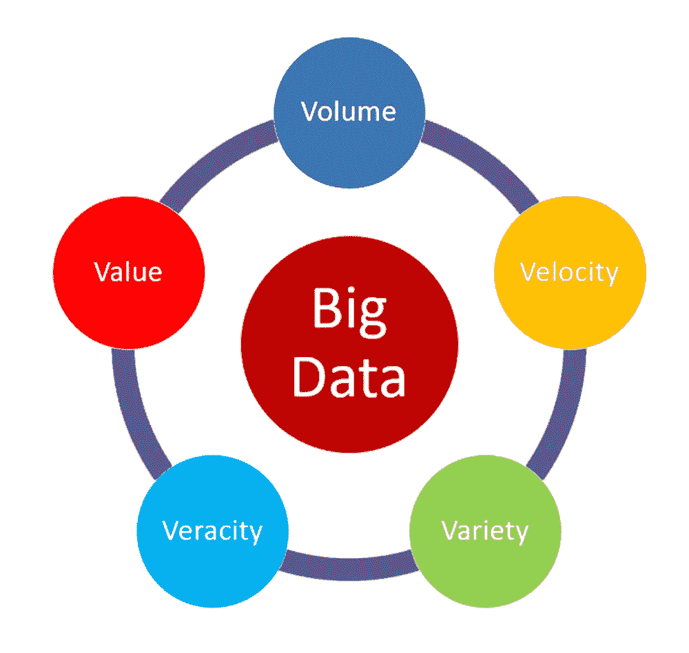
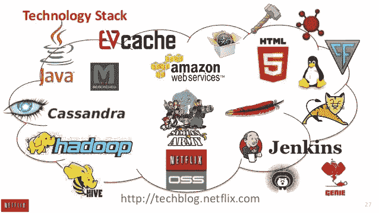
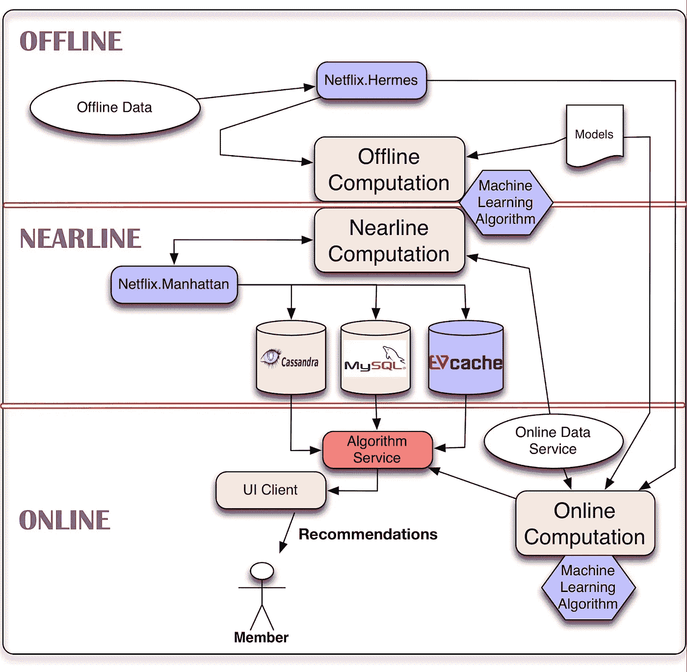

# 网飞推荐系统——大数据案例研究

> 原文：<https://towardsdatascience.com/netflix-recommender-system-a-big-data-case-study-19cfa6d56ff5?source=collection_archive---------0----------------------->

## 网飞著名的推荐系统背后的故事

图片由 [Unsplash](https://unsplash.com/?utm_source=medium&utm_medium=referral) 上的 [Thibault Penin](https://unsplash.com/@thibaultpenin?utm_source=medium&utm_medium=referral) 拍摄

**什么是网飞，他们是做什么的？**

网飞是一家媒体服务提供商，总部设在美国。它通过订阅模式提供电影流。它包括电视节目和内部制作的内容以及电影。最初，网飞出售 DVD，并通过邮件提供租赁服务。一年后，他们停止销售 DVD，但继续提供租赁服务。2010 年，他们上线并开始了流媒体服务。从那时起，网飞已经发展成为世界上最好和最大的流媒体服务之一(网飞，2020)。

网飞在电影和电视节目制作中扮演了积极的角色。该公司严重依赖数据。网飞位于互联网和讲故事的中间。他们正在发明新的网络电视。他们的主要收入来源来自用户的订阅费。它们允许用户在任何时候通过各种互联网连接服务(Gomez-Uribe et ),从他们的大量电影和电视节目中获取数据流。艾尔。, 2016).

他们学习的领域(主题领域)是什么？

网飞的主要资产是他们的技术。尤其是他们的推荐系统。推荐系统的研究是信息过滤系统的一个分支(推荐系统，2020)。信息过滤系统处理在数据流到达人类之前从数据流中去除不必要的信息。推荐系统处理推荐产品或给项目分配等级。它们主要被 YouTube、Spotify 和网飞等公司用来为观众生成播放列表。亚马逊使用推荐系统向用户推荐产品。大多数推荐系统通过使用用户的历史来研究用户。推荐系统有两种主要的方法。它们是协同过滤或内容过滤。协同过滤依赖于这样一个概念，即过去喜欢某样东西的人将来也会喜欢同样的体验。基于内容的过滤方法在项目信息已知但用户信息未知的情况下非常有用。它的功能是特定于用户的分类任务。它对分类器进行建模，以对用户关于项目特征的好恶进行建模。

**他们为什么想要/需要开展大数据项目？**

网飞的模式在一年内从出租/出售 DVD 转变为全球流媒体(网飞科技博客，2017a)。与有线电视不同，互联网电视是关于选择的。网飞希望通过流媒体服务在众多选项中做出选择来帮助观众。有线电视在地理上非常严格。然而，互联网电视的目录上有各种各样的项目，包括来自不同流派、不同人群的节目，以吸引不同口味的人。

销售 DVD 时的推荐问题是预测用户会给 DVD 多少颗星，范围从 1 星到 5 星。这是他们唯一集中精力的任务，因为这是他们从已经看过视频的成员那里得到的唯一东西。他们对观看体验、统计数据没有任何概念，在观看过程中也没有得到任何反馈。当网飞转向流媒体服务时，他们可以获得其成员的大量活动数据。这包括他们与设备相关的详细信息、一天中的时间、一周中的日期以及观看的频率。随着订阅和观看《网飞》的人数增加，这项任务变成了一个大数据项目。

他们想回答什么问题？

网飞就是向用户推荐下一个内容。他们唯一想回答的问题是“如何让用户尽可能地个性化网飞？”。尽管这是一个简单的问题，但几乎是网飞想要解决的所有问题。推荐嵌入在他们网站的每一部分。

推荐从你登录网飞开始。例如，您登录后看到的第一个屏幕由 10 行您最有可能接下来观看的标题组成。意识是他们个性化的另一个重要部分。他们让观众知道他们是如何适应他们的口味的。他们希望客户给他们反馈，同时也培养对他们系统的信任。他们会解释为什么他们认为你会看某个特定的标题。他们使用“基于你对……的兴趣”、“你的口味偏好创造了这一排”等短语。相似性是个性化的另一部分。

网飞从广义上对相似性进行了概念化，如电影、成员、流派等之间的相似性。它使用诸如“相似的标题可以立即观看”、“更像……”等短语。搜索也是网飞推荐系统的一个重要方面。

**数据来源:**

根据(网飞科技博客，2017b)，网飞推荐系统的数据来源是:

*   一组来自其成员的数十亿个评级。每天都有超过 100 万的新收视率。
*   他们在许多方面使用流行度指标，并以不同的方式计算它们。例如，他们每小时、每天或每周计算一次。他们还从地理上或通过使用其他相似性度量来检查构成成员的聚类。这些是计算受欢迎程度的一些不同维度。
*   流相关数据，例如持续时间、播放时间、设备类型、星期几和其他上下文相关信息。
*   他们的订户每天将数百万的图案和标题添加到他们的队列中。
*   目录中与某个标题相关的所有元数据，如导演、演员、流派、评级和来自不同平台的评论。
*   最近，他们添加了用户的社交数据，以便他们可以提取与他们和他们的朋友相关的社交特征，从而提供更好的建议。
*   网飞订户或成员的搜索相关文本信息。
*   除了内部数据来源，他们还使用外部数据，如票房信息、演出和影评。
*   其他特征，如人口统计、文化、语言和其他时态数据，用于预测模型中。

**研究中的数据量有多大？也就是说，大约需要多少数据存储？**

网飞从 2006 年到 2009 年举办了一场大型比赛，要求人们设计一种算法，可以将其著名的内部推荐系统“电影技术”提高 10%。无论是谁做出了最好的改进，都将获得 100 万澳元的奖励。呈现给用户的数据集的大小是 1 亿个用户评级。该数据集由 480，189 名用户对 17，770 部电影的 100，480，507 个评级组成。2009 年，该奖项被授予一个名为 bell kor ' s practical Chaos 的团队。网飞此后表示，该算法可处理其 50 亿次评级(网飞科技博客，2017 年 a)。因此，网飞推荐系统的数据集的大小被认为包括其所有标题的信息，其数量超过 50 亿。

**遇到了哪些数据访问权限、数据隐私问题、数据质量问题？**

如(Netflix Prize，2020)中所述，尽管网飞试图匿名化其数据集并保护用户隐私，但围绕与网飞竞赛相关的数据出现了许多隐私问题。2007 年，奥斯汀大学的研究人员通过匹配互联网电影数据库中的用户评级，找到了匿名网飞数据集中的用户。2009 年，与这个问题有关的四个人对网飞提起诉讼，指控其违反了美国的公平贸易法和视频隐私保护法。在此之后，网飞取消了 2010 年及以后的比赛。

**他们面临了哪些组织(非技术)挑战？**

根据 per (Maddodi 等人，2019 年)，在最初几天，网飞遭受了巨大的损失，然而随着互联网用户的增加，网飞将其商业企业模式从传统的 DVD 公寓和收入转变为 2007 年在线视频流的出现。网飞聪明地预见到了迪士尼和亚马逊等竞争对手的到来，因此从很早的阶段就在数据科学领域投入了大量资金。这些努力的大部分仍然在回报网飞，并使其处于流媒体行业的前沿。

他们面临哪些技术挑战？

该团队在构建系统时面临的一些技术挑战如下(ts cher 等人，2009 年):

*   不同模型的集合来预测单一输出。
*   优化集合的 RMSE。
*   模型的自动参数调整也是一个挑战。
*   捕捉统计相关性的全局效应。
*   捕捉全球时间效应和工作日效应。
*   检测短期影响是由于多人共享同一个账户还是由于一个人的情绪变化。

关于与推荐相关的搜索服务，在网飞工程师发表的一篇论文中(Lamkhede 等人，2019 年)，提到的挑战是:

*   从推荐系统的角度看视频的不可用性。
*   检测、报告和替换不可用的实体。
*   搜索词的长度通常很短，这使得网飞很难理解用户在搜索什么。
*   呈现即时搜索，即用户点击的那一刻，然后是好的结果是一个挑战。
*   通过允许不同的索引方案和指标来优化用户体验。

**为什么这是一个“大数据”问题？**

大数据的 V([来源](https://medium.com/@suryagutta/the-5-vs-of-big-data-2758bfcc51d))

**数量:**截至 2019 年 5 月，网飞约有 13，612 种图书(gal，2019)。仅美国图书馆就有 5087 种图书。截至 2016 年，网飞已经完成了向亚马逊网络服务的迁移。他们几十 Pb 的数据被转移到 AWS (Brodkin et al .，2016)。它由他们的工程数据、公司数据和其他文档组成。根据(AutomatedInsights，n.d ),可以近似计算出网飞仅在视频方面就存储了大约 105TB 的数据。然而，他们的推荐算法数据集预计会非常大，因为它需要包含上述所有信息。仅关注 Netflix 奖励任务，给用户的数据在 2GB 左右。它只包含 1 亿的电影收视率。当时，网飞承认它有 50 亿收视率。粗略地说，这相当于 10，000 GB 的评级数据。今天的规模将大于上述数字。

**速度:**截至 2019 年底，网飞拥有 100 万订户和 1.59 亿观众(BuisinessofApps，2020)。每当观众在网飞上观看某个节目时，它都会收集使用统计数据，如观看历史、标题评级、其他具有相似品味的人、与他们的服务相关的偏好、与标题相关的信息，如演员、流派、导演、上映年份等。此外，他们还收集有关数据时间、观看内容的设备类型、观看时长的数据(网飞，未注明日期)。平均每个网飞用户每天观看 2 小时的视频内容(Clark，2019)。尽管没有明确说明所有的功能，但网飞被认为从用户那里收集了大量的信息。网飞平均每天播放大约 200 万小时的内容。

**准确性:**准确性由数据中的偏差、噪声和异常组成。关于 Netflix 奖挑战，在数据中观察到了很大的差异。不是所有的电影都被一个人平等地评价。一部电影只有 3 个评分，而一个用户对超过 17，000 部电影进行了评分(ts cher 等人，2009)。就信息的类型和数量而言，网飞数据肯定会包含许多异常、偏差和噪声。

**多样性:**网飞表示，它以结构化格式收集大部分数据，如一天中的时间、观看时长、受欢迎程度、社交数据、搜索相关信息、流媒体相关数据等。然而，网飞也可能使用非结构化数据。网飞一直对其用于个性化的缩略图直言不讳。这意味着视频的缩略图对于不同的人是不同的，即使对于同一视频也是如此。所以，它可以处理图像和过滤器。

**谁对研究的进行和结果感兴趣？**

网飞的主要利益相关者是它的订户和观众。他们将会直接受到这个项目的影响。网飞推荐系统对该公司来说非常成功，是增加订户数量和观众人数的主要因素。次要利益相关者是其员工，就任务而言，次要利益相关者是网飞的研究团队，他们直接参与算法和系统的开发和维护。亚马逊、Hulu、Disney+、索尼、HBO 等竞争对手也对网飞的实验行为和结果表现出了浓厚的兴趣。毕竟他们才是制作电影的人。他们为什么希望网飞这样的中介机构拿走份额？他们中的许多人已经开始通过推出自己的平台来播放他们的内容，但网飞从一开始就通过在数据和算法上的大量投资而处于领先地位。

他们使用了哪些硬件/软件资源来实施项目？

网飞技术栈([来源](https://www.slideshare.net/justinbasilico/recommendation-at-netflix-scale)

为了建立一个推荐系统并进行大规模分析，网飞在硬件和软件方面投入了大量资金。网飞提出了一个如何处理任务的架构(巴西利科，2013)。

它如何执行推荐有三个阶段。来自(网飞科技博客，2017c)，离线计算应用于数据，它与用户的实时分析无关。执行时间宽松，算法批量训练，对固定时间间隔内要处理的数据量没有任何压力。但是它需要经常接受训练以吸收最新的信息。模型训练和结果的批量计算等任务是离线执行的。因为它们处理大量数据，所以通过 Pig 或 Hive 在 Hadoop 中运行它们将是有益的。调查结果必须公布，不仅要得到 HDFS 的支持，还要得到 S3 和卡珊德拉等其他数据库的支持。为此，网飞开发了一个名为 Hermes 的内部工具。它也是一个类似 Kafka 的发布-订阅框架，但它提供了额外的功能，如“多 DC 支持，跟踪机制，JSON 到 Avro 的转换，以及一个名为 Hermes console 的 GUI”(mor gan，2019)。他们需要一种工具来透明地有效监控、警告和处理错误。在网飞，近线层由离线计算的结果和其他中间结果组成。他们使用 Cassandra、MySQL 和 EVCache。优先级不是要存储多少数据，而是如何以最有效的方式存储数据。网飞的实时事件流是由一个叫做 Manhattan 的工具支持的，这个工具是内部开发的。它非常接近 Twitter 的 Storm，但它根据内部需求满足不同的需求。通过登录 Chukwa 到 Hadoop 来管理数据流。网飞严重依赖亚马逊网络服务来满足其硬件需求。更具体地说，他们使用 EC2 实例，这些实例很容易扩展并且几乎是容错的。他们所有的基础设施都运行在云中的 AWS 上。

图 1:网飞个性化的系统架构和建议(网飞科技博客，2013)——[来源](https://netflixtechblog.com/system-architectures-for-personalization-and-recommendation-e081aa94b5d8)

他们需要什么样的人/专业资源来开展项目？

网飞在数据科学上投入巨资。他们是一家数据驱动型公司，几乎在每个层面都使用数据分析进行决策。根据(Vanderbilt，2018)，大约有 800 名网飞工程师在硅谷总部工作。网飞还雇佣了一些最聪明的人才，数据科学家的平均工资非常高。它拥有在数据工程、深度学习、机器学习、人工智能和视频流工程方面具有专业知识的工程师。关于 Netflix 奖挑战赛，获胜团队“BellKor 的实用主义混乱”由 Andreas Toscher 和 Michael Jahrer (BigChaos)、Robert Bell、Chris Volinsky (AT & T)、Yehuda Koren(雅虎)(BellKorr 团队)和 Martin Piotte、Martin Chabbert(实用主义理论)组成。

**他们需要什么流程和技术？**

除了上面提到的工程技术，网飞工程师卡洛斯·a·戈麦斯-乌里韦和尼尔·亨特(Gomez-Uribe et。艾尔。，2016)指出，他们的推荐系统使用监督方法，如分类和回归，以及非监督方法，如使用主题建模的维数减少和聚类/压缩。矩阵分解、奇异值分解、分解机、概率图形模型的连接和方法，它们可以很容易地扩展以适应不同的问题。
关于 Netflix 奖挑战赛，使用了 107 种算法作为组合技术来预测单个输出。矩阵分解、奇异值分解、受限玻尔兹曼机是给出良好结果的一些最重要的技术。

**大概的项目进度/持续时间是多少？**

据(网飞科技博客，2017 年 a)报道，解决网飞任务的工程师报告称，他们需要 2000 多个小时的工作来构建一个由 107 个算法组成的集合，从而获得了这个奖项。网飞已经取得了它的源代码，并努力克服它的局限性，例如将它们的收视率从 1 亿提高到 50 亿。

**取得了哪些成果/答案？项目为组织和利益相关者带来了什么价值？**

如(戈麦斯-乌里韦等)中所述。艾尔。, 2016),

*   在推荐系统的帮助下，用户对网飞的整体参与度有所提高。这降低了取消率，增加了流媒体播放时间。
*   他们的用户每月流失率非常低，其中大部分是由于支付网关交易失败，而不是由于客户选择取消服务。
*   个性化和推荐每年为网飞节省超过 10 亿美元。
*   今天人们观看的 75%的内容是由他们的推荐系统提供的。
*   会员满意度随着推荐系统的发展和变化而提高。

关于 Netflix 奖任务，获胜的算法能够提高预测评级，并将“电影技术”提高 10.06% (Netflix 奖，2020 年)。根据(网飞科技博客，2017b)，奇异值分解能够将 RMSE 降低到 89.14%，而受限玻尔兹曼机器有助于将 RMSE 降低到 89.90%。他们一起将 RMSE 降低到 88%。

项目成功了吗？

对数据科学技术的投资帮助网飞成为视频流行业的佼佼者。个性化和推荐每年为公司节省 10 亿美元。此外，这也是吸引新用户加入平台的重要因素之一。此外，关于 Netflix 奖竞赛的获奖算法，其许多组件今天仍在推荐系统中使用(网飞科技博客，2017b)。因此，这个项目可以被认为是成功的。

**有没有发现什么惊喜？**

按照 per(t scher 等人，2009)的说法，他们意外地发现了二进制信息，这可以理解为人们不会随机选择和评价电影的事实。令人惊讶的是，在数据集中观察到非常强烈的一日效应。这可能是因为多人使用同一个帐户，也可能是因为一个人的情绪不同。

**从实施这个项目中学到了什么？**

集合技术带来了好的结果。多种技术结合起来预测单一结果，而不是改进单一技术。
训练模型并单独调整它们不会产生最佳结果。当整个集成方法在多样性和准确性之间具有精确的折衷时，结果是最好的。协作过滤领域已经有了很多开放的研究，Netflix 奖等竞赛可以促进这种开放的想法和研究。

**项目实施后采取了哪些具体措施？**

作为比赛的结果，网飞修改了获胜代码，将收视率从 1 亿提高到 50 亿(网飞科技博客，2017b)。直到今天，它甚至在其最先进的推荐系统中使用获奖项目的代码。网飞将其在视频流行业的成功归功于该项目及其进一步的研究和持续发展。

这个项目是如何改进的？

A/B 测试的程序和步骤可以通过包括通过环境而不是算法的评估来改进。与推荐系统的传统方法相反，它可以使用强化算法来向用户提供推荐。回报可以是用户满意度，状态可以是当前内容，动作可以是下一个最佳内容推荐。

**复杂术语的定义:**

**RMSE** **(均方根误差):**衡量数据点离回归线有多远。它可以用来理解残差的分布。它是通过取误差平方平均值的平方根来计算的。

**A/B 测试:**A/B 测试是一个统计过程，用来检查你的测试的有效性。第一步，提出一个假设。第二步，收集证据的统计数据，以接受或拒绝假设。第三步，分析数据以推断假设的正确性。

**受限玻尔兹曼机器:**这是一种人工神经网络，能够在给定一组输入的情况下学习潜在的概率分布。它可以用于监督学习和非监督学习。在分类、推荐引擎、主题建模等方面有很多应用。

**EC2:** 术语 EC2 代表弹性计算云。是亚马逊云计算平台的重要组成部分之一。任何公司都可以在 EC2 机器上部署其服务/应用程序，并让它们在短时间内运行。

**Hadoop:** Hadoop 通过提供一套软件和工具使分布式计算成为可能。它基于 Map Reduce 原理来存储和处理大数据。如今，许多公司使用 Hadoop 进行大规模数据处理和分析。

**HDFS:** 代表 Hadoop 分布式文件系统。它是作为存储系统的 Hadoop 生态系统的核心组件之一。它的工作原理是 MapReduce。它可以与群集一起提供高带宽。

**引用**
AutomatedInsights。(未注明)。网飞统计:目录保持多少小时。2020 年 4 月
12 日，来自[https://automatedingsights . com/blog/网飞-statistics-how-many-hours-](https://automatedinsights.com/blog/netflix-statistics-how-many-hours-does)
目录-持有

巴西利科，J. (2013 年 10 月 13 日)。网飞规模的建议。检索于 2020 年 4 月 12 日，来自
[https://www . slide share . net/justinbasilic/网飞规模推荐](https://www.slideshare.net/justinbasilico/recommendation-at-netflix-scale)

j . brod kin & Utc。(2016 年 2 月 11 日)。网飞完成了向亚马逊云的大规模迁移。
检索于 2020 年 4 月 12 日，来自[https://ars technica . com/information-technology/2016/02/网飞](https://arstechnica.com/information-technology/2016/02/netflix)
完成了其向亚马逊云的大规模迁移/

BuisinessofApps。(2020 年 3 月 6 日)。网飞收入和使用统计。检索 2020 年 4 月 12 日，发自
[https://www.businessofapps.com/data/netflix-statistics/](https://www.businessofapps.com/data/netflix-statistics/)

t .克拉克(2019 年 3 月 13 日)。网飞称其用户平均每天看 2 个小时——以下是与电视相比的情况。检索于 2020 年 4 月 12 日，来自
[https://www . business insider . com/网飞-观看-与平均水平相比-电视-观看-尼尔森-图表](https://www.businessinsider.com/netflix-viewing-compared-to-average-tv-viewing-nielsen-chart)
2019–3

图一。网飞个性化的系统结构和建议。(2013).系统
个性化和推荐架构【数字图像】，网飞科技
博客。2020 年 4 月 12 日检索，来自[https://netflixtechblog.com/system-architectures-for](https://netflixtechblog.com/system-architectures-for)
个性化推荐-e081aa94b5d8。

gal .(2019 年 5 月 14 日)。在你的国家有多少关于网飞的书？于 2020 年 4 月 12 日
从[https://cord cutting . com/blog/how-number-titles-is-available-on-网飞-in-your](https://cordcutting.com/blog/how-many-titles-are-available-on-netflix-in-your)
country/

Gomez-Uribe，c . a . & Hunt，N. (2016 年)。网飞推荐系统。美国计算机学会管理信息系统汇刊，6(4)，1–19。doi: 10.1145/2843948

Lamkhede，s .，& Das，S. (2019)。流媒体服务搜索面临的挑战。第 42 届国际 ACM SIGIR 信息检索研究与发展会议论文集。多伊:10.1145/333353633437

Maddodi 和 K . K . p .(2019 年)。网飞大数据分析-数据驱动的出现
推荐。SSRN 电子杂志。doi:10.2139/ssrn 3473148

摩根 A. (2019 年 5 月 20 日)。Allegro 发布了 Hermes 1.0，这是一个基于 REST 的消息代理，构建在 Kafka
之上。检索于 2020 年 4 月 12 日，来自[https://www.infoq.com/news/2019/05/launch-hermes-1/](https://www.infoq.com/news/2019/05/launch-hermes-1/)

Netflix 奖。(2020 年 1 月 20 日)。2020 年 4 月 12 日检索，来自
[https://en . Wikipedia . org/wiki/网飞 _ Prize # cite _ note-commendo 0921-27](https://en.wikipedia.org/wiki/Netflix_Prize#cite_note-commendo0921-27)

网飞科技博客。(2017 年 4 月 18 日 a)。网飞推荐:超越五星(第一部分)。
2020 年 4 月 12 日检索，来自[https://Netflix tech blog . com/网飞-推荐-超越-the](https://netflixtechblog.com/netflix-recommendations-beyond-the)
五星-part-1–55838468 f429

网飞科技博客。(2017 年 4 月 18 日 b)。网飞推荐:超越五星(第二部分)。
2020 年 4 月 12 日检索，来自[https://Netflix tech blog . com/网飞-推荐-超越-the](https://netflixtechblog.com/netflix-recommendations-beyond-the)
5-stars-part-2-d 9b 96 aa 399 f 5

网飞科技博客。(2017c 年 4 月 18 日)。个性化的系统架构和
建议。2020 年 4 月 12 日检索，来自[https://netflixtechblog.com/system](https://netflixtechblog.com/system)
个性化推荐架构-e081aa94b5d8

网飞。(2020 年 4 月 10 日)。检索于 2020 年 4 月 12 日，来自[https://en.wikipedia.org/wiki/Netflix](https://en.wikipedia.org/wiki/Netflix)

网飞。(未注明)。网飞的推荐系统是如何运作的。检索于 2020 年 4 月 12 日，来自
[https://help.netflix.com/en/node/100639](https://help.netflix.com/en/node/100639)

推荐系统。(2020 年 4 月 10 日)。检索于 2020 年 4 月 12 日，来自
[https://en.wikipedia.org/wiki/Recommender_system](https://en.wikipedia.org/wiki/Recommender_system)

Tö scher，a .，Jahrer，m .，和 Bell，R. M. (2009 年)。网飞大奖的大混沌解。网飞奖文档，1–52。

t .范德比尔特(2018 年 6 月 22 日)。网飞算法背后的科学决定了你
接下来会看什么。检索 2020 年 4 月 12 日，来自[https://www.wired.com/2013/08/qq-netflix](https://www.wired.com/2013/08/qq-netflix)算法/