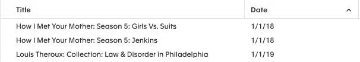
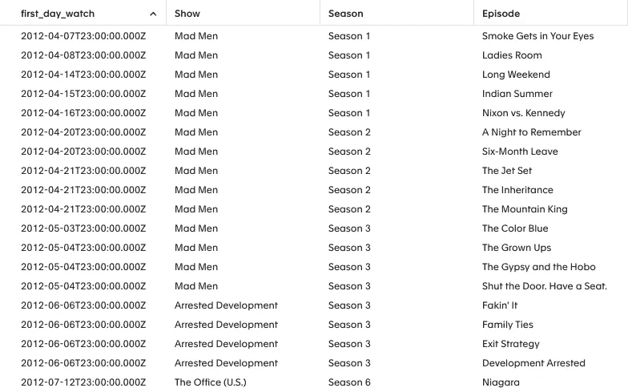
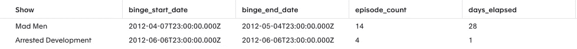
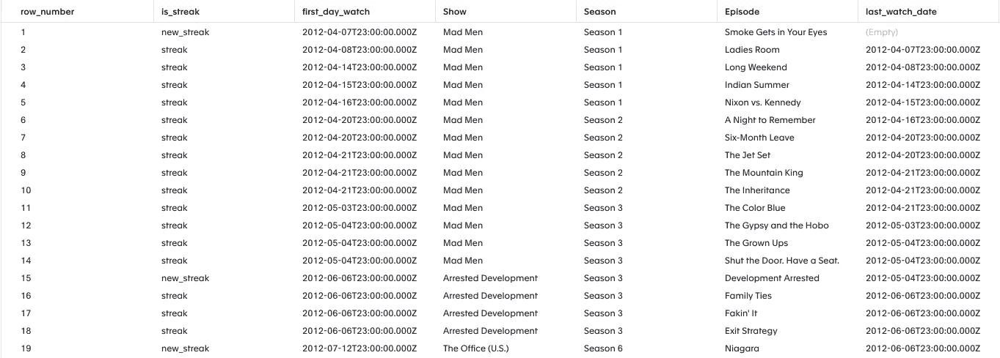
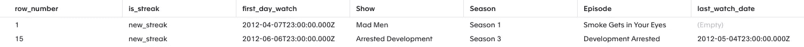
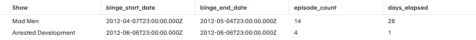
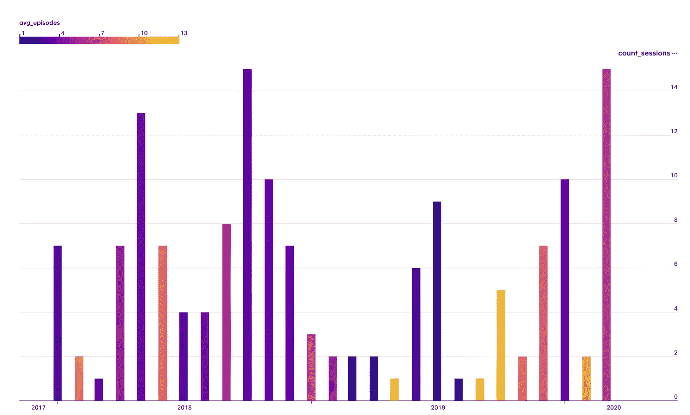
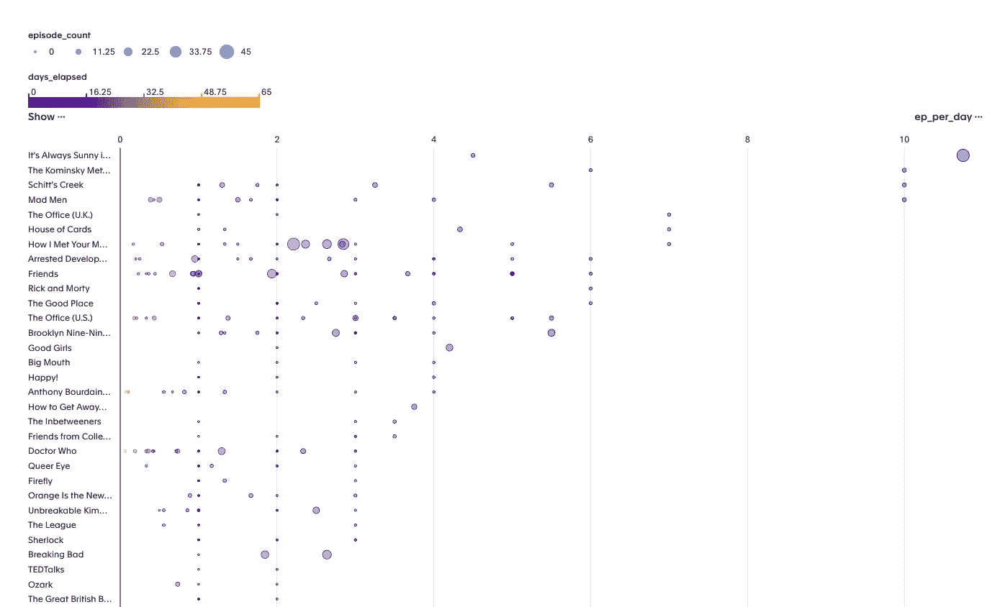

# 网飞和窗口功能

> 原文：<https://towardsdatascience.com/netflix-window-functions-b6dfe60cf0f6?source=collection_archive---------55----------------------->

## 一个窗口功能的快速介绍和一个非常真实的看看我实际上看了多少网飞。🙈

如果你和我一样，你会发现自己最近看了很多《网飞》。如果你更像我，你会渴望得到一些数据来证明这一点。

幸运的是，你可以[从网飞](https://count.co/n/nS97P4kEGwe)下载你自己的观看历史，然后自己开一个数据派对！🥳

更好的消息是:这是如何利用强大而难以捉摸的**窗口功能**的一个很好的例子。这一系列函数通常被认为是“高级”SQL，因此没有得到应有的广泛使用。

在下面的分析中，您将了解更多关于窗口函数的知识，更重要的是，如何充分利用它们。

因此，如果你正在寻找所有窗口功能宣传的内容，或者厌倦了向他人解释窗口功能，或者只是真的想知道我看了多少电视，这是给你的。

## 玩法:

1.  如果你是一个视觉型的人，像我一样，你可以在这里看我做分析

**2。或者，如果你更喜欢阅读，你可以在这里查看最终分析**[](https://count.co/n/0erWed0YsMF)****，或者我已经复制了下面的最终笔记本！****

**在你开始之前，如果你需要一点关于**窗口功能**的入门知识，我们已经为你准备好了。以下指南写在 [Count](https://count.co) 中，但内容适用于任何 SQL 工具！**

**[](https://count.co/n/0erWed0YsMF) [## 我的网飞项目

### 最近我得知网飞将向你提供他们掌握的所有关于你的信息。好奇心得到了最好的…

count.co](https://count.co/n/0erWed0YsMF) 

很难找到实用的数据培训材料来帮助您和您的团队更好地使用数据。我们策划了最好的，并在我们的每周简讯中分享。如果你想了解这一切，请在这里注册。** 

# **目标**

> **确定我“狂看”网飞的频率，以及自 2020 年 3 月“就地安置”指令开始以来，这一频率是否有所增加。**

## **准备👩‍🍳**

**来自网飞的数据是这样的:**

****

**来自网飞的原始格式或数据**

****标题**字段包含所有重要的位。所以，我决定在“:”上分开，从季节和剧集名称中分离出节目或电影名称。**

**根据您使用的工具的不同，执行此操作的代码看起来会有所不同，但它们应该都有相同的结果。**

**根据你的目标，你可能想在这里花更多的时间，但对我来说，这已经足够了！**

## **第二步:探索🧭**

> **在开始任何分析之前，花些时间了解您的数据总是一个好主意。**

**通过这一步，我发现了一个非常关键的发现:**

****网飞只给你最近一次看每一个节目的时间**😩。**

**非常失望。这使得对过去的观看活动建模变得很困难，实际上是不可能的，因为可能有很多我过去看过的(老友记)，现在还在看的(老友记)节目，这些都是最近才统计的。**

**尽管如此，我们坚持！💪**

## **第三步:定义🎯**

**因为我想了解我的狂看行为，我需要定义它到底是什么。**

**我决定把狂看定义为:**

*   **同一电视节目的任何连续观看，**
*   **对于我总共观看了超过 6 个单元的电视节目**

**那么，我们如何到达那里…**

**现在，数据看起来像这样:**

****

**我需要它看起来像这样:**

****

**为此我们需要**窗口函数**！这里有一个关于窗口函数的快速入门:**

**[](https://count.co/sql-resources/bigquery-standard-sql/window-functions-explained) [## 窗口函数说明| BigQuery 语法和示例|计数

### 关于 SQL 窗口函数你需要知道的一切。窗口函数，或称之为分析函数…

count.co](https://count.co/sql-resources/bigquery-standard-sql/window-functions-explained) 

为此，我采取的步骤是:

1.  **通过比较每行中的电视节目和上一行中的电视节目，判断每行是否是正在进行的狂欢会话的一部分**

```
case when lag(first_watch.Show) over (order by first_watch.first_day_watch asc) = first_watch.Show then ‘streak’ else ‘new_streak’ end ‘is_streak’
```

**2。使用行号或索引计算出有多少集**

```
row_number() over (order by first_watch.first_day_watch asc)
```

**3。算出前一集的观看日期。对于连续开始行，这将等于前一个连续的结束日期**

```
lag(first_watch.first_day_watch) over (order by first_watch.first_day_watch asc) last_watch_date
```

完成这三个步骤后，我离目标越来越近了:



**4。仅条纹过滤器启动**



**5。从首行拉入行号和最后一次观察日期:**

```
lead(starts.row_number) over (order by starts.first_day_watch asc) end_row_numlead(starts.last_watch_date) over (order by starts.first_day_watch asc) binge_end_date
```


**6。最后一点数学知识:**



## 第四步:分析📉

最后，有趣的部分！



点击这里查看图表互动版本！



点击这里查看图表互动版本！

从这两张图表中，我可以说:

1.  这个月(2020 年 3 月)我看电视的时间确实比平时多(这并不奇怪)。
2.  一些节目(*总是阳光明媚……*)是在一个大型狂欢会上观看的，而其他的(*朋友*)是在更小、更分散的狂欢会上观看的。

# 那么，现在怎么办？

这就是我今天愿意分享的个人数据的范围，但是你可以想象如果你愿意(我希望你这样做)，你可以如何进一步分析。如果你对网飞的数据做了自己的分析，请在评论中告诉我们结果如何！

很难找到实用的数据培训材料来帮助您和您的团队更好地使用数据。我们策划了最好的，并在我们的每周简讯中分享。如果你想了解它的全部内容，请在此注册。**