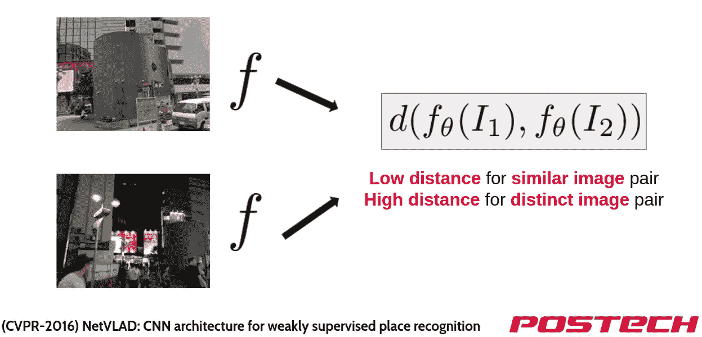

# NetVLAD:弱监督地点识别的 CNN 体系结构

> 原文：<https://towardsdatascience.com/netvlad-cnn-architecture-for-weakly-supervised-place-recognition-ce64b08bebaf?source=collection_archive---------27----------------------->

本文是一篇名为 NetVLAD:弱监督地点识别的 CNN 架构的论文的论文摘要。本文在图像检索任务中很受欢迎，并为地点识别任务提供了关键解决方案。

图像检索结果

**卷积神经网络** (CNN)一直是计算机视觉领域的心脏。随着计算资源的巨大发展，人们开始关注如何在降低计算复杂度的前提下提高模型的性能。因此，在**图像检索**中，CNN 架构用于特征提取。然而，使用 CNN 架构仍然遭受低性能。

**图像检索**是一个专注于**在数据库中找到最相似图像**的任务。相似这个关键词看起来很主观，因为相似性没有严格的定义。此外，我们不能使用朴素图像数组来计算相似性。为了解决它，我们定义了一个特征提取函数 f 和距离函数 d。这个方案被称为**度量学习**。关于**度量学习**的更多细节解释如下。

**视觉地点识别问题**重点在于利用数据库中的信息正确定位查询图像。一个候选的解决方案是使用**图像检索。**对于给定的查询，将其位置近似为最相似图像的位置。这种近似方法被称为**实例检索任务。**

在本文中，我们将介绍 **NetVLAD:弱监督地点识别的 CNN 架构**。这篇论文发表于 2016 年，为**视觉地点识别任务**介绍了一个很棒的 CNN 结构层。

# 在 NetVLAD 之前

有很多尝试来提取图像中的重要局部特征。不幸的是，最初的 CNN 结构不适合视觉位置识别任务。此外，许多“现成”技术限制了端到端的构建方式。本文的主要贡献如下

1.  创建一个 CNN 架构，它可以以端到端的方式进行训练，用于视觉位置识别。
2.  收集足以训练 CNN 架构的数据。
3.  使用 CNN 架构进行特征提取并评估其性能。

# 度量学习

演示材料中的幻灯片

**度量学习**的主要思想是学习距离函数和特征提取函数。为了方便起见，我们通常使用线性函数，并学习它们的参数。因为图像只是简单的整数数组，所以朴素图像很难得到它们之间的距离。因此，我们使用特征提取函数来提取局部描述符。它使用具有 NetVLAD 的 CNN 作为特征提取函数，并使用欧几里德距离作为距离函数。它选择欧几里德距离，因为它在实验中工作得很好。

# VLAD(局部聚集描述符的向量)

为了更好地了解什么是 VLAD，我建议你参考以下链接。

 [## VLAD——词汇袋的延伸

### 最近，我参加了 TagMe-一个由微软和印度研究所举办的图像分类竞赛…

ameyajoshi005.wordpress.com](https://ameyajoshi005.wordpress.com/2014/03/29/vlad-an-extension-of-bag-of-words/)  [## 关于 VLAD 的一切——IEEE 会议出版物

### 本文的目标是给定查询图像的大规模对象实例检索。这样的起点…

ieeexplore.ieee.org](https://ieeexplore.ieee.org/document/6619051) 

**VLAD** 不过是一种特征量化技术。它类似于我们熟悉的概念，被命名为**词汇袋**和**费希尔向量。**当您考虑 k 均值聚类时，它可以帮助您理解。

**VLAD** 是一个 K×D 矩阵，存储着聚类的信息。最初，K 被给定为超参数，并在嵌入空间中随机初始化 K 个簇。(D 是局部描述符的维度)每一列表示每个簇中残差的总和。我们可以关注输出 0 或 1 的函数 a_k。只有当聚类 k 是最近的中心时，它才是 1，否则是 0。

因为函数 a_k 不再可微，所以它不能是端到端的。因此，它使用一个**软赋值**来代替。下图显示了软赋值 a_k 的实际定义。当我们充分放大 alpha 值时，它近似于原始 a_k 函数。

此外，我们可以将该函数分解为

看起来我们只需要学习 c_k。然而，在下面的论文中，它表明{c} 、{w}和{b}的**解耦依赖**将**提高性能**。意思是学习{c}、{w}、{b}比只学习{c}获得更好的表现。进一步的细节将在下面的文章中介绍。

 [## 关于 VLAD 的一切——IEEE 会议出版物

### 本文的目标是给定查询图像的大规模对象实例检索。这样的起点…

ieeexplore.ieee.org](https://ieeexplore.ieee.org/document/6619051) 

整体网络结构如下。

网络结构

我们在 Conv5 图层后添加了 NetVLAD 图层，并使用 NetVLAD 图层提取了 VLAD 格式的要素。它在最后执行帧内归一化和 L2 归一化。文件中解释了进一步的细节。

# 注释数据

不幸的是，在 2016 年，没有一个数据集具有地面真理。因此，他们使用**弱监管**作为解决方案。

> 弱监管是指由于缺乏人工标注的数据而带有嘈杂标签的监管。

它使用**谷歌街景时光机，**只提供它的图像和位置。然后对于每个查询图像，将其他数据库图像分类为**潜在阳性**和**确定阴性**。**潜在阳性**是距离查询图像 10m 以内的图像。**明确否定**是距离查询图像超过 25m 的图像。那么我们就可以直观的理解下面的等式了。

如果最相似的图像具有小的距离，损失函数变大，并且确定的负图像与查询不相似。这个损失函数称为三重损失函数。要了解什么是三重损失函数，我推荐你这篇文章

 [## 无损三重损耗

### 一种更有效的暹罗神经网络损失函数

towardsdatascience.com](/lossless-triplet-loss-7e932f990b24) 

# 评估协议和实验细节

本实验中使用的是匹兹堡(Pitts250k，Pitts30k)和 Tokyo24/7，基于**谷歌街景时光机。**它使用评估协议的召回来计算正确识别的查询的百分比。当前 N 个检索到的数据库图像在 25m 以内时，它被认为是正确定位的。超参数 K 是 64。

# 结果

1.  基于 VGG16 的 VLAD 令人信服地优于由“现成”技术组成的 Root-SIFT + VLAD+白化。
2.  NetVLAD 可以为地点识别提供丰富而紧凑的图像表示。
3.  NetVLAD 在视觉地点识别任务中的表现优于 max-pooling。
4.  无论选择哪种网络主干(AlexNet、VGG16、Places205)，它都优于其他最先进的技术。

上图显示了另一个实验的结果。该实验检查了当我们改变最低训练层时，我们获得更好的性能。然而，当我们学习所有层时，会导致过度拟合，从而导致性能下降。

# **结论**

NetVLAD 提供了一个强大的池机制，具有可学习的参数，可以很容易地插入到任何其他 CNN 架构中。因为 NetVLAD 中的所有功能都是可微分的，所以当在网络中使用时，它可以提供端到端的方式。由于其方便性，它仍然是视觉位置识别任务中的一种受欢迎的方法。

演示文稿网址:[https://docs . Google . com/presentation/d/168 ermavkmuhghdnag 9j-ivxhcpgsudtlnowu _ 4 mcxq/edit？usp =共享](https://docs.google.com/presentation/d/168ErmavKMUHGHdNAG9j-IVXhcmPgSudTLnOWu_4McxQ/edit?usp=sharing)

论文网址:[https://arxiv.org/pdf/1511.07247.pdf](https://arxiv.org/pdf/1511.07247.pdf)

**联系我:jeongyw12382@postech.ac.kr**