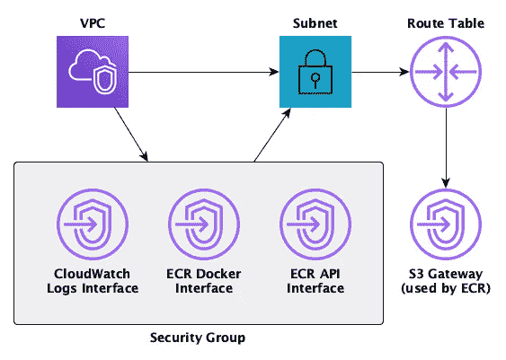

# 如何为 AWS 上的 Fargate 任务设置网络配置

> 原文：<https://towardsdatascience.com/network-configurations-for-fargate-tasks-6333314c4001?source=collection_archive---------53----------------------->

## 你需要知道什么以及如何实施

这篇博文是关于 AWS 上无服务器批处理作业的特定类型架构的三篇技术深度文章之一。该架构背后的基本前提是，我们希望使用 AWS 的托管服务来运行批处理作业。如果您想了解更多关于该架构的信息，请点击[此处](https://blog.codecentric.de/en/2020/06/cost-effective-batch-jobs-on-aws-serverless-infrastructure/)了解更多详情。该架构的整体情况如下:

整体架构(作者图解)。

简而言之，该架构由一个用于开发的组件和另一个用于通过 Cloudwatch 触发器执行批处理作业的组件组成。在这篇博文中，我们只关注这个架构的网络方面。还有一个[公共代码库](https://github.com/timo-boehm/serverless_batch_aws)，允许你基于 Cloudformation 脚本复制完整的服务及其所有部分。

从网络的角度来看， **Fargate** 服务——有点像 AWS 的**弹性容器服务(ECS)**——以及它与**弹性容器注册中心(ECR)** 的交互需要特别注意。网络配置需要满足两个主要要求:

1.  它必须允许该架构中使用的所有服务之间的通信。
2.  它必须保护服务免受未经授权的访问。最重要的是，所有的交通都必须在安全的范围内进行。通过公共 IP 或其他方式向互联网敞开大门是不可接受的。

让我们先从云形成脚本的初级入门开始，然后再来看网络的全貌。如果你已经有了云形成或者类似概念的经验，你可以略读或者跳过下面三段。

**CloudFormation** 是代码为的*基础设施的 AWS 风格。也就是说，您定义一个目标基础设施，将其推送给 AWS，AWS 为您提供它。你在所谓的堆栈中排列你的资源。这使得调整、监控或删除它们变得非常容易。*

您可以在 JSON 或 YAML 文件中编写 CloudFormation 脚本。这里和代码库中的所有例子都是 YAML 文件，但是您也可以在 JSON 中做同样的事情。

还有一组专门针对 CloudFormation 的命令可供您使用。在接下来的例子中，我使用了其中的三个:

1.  **！Ref** 是内部参考；也就是说，CloudFormation 从同一个脚本中插入一个值。
2.  **！Sub** 用于将变量替换成字符串。
3.  **！GetAtt** 类似于“！Ref”但是指向资源的特定属性，而不是它的一般引用。

# 大局

以下是组成网络设置的组件概述:

网络构建模块(作者插图)。

如您所见，这里涉及四项服务:

1.  **虚拟专用云(VPC)** 从逻辑上将您的 AWS 帐户与其他帐户分开。它提供了一组地址供其中的服务使用。
2.  **子网**只属于一个可用区域(AZ)。它们通常用于在一个 AZ 关闭的情况下确保容错。在我们的例子中，为了简单起见，我们跳过这一步，只在一个子网中构建所有内容。
3.  **安全组**是一种限制不同服务之间允许的流量类型的方法。例如，如果您要确保服务只能相互通信，您可以将它们放在同一个安全组中。然后，您可以使用该安全组阻止来自外部的所有流量。
4.  **端点**存在两种味道。首先，端点接口通过私有 IP 提供对服务的直接访问。第二，有端点网关。与接口相反，它们依赖于通过**路由表**进行路由。

在我们的示例中，我们需要端点来使用**弹性容器注册表(ECR)** 并将信息写入 **CloudWatch 日志**。按照规定，这里不涉及公共 IP 或任何对互联网的访问。

# 实施细节

让我带您看一下这个实现的三个方面:安全层**、、三个**接口端点**和**网关端点。****

## **安全层**

**在这种设置下， **VPC** 需要两种配置:**

1.  ****CIDR 块**描述了 VPC 中的地址空间。它是 IP 地址和您需要的子网掩码数量的组合。斜线后面的数字越小，可用的子网掩码就越多。**
2.  **我们还需要启用 **DNS 主机名**和 **DNS 支持**。这些支持端点稍后使用私有 DNS 功能。**

**以下是 VPC 在云形成脚本中的样子:**

**相关的**子网**有两种配置:**

1.  **它定义了一个 **CIDR 块**，该块位于 VPC 提供的块内。在我们的例子中，子网使用 VPC 的整个地址空间。**
2.  **为了安全起见，您可以确保在子网启动时明确关闭**公共 IP** 的映射。**

**同样，这是 CloudFormation 脚本的相关部分:**

****安全组**属于 VPC，没有进一步的配置。相反，一个额外的**入口规则**包含了重要的流量限制。该规则将流量限制为遵循 HTTPS 协议的安全组内的通信。以下是两种资源的配置:**

> ****注意:**也可以在 Cloudformation 中将两个部分配置为一个资源。但是，分成两个资源可以更容易地避免它们之间的循环引用。**

**子网和安全组是稍后被架构的其他部分直接引用的两个组件。这就是为什么公共存储库中的脚本会导出它们的引用。现在我们可以继续实现所需的端点。**

## **界面端点**

**一般来说，AWS 上的接口端点由于 **AWS 专用链接**而工作。记住， **Fargate** 决定了我们在这里需要哪些接口。附加服务或更复杂的架构可能需要其他配置。三个接口端点之间唯一的区别是它们的**服务名**。其余参数是相同的:**

*   **相关 VPC、子网和安全组的 **ID** 。**
*   ****VPC 端点类型**是一个接口。**
*   ****私有 DNS** 选项创建一个具有默认服务名的端点，而不是特定于端点的 DNS 主机名。**

**让我们简要讨论一下这些接口端点在更广泛的环境中所扮演的角色:**

1.  ******.ecr.dkr*** 是注册中心使用 Docker 命令的端点。**
2.  ****** . ECR . api****是通用访问注册表的 API。***
3.  ****.**日志**支持从 Fargate 到 Cloudwatch 日志的通信。***

***以下是所有三个界面的 CloudFormation 脚本:***

***如您所见，这种配置非常简单。不幸的是，我们需要创建另一种类型的端点:网关。***

## ***网关端点***

***只有两个 AWS 服务仍然依赖网关端点:S3 和 DynamoDB。ECR 在后台使用 S3 来存储容器图像和层。与接口端点相反，网关端点也需要直接与所谓的**路由**表**进行交互。*****

***路由表控制与 VPC 相关的流量。要使用它，我们必须创建表，然后将它与子网相关联。配置非常简单，所以让我在这里直接向您展示 CloudFormation 脚本:***

***有了这些资源，我们就可以配置 S3 网关端点了。唯一的新参数是负责组织子网内流量的路由器的 ID。再次比较 CloudFormation 脚本以获得详细信息:***

***如您所见，网关端点本身的配置比接口端点的配置要少。然而，我们需要两个额外的资源来覆盖它的功能。***

***我希望这个总结能够帮助您理解 Fargate 任务所需的网络配置。同样，如果你想了解更多关于架构的知识，请参考[概念帖子](https://blog.codecentric.de/en/2020/06/cost-effective-batch-jobs-on-aws-serverless-infrastructure/)。如果你打算重建它，请参考[公共代码库](https://github.com/timo-boehm/serverless_batch_aws)。此外，不久还会有两篇文章将这一讨论扩展到所需的 IAM 角色和策略，以及整个服务的特定构建块。***

***请在评论中告诉我你的想法和经历。我也很乐意在 [Twitter](https://twitter.com/timo_data) 和 [LinkedIn](https://www.linkedin.com/in/timo-boehm-datascience/) 上联系。感谢您的阅读！***