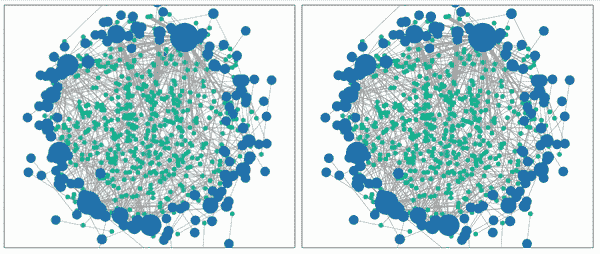
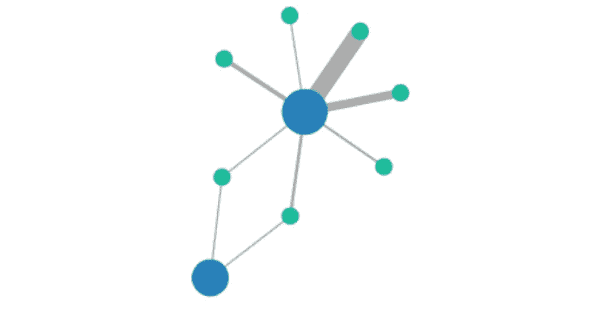
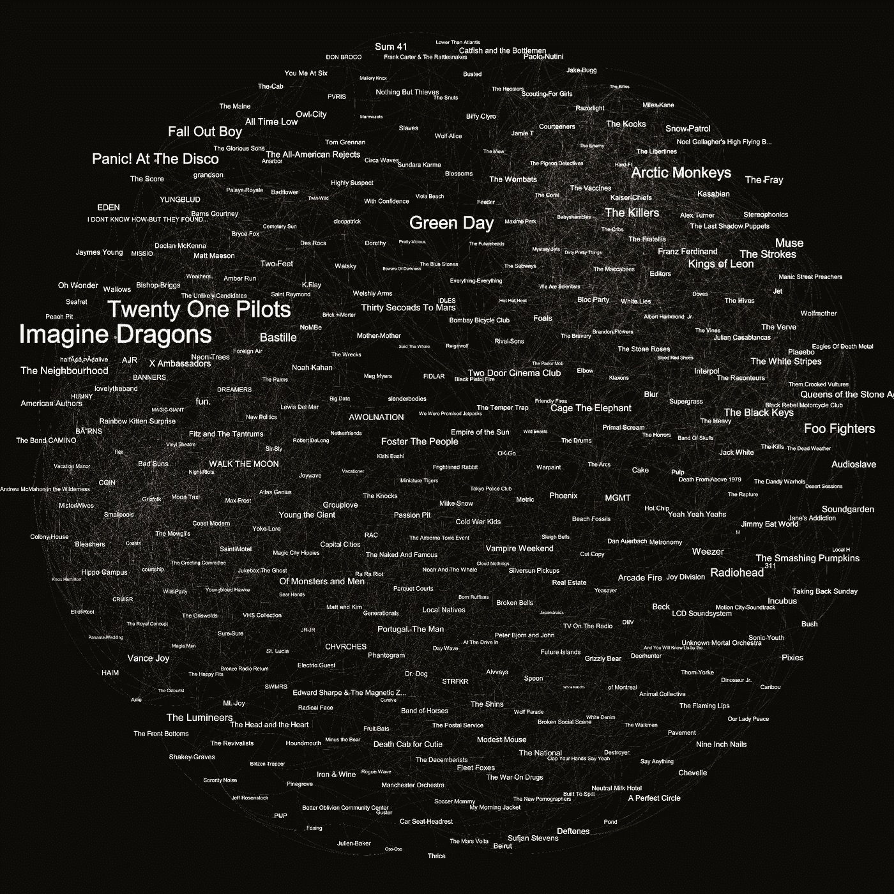

# 在画布上使用 D3js 的网络图

> 原文：<https://towardsdatascience.com/network-graph-with-d3js-on-canvas-b90f275dfaa6?source=collection_archive---------15----------------------->

## 用 D3.js 生成网络图的步骤

网络图模拟 SVG 和 Canvas 由[rubén trivio](https://github.com/Anexon/interactiveNetworkGraphD3Stencil)

1.  [如何在 Web 组件中使用 D3？](/how-to-use-d3js-with-webcomponents-a75ae4f980de)
2.  D3js 在画布上的网络图。

# 介绍

数据可视化是一个多面棱镜；有些人看到的是简单的条形图，而其他人看到的是清晰的增长趋势，甚至是已经完成的目标。

数据图形化有许多解决方案；从 Tableau、QlikView、Carto 或 Datastudio 等企业应用，到 bokeh、matplotlib 或 **d3.js** 等自助工具。事实是，每种情况都需要不同的方法，许多人已经提供了足够多的方法，如果没有必要，没有必要重新发明轮子，但是…如果你需要 DIY 解决方案，你来对地方了。

# 问题陈述:网络图形

这一次，我们将探索一个使用 **HTML Canvas** 元素的网络图形示例。Canvas 元素允许我们绘制内容，而不需要将所有可视元素存储在 *DOM* 中，就像使用 SVG 进行绘图一样。这允许创建具有大量元素的图形，而不会因浏览器渲染过程而降低性能。

我们将要看到的图表是由代表节点之间关系的线条连接起来的节点图。使用的数据集来自我担任运营分析师的 [BuscoExtra](https://buscoextra.es) 。简而言之，BuscoExtra 是一家专注于酒店服务的人事代理机构。在西班牙，雇主需要起草一份合法的雇佣合同来雇佣员工，即使是只持续几个小时的小工作。

因此，数据结构存储了在一定时期内产生的不同雇佣合同，这些将是线条，而餐馆，或雇主，和服务员，或雇员，将是我们图表的节点。

所以有两种类型的节点:`Worker`和`Establishment`。我们将使用两种颜色来区分它们，当`Worker`节点以更大的数量出现时，使用更小的半径。

数据结构定义

类型为`Establishment`的节点的半径随着它们雇佣的工人数量而变化。因此，较小的节点与那些链接到它们的`Worker`节点数量较少的节点相关。

此外，由于`Worker`和`Establishment`之间的约定可能出现多次，我们将添加一个名为`interactions`的变量，因此节点之间的线条将根据交互的次数变宽或变细。我们可以在下图中看到一个例子:

具有不同连接的节点示例。自己阐述。

所有这些特征实际上是丰富图表的不同维度，正如有人所说:一幅图胜过千言万语。我也相信。

在另一种数据结构中，我们可以根据一些其他标准使用一系列颜色来表示节点；根据节点的类型使用不同的形状(正方形、三角形等)..)或者更好的是，根据连接类型改变连接节点的线条类型:虚线、点划线、不同的颜色等..

我们可以使用各种属性来排列信息并添加额外的维度，就像有些人使用 Spotify 来显示音乐风格一样，在相反的两极上表示更遥远的风格。可能性是无限的，只受我们创造力的限制。

Spotify 艺术家网络图，按粉丝数量划分。来自:[Reddit:](https://i.redd.it/rxbclwgstcu41.jpg)[u/Enguzelharf](https://www.reddit.com/user/Enguzelharf/)

# 入门指南

首先我们在 [*模板*](https://stenciljs.com/) 中创建一个基础项目，并在输入参数中提供数据结构([这里是如何做到超快](/how-to-use-d3js-with-webcomponents-a75ae4f980de))。

一旦组件中有了数据，我们将开始定义绘制策略。与 *SVG* 不同，在*画布*中，我们将使用画笔的属性:粗细、颜色等..此外，我们将不得不在绘图时更新画刷在画布中的位置。因此，在*画布*中，我们没有将元素放入绘画中，只有我们已经画过的东西，而在 *SVG* 中，元素是通过标签`<g>`、`<image>`、`<text>`等属性放置的..

Canvas 提供绘制基本几何图形的操作:直线、圆、弧、正方形等。我们将不得不用这些形状做任何事情。但是不要担心，如果你仔细想想，对于这个图形，我们只需要画圆和线。很简单，不是吗？确实是。

## 绘图节点

在下一段代码中，我们可以看到绘制节点所需的步骤:

绘制节点代码段

在这个函数中发生了三件主要的事情:我们开始绘制路径，设置绘制参数(颜色、宽度等..)和生成形状的画笔运动。

在*画布*上的所有操作都是通过它的*上下文*完成的，这个上下文是我们在使用 ***D3.js*** 选择 HTML 元素时得到的。

*   ***begin path()*** 这个函数相当于把画笔放在画布上，所以当我们移动它的位置时，它后面会出现一条线。
*   ***线宽*，*fillStyle*y*stroke style***
    这些都是允许我们自定义线型的属性。例如，根据节点类型，我们会改变颜色。在这种情况下，我们将使用一个充满纯色的圆来绘制一个节点。
*   ***移动到* (x，y)**
    使用此功能，我们将画笔定位在我们想要开始绘制的位置。在这种情况下，我们将使用`X`和`Y`参数将其移动到节点位置。
*   ***arc(x，y，radius，originalAngle，finalAngle)***
    这是负责沿着 0 到 2π的顺时针圆弧画一个圆。如前所述，半径将根据节点类型进行设置。
*   ***fill()***
    这个函数会用之前描述的`fillStyle`参数中设置的颜色填充形状。
*   ***【stroke()】*** 这将绘制一条带有形状的元素线。

## 绘制链接

下一段代码显示了绘制链接所需的步骤:

生活的一部分

这个功能甚至更简单，从笔刷设置的一部分来看，与前面步骤的区别在于我们调用了`lineTo`而不是`arc`。

*   **lineTo(x，y)** 这个函数允许我们用画笔当前位置的原点和传递给它的目的地`X`和`Y`画一条线。也就是说，我们将位置移动到源节点，并制作一条到目标节点的线。在这种情况下，我们将线的宽度调整为一个比例，以便随着交互次数的增加而加宽。

## 完整的绘图功能

一旦我们有了绘制节点和线的函数，我们就可以定义一般的绘制操作:

绘图功能

在这个函数中，我们调用每个节点和链接的绘制方法。此外，通过函数`clearRect`、`save`和`restore`，我们可以在每次迭代中清理并恢复画布，这样之前的操作就不会重叠。

记住，直到现在我们还没有使用过 ***D3.js*** ，我们只是创建了逻辑来绘制我们的元素。用 *D3* 我们将获得我们还缺少的信息:元素的实际位置。

## 定位元素

所有的绘制操作都参考节点的位置。但是，初始数据结构只包含节点之间的引用、迭代次数、关系等等，不包含任何与元素实际位置相关的内容。

为了获得元素的位置，我们将使用 *D3* ，特别是函数`forceSimulation`(此处的[完整引用](https://github.com/d3/d3-force))。该函数执行模拟，其中元素的位置被更新，并且它修改原始数据结构。

通过力模拟生成元素位置

`forceSimulation`从节点列表中执行力模拟。最初，我们的节点没有位置，这是负责在每次迭代中建立每个节点的`X`和`Y`值的节点。因此，在本文开头的 GIF 中，它被视为从中心开始的节点爆炸，这是模拟的开始。

该函数允许我们提供一个节点列表，声明一系列力，并订阅模拟的每次迭代，其中我们将有节点的更新位置，并允许我们绘图。我们可以宣布的力量是:

*   ***链接***
    它们是节点之间的联合力量，它允许我们通过使用 D3 函数`forceLink`来建立节点之间的距离限制，我们将我们的链接列表和节点之间的期望距离传递给 D3 函数。
*   ***电荷*** 这种力产生了类似电子电荷的效应。在 D3 提供的选项中，我们将使用负力的`forceManyBody`，它建立了一个类似重力但方向相反的力场。也就是说，所有节点会相互排斥，排斥力随着距离的增加而减小，直到到达`distanceMax`时完全消失。
*   ***中心*** 另一方面，我们建立了一个径向力场，将所有网络保持在一起，使孤立的节点不会分散太多。

模拟的每次迭代都调用函数`tick`,我们可以利用它来绘制节点，从而获得动画效果。

# 为什么在 SVG 上画布

HTML Canvas 元素引入了一系列复杂性，因为它没有对所绘制元素的引用，必须对数据执行迭代操作并存储元素的位置以更新它们的状态。然而，数据结构被专门存储在 *VirtualDOM* 中，不像 *SVG* ，其数据结构被呈现在 *DOM* 中，并在用户与可视元素进行任何交互后重新绘制。这大大减少了绘画操作，尤其是在操作成千上万的视觉元素时。然而，当要绘制的表面非常大时，*画布*会压倒性地输给 *SVG* 。

绘制成千上万个数据点可能不是每种情况，或者在绘制过程之前可以在服务器上完成数据的预处理。然而，有时这是不可避免的，在这些情况下，当 *SVG* 简单地冻结浏览器时， *Canvas* 元素可能是一个解决方案。

# 结论

如果你想自己完全重现这个过程，你可以检查 [**这个完整的项目**](https://github.com/Anexon/interactiveNetworkGraphD3Stencil) 和**交互功能，同时使用 Canvas 和 SVG** 。此外，我还包含了数据集文件，这样你就可以探索数据结构或者用你自己的来改变它。