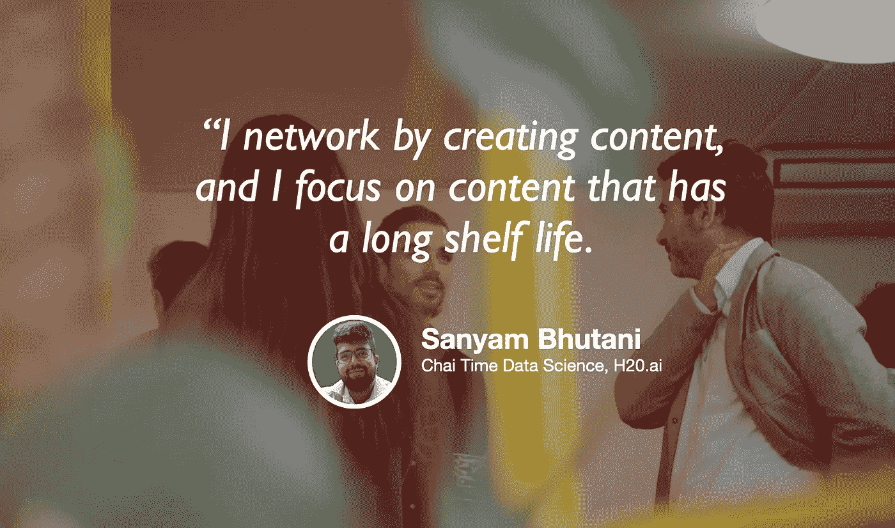

# 像数据科学专家一样联网

> 原文：<https://towardsdatascience.com/networking-like-a-pro-in-data-science-4133b91e1b6f?source=collection_archive---------37----------------------->

## [苹果](https://podcasts.apple.com/ca/podcast/towards-data-science/id1470952338?mt=2) | [谷歌](https://www.google.com/podcasts?feed=aHR0cHM6Ly9hbmNob3IuZm0vcy8zNmI0ODQ0L3BvZGNhc3QvcnNz) | [SPOTIFY](https://open.spotify.com/show/63diy2DtpHzQfeNVxAPZgU) | [其他](https://anchor.fm/towardsdatascience)

## Sanyam Bhutani 在 [TDS 播客](https://towardsdatascience.com/podcast/home)

背景图片由[HIVAN ARVIZU @ soyhivan](https://unsplash.com/@soyhivan?utm_source=unsplash&utm_medium=referral&utm_content=creditCopyText)-[Unsplash](https://unsplash.com/s/photos/networking?utm_source=unsplash&utm_medium=referral&utm_content=creditCopyText)

*编者按:迈向数据科学播客的“攀登数据科学阶梯”系列由 Jeremie Harris 主持。除了主持播客，Jeremie 还帮助运营一家名为*[*sharpes minds*](http://sharpestminds.com)*的数据科学导师初创公司。你可以听下面的播客:*

网络是数据科学中最有价值的职业发展技能。然而，几乎矛盾的是，大多数数据科学家根本不在这上面花时间。在某些方面，这并不十分令人惊讶:数据科学是一个非常技术性的领域，技术人员通常不愿意特意去寻求社交互动。我们倾向于认为与其他“编码灵长类动物”的交流往好里说是一种干扰，往坏里说是一种引发焦虑的噩梦。

那么，数据科学家如何克服这种焦虑，挖掘网络建设的价值，并在数据科学社区中为自己开发品牌呢？这个问题将我们带到了本期播客。为了回答这个问题，我采访了重复嘉宾 Sanyam Bhutani——一位顶级 Kaggler，Chai Time 数据科学节目的主持人，机器学习工程师和 H2O.ai 的人工智能内容创作者，谈到了他利用非正统的网络战略成为机器学习社区的一员，并获得了他目前的角色。

以下是这一集中我最喜欢的一些带回家的东西:

*   在数据科学中，有很多很多不同的方式来建立联系:聚会、Slack 和 Discord 社区、一对一的电话、播客、书面采访和博客帖子等。你不需要做所有的事情，也不应该做。相反，从选择符合你个性的策略开始。如果你比较内向，远离聚会(需要更多的破冰)，专注于一对一的通话。如果你是一个外向的人，在更大的集体活动中寻找机会做演讲，通过与人交往来利用你的比较优势。
*   这听起来可能有争议，但是播客作为一种交流方式仍然被低估了。不要误会我的意思:你绝对不应该为了出名而开播客！但是，采访式播客给了你一个很好的借口去了解机器学习社区的重要成员，甚至是你有一天可能想为之工作的公司的经理。人们出人意料地乐于接受采访，一对一的形式意味着这种策略特别适合内向的人。
*   如果你没有勇气建立关系网，主持播客也很好，因为它迫使你预先承诺在特定的时间和日期与某人交谈。鼓起勇气通过电子邮件发送邀请相对容易，所以害羞内向的人更有可能真的这么做——一旦你这么做了，你就不得不坚持到底。
*   有大量不和谐和松散的社区以及在线论坛，在进行任何“面对面”(即远程视频聊天)网络之前，你可以与其他数据科学家联系，进行热身。如果你想尝试一下，这可能是很好的第一步。

你可以[在 Twitter 上关注 Sanyam 这里](https://twitter.com/bhutanisanyam1)，你可以[在 Twitter 上关注我这里](https://twitter.com/jeremiecharris)。

另外，看看 [YouTube](https://www.youtube.com/channel/UCRjtBP-o5FbgRzX2BHQEFtQ) 和[主播](https://anchor.fm/chaitimedatascience)上的柴时代数据科学秀吧！