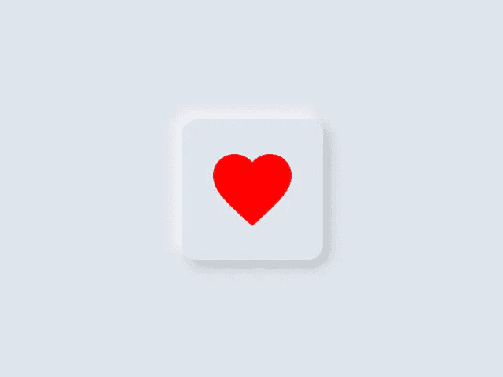
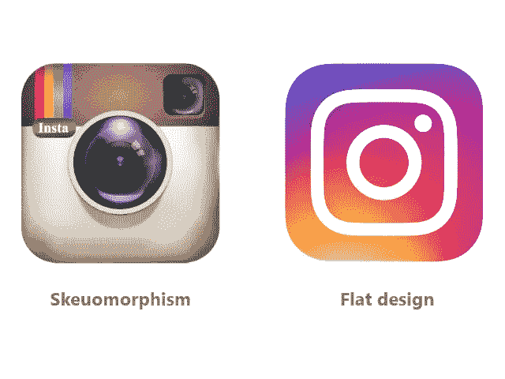
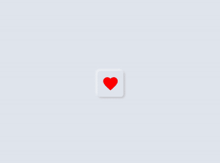
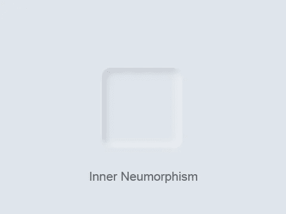
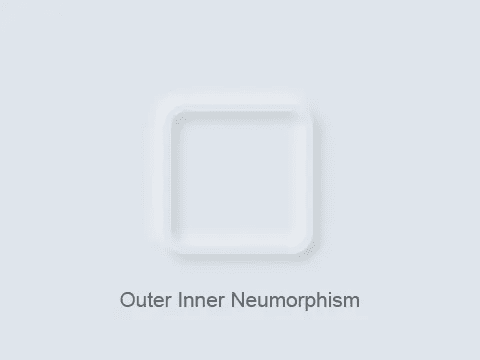
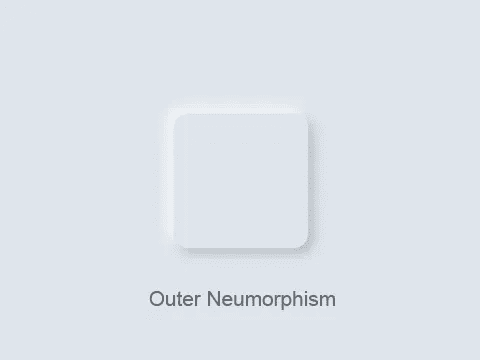
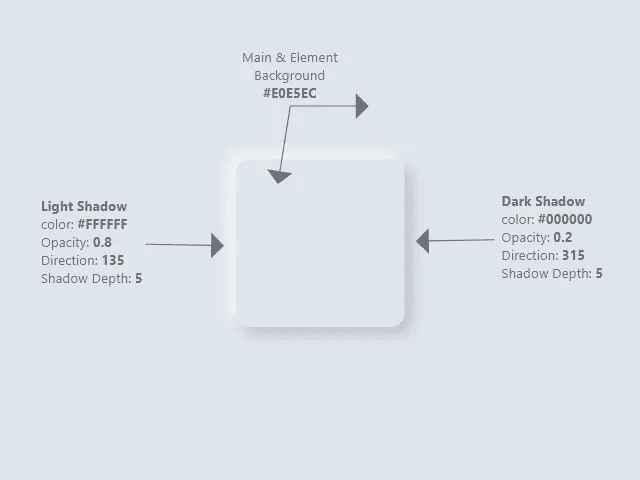
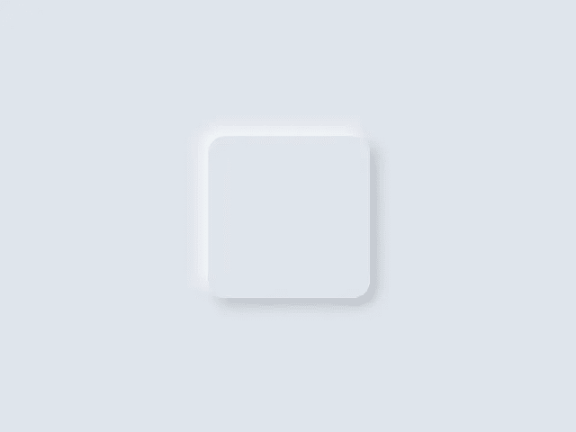

# 带动画的神经变形

> 原文：<https://towardsdatascience.com/neumorphism-with-animation-1c24a4c0e2b4?source=collection_archive---------33----------------------->

## 理解新变体并在 WPF 实施。

作者一张美丽的爱情纽扣照片。

技术世界发展迅速，每天都有一些有才华的人提出新技术。如果你是这些人中的一员，你就是一个了不起的家伙！但是如果你不是，通过学习他们的成就来阻止他们超越你。

我已经回答了这个故事中的两个基本问题:

*   什么是神经形态？
*   如何在 WPF 实现新形态？

我希望我的解释能够帮助您将这项新技术应用到即将到来的项目中。

# 什么是神经形态？

Neumorphism 是 2020 年新的设计风格趋势。其实它第一次使用是在 2019 年的最后。

在我们定义神经形态之前，让我们看看以前的设计风格:

*   **Skeuomorphism:** 是一种界面元素风格，*模仿*它们在现实世界中的对等物，以及用户如何与它们互动。
*   **平面设计:**是一种界面设计风格，强调简单元素、排版和平面颜色的极简使用。这是设计网页或手机界面的常用风格。

(左)图标来自[图标 png](https://www.iconspng.com/image/139777/old-instagram-logo) |(右)图标来自[图标 png](https://www.iconspng.com/image/140517/instagram-logo) 。

Skeuomorphism 风格看起来像现实。扁平化设计看起来数字化，其实很简单。

**Neumorphism** 结合 Skeuomorphism 和扁平化设计:真实又简单。有了这种风格，我们可以给用户一种独特的体验。

> Neumorphism 关心的是用简单的形状和颜色制作逼真的元素。

# 如何在 WPF 实现新形态？

一起，我们将实现这样的纽形按钮:

我工作的最终结果。

## 1.概观

一个神经形态元素有不同的表现方式(见下图)，基于元素行为，我们可以决定我们应该使用哪种表现方式。

作者图片。

要对任何元素应用 Neumorphism 样式，您必须实现以下三个主要属性:

*   **元素的背景**必须与其主容器相同。
*   **深色阴影**必须应用到元素的一个角上。
*   **光影**必须应用到对角。

异形零件的描述。

## 2.让我们开始编码吧

我将编码过程分为 4 个部分:

*   制作外部异形按钮样式。
*   制作内部异形按钮样式。
*   应用动画。
*   添加一个漂亮的图标。

你可以从[这里](https://gist.github.com/osman-bashir/8b402ef2099f69312c88b7e5e3b6a9f9)得到所有的代码样本。尽管代码是用 XAML 语言写的，你仍然可以用你喜欢的语言把相同的概念变成代码。

## 1.制作外部异形按钮样式

打开 Visual Studio，创建一个新的 WPF 应用程序，并将其命名为“Neumorphism”。在本例中，解决方案名称为“Neumorphism”。

打开 **Neumorphism.xaml** ，添加以下代码:

外部神经形态按钮实现

我们有一个名为 **OuterGrid** 的网格元素，它代表主要的背景色，我们还有两个边框元素: **OuterLowerBorder** 代表深色阴影，以及**outeruperborder**代表浅色阴影。

很简单，对吧？只有两个元素(网格和边界)，我们已经获得了我们的设计。

外部变形风格。

## 2.制作内部异形按钮样式

如果我们只是将 **OuterLowerBorder** 和 **OuterUpperBorder** 的背景从(#E0E5EC)改为(Transparent)，我们会得到另一种 Neumorphism 表示，我称之为 outer inner style，因为它是外部和内部风格的混合。

外部内部样式实现

外在内在风格。

为了改变这种内部风格，我们必须隐藏边界周围的外部阴影(明暗),并保持内部阴影可见。我们可以通过用另一个边界包围我们的边界来做到这一点。这个名为 **SurroundingBorder** 的新边框必须与我们的主边框具有相同的属性。将 **InnerGrid** 实现插入 **MainGrid** 实现，如下所示:

内部按钮样式实现

内部按钮样式。

## 3.应用动画

我们已经到了本教程最重要的部分:如何制作我们的按钮？以及如何使其可点击？

我们需要做的就是在内部样式的上方添加**外部样式**，并根据用户交互使其消失和出现。

下面的代码显示了如何在外部和内部样式之间进行组合:

Neumorphic 按钮样式实现

为了让这些边框与用户交互，正如你在上面的动画图像中看到的，我们需要在 **MainGrid** 中的上边框添加一些触发器，即**outerupberborder**。

在 **OuterUpperBorder** 触发器中，我实现了两个事件:MouseDown**事件和 MouseUp** 事件。

为按钮实现动画

在 **MouseDown** 事件触发器中，我对我们的 Neumorphic 按钮做了四个动画更改，以将其从外部样式转换为内部样式:

*   隐藏**外网格**通过减少其不透明度为 0。
*   减少**外上边框**和**外下边框**(外边框)的宽度和高度。
*   减少**外暗阴影**和**外亮阴影**的阴影深度(外边框阴影)。
*   增加**内暗阴影**和**内亮阴影**的阴影深度(内边框阴影)。

在 **MouseUp** 事件触发器中，我对我们的 Neumorphic 按钮进行了四次动画修改，以将其从内部样式转换为外部样式(与 **MouseDown** 事件触发器相同，但方向相反):

*   通过将不透明度设置为 1 来显示**外网格**。
*   扩展**外上边框**和**外下边框**(外边框)的宽度和高度。
*   增加**外暗阴影**和**外亮阴影**的阴影深度(外边框阴影)。
*   减少**内暗阴影**和**内亮阴影**的阴影深度(内边框阴影)。

## 4.添加一个漂亮的图标

这部分不重要:你可以把你想要的任何内容放在 **MainGrid** (上层)。

我使用了材料设计图标中的图标。如果你想和我继续下去，你必须在你的项目上安装 Xaml 工具包中的[材料设计。本指南](https://github.com/MaterialDesignInXAML/MaterialDesignInXamlToolkit)[超级快速入门](https://github.com/MaterialDesignInXAML/MaterialDesignInXamlToolkit/wiki/Super-Quick-Start)将帮助你做到这一点。

以下代码演示了如何将图标添加到 **MainGrid** 子节点:

图标实现

现在，给**鼠标按下**和**鼠标抬起**事件触发器添加图标动画:

图标的动画实现

鼠标按下时:

*   **LoveIcon** 颜色会恢复到原来的状态(浅灰色)。
*   **LoveIcon** 宽度和高度会减小。

当鼠标抬起时:

*   **LoveIcon** 颜色会变成红色。
*   **LoveIcon** 宽度和高度会增加。

终于，你做到了！运行项目，看看你取得了什么成果。

谢谢你的时间。我希望你找到了你的目标，并且喜欢阅读我的文章。如果你有任何问题或笔记，请随意写在这里的回复中。