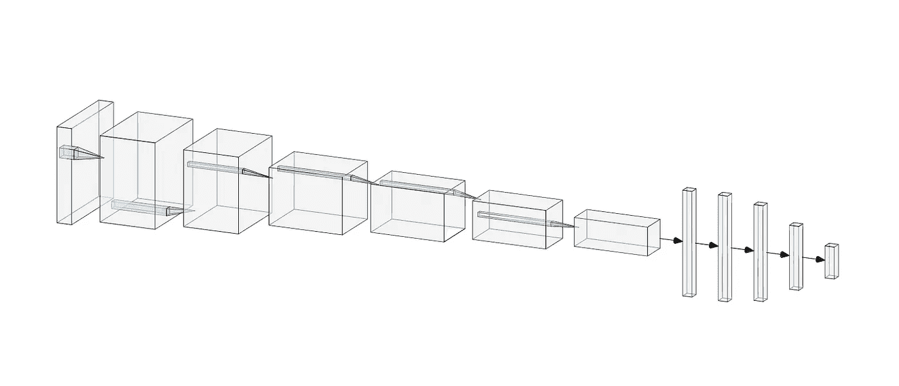
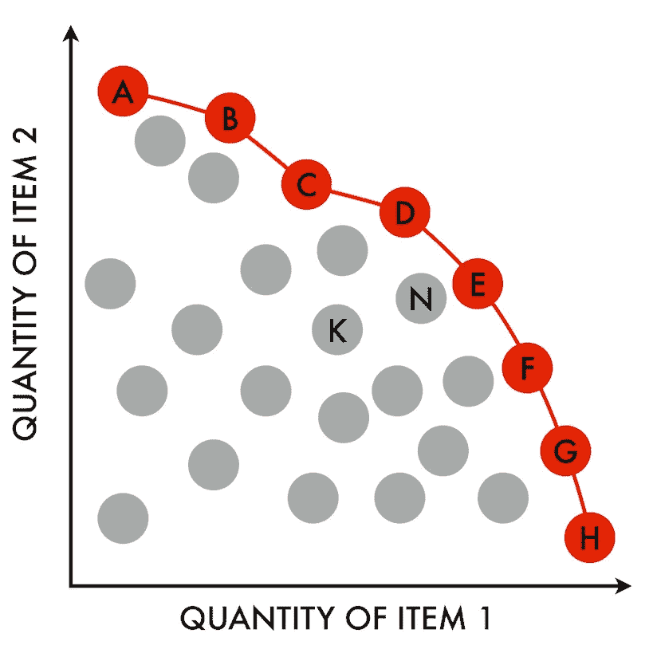
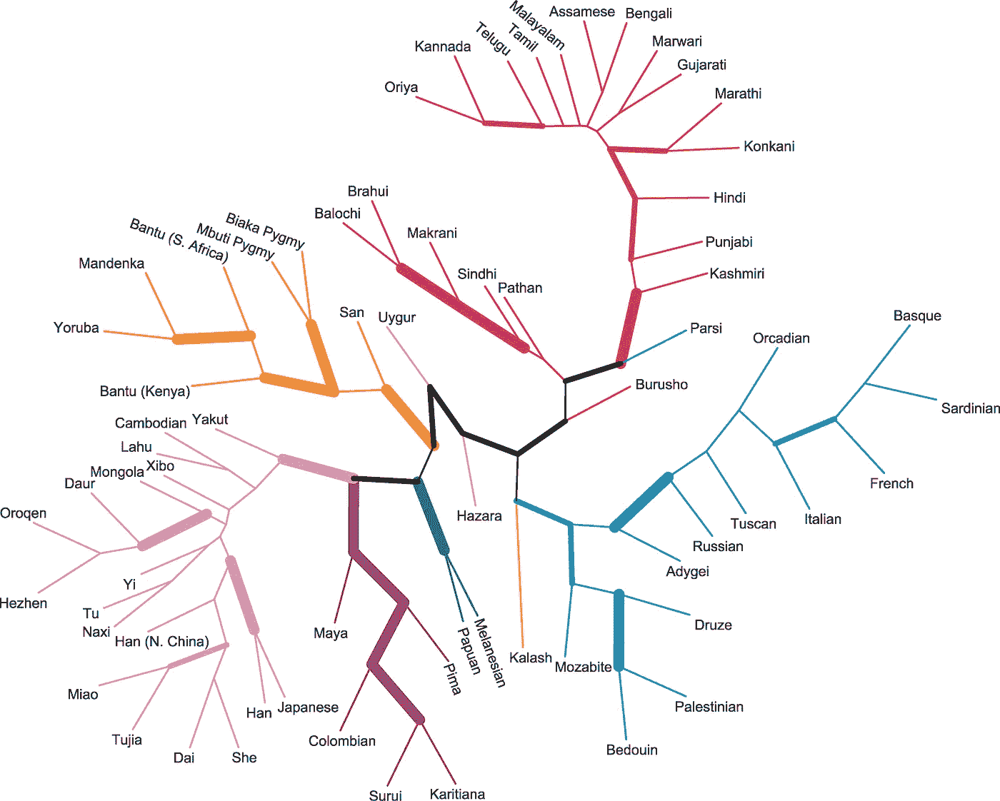

# 神经结构转移

> 原文：<https://towardsdatascience.com/neural-architecture-transfer-54226b2306e3?source=collection_archive---------45----------------------->

## [机器学习](https://towardsdatascience.com/machine-learning/home)

## NAT 可能是深度学习领域的下一件大事

一种可能的网络架构。图片作者。

神经网络拓扑描述了神经元如何连接形成网络。这种架构具有无限的适应性，新颖的拓扑结构通常被誉为神经网络研究的突破。从 1958 年感知器的出现，到前馈神经网络，到长/短期记忆模型，再到最近由 Ian Goodfellow 开发的生成式对抗网络，创新的架构代表了机器学习的巨大进步。

但是如何为特定的问题集找到新颖有效的架构呢？仅仅依靠人类的聪明才智，直到最近。这将我们带到了神经架构搜索(NAS)，这是一种通过原始计算能力发现最佳网络拓扑的算法方法。这种方法基本上是一种大规模的网格搜索。测试超参数的多种组合，如隐层数、每层神经元数、激活函数等。，找到性能最佳的架构。如果这听起来非常耗费资源，确实如此。

NAS 可以分为三个部分，这三个部分反映了它必须解决的各种优化问题。

1.  **搜索空间**:您要检查的参数。正如 Kyriakides 和 Margaritis 警告[2]的那样，减少搜索空间将节省资源，但是如果没有适用的领域知识和对可能的有效架构的直觉，人们很容易错过最佳解决方案。事实上，只采用已知的成功架构很容易在搜索中引入偏见。你只会巩固我们已经知道的工作。
2.  **优化方法**:如何探索搜索空间。我们必须权衡向全球最优进一步探索的价值和探索的成本。有很多方法可以利用，包括进化算法(稍后将再次出现)、强化学习和贝叶斯优化。
3.  **候选人测评**:如何选择最佳车型。这更直接，但是计算量也很大。这可以通过使用更少的训练时期或者随着过程的进行在模型之间共享权重来在一定程度上规避。

> 我推荐在这里阅读更多关于进化算法的文章。

正如作者所指出的，我们似乎只是简单地将一个困难的模型微调决策过程换成了另一个同样困难的架构搜索调整决策过程。那么，我们该何去何从呢？

## 神经结构转移，转移学习重新想象

迁移学习传统上意味着使用预训练的神经网络和固定的神经元权重来大幅改善特定模型的结果。这些模型，像 [VGG](https://www.robots.ox.ac.uk/~vgg/research/very_deep/) 、[盗梦空间](https://static.googleusercontent.com/media/research.google.com/en//pubs/archive/43022.pdf)、[例外](https://arxiv.org/abs/1610.02357)和 [MobileNet](https://arxiv.org/abs/1801.04381) ，都是在包含超过 120 万张图片的 ImageNet 数据集上训练出来的复杂、深度的网络。这允许个人利用强大的模型，而不需要资源密集型培训。

迁移学习可能会产生惊人的结果，但是采用迁移学习的一个注意事项是，最终用户不能改变迁移学习的架构来更好地满足他们的需求。一旦他们的架构改变了，就必须重新训练模型，使预先训练的模型的优点无效。

进入神经结构迁移，一种新的迁移学习方法。由密歇根州立大学鲁治超分校、Gautam Sreekumar、Erik Goodman、Wolfgang Banzhaf、Kalyanmoy Deb 和 Vishnu Naresh Boddeti 的研究人员描述，NAT 允许为用户的问题空间优化定制的架构。此过程自动化了 NAS，但它能够规避 NAS 带来的一些复杂性。

通过超网，在 NAS 期间探索和训练许多模型的巨大计算成本在一定程度上被抵消，超网由多个组件子网组成，可以通过权重共享来同时训练。然后，超网返回帕累托优化前沿的最佳子网，这些子网可用于解决新问题，就像传统的迁移学习一样。

经济学中的帕累托前沿。原则仍然是，尝试找到与多目标搜索相关的所有资源最佳点(红线/点)。图片来自 [Njr00 —自己的作品](https://commons.wikimedia.org/w/index.php?curid=31254379)， [CC BY-SA 3.0](https://creativecommons.org/licenses/by-sa/3.0/) 。

Pareto 前沿对于可视化多目标搜索(如 NAS)中的权衡非常有用。NAT 的一个吸引人的方面是，它只返回位于 Pareto 前沿的子网，确保模型具有最佳拓扑。

最初引发这篇文章的是用来进行多目标搜索本身的方法。研究人员使用进化算法(EA)来搜索子网的最佳拓扑结构。EAs 利用许多代的“适者生存”来识别最佳超参数。

一般流程如下:

1.  从以前探索的体系结构中选择初始群体
2.  从“父”架构中创建突变和交叉的“后代”
3.  “适者生存”——只保留最好的 k 架构做下一代父母
4.  重复进行，直到达到所需的目标阈值

进化生物学的一个例子。我们看到人群如何分支到不同的方向，有机地探索问题空间。这就是进化算法再造的东西。图片由[诺亚·罗森伯格](https://commons.wikimedia.org/wiki/File:Consensus_Neighbor-Joining_Tree_of_Populations.png)、 [CC BY-SA 3.0](https://creativecommons.org/licenses/by/2.5/) 提供。

研究人员报告的结果令人震惊。通过在 ImageNet 上训练超网和在 10 个图像分类数据集(包括 ImageNet、CIFAR-10 和 CIFAR-100)上评估子网，NAT 模型始终优于包括 Inception、ResNet 和 MobileNet 在内的最新模型，同时所需的 FLOPs 数量级更少。

正如研究人员指出的，NATnets 明显比传统的微调更有效。此外，由于所有数据集都使用相同的超网，而数据集又千差万别，因此 NAT 似乎确实能够为每个新的问题空间生成定制的最佳子网。

神经结构转移很可能是与上述进步相结合的一项创新。它能够为新问题稳健地生成高性能、低成本的子网，并且在一系列分类案例上已经超过了许多当前的 vanguard 模型。

> 如果您对 NAT 或它的任何方法感兴趣，请阅读[1]以获得深入的解释！这里的[是研究员的 NAT GitHub 页面。](https://github.com/human-analysis/neural-architecture-transfer)

在这里随意探索我的其他文章[，在 LinkedIn](https://medium.com/@arencarpenter) [这里](https://www.linkedin.com/in/aren-carpenter/)和我联系。

## 来源

[1] Z. Lu，G. Sreekumar，E. Goodman，等.[神经结构转移](https://arxiv.org/abs/2005.05859) (2020)，arXiv:2005.05859 .

[2] G. Kyriakides 和 K. Margaritis，[卷积网络的神经结构搜索导论](https://arxiv.org/abs/2005.11074) (2020)，arXiv:2005.11074。

[3] A.N .斯洛斯和 s .古斯塔夫森， [2019 进化算法综述](https://arxiv.org/abs/1906.08870) (2019)，arXiv:1906.08870。