# 用于艺术娱乐的神经细胞自动机

> 原文：<https://towardsdatascience.com/neural-cellular-automata-for-art-recreation-6d9fb61afb37?source=collection_archive---------29----------------------->

本文将简要介绍细胞自动机(CA)领域，以及神经网络方法。这项工作的输出不仅仅是图像。它们是某种形式的虚拟有机体，类似于生命体，生长并对变化做出反应。这是一项实验工作，希望以类似基因组的方式编码信息。

在这篇文章的最后，我们将无法创造一个生活在圣朱尼佩罗的虚拟人。然而，我们将能够呈现一个[基斯·哈林的](https://en.wikipedia.org/wiki/Keith_Haring)图标系列(1990)的再现。这些图标将从一个单细胞开始生长，直到它们达到饱和点，在饱和点，单细胞变成一个多细胞实体。

如果你对神经网络架构背后的技术细节不感兴趣，可以跳过标题以“*、CNN:* ”开头的章节。我在 Colab [笔记本](https://github.com/samnaji/Neural-Cellular-Automata-For-Art-Recreation/blob/master/Neural_Cellular_Automata_For_Art_Recreation.ipynb)上设置了用于这个项目的代码，它可以用于为用户定义的输入创建类似的图形和图像。

 [## Sam Naji/艺术娱乐的神经细胞自动机

### 艺术娱乐文章的神经细胞自动机笔记。用户可以上传 png 并创建 CN 模型…

github.com](https://github.com/samnaji/Neural-Cellular-Automata-For-Art-Recreation/blob/master/Neural_Cellular_Automata_For_Art_Recreation.ipynb) 

这本笔记本是 Mordvintsev 关于[生长神经细胞自动机](https://distill.pub/2020/growing-ca/)【1】的工作的编辑版本。

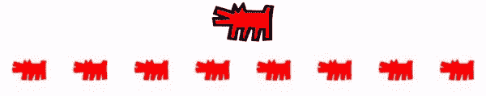

图 1:神经细胞自动机能力的例子。最上面的图片是基斯·哈林著名的狗叫图标。底部的一组图像是八个不同的细胞自动机模型，它们学会了重新创建这个图标。底部 gif 不是简单的一组帧。它是一个不断增长和互动的模型，从一粒种子开始，当它到达目标图像时就饱和了。(上图基于[公共项目档案](https://www.haring.com/!/art-work/788)。作者底部图片)

20 世纪 50 年代早期， [**罗莎琳德·富兰克林**](https://en.wikipedia.org/wiki/Rosalind_Franklin) 、弗朗西斯·克里克和詹姆斯·沃森的合作导致了 DNA 的发现[2]。这一发现不仅创造了现代生物学发展中最重要的里程碑，也塑造了其他领域，如计算机科学。

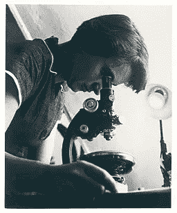

图 2:罗莎琳德·埃尔西`富兰克琳的工作是理解 DNA 分子结构的核心。尽管她通常没有足够的学分，但她是历史上最受欢迎的女科学家之一。

尽管计算机科学似乎与生物学完全脱节，但像约翰·冯·诺依曼、斯坦尼斯劳·乌拉姆和 s·沃尔夫拉姆这样的计算机科学家对生物系统的效率和复杂性印象深刻[3]。他们绘制了一个模型，该模型解释了新发现的 DNA 角色，并翻译了分子生物学架构以服务于计算目的。按照他们当时的理解，一个生命体是由一个算法(DNA)和几个功能(生化操作)所支配的，这些功能使自然界呈现出一个连续的、有反应的模型(一个生物有机体)。因此，生命找到了一种方法来压缩大量信息，并通过使用这两个原则来编码复杂的行为。这种理解是细胞自动机(CA)的基础。因此，CA 是计算机科学算法中实验动力学的一种练习，希望将信息重建为基因组编码的细胞形式。

# 细胞自动机简介

细胞自动机是从一个种子开始的一组细胞(网格的元素)的连续状态，该种子可以是单个细胞或几个细胞。在时间“*t+1”*的一组单元是根据更新“*规则”在“*t”*的一组单元的更新。*更新*规则*涉及依赖于*相邻*单元格的计算。*邻居*小区有三种标准定义。

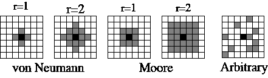

图 3:不同社区的例子(作者拍摄)

根据每种不同类型的邻域，不同的单元选择(灰色)有助于特定单元(黑色)的更新。因此，一个单元持有的状态或值直接影响其他单元。因此，细胞自动机进化为一个连续的实体。邻域对像元的影响因格网类型而异。说明这一点的最佳方式是考虑一维网格。在下面的动画中，所有的单元格占据一行。每个单元格只能有 0 或 1 的值。

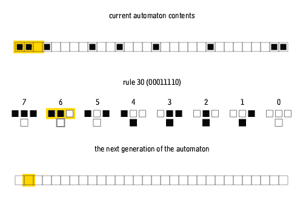

图 4:规则和邻居从当前代产生下一代。([公共领域](https://commons.wikimedia.org/wiki/File:One-d-cellular-automate-rule-30.gif))

因此，*规则*决定了一代相对于其邻居如何变化到下一代。编号为 0 到 7 的案例代表一维网格中可能存在的不同情况。例如，情况 2 表明，如果一个单元(中间的块是当前单元)当前为 1 并且有两个 0-邻居，那么它将保持为 1(结果显示为底部的块)。有 256 种不同的组合，因为 8 种情况中的每一种都可以是 0 或 1。因此，对于一维二元细胞自动机，可能有 256 种不同的规则来控制系统的进化。

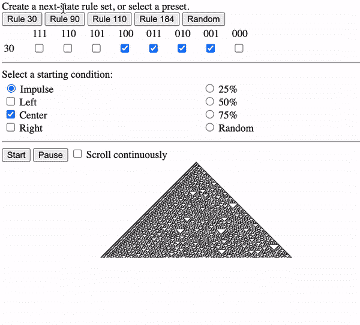

图 5:惊人简单有效的**初级** **细胞** **自动机**模拟器由 [Devin Acker 制作，2010](http://devinacker.github.io/celldemo/) 。(作者制作的 Gif)

这些系统通常被称为**基本细胞自动机(ECA)**【4】。尽管它们很简单，但有些规则会在几代人的时间里产生复杂的模式，例如[规则 30](http://en.wikipedia.org/wiki/Rule_30) 、[规则 90](http://en.wikipedia.org/wiki/Rule_90) 、[规则 110](http://en.wikipedia.org/wiki/Rule_110) 和[规则 184](http://en.wikipedia.org/wiki/Rule_184) 。有专门针对 ECA 研究的奖项，比如[规则 30 奖](https://www.rule30prize.org/)。在这里，Devin Acker 创建了一个简单的 [ECA 模拟器](https://medium.com/r?url=http%3A%2F%2Fdevinacker.github.io%2Fcelldemo%2F)，用户可以在其中设置更新规则和初始条件，如图所示，可以产生独特的模式。

# 细胞自动机的现状

CA 领域从简单的 ECA 模型迅速发展，并能够创建更复杂的模式。在创建二维和高维网格方面已经做了大量的工作。细胞之间的相互作用，“更新规则”，也采取了高度复杂的数学表达式的形式。

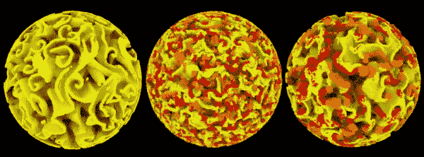

图 6: 3D 循环细胞自动机。查看此[链接](https://softologyblog.wordpress.com/2013/08/29/cyclic-cellular-automata/)阅读更多关于一些先进和令人兴奋的循环细胞自动机模型。这个[博客](https://softologyblog.wordpress.com/2013/08/29/cyclic-cellular-automata/)在探索这些概念方面做得非常出色(经许可，转载自[)。](https://www.youtube.com/watch?v=0nFc9ALgG-8)

不幸的是，细胞自动机的研究人员仍然远远没有在虚拟世界中创造出一个功能性的生物有机体，有些人可能会认为这是一种解脱:)。生成的图案通常是无定形的，没有明确的形状表示。这些图案因其美学价值而吸引了很多关注。一些研究集中于发现建立在计算机科学和数学之上的艺术 CA 模型，因此，质疑数据科学和艺术之间的关系。

> 对于单纯的艺术爱好者来说，这些是引人入胜的直接图像，想象力可能会努力解释或仅仅接受。对 CA 理论家和实践者来说,“艺术”充满了更深层次的意义，就像禅宗艺术既可以在表面上体验，也可以由禅师体验。 **Wuensche，第 13 页，设计美:细胞自动机的艺术【5】**

然而，这个项目旨在从一个种子细胞开始再造艺术品。为此，我们将使用一个受监督的神经网络来寻找最佳更新规则，该规则可以在几个步骤之后成功地重建图像。

# 神经网络创建一个最佳的细胞自动机

这一领域面临的最大挑战之一是“如何正确地告诉客户何时构建？建什么？什么时候停止？”。生物学似乎已经解决了这个问题。经过数百万年的进化，它优化了物理和计算法则的使用。不幸的是，由于生物学家仍在努力解决生命之谜，我们没有一个清晰的方法来虚拟地重建类似的系统。在 CA 术语中，问题在于找到将单个单元转换成高度紧凑体的更新规则。因此，不是在生物学中寻找最佳更新规则，而是可以使用神经网络算法在几代中寻找该规则。神经网络可以经历几次试验，就像生物体经历的某种形式的虚拟进化一样。因此，可以使用神经网络架构从种子细胞创建目标图像[1]。

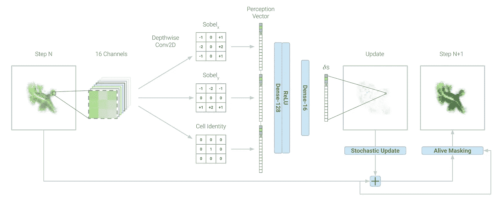

图 7:细胞神经网络架构[1]。从[生长神经细胞自动机](https://distill.pub/2020/growing-ca/)(在 [CC-BY 4.0](https://creativecommons.org/licenses/by/4.0/) 下获得许可)检索的图

## CNN:细胞自动机模型状态

这里的输入图像具有 40×40 的单元矩阵。每个单元有 16 个状态(通道)。前三个通道是 RGB，第四个是 alpha 通道(透明)，而其他通道是不可见的，不一定具有预定的含义。它们可以被认为是生物细胞经历的化学和物理相互作用的代表。更新规则将学习如何利用这些通道来到达目标图像。细胞根据摩尔(r=2)邻域相互作用(如图 3 所示)。

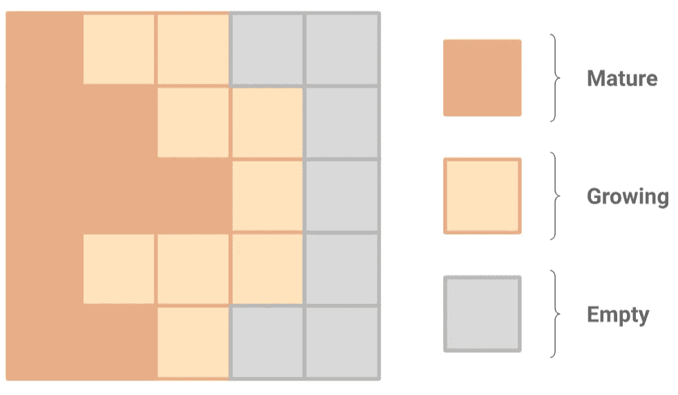

图 8:阿尔法通道。从[生长神经细胞自动机](https://distill.pub/2020/growing-ca/)(在 [CC-BY 4.0](https://creativecommons.org/licenses/by/4.0/) 下获得许可)检索的图表

此外，阿尔法通道将用于区分活细胞。α值> 0.1 的细胞为“*成熟”*细胞，其相邻细胞为“*生长”*细胞。相比之下，alpha <为 0.1 且邻近区域没有“*成熟”*细胞的细胞是死细胞。

## CNN:反馈回路

最后，使用 [L2 损失函数](https://afteracademy.com/blog/what-are-l1-and-l2-loss-functions#:~:text=L1%20and%20L2%20are%20two,stands%20for%20Least%20Square%20Errors.)设置反馈回路。损失值是通过将重建图像的可见通道与目标图像的那些通道进行比较来计算的。换句话说，不同的渠道对其他渠道的贡献只在于通过感知向量找到正确的更新规则。它们是灵活的，并且将由神经网络架构定制以优化更新规则。而可见信道中的损耗将使用均方误差(MSE)来计算，以指导训练。

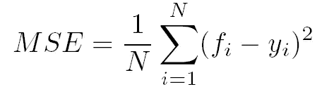

等式 1:神经网络中使用的均方误差公式。(图片由作者提供)

## CNN:卷积层

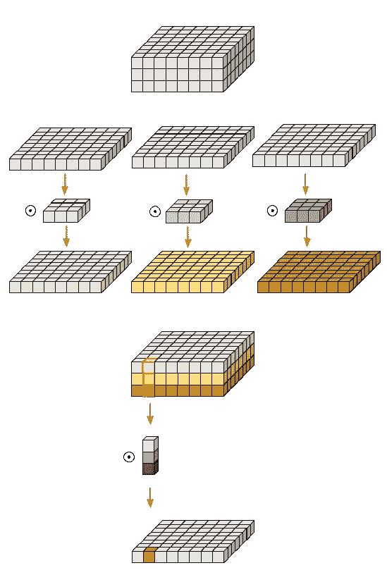

图 9:深度方向的 2D 卷积。插图来自[用于机器学习的深度方向可分离卷积](https://eli.thegreenplace.net/2018/depthwise-separable-convolutions-for-machine-learning/)，2018。经允许重新发布

卷积神经网络(CNN)的核心是卷积层，这也是它们得名的原因。CNN 是专门为处理图像而设计的，其灵感来自人类的视觉方式。与矢量化图像的传统神经网络不同，CNN 采用图像的 2D 形式。这个过程与传统的神经网络相比具有显著的优势；它保持像素的空间位置。因为图像没有被矢量化，所以图像的 2d 特征被正确地馈送到网络。

这里，Sobel 滤波器(如上图 7 所示)与两个卷积层中的 16 个通道进行卷积。然后，将得到的矩阵线性化为感知向量，并馈入最终的线性神经层，该层给出 128 个输出节点，其中 ReLU 激活函数然后将它们馈入产生 16 个值的线性层。每个值代表 16 个原始通道之一的更新规则。

## CNN: ReLU 激活

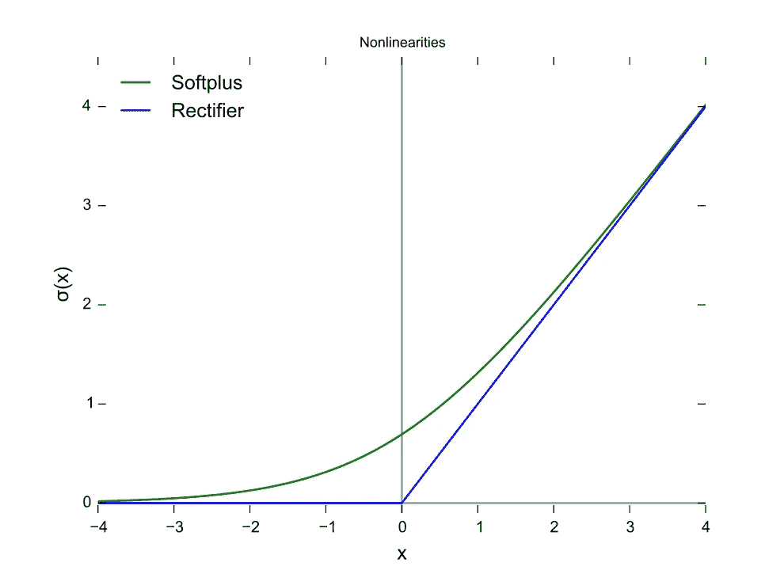

图 10:从激活函数中选择 ReLU 函数，如果神经元不给出火花值(权重)，最初没有任何变化，而在权重超过 0[6，7]后，响应的幅度线性变化([公共域](https://commons.wikimedia.org/wiki/File:Rectifier_and_softplus_functions.svg)

体系结构的这些层是测试和更改更新规则的地方。每个细胞对感知向量应用一系列运算，例如卷积运算和 ReLU 非线性。这些操作是系统的更新规则。网络正在将该更新规则参数化为 8000 个参数。然后检查来自 ReLU 函数的信号，然后应用适当的更改来更新规则。这些变化以感知向量中不同状态的值相加或相减的形式出现。此外，这些变化由 ReLU 函数指示的权重和值来指导。

## CNN:随机过滤和状态更新

该规则根据一个神经网络步骤的结果不断改变。但是，不会直接应用更新规则。与传统的元胞自动机模型不同，元胞不会同时更新。这种概率方法类似于自组织生物系统，因为细胞不在全局同步中工作。在该模型中，每次更新都应用于每个单元，等待时间是随机的。我们放宽了这一要求，假设每个单元独立执行一次更新，在更新之间等待一个随机的时间间隔。

# 结果

为了测试这个系统，我们最初试图重现基斯·哈林的作品以及其他一些符号。仅通过查看目标图像和对应于该图片的最佳 CA，就可以直观地比较结果。也可以通过使用损失历史图来检查，其中最佳细胞自动机模型具有最低的对数损失分数。这也表明了目标图像的复杂性。高度复杂的目标图像在 80，000 个步骤之后将不会被容易地再现。它通常具有较高的测井曲线损失值。

# 2-飞行恶魔:

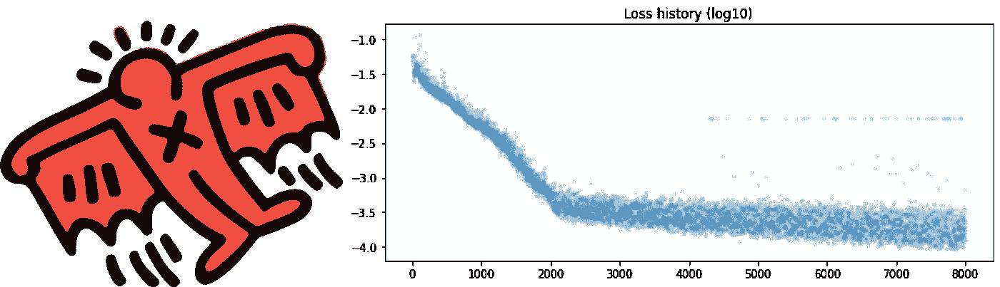

图 11:左:哈林在 1990 年创造的飞行魔鬼图标。这是一件捕捉哈林经典风格的独特作品(图片基于[公共项目档案](https://www.haring.com/!/art-work/790))。右图:与目标图像相比，CA 模型丢失的日志(作者提供的图片)。

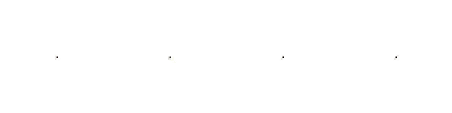

图 12:具有不同更新规则的四个不同的 CA。第一个具有最无效的更新规则，右边的最后一个具有最准确的更新规则(图由作者提供)。

# 3-光彩照人的宝贝:

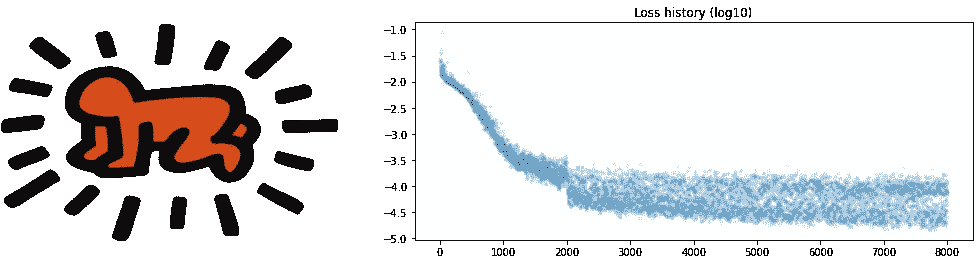

图 13:左:哈林在 1990 年创造的光芒四射的婴儿图标(图片基于[公共项目档案](https://www.haring.com/!/art-work/773))。左图:与目标映像相比，CA 模型丢失的日志。

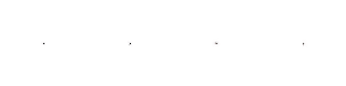

图 14:具有不同更新规则的四个不同的 CA。第一个是最无效的更新规则，右边的最后一个是最准确的更新规则(作者提供的图表)

# 讨论

该项目能够高精度地重现这些图标。然而，该过程有几个可以改进的限制。例如，该项目是在免费的 Colab 订阅上完成的，对计算能力有限制。因此，我们被迫将图像缩小到 40×40 像素。这使得目标图像失去了一些质量，看起来像是像素化的。

图 15:基斯·哈林的《三眼怪》(图片基于[公共项目档案](https://www.haring.com/!/art-work/791))。

此外，神经网络体系结构被设计为迭代超过 80，000 个具有不同更新规则的 CA 版本。由于其复杂性，这种迭代次数根本不足以精确再现某些目标图像，如基斯·哈林的“三眼怪”。

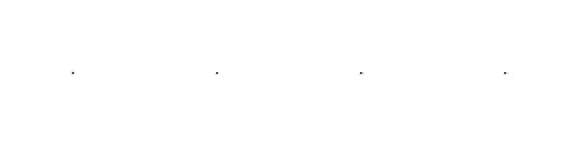

图 16:神经网络未能找到正确的更新规则，细胞以混乱的方式生长(图由作者提供)。

还值得一提的是，我们通过添加更多的卷积层和运算符来尝试不同的神经网络架构。然而，这只是增加了运行时间，并没有产生明显更好的结果。

# 结论

有必要考虑开发细胞自动机模型的替代方法。我们的目标是找到正确的设置，从一个种子细胞创造出高度复杂的结构，这不仅仅是从数学的角度出发。数值方法，如神经网络，可以帮助指导这种搜索。事实上，使用神经网络可能无法揭示创造生物结构的秘诀；然而，它可能会给你一个机会去哪里搜索这个食谱以及会有什么样的结果。

 [## Sam Naji/艺术娱乐的神经细胞自动机

### 艺术娱乐文章的神经细胞自动机笔记。用户可以上传 png 并创建 CN 模型…

github.com](https://github.com/samnaji/Neural-Cellular-Automata-For-Art-Recreation/blob/master/Neural_Cellular_Automata_For_Art_Recreation.ipynb) 

这幅作品献给伟大的艺术家[基斯·哈林](https://www.haring.com/)。如果你不知道哈林，他是一个街头艺术家，在他短暂的一生中，塑造了当代流行艺术，倡导同性恋权利，并不断提高对艾滋病的认识[8]。

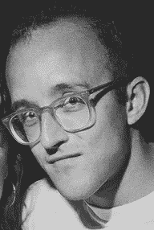

图 17:哈林摄于 1988 年冈萨雷斯的一次聚会上。([公共领域](https://commons.wikimedia.org/wiki/File:Keithharingportrait.png)

要阅读关于神经细胞自动机的更多细节，请查看这篇详细解释这一概念的优秀文章。这篇文章是这项工作的基础，我强烈推荐进一步的知识。

 [## 生长神经细胞自动机

### 形态发生的可区分模型点击或轻敲图像擦除图案的一部分，并看到它再生…

蒸馏. pub](https://distill.pub/2020/growing-ca/) 

**参考文献:**

[1] Mordvintsev 等人，[生长神经细胞自动机](https://distill.pub/2020/growing-ca/) (2020)，提取。

[2] Pray，l .，[DNA 结构和功能的发现:Watson 和 Crick](https://www.nature.com/scitable/topicpage/discovery-of-dna-structure-and-function-watson-397/#:~:text=Many%20people%20believe%20that%20American,by%20Swiss%20chemist%20Friedrich%20Miescher.) (2008)，自然

[3]沃尔夫拉姆，斯蒂芬，[一种新的科学](https://www.wolframscience.com/nks/) (2002)，沃尔夫拉姆媒体。

[4] Weisstein，Eric W .，[初等细胞自动机](https://mathworld.wolfram.com/ElementaryCellularAutomaton.html)，来自 MathWorld 网络资源 MathWorld。

[5] Adamatzky、Andrew 和 Genaro J Martí nez，编辑。[设计美:细胞自动机的艺术](https://www.springer.com/gp/book/9783319272696) (2018)，施普林格。

[6] V，阿维纳什·夏尔马。[了解神经网络中的激活功能](https://medium.com/the-theory-of-everything/understanding-activation-functions-in-neural-networks-9491262884e0) (2017)。*中*，万物之论。

[8] Brownlee，Jason，[《整流线性单元(ReLU)的温柔介绍》](https://machinelearningmastery.com/rectified-linear-activation-function-for-deep-learning-neural-networks/) (2019)，深度学习性能。

[9]安德鲁·亚罗，[艺术家基斯·哈林逝世，享年 31 岁；职业生涯始于《纽约时报》的地铁涂鸦](https://www.nytimes.com/1990/02/17/obituaries/keith-haring-artist-dies-at-31-career-began-in-subway-graffiti.html) (1990)。