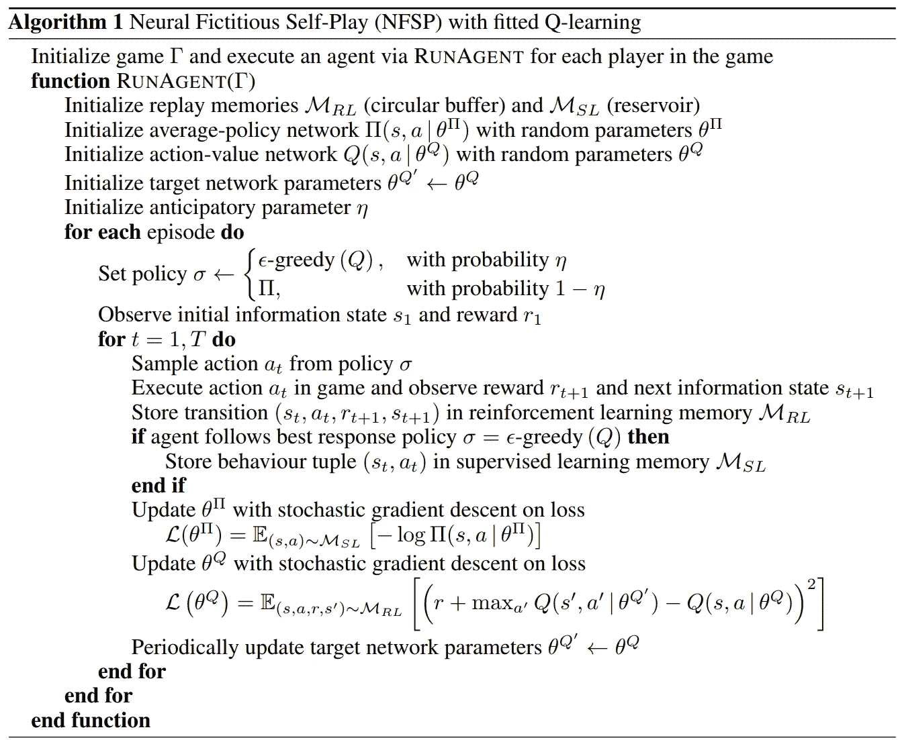
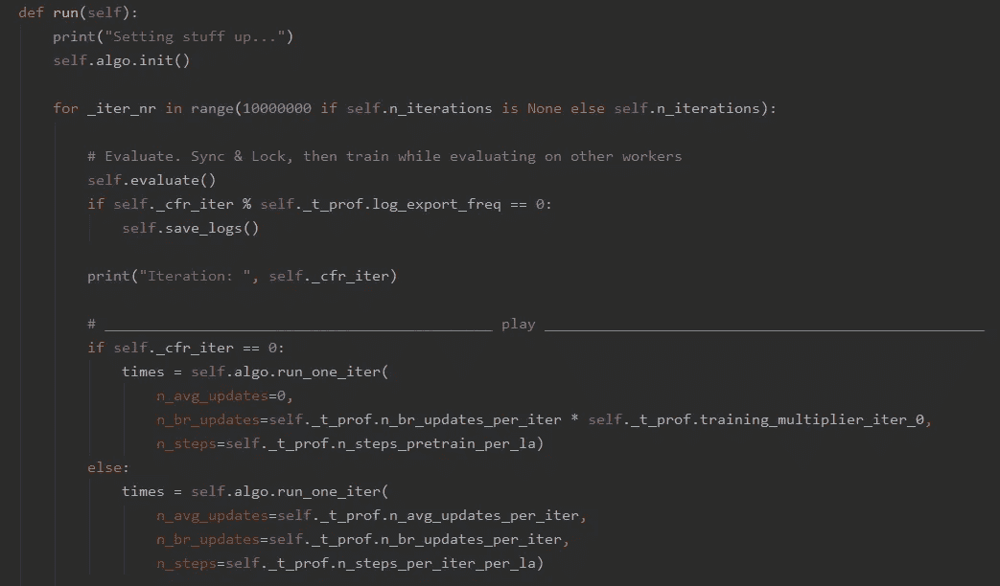
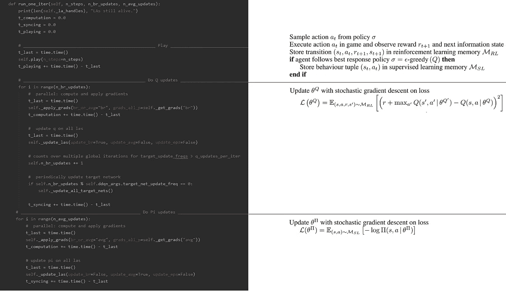
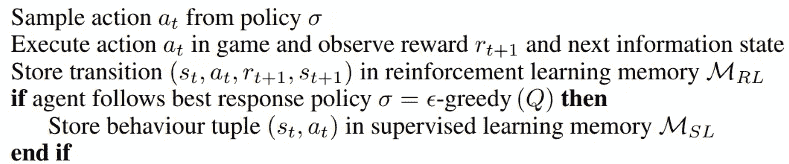
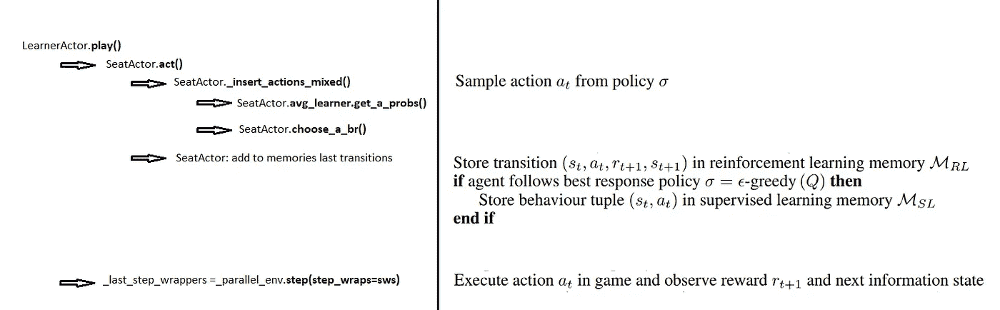
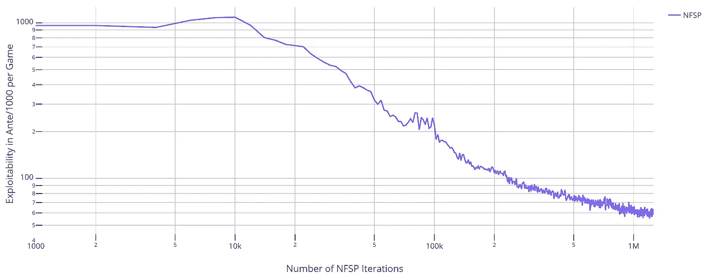

# 实践中的神经虚拟自我游戏

> 原文：<https://towardsdatascience.com/neural-fictitious-self-play-in-practice-132836b69bf5?source=collection_archive---------47----------------------->

## Leduc Hold'em 扑克游戏中神经元虚拟自我游戏的具体实现

基南·康斯坦斯在 [Unsplash](https://unsplash.com?utm_source=medium&utm_medium=referral) 上的照片

**更新**:学习和练习强化学习的最好方式是去[http://rl-lab.com](http://rl-lab.com/)

本文描述了在 Leduc Hold'em 扑克游戏中基于 Eric Steinberger[的代码实现的神经虚拟自我游戏(NFSP)。完整的源代码可以在他的](https://github.com/EricSteinberger) [Github 库](https://github.com/EricSteinberger/Neural-Fictitous-Self-Play)中找到。

如果你是新手，最好先从这些文章开始:
[虚构游戏简介](/introduction-to-fictitious-play-12a8bc4ed1bb)
[虚构自我游戏](/fictitious-self-play-30b76e30ec6a?source=your_stories_page---------------------------)
[神经虚构自我游戏](/neural-fictitious-self-play-800612b4a53f)

**免责声明**:本文的目的不是解释实现代码中的每一个细节，而是强调代码实现和学术解决方案之间的主轴和映射。

实现涉及分布式计算，这增加了代码的复杂性。然而在本文中，我们将关注算法本身，我们将绕过分布式计算方面。
为此，我们将与下面的理论算法并行。

[来自海因里希的 NFSP 算法/银纸](https://arxiv.org/pdf/1603.01121.pdf)

# Leduc 德州扑克

首先，我们来定义一下 Leduc 德州扑克游戏。
这里是取自 [DeepStack-Leduc](https://github.com/lifrordi/DeepStack-Leduc) 的定义。上面写着:

> Leduc Hold'em 是一种玩具扑克游戏，有时用于学术研究(首次在[Bayes ' Bluff:Poker 中的对手建模](http://poker.cs.ualberta.ca/publications/UAI05.pdf)中介绍)。它是用一副六张牌来玩的，每副牌包括两副三个等级的花色(通常是国王、王后和杰克——在我们的实现中是王牌、国王和王后)。游戏开始时，每个玩家私下发一张牌，然后是一轮下注。然后，另一张牌面朝上的牌作为公共牌(或公共牌)发出，然后进行另一轮下注。最后，玩家展示他们的私人牌。如果一个玩家的私人牌和棋盘牌的等级相同，他或她赢得这场游戏；否则，私人牌排名较高的玩家获胜。

# 全局视图

主类是 **workers\driver\Driver.py** ，它有一个方法 **run()** 来启动一切。
它设置了每次迭代的主循环和算法执行，如下图所示。

[Driver.py](https://github.com/EricSteinberger/Neural-Fictitous-Self-Play/blob/master/NFSP/workers/driver/Driver.py)

# 该算法

大部分动作发生在 **_HighLevelAlgo.py** 中，在这里很容易区分学术解决方案的不同部分。

实际代码和理论解之间的映射: [_HighLevelAlgo.py](https://github.com/EricSteinberger/Neural-Fictitous-Self-Play/blob/master/NFSP/workers/driver/_HighLevelAlgo.py)

# 播放阶段

让我们放大播放阶段。
代码不能完美地映射到理论解决方案，但也不远了。只是重组方式不同。
动作 ***a(t)*** 的采样发生在类 **SeatActor** 类中。你可以把**的座位演员**想象成玩家。不止一个。

另一方面，**pockerenv . py(poker rl \ game \ _ \ rl _ env \ base)**实际上是游戏引擎，游戏动态和规则在这里执行。每当“玩家”在游戏中行动时，就会调用 **PockerEnv.step()** 方法。

最后，**learner actor(workers \ la \ local . py)**是协调不同 **SeatActors** 的类。它包含 **play()** 方法，该方法执行对以下序列的几个类和方法的调用:

# 结果

据 Eric Steinberger 称，该代码取得了与学术论文相同的结果。

> 100 毫安/克(=来自纸张的 0.1A/克)线在 230 千次迭代(4:24 小时)后穿过，60 毫安/克线在 850 千次迭代(19 小时)后穿过。

该图显示了根据 NFSP 迭代次数的可开发性曲线。

[可开发性图](https://github.com/EricSteinberger/Neural-Fictitous-Self-Play)

提醒一下，可开发性是衡量策略最坏情况下的性能。关于可开发性的介绍可以在这些[幻灯片](https://pdfs.semanticscholar.org/7a33/0ac108ec90f405efb4ce3bec158566c1d9db.pdf)中找到。

# 结论

这是由 [Eric Steinberger](https://github.com/EricSteinberger) 在实践中实现 NFSP 的一个快速概述(点击查看[源代码)。
它将帮助您找到进入代码的方法，代码具有相当复杂的结构，并让您清楚地了解真正的动作发生在哪里。](https://github.com/EricSteinberger/Neural-Fictitous-Self-Play)

最后，我要感谢埃里克·斯坦伯格审阅这篇文章并分享他的评论。
再次感谢 [Arman Didandeh](https://medium.com/u/7e968a07c09e?source=post_page-----132836b69bf5--------------------------------) 校对本文。