# 神经性幻觉

> 原文：<https://towardsdatascience.com/neural-hallucinations-13c645e2fd23?source=collection_archive---------20----------------------->

## 内部人工智能

## 神经网络如何产生图像修复中缺失像素的幻觉

约翰尼斯·普莱尼奥拍摄的照片

当一个人看到一个物体时，我们大脑视觉皮层中的某些神经元会活跃起来，但当我们服用致幻药物时，这些药物会淹没我们的血清素受体，导致对颜色和形状的扭曲视觉感知。类似地，以我们大脑结构为模型的深度神经网络将数据存储在巨大的数字系数表中，这违背了人类的直接理解。但是，当这些神经网络的激活被过度刺激(虚拟药物)时，我们就会出现神经梦和神经幻觉等现象。梦是我们大脑在感知器官关闭时产生的心理推测，而幻觉是在这个感知器官变得极度活跃时产生的。在这篇博客中，我们将讨论如何利用神经网络中的幻觉现象来完成图像修复的任务。

# 图像和视频修复

**图像修复**是一种合成替代内容的艺术，用于重建图像中缺失或损坏的部分，从而使修改在语义上正确且在视觉上逼真。在过去的几年中，图像修复受到了计算机视觉和图像处理界的极大关注，并在研究和应用领域取得了重大进展。传统上，使用基于示例的方法或者基于扩散的方法来实现修复，其中基于示例的方法一次重建一个似是而非的假设的一个缺失像素/片，同时保持邻域一致性，基于扩散的方法将局部语义结构传播到缺失部分。然而，无论采用何种方法，图像修复的核心挑战是保持全局语义结构，并为未知区域生成逼真的纹理细节。当缺失区域的大小很大或高度不规则时，传统方法无法实现这种全局语义结构和逼真的纹理。因此，需要一种能够为丢失的像素提供似是而非的幻觉的组件来解决这种修补问题。为了设计这些幻觉组件，研究人员一般会选择深度神经网络来提供自然图像的高阶模型。使用图像修补来修饰不需要的区域、移除分散注意力的对象或完成图像中被遮挡的区域的使用案例有很多。它还可以广泛应用于包括视频取消裁剪、重新定位、重新合成、旋转和拼接在内的任务。

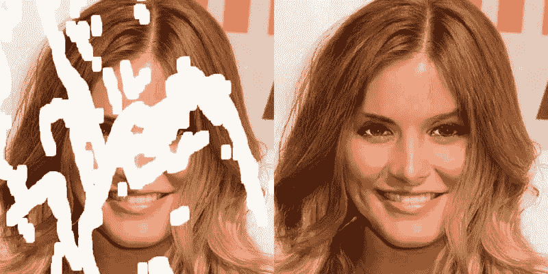

图像修复应用示例- [来源](https://developer.nvidia.com/rtx/ngx)

与图像修复类似，**视频修复**旨在用新合成的内容填充给定的时空区域。它用在时间和空间上都相干的像素来重建给定视频序列的缺失区域。传统的视频修复算法将该问题表述为基于块的优化任务，并遵循传统的图像修复流水线，通过对已知区域的时空块进行采样来填充缺失区域，然后将其作为最小化问题来求解。尽管由于物体和摄像机的复杂运动，大多数视频修复算法面临着明显的挑战。这些挑战主要是由于未知区域中平滑且均匀的光学运动场的假设。与图像修复类似，与丢失区域的似是而非的运动场幻觉相关联有助于应对这些挑战，并为视频序列生成无缝内容，使改变几乎察觉不到。视频修复主要用于视频恢复(去除划痕)、编辑特效工作流(去除不想要的对象、水印和徽标)以及视频稳定。

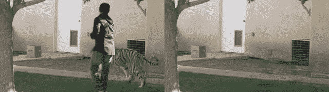

视频修复应用实例- [来源](https://pythonawesome.com/learnable-gated-temporal-shift-module-for-deep-video-inpainting/)

# 没有任何先验知识就产生幻觉

卷积神经网络的优异性能通常归因于它们从大量数据中学习真实图像先验的能力。如果您想知道“图像先验”是什么意思，它是我们图像数据集中的“先验信息”，用于简化处理参数的选择和解决图像处理中的不确定性，如 CNN 在训练后学习的矢量表示。但相反，像[【1】](https://dmitryulyanov.github.io/deep_image_prior)这样的研究表明，即使是生成 CNN 的结构也能够在任何数据密集型学习之前捕获大量低级图像统计数据。其主要思想是，即使随机初始化的卷积神经网络也可以用作手工制作的先验，在图像修复和去噪等标准逆问题中具有高质量的性能。这种想法不仅突出了生成器网络捕获的感应偏差，还弥合了深度学习 CNN 和基于手工制作的图像先验的无学习算法之间的差距。在这一节中，我们将重点讨论如何利用这种获得图像先验的技术来使图像中看不见的像素产生幻觉。

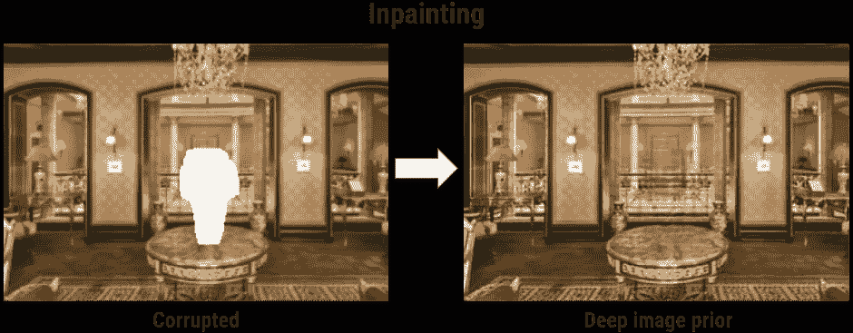

使用深度图像先验的图像修复- [来源](https://www.311institute.com/ai-can-now-restore-your-corrupted-photos-to-its-pristine-original-condition/)

人们一致认为 CNN 的结构在网络性能中起着关键作用，并且网络结构必须与数据结构相一致。但同时，我们也不能指望一个未经训练的网络 F(θ)了解某些物体类别的具体外观细节。然而，如在[1]中所建议的，由于它们的局部和平移不变性的性质，即使是未经训练的卷积滤波器序列也具有捕获像素邻域之间的多尺度低级图像统计的能力。这些统计足以对图像修补问题中所需的条件图像分布 p(x_filled|x_missing)进行建模。在公式化过程中，该分布以更一般的方式书写，它被表述为能量最小化问题(在我们的情况下可以是损失函数最小化，例如 MSE)。我们假设地面真理属于具有零能量的点 x 的流形 **E(x，x_in) = 0** 。

> x = arg min(**E**(**x _ prior _ estimated**|**x _ input _ with _ missing _ pixels**)+R(x)|其中 **E** 可以是类似 MSE 的损失函数， **x_prior_estimated** 是随机初始化网络的输出，**x _ input _ with _ missing _ pixels**是需要修复的输入，正则化子(x)可以

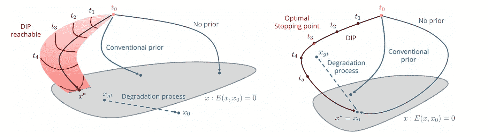

先验恢复期间的图像空间可视化— [源](https://arxiv.org/pdf/1711.10925.pdf) | **倾角**代表**深度图像先验。****可视化举例说明了超分辨率(左)和去噪(右)的任务，以解释通过参数化过程优化期间点的流形分布的视觉方面。**

**为了开始幻觉，我们首先需要一个对应于二进制掩码(M)的丢失或被遮挡像素的图像。现在，如果随机初始化的 CNN 估计丢失的区域，我们可以将损失计算为:**

> **loss =[(**x _ prior _ estimated x _ input _ with _ missing _ pixels**)⦿m]|其中⦿是逐元素乘法**

**上述等式与丢失像素的实际值无关，这使得不可能直接对像素值进行优化。因此 **x_prior_estimated** 是在重新参数化后优化计算的。在许多情况下，产生的幻觉导致几乎完美的结果，几乎没有接缝和假象。然而，这种方法似乎有某些缺点，如修补大洞或任何高度语义缺失的区域。但这些缺点是可以接受的，因为这种方法没有在任何监督数据上进行训练，并且在大多数其他情况下都非常有效。**

**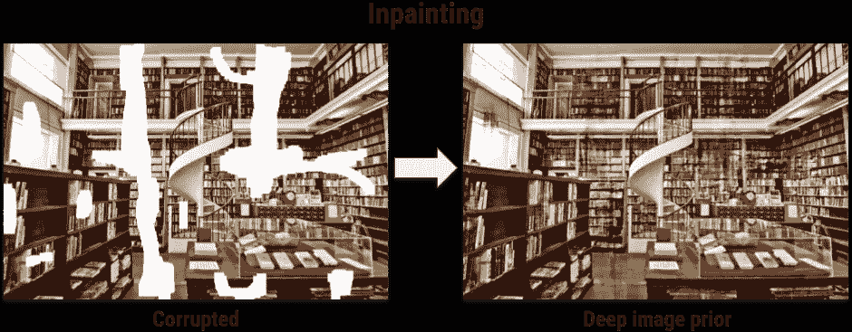**

**使用深度图像先验的图像修复- [来源](https://www.311institute.com/ai-can-now-restore-your-corrupted-photos-to-its-pristine-original-condition/)**

**获得的幻觉强调了:**

*   **该网络利用图像的全局和局部上下文，并用已知部分的纹理对缺失区域进行插值。**
*   **传统的自相似先验和深度学习架构之间的关系，还建议并解释了具有用于一般识别任务的跳过连接的深度架构的好处。**

**运行这个 colab 笔记本，如果你想尝试图像修复的网络(提供:DmitryUlyanov)。**

** [## 谷歌联合实验室

### 编辑描述

colab.research.google.com](https://colab.research.google.com/github/DmitryUlyanov/deep-image-prior/blob/master/inpainting.ipynb) 

# 在图像上学习后产生幻觉

在本节中，我们将讨论一些帮助深度神经网络产生幻觉的相关网络架构组件。在我们讨论这些组件之前，重要的是调查激发这些组件的架构的人类行为，以便为图像恢复任务实现更好的幻觉。基本过程主要包括概念化和绘制两个步骤，以保持图像的全局结构一致性和局部像素连续性。在绘画过程中，人类通常从先前绘制的线的末端节点绘制新的线，以确保相邻像素的连续性和一致性。记住这一点，我们将讨论多个研究论文中提出的旨在实现类似目的的各种组件。

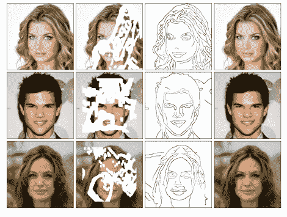

边缘幻觉之前，我们填写更好的细节和传播颜色。

最近的图像修复研究已经显示了通过使用主要两种类型的方法利用上下文信息的良好质量结果。第一类方法使用空间注意，其利用相邻像素特征作为参考来恢复未知像素，从而确保幻觉内容相对于全局上下文的语义一致性。第二类方法使用有效像素的条件值来预测缺失像素。然而，这两种类型的方法有时无法生成语义上完美的内容和无伪边界。但是，如果我们像在论文[2]和[3]中建议的那样，利用像连贯语义注意模块和门控卷积这样的架构，我们可以很容易地克服这些挑战。我们还将研究周期性激活功能的概念，如**警报器**用于产生更好的隐含神经表征，从而产生更好的神经幻觉。

## 连贯语义注意

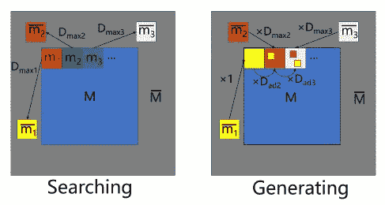

CSA 层的图示显示了孔“m”中的每个神经补片如何在边界上搜索最相似的神经补片- [来源](https://arxiv.org/pdf/1905.12384v3.pdf)

受人类概念化和绘画方法的启发,[2]的作者引入了连贯语义注意(CSA)层。CSA 用已知区域中最相似的特征像素初始化丢失的像素值。然后，通过假设空间一致性，使用相邻像素的值迭代优化这些初始化的像素。所述过程的优点是双重的，第一个优点是由于初始化而引入的全局语义一致性，第二个优点是通过优化迭代确保的局部特征一致性。原始网络首先使用简单的自动编码器计算粗略预测(I_p )(以便可以为初始化过程计算相似性),然后将粗略预测(I_p)和输入图像(I_in)馈送到 CSA 促进的编码器层进行细化。精化网络对输入(I_p + I_in)执行上述两个步骤(初始化和迭代优化)以输出最终结果(I_r)。

> **简单来说就是迭代优化**
> 
> pred_pixel = A + B
> 
> A =相似度(预测像素，相邻像素)×相邻像素
> 
> B =相似性(预测像素，最相似像素)×最相似像素
> 
> 其中 pred_pixel 是要产生幻觉的像素，adjacent_pixel 是相邻像素，most_similar_pixel 是具有最相似特征的像素。相似性也被归一化。

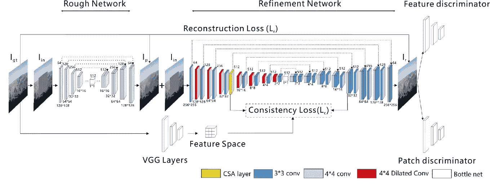

利用 CSA 层的模型架构- [来源](https://arxiv.org/pdf/1905.12384v3.pdf)

## 门控卷积

当我们使用普通 CNN 时，卷积滤波器对所有像素应用相同的操作，而不管它们在空间上是位于已知区域还是未知区域。普通 CNN 的这一缺点导致模糊的输出，在色彩和边缘领域具有视觉假象。为了解决这些问题，最近的研究提出了部分卷积和门控卷积的概念[4，3]。门控卷积背后的主要思想是为每个空间位置和图像通道学习动态特征门控机制。门控值只不过是一个根据数据/要素自动计算并乘以要素以调整特定空间和通道索引值的软遮罩。例如，如果输入特征是 I_in，并且门控机制的可学习卷积权重矩阵是 W_g，则软掩码将被计算为:

> 门控值= sigmoid(∑W _ g I _ in)

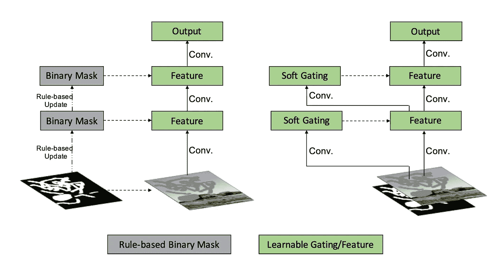

(左)部分卷积和(右)门控卷积的图示。- [来源](https://arxiv.org/pdf/1806.03589v2.pdf)

然后，将计算出的柔化蒙版乘以原始特征。重要的是要注意，当卷积在 CNN 中逐层堆叠时，卷积之前或之后乘以掩码是等效的。门控卷积有两个显著的优点:

*   首先，它使幻觉成分对任意形状更加鲁棒
*   其次，它使网络能够不仅根据掩模和背景，而且根据一些通道中的语义分割信息来学习选择特征。

## SIREN——正弦表示网络

图像修补的任务包括对图像信号的精细细节进行建模。但是大多数使用的方法经常无法学习图像的空间导数的鲁棒隐式神经表示，这在生成过程中可能重要也可能不重要(取决于任务的难度)。为了解决这个很少考虑的问题，[5]提出利用周期性激活对复杂的隐式神经表示进行鲁棒建模。与使用离散表示来模拟图像中不同类型信号的传统方法不同，SIREN 使用正弦作为周期性激活函数。由于正弦的导数是余弦，警报器的导数继承了警报器的属性，这使得能够监控具有复杂信号的警报器的任何导数。SIREN 的作者演示了 SIREN 在图像修复方面的能力，方法是将 5 层 MLP SIREN 拟合到图像输入中，并在表示上实施先验。下图显示了该方法的结果。因此，在这些组件中，SIREN 也值得一提，它无疑为许多类型的逆问题的未来工作提供了几个令人兴奋的途径。

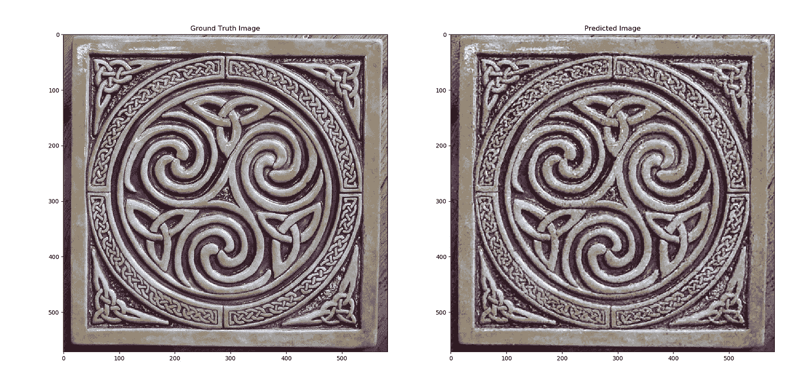

图像修复结果来自 SIREN 模型，(左)地面真实和(右)修复图像- [来源](https://pythonawesome.com/tensorflow-2-0-implementation-of-sinusodial-representation-networks/)

# 在视频上学习后产生幻觉

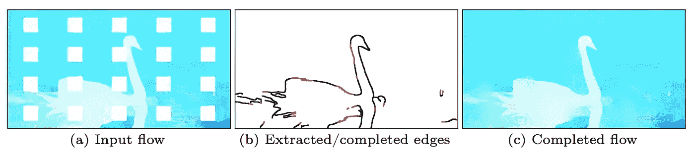

光流幻觉(a)对输入序列的光流估计。缺失区域是红色的白色方块(b)幻觉流边缘。(c)边缘导向流动完井- [来源](https://arxiv.org/pdf/2009.01835.pdf)

与图像修复不同，视频修复侧重于用生成的内容填充给定视频序列中的时空区域。为了合成这些内容，大多数传统方法使用基于补丁的合成。但在基于学习的方法兴起后，一些最成功的方法是基于流的方法，它们联合合成光流和颜色，以实现高分辨率输出。合成的颜色通常沿着流动轨迹传播到缺失的时空区域，以确保时间一致性，并且还减轻了记忆问题。在本节中，我们将讨论论文[6]中建议的基于流程的方法。

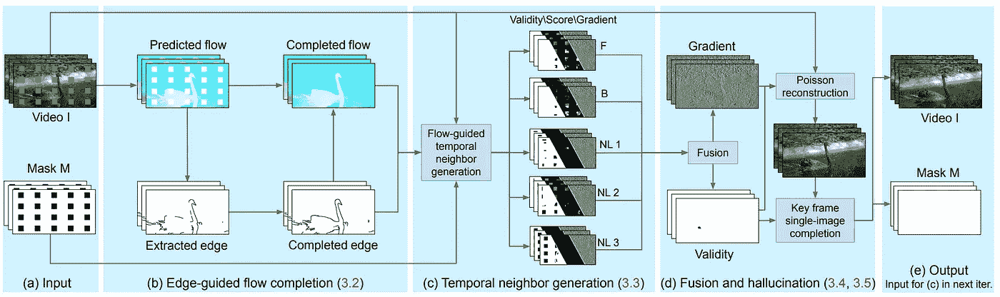

流引导视频补全算法概述- [来源](https://arxiv.org/pdf/2009.01835.pdf)

基于流的视频修复方法的关键部分是运动物体的光流场的精确和清晰的边缘合成。在[6]“流边缘引导的视频完成”中提出的方法旨在专门处理精确的流完成。为了达到同样的目的，网络的第一级计算序列的相邻和非相邻帧之间的前向和后向流。然后使用计算的流量，计算丢失像素区域的流量。为了计算初始流，他们首先使用 canny 边缘检测器提取已知区域的边缘，然后使用 EdgeConnect 并训练一个流边缘完成网络。网络的这一阶段是架构的主要幻觉组件，其工作是在缺失的区域中幻觉出流边缘。流动图的幻觉边缘通常是最显著的特征，用作产生分段平滑流动完成的关键输入。一旦光流的幻觉完成，网络沿着向后和向前的流轨迹为每个丢失的像素传播两个候选像素。网络还通过检查三个时间上相距较远的帧从序列中获得三个非局部流矢量。最后，使用置信度加权平均，在梯度域中融合每个缺失像素的候选像素值。梯度域中的这种类型的融合确保了任何视觉假象和可见色缝的去除。

# 结论

在这篇博客中，我们重点讨论了如何利用神经网络中的幻觉来完成图像修复的任务。我们讨论了三个主要场景，涵盖了在没有任何事先学习的情况下，在图像上学习后和在视频上学习后产生幻觉像素的概念。所有讨论的案例都有深刻的含义，并以各自的方式反映了图像/视频修复研究的丰富历史。然而，我们强调了所有这些方法的共同目标是如何产生看不见的像素，以及它们如何以各自的方式解决图像/视频修复的逆问题。神经幻觉的应用领域非常广泛，只受到设计者独创性的限制。

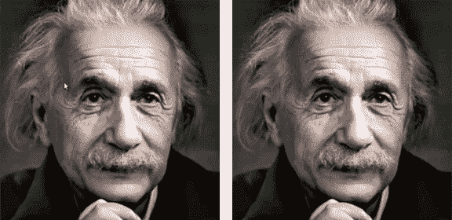

图像修复在编辑图像中的应用- [来源](https://www.nvidia.com/research/inpainting/)** 

***我的博客反映了我所从事的工作，并简单地传达了我对这些话题的理解。我对深度学习的解读可以和你不一样，但我的解读只能和我一样无误。***

# **参考**

**[1] Ulyanov，d .，Vedaldi，a .，和 Lempitsky，V. (2020 年)。深度图像先验。*国际计算机视觉杂志，128* ，1867–1888。**

**[2]刘，黄，姜，黄，肖，杨，张(2019).图像修复中的一致语义注意。 *2019 IEEE/CVF 国际计算机视觉大会(ICCV)* ，4169–4178。**

**[3]俞军，林，张志林，杨军军，沈，徐，陆，黄，等(2019)。基于门控卷积的自由曲面图像修复。 *2019 IEEE/CVF 计算机视觉国际会议(ICCV)* ，4470–4479。**

**[4]刘桂林、Fitsum A Reda、Kevin J Shih、廷、Andrew Tao 和 Bryan Catanzaro。基于部分卷积的不规则孔洞图像修复。《欧洲计算机视觉会议论文集》(ECCV)**

**[5]西茨曼，v .，马特尔，J.N .，伯格曼，a .，林德尔，D.B .，&韦茨斯坦，G. (2020)。具有周期性激活函数的隐式神经表示。 *ArXiv，abs/2006.09661* 。**

**[6]高，c .，萨拉夫，a .，黄，j .，&科普夫，J. (2020)。流动边缘引导的视频完成。 *ArXiv，abs/2009.01835* 。**