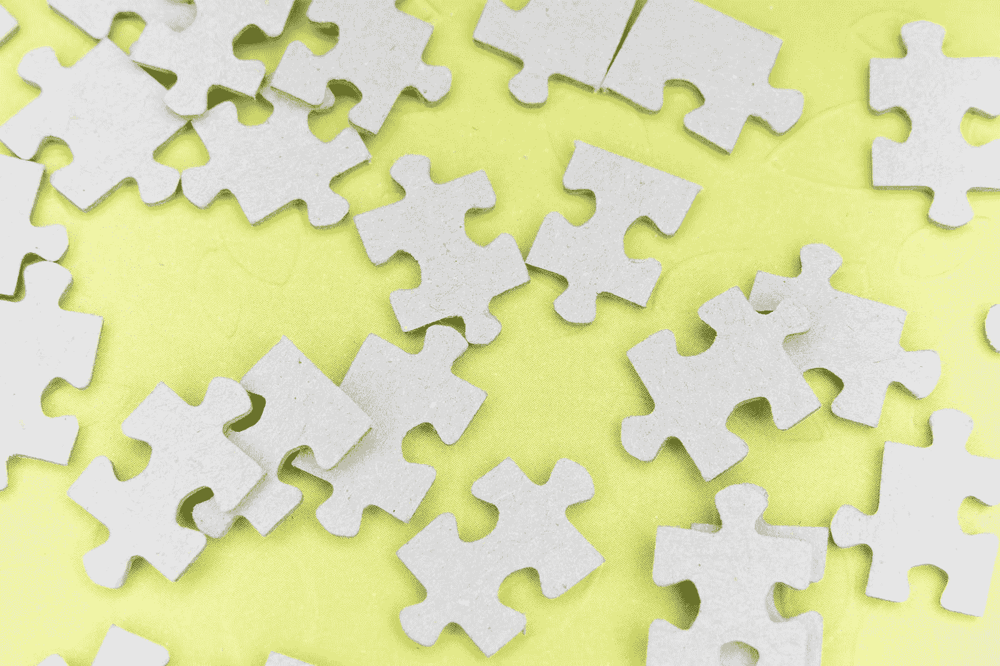
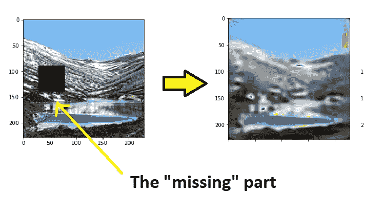
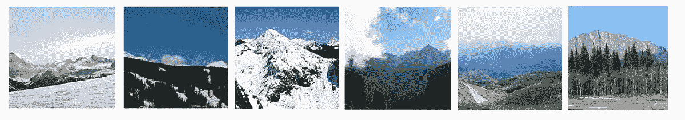
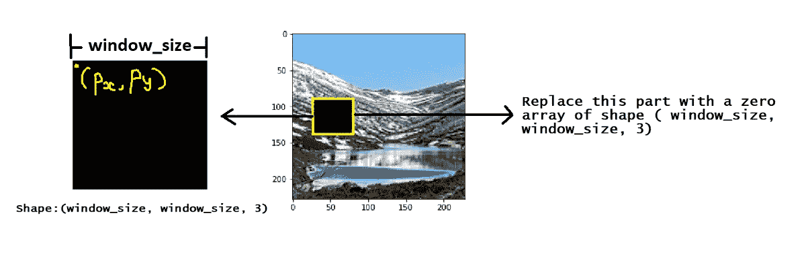
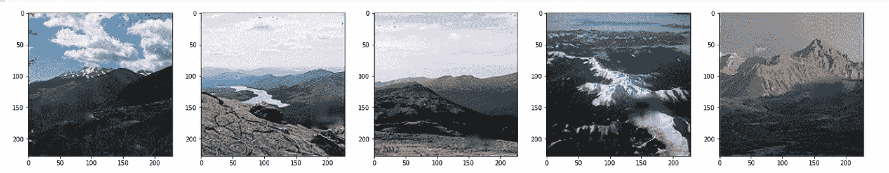

# 使用自动编码器和张量流的神经植入

> 原文：<https://towardsdatascience.com/neural-implanting-with-autoencoders-and-tensorflow-9c2c7b532198?source=collection_archive---------41----------------------->

## 🤖[深度学习](https://equipintelligence.medium.com/list/deep-learning-techniques-methods-and-how-tos-01015cf5f917)

## 使用自动编码器的图像重建(使用跳跃连接)


照片由[卡伦·艾姆斯利](https://unsplash.com/@kalenemsley?utm_source=medium&utm_medium=referral)在 [Unsplash](https://unsplash.com?utm_source=medium&utm_medium=referral) 上拍摄

# 直觉



马库斯·温克勒在 [Unsplash](https://unsplash.com?utm_source=medium&utm_medium=referral) 上拍摄的照片

想象你正在解决一个拼图游戏。你已经完成了大部分。假设你需要在一张图片的中间固定一块(这张图片快完成了)。你需要从盒子里选择一件适合这个空间的物品，并完成整幅画。

我相信你能很快做到这一点。但是你的大脑是怎么做到的呢？

首先，它分析空槽周围的图片(在那里你需要固定一块拼图)。如果图片中有一棵树，你会寻找一个绿色的块(这是显而易见的！).因此，简而言之，我们的大脑能够通过了解图像的*周围环境*来预测作品(将适合该槽)。

> 在本教程中，我们的模型将执行类似的任务。它将学习图像的上下文，然后使用这个学习的上下文预测图像的一部分(丢失的)。

## 代码实现

我建议你应该在另一个标签中打开这个笔记本(TF 实现),这样你就能对正在发生的事情有一个直觉。

[](https://colab.research.google.com/drive/1zFe9TmMCK2ldUOsVXenvpbNY2FLrLh5k#scrollTo=UXjElGKzyiey&forceEdit=true&sandboxMode=true) [## 谷歌联合实验室

### 编辑描述

colab.research.google.com](https://colab.research.google.com/drive/1zFe9TmMCK2ldUOsVXenvpbNY2FLrLh5k#scrollTo=UXjElGKzyiey&forceEdit=true&sandboxMode=true) 

# 问题陈述

我们希望我们的模型能够预测图像的一部分。给定一个有洞的图像(图像数组的一部分，只包含零)，我们的模型将预测完整的原始图像。

因此，我们的模型将使用它在训练期间学习的上下文来重建图像的丢失部分。



作者图片

# 数据

我们将为我们的任务选择一个域。我们在 [Kaggle](https://www.kaggle.com/) 上选择了一些山脉图像，它们是[英特尔图像分类](https://www.kaggle.com/puneet6060/intel-image-classification)数据集的一部分。

> 为什么只有山脉的图像？
> 
> 这里，我们选择属于特定领域的图像。如果我们选择一个在野生的图像中有*的数据集，我们的模型将不能很好地执行。因此，我们将其限制在单个域中。*



数据集中的一些图像。作者图片

使用`wget`下载我在 GitHub 上托管的数据

```
!wget [https://github.com/shubham0204/Dataset_Archives/blob/master/mountain_images.zip?raw=true](https://github.com/shubham0204/Dataset_Archives/blob/master/mountain_images.zip?raw=true) -O images.zip!unzip images.zip
```

为了生成训练数据，我们将遍历数据集中的每个图像，并对其执行以下任务。



作者图片

1.  首先，我们将使用`PIL.Image.open()`读取我们的图像文件。使用`np.asarray()`将这个`Image`对象转换成一个 NumPy 数组。
2.  确定窗口大小。这将是我们要从原始图像中提取的正方形的边长。
3.  在`[ 0 , image_dim — window_size ]`范围内产生 2 个随机数。其中`image_dim`是我们的正方形输入图像的大小。
4.  这两个数字(称为`px`和`py`)是原始图像将被裁剪的位置。选择图像数组的一部分，并用零数组替换它。

代码看起来像这样，

1.准备培训数据。

# 带跳跃连接的自动编码器型号

我们将跳过连接添加到我们的自动编码器模型中。这些跳跃连接提供了更好的上采样。通过使用最大池层，许多空间信息在进入编码器时会丢失。为了从图像的潜在表示(由编码器产生)中重建图像，我们添加了跳过连接，将信息从编码器带到解码器。

2.自动编码器模型。

最后，我们用跳过连接来训练我们的自动编码器模型，

```
model.fit( x_train , y_train , epochs=150 , batch_size=25 , validation_data=( x_test , y_test ) )
```



作者图片

上述结果是在一些测试图像上获得的。我们观察到模型几乎已经学会了如何填充黑盒！但我们仍能辨认出盒子在原始图像中的位置。这样，我们可以构建一个模型来预测图像中缺失的部分。

# 进一步阅读

如果你喜欢这个博客，请确保你在媒体上读到更多我的故事。

# 仅此而已！

这只是自动编码器的一个很酷的应用。我从[这里](https://youtu.be/9zKuYvjFFS8?t=317)得到了这个视频的灵感。感谢阅读！