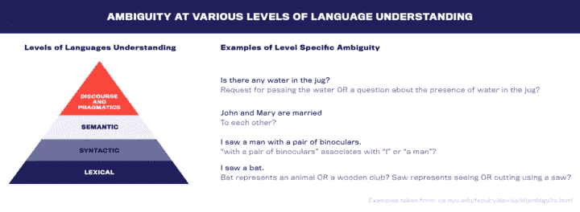
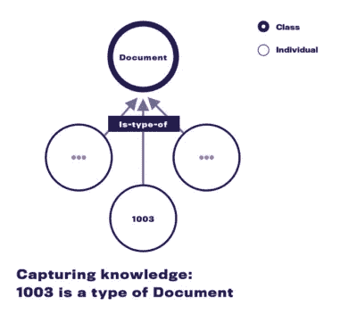
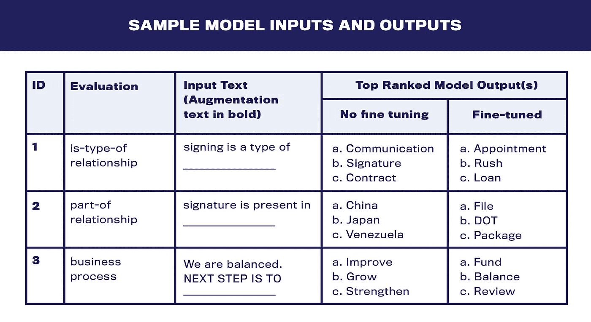

# 作为特定领域知识库的神经语言模型

> 原文：<https://towardsdatascience.com/neural-language-models-as-domain-specific-knowledge-bases-9b505b21de5?source=collection_archive---------22----------------------->

图片来自 [Unsplash](https://unsplash.com/photos/ZiQkhI7417A)

## 自然语言处理|基于转换器的语言模型|领域知识和领域本体

## 基于转换器的语言模型承载的领域知识分析

自然语言处理(NLP)的基本挑战是解决自然语言的含义和意图中存在的歧义。歧义发生在语言理解的多个层面，如下图所示:

(图片由作者提供)

为了解决文本中的歧义，算法使用来自文本出现的上下文的知识。例如，句子“*我参观了动物园。”*“*我看见了一只蝙蝠”*这句话前可以用来推断*蝙蝠*代表的是一种动物而不是一根木棒。

虽然在许多情况下，相邻文本足以减少歧义，但通常在处理来自专门领域的文本时，这是不够的。处理特定领域的文本需要理解大量特定领域的概念和过程，这是 NLP 算法无法单独从相邻文本中收集到的。

例如，在产权保险和结算领域，算法可能需要理解以下概念:

*   A *1003* 是一种*表格，用于申请抵押*
*   *平衡*是完成房地产交易过程中的一个*处理步骤*
*   当*平衡*完成后，下一个*处理* *步骤*可能是*资金释放*

这就是特定领域知识库的用武之地。

特定领域知识库获取自然语言处理算法正确解释特定领域文本所需的领域知识。

根据用例的不同，知识库中的知识可以是特定类型的，也可以是多种类型的。

传统上，知识库被建模为基于图的本体，并作为文本处理管道中的一个组件添加。然而，随着基于转换器的语言模型的出现，如伯特和 GPT-2，有研究和评估[1][2]在一个训练有素的语言模型中固有的知识的类型和质量。

注意:统计语言模型是单词序列的概率分布。给定序列的前面和/或后面的单词，概率分布用于预测在文本序列中某个位置最可能的单词。

这种评估的有利结果可以为从文本处理管道中去除单独的知识库组件以显著降低其复杂性提供理由。围绕这一思想，这篇博客文章描述了基于图的知识库的挑战，并提供了对语言模型中存在的领域知识的评估，这些语言模型已经在标题和结算领域的文本上进行了微调。

# 知识库中预期的知识类型

要评估一个知识库，需要测试处理领域文本所需的所有类型的知识。以下是特定领域文本处理知识库中可能需要的精选知识类型列表:

## 1.特定于业务的实体的知识，如工件、事件和参与者

*   示例:文档、文件、公证和特定类型的文档，例如 1003
*   这种类型的知识支持实体级领域属性的定义和应用。例如，如果一个文档被识别，就知道它可以被共享，并且它具有页数属性

## 2.实体属性的知识

*   例如:住宅再融资借款人有一个属性，如婚姻状况
*   这种类型的知识定义了与实体类型相关联的属性，并有助于文本的解释和信息的提取

## 3.了解实体之间的关系

*   示例:结算披露是贷款人一揽子计划的一部分
*   这种类型的知识有助于评估修改子实体时对父实体的影响

## 4.了解所有这些如何整合到业务流程中

*   示例:找到公证人，安排成交预约
*   这种类型的知识决定了在给定业务流程状态信息的情况下的下一个动作

根据业务领域和用例，知识库中可能需要更多类型的知识。

# 典型的知识库设计、生命周期和成本

要创建知识库，需要定义知识库中存在的知识。根据知识库的不同，这要么完全由人类专家来完成，例如 [WordNet](http://wordnetweb.princeton.edu/perl/webwn) [3]，要么由自动算法来完成，这些算法可能基于也可能不基于人类定义的知识，例如 [YAGO](https://www.mpi-inf.mpg.de/departments/databases-and-information-systems/research/yago-naga/yago) [4]。

知识一旦被定义，就在知识库中被建模为图形或本体。像*类*和*个体*这样的概念被建模为节点，它们之间的*关系*被建模为图的边。类表达像文档和事件这样的概念。个人表示类别的实例，例如，1003、结案披露和契约都是类别文档的实例。边缘捕捉类和个体之间的关系。边捕获的关系的例子有 is-type-of、is-instance-of 和 has-attribute。在下面的例子中， *1003* 和*文档*之间的有向边用于获取 a 1003 是文档类型的知识。

(图片由作者提供)

本体或图形本身使用知识表示语言如 RDF、RDFS 和 OWL 来表示，并以 XML 等格式存储。

有许多流行的知识库——像 YAGO 和概念网——以这种方式模拟各种关系。他们经常从维基百科和 WordNet 等其他知识库中挑选实体进行建模。

一旦一个知识库准备好了，不同的 NLP 模型使用不同的方法将它合并到他们的管道中。选项包括:

1.  使用知识库中存在的实体类型信息来替换或增加文本中的实体出现
2.  使用基于图的测量创建的特征，如文本中提到的实体节点之间的距离，作为模型中的特征[5]
3.  更先进的方法，通过图形嵌入和基于 LSTM 的特征提取等技术，将图形的特征提取结合到反向传播和损失优化循环中[6]

这些方法很重要，需要付出巨大的努力才能发明出来，并在培训和应用阶段加以整合。

基于以上所述，很明显，图形和本体形式的知识库在时间、精力和金钱方面是昂贵的，尤其是当涉及人类专家时。

# 评估基于 Transformer 的语言模型是否带有内置的领域知识库

## 动机

因为创建和合并基于本体的知识库是昂贵的，所以更好的选择总是受欢迎的。

近年来，基于 Transformer 的语言模型，如 BERT 和 GPT-2，在 NLP 竞赛、任务和基准测试中占据了领先地位。令人印象深刻的是，他们通过以下方式实现了这一目标:

1.  形成端到端管道的单个模型(与多模型文本处理管道相反)
2.  预训练模型的最小微调
3.  在多项任务中使用通用基础模型

鉴于这样的成功和易用性，如果这些模型的微调版本中包含领域知识，那将是理想的。如果是这样，可以:

1.  跳过创建知识库的高成本
2.  删除单独的知识库组件，简化多模型文本处理流程
3.  保留拥有知识库的好处，因为在语言模型中获取的知识将在使用模型进行下游任务时自动发挥作用
4.  在语言模型的预训练阶段，获得内置于语言模型中的更广泛的世界知识的额外提升

## 评价方法

为了进行评估，我们在公司内部数据上微调了一个 roBERTa-base 和一个 gpt2-medium 模型(都来自[拥抱脸](https://huggingface.co/)),并探索了其中捕获的知识。用于评估模型的方法是:

1.决定需要评估的知识类型。示例:关系的类型

2.生成知识类型的特定实例，以测试知识的存在。示例:1003 是一种文档。

3.通过屏蔽单词或在实例末尾添加额外的填空类问题来修改知识实例。例:1003 是 _ _ _ _ _ _ _ _ _ 的一种。

4.请模型填空并评价答案。

请注意，根据需要测试的知识类型，还可以使用其他方法。

## 样本模型输入和输出

(图片由作者提供)

# 选择调查结果和分析

## RoBERTa 捕捉了多种类型的关系，并能够自动将学到的概念扩展到新的看不见的实体实例

**Is-type-of 关系:**

4.预微调:花旗银行是一种 ***银行*** 。

5.后期微调:花旗银行是 ***贷款人*** 的一种。

注意，*花旗银行*根本不在数据集中。该模型似乎了解到，银行在产权保险和结算业务中扮演贷款人的角色。然后，它将这种学习应用到它从预培训中了解到的银行。

**实体-属性关系:**

6.后期微调:公证员的 _____ 是 _____

第一个空格的建议上限值:*姓名、信息、电子邮件、联系人、信息、地址、确认、时间表、号码*

**与行动相关的实体关系**

7.________ 需要更改

建议的空白值有:*密码、标题、这个、什么都没有、CD、金额、费用、it、姓名*

虽然有几个例子的模型结果不如上述例子有说服力，但对大多数例子来说，它们是有说服力的。语言模型似乎很好地捕捉了 is-type-of、entity-attribute 和 entity-associated-action 关系。

## 模型输出的知识虽然大多是合理的，但并不总是信息丰富、有用或理想的

**关系的一部分**

8.贷方包由**页*页*页**组成。

其他热门答案有:*二、文件、信托、箱子*

对于上面的例子，虽然像*页*和*文档*这样的答案没有错，但是它们也不是很有用。像*结案陈词*、 *1003* 或*签名宣誓书*这样的回答会提供更多信息。类似地在实施例 7 中。，像*没什么*和*这个*这样的回答是没有参考价值的。这些无用的答案是在各种评估中发现的，可以大致分为以下几类:代词，疑问词，如“什么”，标点符号，以及大小写变化重复的单词。

## 模型开发了对业务流程的良好理解，但是需要智能的外部输入来利用这种理解

**业务流程理解**

*微调过的罗伯塔:*

9.

*   输入:我们是平衡的。
*   增补:请提供 _ _ _ _ _ _ _ _ _ _
*   模型输出(接下来两个词):*收益表*

*微调过的 gp T2-培养基:*

10.

*   输入:贷款金额有误。
*   增补:请提供 _ _ _ _ _ _ _ _ _ _
*   模型输出:*用正确的贷款金额更新费用表*

11.

*   输入:贷款金额有误。
*   增强:请获取 _ _ _ _ _ _ _ _ _ _
*   模型输出:*契约修正归属*

12.

*   输入:公证可用。
*   增强:下一步是 _ _ _ _ _ _ _ _ _ _
*   模型输出:*签名*

注意，在例 9 中。, 10.和 12。如果有很好的补充，这个模型能够给出一个合理的答案。相反，在实施例 11 中。在增强不典型的情况下，模型没有产生可接受的答案。如果下游任务没有简单的方法来提供所需的文本扩充，这可能会成为一个问题。

# 超越语言模型的内置知识库

虽然这篇博客主要关注于评估语言模型的内置知识库，但是如果有必要并且成本不太高的话，可以考虑类似 COMeT[7]的方法。COMeT 在现有知识库上微调预先训练的语言模型，以预测已知和新的知识库关系。

现有知识库上的训练用比原始知识库或预训练语言模型中包含的知识更广泛和更准确的知识来丰富模型。虽然关于 COMeT 方法的讨论超出了本博客的范围，但是在[ATOMIC](https://homes.cs.washington.edu/~msap/atomic/)【8】和[concept net](https://conceptnet.io/)【9】上训练的 COMeT 的在线演示可以在[这里](https://mosaickg.apps.allenai.org/)找到。

# 外卖食品

基于上面的分析，我们相信语言模型——一旦经过微调——确实包含了丰富的领域知识。然而，在直接利用知识的过程中，存在一些挑战，如正确的扩充文本和识别更多信息的模型输出。

*文章最早出现在*[*【statestitle.com】*](https://www.statestitle.com/data-science-blog/)

**参考文献**

[1] Petroni，Fabio 等，“作为知识库的语言模型？”*2019 自然语言处理经验方法会议暨第九届国际自然语言处理联合会议(EMNLP-IJCNLP)论文集*。2019.

[2]戴维森、乔、约书亚·费尔德曼和亚历山大·拉什。"从预先训练的模型中挖掘常识知识."*2019 自然语言处理经验方法会议暨第九届国际自然语言处理联合会议(EMNLP-IJCNLP)论文集*。2019.

[3]普林斯顿大学。“关于 WordNet。” [WordNet](https://wordnet.princeton.edu/) 。普林斯顿大学。2010.

[4] Suchanek，Fabian M .，Gjergji Kasneci 和 Gerhard Weikum。" Yago:语义知识的核心."第 16 届国际万维网会议论文集。2007.

[5]夏，江南，陈武，。"通过多任务学习将关系知识融入常识阅读理解."第 28 届 ACM 信息与知识管理国际会议论文集*。2019.*

[6]林，比尔·，等.〈知识感知图网络:用于常识推理.〉 *arXiv 预印本 arXiv:1909.02151。* 2019。

[7] Bosselut，Antoine 等，《彗星:知识图构建的常识变压器》计算语言学协会(ACL) 。2019.

[8] Sap，Maarten 等人，“原子:如果-那么推理的机器常识图谱”AAAI 人工智能会议论文集。第 33 卷。2019.

[9]斯佩尔、罗宾、约书亚·钦和凯瑟琳·哈瓦西。"概念网 5.5:一个通用知识的开放多语言图表."第 31 届 AAAI 人工智能会议论文集。2017.