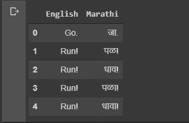
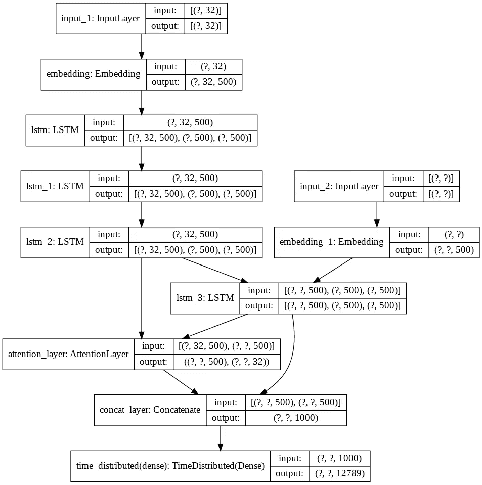
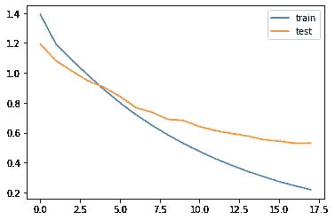

# 具有注意机制的神经机器翻译(NMT)

> 原文：<https://towardsdatascience.com/neural-machine-translation-nmt-with-attention-mechanism-5e59b57bd2ac?source=collection_archive---------14----------------------->

## 深度学习语言翻译指南！


# 概观

不可否认的事实是，在这个全球化的时代，语言翻译在不同国家的人们之间的交流中起着至关重要的作用。此外，在一个像印度这样的国家——一个使用多种语言的国家，语言差异在它自己的各邦都可以观察到！因此，考虑到语言翻译的重要性，有必要开发一个能够将未知语言翻译成已知语言的系统。

据此，在这个故事中，我们将制作一个深度学习模型，将英语句子翻译成马拉地语句子。我选择了马拉地语，因为它容易辨认。您可以使用任何其他您觉得舒服的语言，因为模型几乎保持不变。而且，我在这里会试着简单解释一下语言处理中的一个主要概念叫做注意机制！

# 先决条件

1.  [长短时记忆(LSTM)](/illustrated-guide-to-lstms-and-gru-s-a-step-by-step-explanation-44e9eb85bf21) 细胞的工作
2.  TensorFlow、Keras 和其他一些强制性 python 库的工作。

# 什么是注意力机制？

序列递归神经网络的主要缺点是只能处理短序列。**编码器模型很难记忆长序列并将其转换成固定长度的向量。**此外，解码器仅接收一个信息，即最后一个编码器隐藏状态。因此，解码器很难一次汇总大量的输入序列。那么，我们如何克服这个问题呢？

> 如果我们给解码器模型一个从每一个编码器步骤的向量表示怎么样！

现在，这就是**‘注意力机制**’概念的来源。关于这一点的主要直觉是，它通过关注序列的几个相关部分而不是查看整个序列来预测下一个单词。

> 通俗地说，它可以被描述为编码器和解码器之间的干扰，它从编码器中提取有用的信息，并将其传输回解码器。


注意力层动画

*此处* *参考* [*详细了解注意机制。*](/attn-illustrated-attention-5ec4ad276ee3)

主要有两种类型的注意机制:

*   全球关注
*   当地的关注

## 全球关注

全局注意力是那些通过编码器的所有隐藏状态向量来获得上下文向量的注意力。

## 当地的关注

局部注意力是那些仅考虑编码器的少数隐藏状态向量来生成上下文向量的注意力。

在这个故事中，我们将利用全球的注意力。现在让我们利用注意机制，开发一个语言翻译器，将英语句子转换成马拉地语句子。

# 履行

## 库导入

打开 Jupyter 笔记本，导入一些需要的库:

```
import pandas as pd
from sklearn.model_selection import train_test_split
import string
from string import digits
import re
from sklearn.utils import shuffle
from tensorflow.keras.preprocessing.sequence import pad_sequences
from tensorflow.keras.layers import LSTM, Input, Dense,Embedding, Concatenate, TimeDistributed
from tensorflow.keras.models import Model,load_model, model_from_json
from tensorflow.keras.utils import plot_model
from tensorflow.keras.preprocessing.text import one_hot, Tokenizer
from tensorflow.keras.callbacks import EarlyStopping
import pickle as pkl
import numpy as np
```

## 下载数据集

> 我们将在这里 *使用一个可用的语言数据集 [*。*](http://www.manythings.org/anki/)*

该网站包含许多语言的数据集及其英语翻译。你可以根据自己的喜好和舒适度下载任何语言数据集。但是，记住要选择一个相当庞大的数据集，这样我们在训练模型后才能得到更好的结果。在这里，我将下载由 38696 个句子组成的马拉地语-英语数据集。

下载加载数据集后，按如下所述导入数据:

```
with open('mar.txt','r') as f:
  data = f.read()
```

## 预处理数据集

**数据转换**

正如你所看到的，这是一个原始的文本文件，因此有必要根据我们的喜好对其进行清理和转换。我们将分离马拉地语和英语句子，并形成一个列表，通过将它存储到一个数据帧中来延续它，这样我们就可以很容易地再次使用它。

```
uncleaned_data_list = data.split('\n')
len(uncleaned_data_list)
uncleaned_data_list = uncleaned_data_list[:38695]
len(uncleaned_data_list)english_word = []
marathi_word = []
cleaned_data_list = []
for word in uncleaned_data_list:
  english_word.append(word.split('\t')[:-1][0])
  marathi_word.append(word.split('\t')[:-1][1])language_data = pd.DataFrame(columns=['English','Marathi'])
language_data['English'] = english_word
language_data['Marathi'] = marathi_wordlanguage_data.to_csv('language_data.csv', index=False)
```

> language_data.head()



```
english_text = language_data['English'].values
marathi_text = language_data['Marathi'].values
len(english_text), len(marathi_text)
```

**数据清理**

现在让我们清理数据，使其适合我们的模型。在清理过程中，我们将转换成小写，删除所有标点符号和其他不必要的字母和数字。

```
**#to lower case**
english_text_ = [x.lower() for x in english_text]
marathi_text_ = [x.lower() for x in marathi_text]**#removing inverted commas**
english_text_ = [re.sub("'",'',x) for x in english_text_]
marathi_text_ = [re.sub("'",'',x) for x in marathi_text_]def remove_punc(text_list):
  table = str.maketrans('', '', string.punctuation)
  removed_punc_text = []
  for sent in text_list:
    sentance = [w.translate(table) for w in sent.split(' ')]
    removed_punc_text.append(' '.join(sentance))
  return removed_punc_text
english_text_ = remove_punc(english_text_)
marathi_text_ = remove_punc(marathi_text_)remove_digits = str.maketrans('', '', digits)
removed_digits_text = []
for sent in english_text_:
  sentance = [w.translate(remove_digits) for w in sent.split(' ')]
  removed_digits_text.append(' '.join(sentance))
english_text_ = removed_digits_text**# removing the digits from the marathi sentances**
marathi_text_ = [re.sub("[२३०८१५७९४६]","",x) for x in marathi_text_]
marathi_text_ = [re.sub("[\u200d]","",x) for x in marathi_text_]**# removing the stating and ending whitespaces**
english_text_ = [x.strip() for x in english_text_]
marathi_text_ = [x.strip() for x in marathi_text_]
```

在马拉地语句子中添加“开始”和“结束”标签。这将帮助解码器知道从哪里开始解码以及何时结束解码。

```
# Putting the start and end words in the marathi sentances
marathi_text_ = ["start " + x + " end" for x in marathi_text_]# manipulated_marathi_text_
marathi_text_[0], english_text_[0]
```

> (“开始जा结束”，“开始”)

## 建模的数据准备

我们将以 0.1 的比率分割我们的数据集，以便我们训练的模型可以给出精确的结果。X_train 和 y_train 将是我们的训练集，而 X_test 和 y_test 将是我们的测试/验证集。

```
X = english_text_
Y = marathi_text_X_train, X_test, y_train, y_test=train_test_split(X,Y,test_size=0.1)
```

让我们确定英语和马拉地语句子的最大长度:

```
def Max_length(data):
  max_length_ = max([len(x.split(' ')) for x in data])
  return max_length_#Training data
max_length_english = Max_length(X_train)
max_length_marathi = Max_length(y_train)#Test data
max_length_english_test = Max_length(X_test)
max_length_marathi_test = Max_length(y_test)max_length_marathi, max_length_english
```

> (26, 32)

**标记化:**

由于神经网络需要处理数字数据，因此有必要将我们的字符串输入转换为数字列表。一种方法是使用 keras 预处理库提供的**标记器**。

此外，请记住，在序列到序列模型中，所有输入序列的长度必须相等。因此，我们将填充额外的“0”以使序列具有相同的长度。这将由 **pad_sequence 完成。**

```
englishTokenizer = Tokenizer()
englishTokenizer.fit_on_texts(X_train)
Eword2index = englishTokenizer.word_index
vocab_size_source = len(Eword2index) + 1X_train = englishTokenizer.texts_to_sequences(X_train)
X_train = pad_sequences(X_train, maxlen=max_length_english, padding='post')X_test = englishTokenizer.texts_to_sequences(X_test)
X_test = pad_sequences(X_test, maxlen = max_length_english, padding='post')marathiTokenizer = Tokenizer()
marathiTokenizer.fit_on_texts(y_train)
Mword2index = marathiTokenizer.word_index
vocab_size_target = len(Mword2index) + 1y_train = marathiTokenizer.texts_to_sequences(y_train)
y_train = pad_sequences(y_train, maxlen=max_length_marathi, padding='post')y_test = marathiTokenizer.texts_to_sequences(y_test)
y_test = pad_sequences(y_test, maxlen = max_length_marathi, padding='post')vocab_size_source, vocab_size_target
```

> (5413, 12789)

```
X_train[0], y_train[0]
```

> (array([ 1，157，5，134，4，0，0，0，0，0，0，0，0，0，0，0，0，0，0，0，
> 0，0，0，0，0，0，0，0，0，dtype=int32)，
> array([ 1，6，22，61，253，29，2，0，0，0，0，0，0，0，0，0

为了节省我们的预处理时间，我们将保存我们的重要属性。所以，我们先借助泡菜库来做。

```
with open('NMT_data.pkl','wb') as f:
  pkl.dump([X_train, y_train, X_test, y_test],f)with open('NMT_Etokenizer.pkl','wb') as f:
  pkl.dump([vocab_size_source, Eword2index, englishTokenizer], f)with open('NMT_Mtokenizer.pkl', 'wb') as f:
  pkl.dump([vocab_size_target, Mword2index, marathiTokenizer], f)X_train = np.array(X_train)
y_train = np.array(y_train)
X_test = np.array(X_test)
y_test = np.array(y_test)
```

## 模型结构

取代简单的编码器-解码器架构，我们将使用本博客前面讨论过的注意机制。

Keras 不正式支持关注层。因此，我们可以实现自己的关注层，也可以使用第三方实现。目前，我们将使用第三方关注机制。你可以从 [**这里**](https://github.com/thushv89/attention_keras/blob/master/layers/attention.py) 下载关注层，复制到另一个名为 **attention.py** 的文件中。这个注意力是 [*【巴赫达瑙注意力】*](https://arxiv.org/pdf/1409.0473.pdf) *的一个实现。*

让我们定义模型的结构:

```
from attention import AttentionLayer
from keras import backend as K 
K.clear_session() 
latent_dim = 500# Encoder 
encoder_inputs = Input(shape=(max_length_english,)) 
enc_emb = Embedding(vocab_size_source, latent_dim,trainable=True)(encoder_inputs)#LSTM 1 
encoder_lstm1 = LSTM(latent_dim,return_sequences=True,return_state=True) 
encoder_output1, state_h1, state_c1 = encoder_lstm1(enc_emb)#LSTM 2 
encoder_lstm2 = LSTM(latent_dim,return_sequences=True,return_state=True) 
encoder_output2, state_h2, state_c2 = encoder_lstm2(encoder_output1)#LSTM 3 
encoder_lstm3=LSTM(latent_dim, return_state=True, return_sequences=True) 
encoder_outputs, state_h, state_c= encoder_lstm3(encoder_output2)# Set up the decoder. 
decoder_inputs = Input(shape=(None,)) 
dec_emb_layer = Embedding(vocab_size_target, latent_dim,trainable=True) 
dec_emb = dec_emb_layer(decoder_inputs)#LSTM using encoder_states as initial state
decoder_lstm = LSTM(latent_dim, return_sequences=True, return_state=True) 
decoder_outputs,decoder_fwd_state, decoder_back_state = decoder_lstm(dec_emb,initial_state=[state_h, state_c])#Attention Layer
attn_layer = AttentionLayer(name='attention_layer') 
attn_out, attn_states = attn_layer([encoder_outputs, decoder_outputs])# Concat attention output and decoder LSTM output 
decoder_concat_input = Concatenate(axis=-1, name='concat_layer')([decoder_outputs, attn_out])#Dense layer
decoder_dense = TimeDistributed(Dense(vocab_size_target, activation='softmax')) 
decoder_outputs = decoder_dense(decoder_concat_input)# Define the model
model = Model([encoder_inputs, decoder_inputs], decoder_outputs) plot_model(model, to_file='train_model.png', show_shapes=True)
```

您可以根据自己的选择和要求修改该模型，以获得更好的结果。你也可以改变层数、单位数或一些正则化技术。暂时先往前走，看看我们的模型是什么样子的！



```
model.compile(optimizer='rmsprop',
              loss='sparse_categorical_crossentropy', 
              metrics=['accuracy'])
```

## 模特培训

我们将首先定义一些回调，以便将来模型可视化和评估变得容易。

```
es = EarlyStopping(monitor='val_loss', mode='min', verbose=1)
```

我们正在使用“**教师强制**”技术来更快地训练我们的模型。在教师强制方法中，我们还将目标数据作为输入传递给解码器。例如，如果我们要预测“hello ”,那么我们将把“hello”本身作为输入传递给解码器。因此，这使得学习过程更快。

让我们训练我们的模型:

```
history = model.fit([X_train, y_train[:,:-1]], y_train.reshape(y_train.shape[0], y_train.shape[1],1)[:,1:], 
                    epochs=50, 
                    callbacks=[es],
                    batch_size=512,
                    validation_data = ([X_test, y_test[:,:-1]],           y_test.reshape(y_test.shape[0], y_test.shape[1], 1)[:,1:]))
```

> 在 12GB**NVIDIA**Tesla K80**GPU**上，执行时间约为每个纪元 39 秒。18 世纪实现了早期停止。

我们可以将训练和验证阶段的损失差异形象化为:

```
from matplotlib import pyplot 
pyplot.plot(history.history['loss'], label='train') 
pyplot.plot(history.history['val_loss'], label='test') 
pyplot.legend() 
pyplot.show()
```



损失比较

> 我们从我们的模型中得到了一些非常好的结果，验证准确率约为 90%，验证损失为 0.5303。

## 模型保存和加载

让我们用适当的权重来保存我们训练好的模型。请记住像我一样保存模型，因为我们还必须为推理模型加载权重。

```
model_json = model.to_json()
with open("NMT_model.json", "w") as json_file:
    json_file.write(model_json)
# serialize weights to HDF5
model.save_weights("NMT_model_weight.h5")
print("Saved model to disk")
```

负载模型:

```
# loading the model architecture and asigning the weights
json_file = open('NMT_model.json', 'r')
loaded_model_json = json_file.read()
json_file.close()
model_loaded = model_from_json(loaded_model_json, custom_objects={'AttentionLayer': AttentionLayer})
# load weights into new model
model_loaded.load_weights("NMT_model_weight.h5")
```

## 推理模型

> 在机器学习中，我们通过考虑来自预训练模型的权重，使用推理模型来预测我们的输出序列。换句话说，可以说它是一个模型，该模型推导出在训练阶段学习到的并且现在用于预测新序列的属性。

让我们编写推理模型的代码:

```
latent_dim=500
# encoder inference
encoder_inputs = model_loaded.input[0]  #loading encoder_inputs
encoder_outputs, state_h, state_c = model_loaded.layers[6].output #loading encoder_outputs#print(encoder_outputs.shape)encoder_model = Model(inputs=encoder_inputs,outputs=[encoder_outputs, state_h, state_c])# decoder inference
# Below tensors will hold the states of the previous time step
decoder_state_input_h = Input(shape=(latent_dim,))
decoder_state_input_c = Input(shape=(latent_dim,))
decoder_hidden_state_input = Input(shape=(32,latent_dim))# Get the embeddings of the decoder sequence
decoder_inputs = model_loaded.layers[3].output#print(decoder_inputs.shape)
dec_emb_layer = model_loaded.layers[5]dec_emb2= dec_emb_layer(decoder_inputs)# To predict the next word in the sequence, set the initial states to the states from the previous time step
decoder_lstm = model_loaded.layers[7]
decoder_outputs2, state_h2, state_c2 = decoder_lstm(dec_emb2, initial_state=[decoder_state_input_h, decoder_state_input_c])#attention inference
attn_layer = model_loaded.layers[8]
attn_out_inf, attn_states_inf = attn_layer([decoder_hidden_state_input, decoder_outputs2])concate = model_loaded.layers[9]
decoder_inf_concat = concate([decoder_outputs2, attn_out_inf])# A dense softmax layer to generate prob dist. over the target vocabulary
decoder_dense = model_loaded.layers[10]
decoder_outputs2 = decoder_dense(decoder_inf_concat)# Final decoder model
decoder_model = Model(
[decoder_inputs] + [decoder_hidden_state_input,decoder_state_input_h, decoder_state_input_c],
[decoder_outputs2] + [state_h2, state_c2])
```

## 预言

现在，我们已经训练了序列对序列模型，并使用训练的模型创建了用于进行预测的推理模型。让我们从英语句子中预测一些马拉地语句子。

```
def decode_sequence(input_seq):
    # Encode the input as state vectors.
    e_out, e_h, e_c = encoder_model.predict(input_seq)# Generate empty target sequence of length 1.
    target_seq = np.zeros((1,1))# Chose the 'start' word as the first word of the target sequence
    target_seq[0, 0] = Mword2index['start']stop_condition = False
    decoded_sentence = ''
    while not stop_condition:
        output_tokens, h, c = decoder_model.predict([target_seq] + [e_out, e_h, e_c])# Sample a token
        sampled_token_index = np.argmax(output_tokens[0, -1, :])
        if sampled_token_index == 0:
          break
        else:
          sampled_token = Mindex2word[sampled_token_index]if(sampled_token!='end'):
              decoded_sentence += ' '+sampled_token# Exit condition: either hit max length or find stop word.
              if (sampled_token == 'end' or len(decoded_sentence.split()) >= (26-1)):
                  stop_condition = True# Update the target sequence (of length 1).
          target_seq = np.zeros((1,1))
          target_seq[0, 0] = sampled_token_index# Update internal states
          e_h, e_c = h, creturn decoded_sentence
```

形成反向词汇:

```
Eindex2word = englishTokenizer.index_word
Mindex2word = marathiTokenizer.index_word
```

在给函数一个字符串之前进行一些转换:

```
def seq2summary(input_seq):
    newString=''
    for i in input_seq:
      if((i!=0 and i!=Mword2index['start']) and i!=Mword2index['end']):
        newString=newString+Mindex2word[i]+' '
    return newStringdef seq2text(input_seq):
    newString=''
    for i in input_seq:
      if(i!=0):
        newString=newString+Eindex2word[i]+' '
    return newString
```

调用必要的函数，让我们测试我们的翻译模型:

```
for i in range(10):  
  print("Review:",seq2text(X_test[i]))
  print("Original summary:",seq2summary(y_test[i]))
  print("Predicted summary:",decode_sequence(X_test[i].reshape(1,32)))
  print("\n")
```

> 回顾:没人会告诉你
> 原概要:तुला कोणीही सांगणार नाही
> 预测概要:कोणीही तुला सांगणार नाही
> 
> 回顾:前瞻
> 原创总结:समोर बघा
> 预测总结:तिथे बघ
> 
> 回顾:我要把这个还给汤姆
> 原摘要:मी हे टॉमला परत करायला जातोय
> 预测摘要:मी ते स्वतःहून करणार आहे
> 
> 回顾:一只雄鹰正在天空飞翔
> 原概要:आकाशात एक गरुड आहे
> 预测概要:न्यूयॉर्क अतिरेकी तो दुसर्याचा
> 
> 回顾:他会说阿拉伯语
> 原文摘要:तो अरबी बोलतो
> 预测摘要:तो अरबी बोलतो
> 
> 回顾:收拾这个烂摊子
> 原概要:हा पसारा साफ करून टाका
> 预测概要:हा पसारा साफ कर
> 
> 回顾:不要在课堂上说法语
> 原概要:वर्गात फ्रेंचमध्ये बोलू नका
> 预测概要:वर्गात जास्त कठीण राहू नकोस
> 
> 回顾:我关灯了
> 原概要:मी दिवे
> 预测概要:मी दोन हात वर केला
> 
> 回顾:你有多少球拍
> 原概要:तुझ्याकडे किती रॅकेट आहेत
> 预测概要:तुमच्याकडे किती बहिणी आहेत
> 
> 回顾:我给了汤姆·玛丽的电话号码
> 原概要:मी टॉमला मेरीचा फोन नंबर दिला
> 预测概要:मी टॉमला मेरीचा फोन क्रमांक दिला

万岁！！

我们的模型可以很好地将英语句子翻译成马拉地语句子。

## 项目演示

我已经通过 Django 部署了我的模型，并在 heroku 上托管了它。你可以在这里看看。

 [## 哈希尔·帕特尔

hurdlenet.herokuapp.com](https://hurdlenet.herokuapp.com/) 

## 结尾注释

在这个故事中，我们学习了注意机制的功能，并实现了一个语言翻译任务。这项任务在日常生活中可能有多个用例。例如，我们可以使用这种技术来构建一个多语言翻译器，它可以从一种语言翻译多种语言。此外，如果我们能把它与光学字符识别系统结合起来，我们就能直接从图像中翻译出文本。

如果您有任何其他使用案例或技术来处理翻译数据，并且如果您为 NMT 找到了一个更好的模型，请在下面的回复框中分享！

这篇文章的全部代码可以在 [*这里*](https://github.com/harshilpatel99/NMT_english2marthi) 获得。如有任何反馈，欢迎随时联系我 [*LinkedIn*](https://www.linkedin.com/in/harshil-patel-708680148/) 。