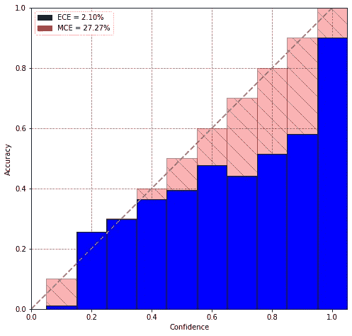

# 用 PyTorch 校准神经网络

> 原文：<https://towardsdatascience.com/neural-network-calibration-using-pytorch-c44b7221a61?source=collection_archive---------2----------------------->

## 用几行代码就能让你的模型适用于安全关键的应用。

在 [Unsplash](https://unsplash.com/s/photos/fall?utm_source=unsplash&utm_medium=referral&utm_content=creditCopyText) 上 [Greg Shield](https://unsplash.com/@gregshield?utm_source=unsplash&utm_medium=referral&utm_content=creditCopyText) 拍照

我想你是在这家新的高科技医院工作的放射科医生。上周，你得到了第一个基于神经网络的模型，它可以帮助你根据病人的数据进行诊断，并最终提高诊断的准确性。但是等等！就像我们人类一样，合成模型的预测永远不会 100%准确。但是，我们如何知道一个模型是绝对确定的，还是仅仅超出了猜测的范围呢？这些知识对于正确的解释和选择合适的治疗方法是至关重要的。

假设你更像是一名工程师:这种情况也与自动驾驶高度相关，在自动驾驶中，汽车必须不断做出决定，判断前方是否有障碍。忽略不确定性会很快变得很糟糕。

如果你像 90%的深度学习社区(包括过去的我)一样，你只是假设由 Softmax 函数
产生的预测代表概率，因为它们被整齐地挤压到域[0，1]中。这是一个常见的陷阱，因为这些预测通常过于自信。正如我们将很快看到的，这种行为受到各种架构选择的影响，如批量规范化的使用或层数。

你可以在这里找到一个交互式 Google Colab 笔记本，上面有所有代码。

# 可靠性图

正如我们现在所知道的，希望输出**校准的置信度**而不是它们的原始对应物。为了直观地了解特定架构在这方面的表现，经常使用**可靠性图表**。

在 CIFAR10 上训练了 10 个时期的 ResNet101 的可靠性图(图片由作者提供)

用一句话来概括，可靠性图显示了预测的置信度得分与其实际准确性的对比情况。因此，给定 100 个预测，每个预测的置信度为 0.9，如果模型完全校准，我们预计其中 90%是正确的。

为了完全理解正在发生的事情，我们需要更深入一点。从图中可以看出，测试集的所有置信度得分都被分入 *M=10* 个不同的仓[0，0.1]，[0.1，0.2]，…，[0.9，1]。对于每个箱，我们可以计算它的**精度**

和**信心**

然后，这两个值都显示为一个条形图，其中同一条线表示完美校准。

# 韵律学

图表和情节只是故事的一面。为了根据模型的**校准误差**对模型进行评分，我们需要定义指标。幸运的是，这里最常用的两个指标都非常直观。

**预期校准误差(ECE)** 只是对绝对精度/置信度差异进行加权平均。

对于如上所述的安全关键应用，测量精确度和置信度之间的最大差异可能是有用的。这可以通过使用**最大校准误差(MCE)** 来完成。

# 温度标度

我们现在想关注如何解决这个问题。虽然存在许多解决方案，如[直方图宁滨、](https://cseweb.ucsd.edu/~elkan/calibrated.pdf) [保序回归](https://citeseerx.ist.psu.edu/viewdoc/download?doi=10.1.1.13.7457&rep=rep1&type=pdf)、[贝叶斯宁滨分位数(BBQ)](https://people.cs.pitt.edu/~milos/research/AAAI_Calibration.pdf) 和[普拉特缩放](http://citeseer.ist.psu.edu/viewdoc/summary?doi=10.1.1.41.1639)(以及它们对多类问题的相应扩展)，但我们希望将重点放在**温度缩放**。这是因为它是最容易实现的，同时给出了上述其他算法中的最佳结果。

为了充分理解它，我们需要后退一步，看看神经网络的输出。假设一个多类问题，网络的最后一层输出逻辑 **z** ᵢ ∈ ℝ.然后可以使用 Softmax 函数σ获得预测的概率。

温度缩放直接作用于逻辑 **z** ᵢ **(而不是预测的概率！！**)并使用单一参数 *T > 0* 对所有类别进行缩放。校准后的置信度可以通过下式获得

值得注意的是，参数 *T* 是根据**验证集**的负对数似然(NLL)损失进行优化的，网络参数在此阶段是固定的。

# 结果

ResNet101 在 CIFAR10 上训练 10 个时期并使用温度标度校准的可靠性图(图片由作者提供)

正如我们从图中看到的，这些条现在更接近身份线，表明几乎完美的校准。我们也可以从指标中看到这一点。经济效率从 2.10%下降到 0.25%，经济效率从 27.27%下降到 3.86%，这是一个巨大的进步。

# PyTorch 中的实现

正如承诺的那样，PyTorch 中的实现相当简单。

首先，我们定义在给定特定温度 **T** 和**逻辑**的情况下返回校准置信度的 *T_scaling* 方法。

在下一步中，必须使用 [LBGFS](https://en.wikipedia.org/wiki/Limited-memory_BFGS) 算法来估计参数 T。这在 GPU 上应该只需要几秒钟。

代码有点类似于 gpleiss 的[库](https://github.com/gpleiss/temperature_scaling)。

欢迎你在我这里[创建的 Google Colab 笔记本里玩一玩](https://colab.research.google.com/drive/1H_XlTbNvjxlAXMW5NuBDWhxF3F2Osg1F?usp=sharing)。

# 结论

如本文所示，只需几行代码就可以完成网络校准，并有很大的改进。如果有足够的兴趣，我很乐意在另一篇 Medium 文章中讨论模型校准的其他方法。如果你有兴趣深入研究这个话题，我强烈推荐郭等人的论文“[关于神经网络的校准](https://arxiv.org/pdf/1706.04599.pdf)..

干杯！