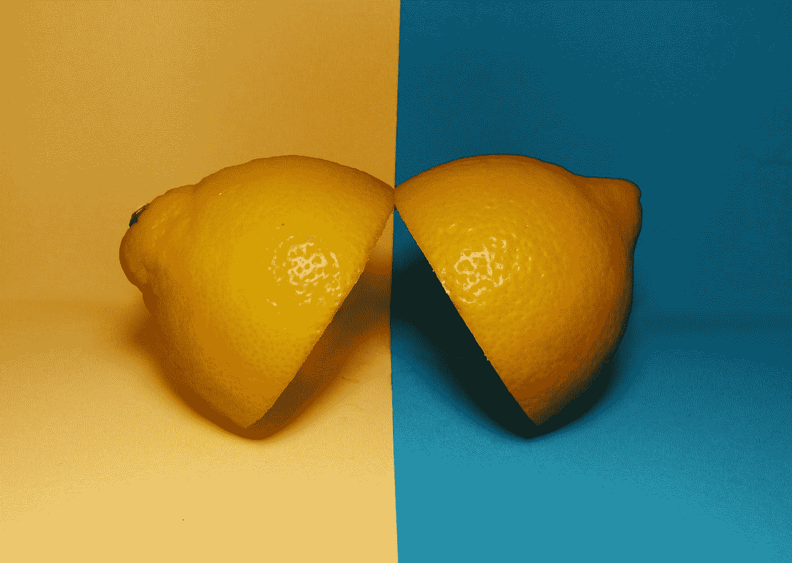
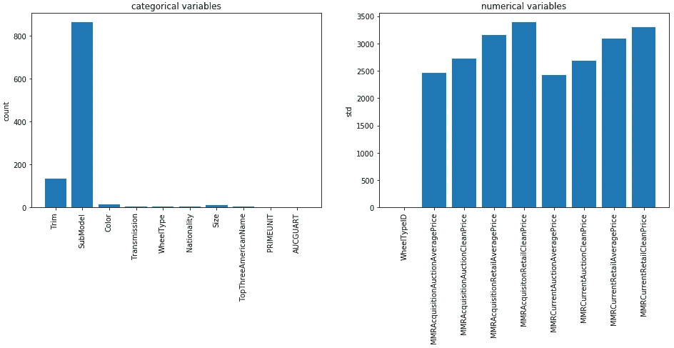
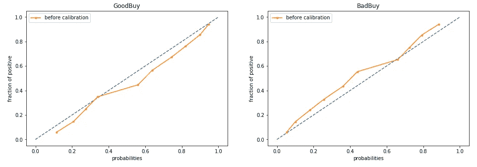
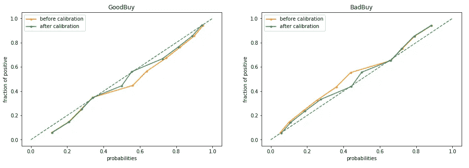

# 基于 Keras 的神经网络校准

> 原文：<https://towardsdatascience.com/neural-network-calibration-with-keras-76fb7c13a55?source=collection_archive---------7----------------------->

## 在真实场景中调整神经网络概率分数



在 [Unsplash](https://unsplash.com?utm_source=medium&utm_medium=referral) 上由 [Lewis Fagg](https://unsplash.com/@_lewis_f?utm_source=medium&utm_medium=referral) 拍照

概率的概念在机器学习领域很常见。在分类任务中，概率是几乎每个预测模型的输出分数以及相对标签。将它们显示在一起比只提供原始分类报告更能提供信息。通过这种方式，我们使用概率作为置信分数来近似我们的模型预测的不确定性。这是一种常见的做法，反映了我们的推理方式。

问题是我们的算法不够智能，无法以可信的置信度分数的形式提供概率。他们倾向于不校准结果，也就是说，如果我们将结果与预期的准确度进行比较，他们会高估或低估概率。这导致了误导性的可靠性，破坏了我们的决策政策。

在这篇文章中，我们想用概率来处理神经网络校准的问题。正如我们将看到的，建立一个校准的模型不是显而易见的，我们必须在开发过程中小心谨慎。我们操作适当的技术来校准真实分类问题中的分数，以使*不会在自动拍卖中被踢*，在自动拍卖中，风险是购买一个*柠檬*。

# 数据

数据集是从 Kaggle 收集的，来自过去的比赛' [*不要被踢！*](https://www.kaggle.com/c/DontGetKicked)’。*这个比赛的挑战是预测在拍卖会上购买的汽车是否是一个好东西*。当车辆出现严重问题或其他一些不可预见的问题时，经常会导致跳车，给经销商造成很高的成本。我们必须找出哪些汽车被淘汰的风险更高，从而为经销商提供真正的价值。该问题可以作为一个二进制分类任务来进行(*好坏买？*)。


标签分发

我们可以处理的变量是分类变量和数字变量的混合:



我们操作一个标准的预处理:NaNs 值用中位数(对于数值)和“未知”类(对于分类)填充。然后对数值变量进行标准缩放，对分类变量进行普通编码。

# 模型

用于预测我们的购买是否划算的模型是一个具有分类嵌入的前馈神经网络。类别嵌入在第二层连接，而在最后部分，我们保持原始输出层(logits)和激活(softmax)之间的分离，用于概率计算。当我们需要校准模型时，这个小技巧会对我们有用。

```
def get_model(cat_feat, emb_dim=8):

    def get_embed(inp, size, emb_dim, name): emb = Embedding(size, emb_dim)(inp)
        emb = Flatten(name=name)(emb) return emb

    inp_dense = Input(shape=len(num_))

    embs, inps = [], [inp_dense]

    x = Dense(128, activation='relu')(inp_dense)

    for f in cat_feat:
        inp = Input((1,), name=f+'_inp')
        embs.append(get_embed(inp, cat_[f]+1, emb_dim, f))
        inps.append(inp)

    x = Concatenate()([x]+embs)
    x = BatchNormalization()(x)
    x = Dropout(0.3)(x)
    x = Dense(64, activation='relu')(x)
    x = Dropout(0.3)(x)
    x = Dense(32, activation='relu')(x)

    logits = Dense(2, name='logits')(x)
    out = Activation('softmax')(logits)

    model = Model(inps, out)
    model.compile(optimizer='adam', 
                  loss ='categorical_crossentropy', 
                  metrics=[tf.keras.metrics.AUC()])

    return model
```

我们在训练、验证和测试中分离初始数据集。验证将首先用于网络调谐，然后在第二阶段拟合校准程序的温度标度系数。拟合后，我们在测试数据上实现了 0.90%的精确度，这比将所有汽车分类为好交易的随机模型要好。

# 神经网络校准

正如我们所看到的，我们的模型可以在看不见的数据上提供良好的性能。但是*这个结果有多靠谱？*预测校准良好的概率的优点是，如果预测的概率接近 1 或 0，我们可以有信心，否则就不那么有信心。在我们的例子中，如果没有，我们的分类器可能会过度预测类似的汽车为“*柠檬*”，这可能导致不购买实际上状况良好的汽车的决定。

根据定义，如果对于任何概率值 p，对应于具有 p*100 %精度水平的类别预测，则模型被完美校准。为了检查我们的分类器是否校准良好，我们需要做的就是绘制一个图！同时，产生校准概率非常简单，因为应用了后处理技术。

第一步是绘制可靠性图，在这里我们可以比较预期的准确性和预测的可信度。为方便起见，每个等宽组/箱计算阳性分数和平均预测值。这可以针对二元或多类问题进行计算，并为每个类生成一条曲线。



校准前的可靠性图

最佳情况是当我们在计算的概率和阳性分数之间有一个完美的线性关系时(蓝色虚线)。在我们的例子中，我们的神经网络倾向于分别高估和低估中间两类的概率。我们可以用一个适当的指数来量化校准的好坏，即所谓的预期校准误差(ECE)，即预期精度和预测置信度之间差异的加权(每个箱中样本的比例)平均值(越低越好)。

我们可以通过应用一种技术来调整 ECE，这种技术是温度缩放的扩展，称为普拉特缩放。神经网络输出一个称为 logits 的向量。Platt scaling 简单地将 logits 向量除以一个学习到的标量参数 *T，*，然后将其传递给 softmax 函数以获得类概率。


y_hat 是预测值，z 是逻辑值， *T* 是学习参数

实际上，只需几行代码，我们就可以构建自己的函数来计算温度比例。比例因子 *T* 是在预定义的验证集上学习的，其中我们试图最小化平均成本函数(在 tensor flow:*TF . nn . soft max _ cross _ entropy _ with _ logits*)。输入和输出将分别是我们的逻辑值，用可学习的 *T* 进行缩放，以及虚拟向量形式的真实输出。列车是用随机梯度下降法经典计算的。



校准后的可靠性图

最后，两个班级的 ECE 分数都有所提高。正如我们在上面新的可靠性图表中看到的，我们可以得到更精确的概率。

# 摘要

在这篇文章中，我们研究了一种后处理技术来校准我们的神经网络的概率，并在可能的情况下(并非总是温度标度有效)，让它成为一种更可信的工具。这是一个非常简单的技巧，适用于任何地方，如果我们关心我们的模型计算决策的概率，这变得很有用。

[**查看我的 GITHUB 回购**](https://github.com/cerlymarco/MEDIUM_NoteBook)

保持联系: [Linkedin](https://www.linkedin.com/in/marco-cerliani-b0bba714b/)

**参考文献**

*   [StellarGraph——图上的机器学习](https://medium.com/stellargraph/graph-neural-network-model-calibration-for-trusted-predictions-e49628487e7b)
*   关于现代神经网络的校准:郭川，杰夫·普莱斯，孙玉，基利安·q·温伯格