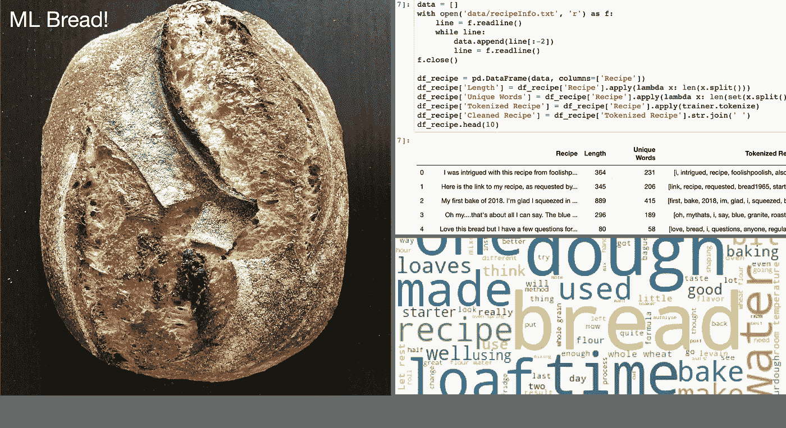
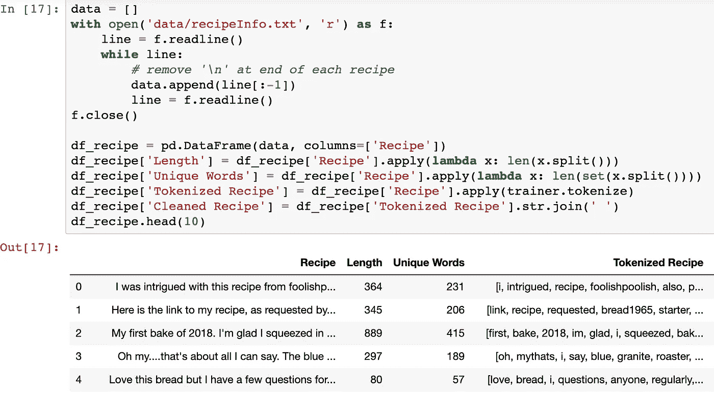
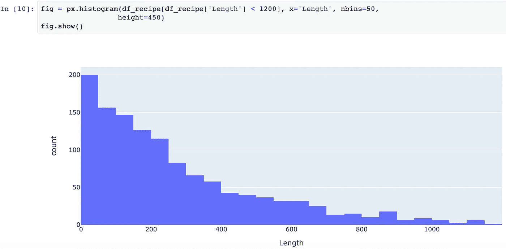
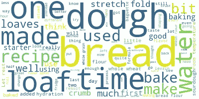
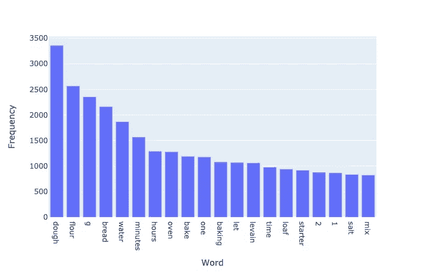

# 用于生成面包食谱的神经网络

> 原文：<https://towardsdatascience.com/neural-network-for-generating-bread-recipes-d872e15b1d1c?source=collection_archive---------40----------------------->

## 面包真的很好吃！

2017 年，一个朋友给了我一些酸面团发酵剂用来做面包，从那以后，我的生活发生了变化。这听起来很俗气，但我发现了一个爱好，它让我一次买了差不多 200 磅面粉(说真的)，养成了两周一次的披萨烘焙习惯，并梦想着未来几天我要做什么面包！



左边是我用我的神经网络模型生成的食谱做的一条酸奶面包。右边是分析和预测面包食谱的代码。(图片由作者提供)

因为我花了很多时间烘焙酸面团和试验新配方，所以我想看看我是否可以创建一个人工智能驱动的食谱生成器，它可以预测我要做的东西！我经常去的技术、技巧和诀窍网站之一是面包烘焙论坛 [The Fresh Loaf](http://thefreshloaf.com/) ，在那里人们可以提问和发布食谱。我的想法是抓取这个网站，获取数据来训练神经网络，以生成新的面包食谱——这就是我所做的。在这个项目结束时，我能够实现我的目标:烘烤一条受机器学习启发的面包，用神经网络预测配料。

由于这个项目有多个组成部分，我将在几篇文章中对它们进行分解。第一部分在 Medium 上，其余部分在我的博客上， [https://pratima.io.](https://pratima.io.) 我为这个项目使用的所有代码都在[这个回购](https://github.com/pratima-personal/bread-recipe-generator)中。


*我的核桃酸面团面包，附带的内部图片(称为面包屑照片)显示出由于核桃中的单宁而产生的紫色条纹。化学！(图片由作者提供)*

# 项目概述

在这个项目中，我按照以下步骤获得了一个配方生成模型:

*   首先，我浏览了新鲜面包网站，获得了一份食谱列表，对其进行了清理和可视化，以了解数据集中的趋势(第一部分——你现在正在阅读的内容)
*   然后，我使用 NLP 工具研究了这些数据，以进一步了解博客上的人们在他们的帖子中说了些什么
*   最后，我训练了一个神经网络来学习基于单词的语言模型，并从中生成句子来获得新的食谱

在这篇文章中，我将描述该项目的数据收集和数据探索部分。

## 抓取网站获取数据

我用 python 中的 urllib 库[查询网页的网站](https://github.com/pratima-personal/bread-recipe-generator/blob/master/scrape_web.py)和美汤解析 HTML 代码。检查新鲜面包上的博客帖子的源代码，我意识到包含食谱的帖子有类`node-type-blog`，而其他帖子有类似`node-type-forum`的其他类；所以我确保只抓取以前班级的页面。然后我必须确定包含文本的博客主体在哪里。标签有很多嵌套，对我来说，有点乱，因为我不经常看 HTML 代码。这个类的`<div>`元素既包含博客文本，也包含评论和广告，但是我只想分离出菜谱。所以我决定在 Beautiful Soup 中使用`prettify()`函数，并检查结果字符串，看看文本主体在哪里。

```
import urllib.request as urlib
from bs4 import BeautifulSoupdef get_recipe(page_idx):
  try:
    page_url = f’[http://www.thefreshloaf.com/node/{page_idx}'](http://www.thefreshloaf.com/node/{page_idx}')
    page = urlib.urlopen(page_url)
    soup = BeautifulSoup(page, ‘html.parser’)
    # only process pages that are blog posts, aka contain recipes
    if ‘node-type-blog’ in soup.body[‘class’]:
      print(f’blog at index {page_idx}’)
      soup = soup.prettify()
      soup = soup[soup.find(‘title’):]
      soup = soup[soup.find(‘content=”’)+len(‘content=”’):]
      end = soup.find(‘“‘)
      return preprocess(soup[:end])
  except Exception:
    print(f’Page: [http://www.thefreshloaf.com/node/{page_idx](http://www.thefreshloaf.com/node/{page_idx)} not found!’)
```

这个字符串中的标记使得找到菜谱主体(包含在内容部分中)变得非常容易，在分离出这个字符串之后，我使用了一个快速预处理函数来去除菜谱文本中的任何 HTML 残余。

```
def preprocess(text):
  text = text.replace(u’<br/>’, ‘’)
  text = text.replace(‘(<a).*(>).*(</a>)’, ‘’)
  text = text.replace(‘(&amp)’, ‘’)
  text = text.replace(‘(&gt)’, ‘’)
  text = text.replace(‘(&lt)’, ‘’)
  text = text.replace(u’\xa0', ‘ ‘)
  return text
```

我搜集了大约 10000 个帖子，最后得到了 1257 个食谱，我把它们收集到一个文本文档中，每个食谱都用一个新行隔开。我可以继续搜集更多信息，但在查询了几个小时后，网站停止了响应，所以我决定停下来，从这里了解数据。

## 数据清理和探索

首先，我将文本文件加载到一个 Jupyter 笔记本上，并计算了每个食谱的长度和独特的单词。在检查数据时，我发现许多作者参考了其他的 url，在那里他们获得了食谱的灵感，我从文本中删除了这些“单词”。我还通过使用 NLTK 语料库[删除停用词来标记菜谱。然而，许多作者描述了他们自己的想法和过程，因此在训练语言模型时，删除停用词“我”和“我”会导致语法问题；我在文中保留了这些停用词。](https://www.nltk.org/)

```
def tokenize(text):
  punctuation_map = str.maketrans(‘’, ‘’, string.punctuation)
  stopwords_list = stopwords.words(‘english’)
  stopwords_list.remove(‘i’)
  stopwords_list.remove(‘me’)
  stopwords_list.append(‘com’)
  stopwords_set = set(stopwords_list)
  text = text.split()
  # remove website links in text
  text = [word for word in text if not (‘http’ in word or ‘www’ in word)]
  text = [word.translate(punctuation_map).lower() for word in text]
  tokenized_words = [word for word in text if word not in stopwords_set]
  return tokenized_words
```



食谱的平均长度为 294 个单词，标准差为 618。食谱长度差异很大！它们平均还包含 166 个独特的单词，同样具有 174 个单词的高标准偏差。这种高标准偏差表明尾部很大，事实上，在检查数据时，我发现有几个超过 1200 个单词的食谱扭曲了这些统计数据。一个帖子甚至有> 20000 字！



*显示配方长度直方图的代码。(图片由作者提供)*

为了获得这些食谱文本所包含内容的可视化表示，我基于食谱中的单词创建了一个[单词云](https://github.com/amueller/word_cloud)。这个包在删除停用词后创建了一个顶部术语的图像。不出所料，最常见的词是“面包”、“面团”、“面包”、“时间”和“水”。我想到的其他一些词是“伸展”、“折叠”和“开始”。从我烤面包的经验来看，时间是一个重要的因素，而且它是一个相当频繁的词。我也很高兴看到拉伸和折叠，因为这是一种在面团中发展力量的常见技术，很多人似乎都在使用它！令人惊讶的是，发酵剂出现了，但“酵母”一词却没有出现，因为面包可以用野生酵母发酵剂和标准商业烘焙酵母发酵。似乎新鲜面包的使用者，像我一样，更喜欢用酸面团发酵剂来发酵他们的面包，并哄出有趣的味道，因为它的野性。



*字云从菜谱的正文中生成。(图片由作者提供)*

从数量上来说，我把所有的单词列了一个长长的清单，并计算了每个单词出现的次数，从而画出了食谱中最常见的 20 个单词。和上面的单词“云”一样，我们在这个常用术语列表中看到了“面团”、“面粉”、“水”和时间单位。



*显示食谱中出现的前 20 个单词的频率的直方图。(图片由作者提供)*

唷——这么多东西！前往我的网站查看第二部分[和第三部分](https://pratima.io/neural-network-bread-recipe-generation-ii/)[以了解更多关于数据集的信息，以及我如何训练一个告诉我如何制作面包的神经网络:-)](https://pratima.io/neural-network-bread-recipe-generation-iii/)

[*原载于 2020 年 7 月 22 日作者博客*](https://pratima.io/neural-network-bread-recipe-generation-i/)