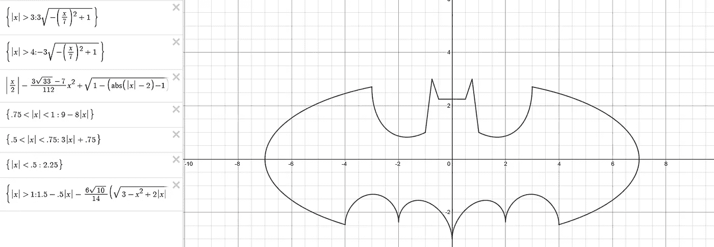

# 神经网络生成超级英雄标志

> 原文：<https://towardsdatascience.com/neural-network-generating-superhero-logo-c86f931c9cf1?source=collection_archive---------56----------------------->

## 使用多层感知器创建一个标志，并可视化参数如何影响你的模型

照片由 [Teo Zac](https://unsplash.com/@teo?utm_source=medium&utm_medium=referral) 在 [Unsplash](https://unsplash.com?utm_source=medium&utm_medium=referral) 上拍摄

机器学习是计算机科学领域的超级力量。多亏了推荐系统，我们可以用它来预测未来，通过检测和分类物体让机器人看到东西，或者找到符合我们口味的产品和内容。

当更强大的深度学习方法被发现时，我们获得了能够实现几乎神奇结果的工具。生成看起来像真的一样的人造图像，或者转换风格以生成自己版本的杰作，激发了我们的想象力和创造力。

创造性地使用神经网络刺激我们的动机和学习过程。即使我们有先进的生成模型，也有办法使用简单、经典、多层的神经网络来生成视觉内容，并使用它来描述模型如何工作。所以，让我们发挥创意，制作我们自己的超级英雄标志吧！

# 数据优先

数据科学模型需要数据的支持。该核心组件定义了模型的行为，是人工大脑的基础。我们自己的超级英雄标志的种子将被编码在传统的二维点阵中。

2D 点网格(作者图片)。

这是我们的训练数据集。它由 ***627 个点*** 与 ***x，y*** 坐标， ***一个标号*** 。标签有两种类型 ***0*** 和 ***1*** 。

这些数据代表了什么？我希望我的神经网络经过适当的训练后能给我们看，但我们先介绍一下我们的模型。

# 船长神经网络

这个想法很简单。我们将使用一个三层神经网络。它由一个输入层**和一个将数据点传递给隐藏层**的组成。这里我们有神经元具有*的激活功能:*

**

*乙状结肠激活功能(图片由作者提供)。*

*隐藏层的神经元有两个权重和一个偏差:*

**

*隐层神经元方案(图片由作者提供)。*

*最后，最后一层将使用隐藏层神经元的输出，并为我们的点生成标签。因为我们只有两个可能的标签 ***，所以一个输出神经元*** 就足够了。*

*看看我们的模型:*

**

*3 层神经网络(图片由作者提供)。*

# *训练任务*

*有了我们的数据和神经网络模型，我们可以开始训练过程。让我们试试最简单的方法:*

1.  *按原样使用数据。*
2.  *把 ***40 个*** 隐藏起来的神经元。*
3.  *使用范围 *(-0.2，0.2)* 中接近 *0* 的随机值初始化神经元权重。*
4.  *将每个数据点 ***呈现 1 000 次***(1000 次训练迭代)。*

*在训练过程之后，我们将要求我们的神经网络为训练集中的每个数据点分配标签。然后我们将使用不同的颜色为标签 *0* 和 *1* 绘制点。如果模型从我们的数据中学习模式，我们应该看到一个超级英雄标志。*

*让我们检查一下:*

**

*神经网络未能学习模式(图片由作者提供)。*

*哎呀，看起来不太好。神经网络没有很好地将想法包含在数据中。*

*根本原因是什么？有几个可能的问题。首先，我们的 ***数据不是归一化的*** 。我们为网络提供从 *-8.0* 到 *8.0 的坐标。*当我们使用 sigmoid 激活函数时，它应该更适合范围 *(0，1)内的数据。**

*然而，看着 ***均方误差***【2】，及其下降趋势我们也可以尝试增加训练迭代的次数:*

**

*每次迭代的均方误差(图片由作者提供)。*

# *更多迭代*

*为了检查网络是否需要更多的时间来学习模式，让我们给它一个机会。让它疯狂地运行 40 000 次迭代，看看会发生什么。*

**

*正确分类的训练集(图片由作者提供)。*

*你能在图片中看到熟悉的东西吗？想想最著名的漫画人物之一。那个很黑，喜欢在晚上工作的人。让我来帮你:*

**

*分类训练集和“蝙蝠侠曲线”(图片由作者提供)。*

*没错，就是蝙蝠侠标志！*

# *蝙蝠侠曲线*

*我的数据集背后的秘密已经被揭示了。我用这些公式[3]构建了它:*

**

*“蝙蝠侠曲线”公式(图片由作者提供)。*

*我到底是怎么用的？我的代码通过一个小步长 *(0.1)* 在一个坐标系统中迭代点。如果该点在曲线内，则标记为 *1* 。否则，点被标记为 *0。**

*神经网络学会了如何区分曲线内的点和曲线外的点，这很好。然而，有两个问题:*

1.  *这不是我自己的标志，蝙蝠侠标志已经有人用了。*
2.  *神经网络在训练集上表现很好，这不是什么大事。*

*是时候解决这两个问题了。*

# *测试任务*

*为了让神经网络生成原始徽标，我将生成第二个点网格。然而，这一次它将是一个真正的厚网格。更何况，每个点都不会被分配标签。*

*相反，已经训练好的神经网络将被用来为更粗的网格生成标签。这个时间网格由 ***26 000 个*** 点组成。给定点不是训练集(627 点)的一部分的概率相当高。*

*在迭代每个点并获得神经网络预测的标签后，我们可以绘制结果:*

**

*由神经网络生成的新标志(图片由作者提供)。*

*我们拿到了。但是哪个超级英雄会用它呢？飞鼠人？或者更像是象人？我会把它留给你的想象力。*

# *生成徽标的整个过程*

*让我们总结一下如何生成徽标:*

1.  *找到一个模式或公式，它将作为你形象的基础。使用点的坐标作为神经网络的输入。不同区域的不同标签对你的最终形象至关重要。让训练集网格不要那么粗，这样你的神经网络就有了一些空间 ***在未知领域有创意*** 。*
2.  *生成一个更粗的网格作为你的测试集。这次不要给这些点贴标签。*
3.  *训练你的神经网络。*
4.  *使用不同的颜色为测试设定点和标绘点生成不同的标签。*
5.  *检查结果。如果不喜欢，就玩玩神经网络参数，看看对最终结果有什么影响。*

*Octave 代码以及用于运行这些实验的数据可以在这里获得[4]。*

*看看三个基于 **" *蝙蝠侠曲线的* "** 标识的例子，通过玩弄神经网络参数生成:*

******

*不同神经网络生成的 Logos(图片由作者提供)。*

# *让它有趣*

*数据科学和学习可能很有趣。通过寻找利用科学的创造性方法，你可以鼓励自己学习更多，并且更好地理解事物是如何工作的。*

*视觉形式甚至更吸引我们的想象力，因为我们使用不同的感官来获得我们试图完成或学习的大部分事情。欢迎您更改一些神经元、期望误差以及许多其他参数，并立即查看它如何影响最终结果。*

*记住，权力越大，责任越大。如果你有一个能激发好奇心的想法，不要犹豫，分享它吧！*

## *参考书目:*

1.  *Joel Grus，*数据科学从零开始，第二版*，ISBN:978–1492041139*
2.  *[https://en.wikipedia.org/wiki/Mean_squared_error](https://en.wikipedia.org/wiki/Mean_squared_error)*
3.  *[https://www.desmos.com/calculator/dnzfajfpym](https://www.desmos.com/calculator/dnzfajfpym)*
4.  *[https://github.com/rauluka/mluvr-logo](https://github.com/rauluka/mluvr-logo)*