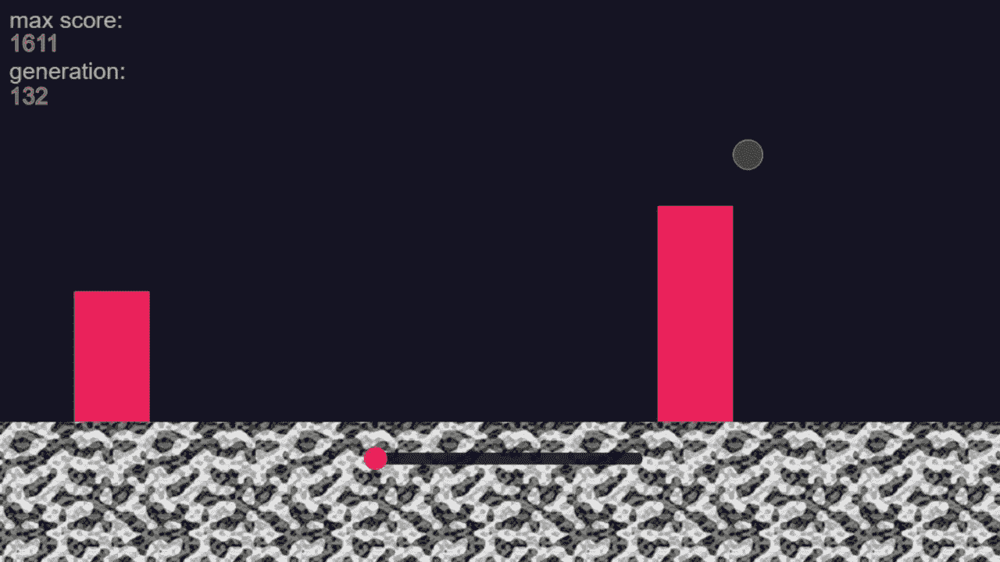
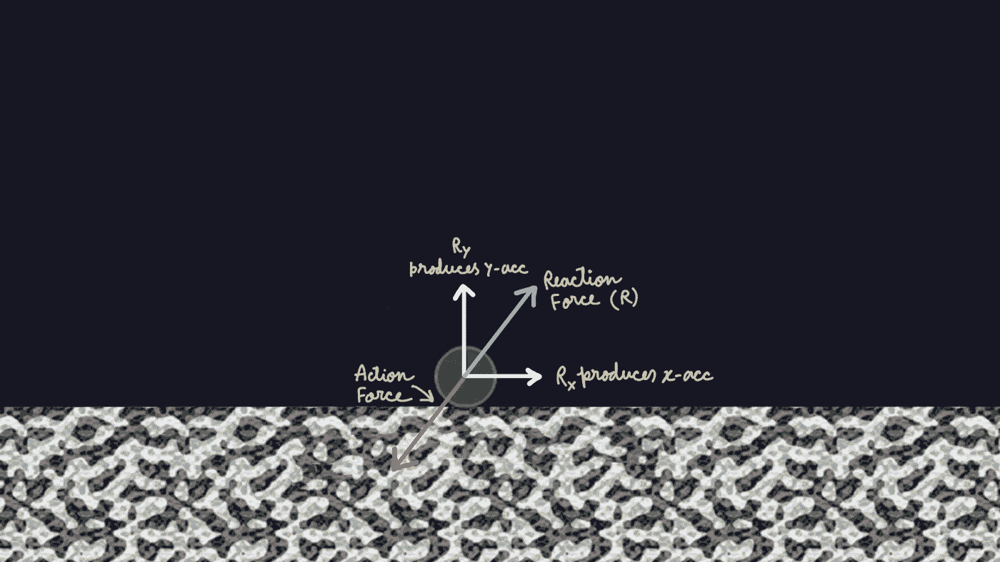
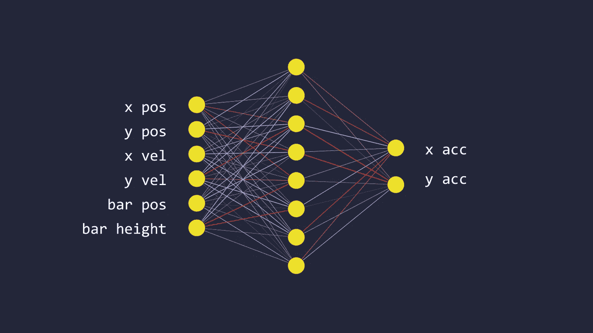

# 神经网络+遗传算法+博弈= ❤

> 原文：<https://towardsdatascience.com/neural-network-genetic-algorithm-game-15320b3a44e3?source=collection_archive---------11----------------------->

## 我就是这样创造了一个完全打败这个游戏的人工智能！

人工智能玩游戏

# 游戏:规则和移动

首先，我来描述一下这个游戏。你可能已经从 gif 中猜到了，这个游戏的目标是避开红色的栅栏，让绿色的生物向前移动。你走得越远，你的分数就越高。为了让游戏更真实，我实现了重力，这意味着如果生物向上移动，它必须以给定的加速度向下移动。但是它怎么/什么时候跳呢？为了能够跳跃，它必须在地面上。在这个位置，生物可以对地面施加作用力，地面会对其施加反作用力。这种反应会帮助它跳跃(就像我们如何跳跃一样)。这个力的 x 分量将在 x 方向产生一个加速度，y 方向也是如此。

> 注意:为了简单起见，我没有实现动作-反应机制，而是只处理加速度。当生物在地面上时，它可以决定它的 x 和 y 加速度！

跳跃物理学

挑战是找到这些加速度的值，这样它就可以安全地跳过下一个红色条！需要注意的是，当它在空中时，它不能改变自己的速度(为什么？留给读者)。与地面的碰撞是非弹性的，因此它不会自动反弹。

# 构建人工智能

有许多方法可以解决这类问题。在这里，我应用了一种叫做**神经进化**的东西，它是**神经网络**和**遗传算法**的组合。

## 一.神经网络

为了能够‘思考’(**何时**和**如何**跳跃)，这种生物需要某种决策模型。在我的方法中，我用一个神经网络作为我们小朋友的大脑。我在输入层使用了一个包含 ***6*** 节点的小 nn，在隐藏层使用了 ***8*** ，在输出层使用了 ***2*** 。但是在那些 ***6*** 输入节点中有什么，在 ***2*** 输出节点中有什么呢？我们先来看输出节点。 ***2*** 节点决定两个方向的加速度值。正如我之前所说的，这个生物只需要决定它的 x 和 y 加速度。

我们的神经网络的结构显示了输入特征和输出

对于输入节点，可能有许多组可能的特征。目的是向大脑提供尽可能多的关于生物当前状态及其周围环境的信息。我正在使用这 6 条信息(你能想出一套更好的功能吗？)

## 二。遗传算法

顾名思义，和遗传有关。这是一种进化算法，我们试图模仿生物进化来找到一个给定问题的最优解。我们从一组解决方案开始，从中选择最好的，并让它们发展。不严格地说，每种遗传算法都遵循 ***5*** 的步骤。

*   **初始群体:**解的初始集合。每个解决方案都有特定的**基因**(一组参数)决定其行为。基因在个体之间有所不同，这被称为**变异**。

> 注意:如果初始种群没有变化，那么每个解都会以完全相同的方式进化，我们将无法探索其他解！

*   **适应度函数:**一个数学函数，通过给每个解决方案分配一个适应度分数来确定一个解决方案有多适合(最优)。这将有助于下一步。
*   **选择:**在这一步，我们选择最适合的个体，让他们把自己的遗传信息传递给下一代。
*   **交叉:**结合两个(或更多)父母的基因，产生下一代的一个个体。
*   **突变:**当遗传信息从当前一代传递到下一代时，很小比例的信息被随机改变。

> 注意:由于突变，一些新的特征(属性)将被引入，这将“有希望”使我们的解决方案更加优化。希望如此，因为变异是随机的，也会产生负面影响！

## 三。神经网络与遗传算法的结合

现在是大揭露的时候了。你会如何结合这两种完全不同的算法？主要思想是将神经网络(大脑)的权重视为基因。最初，我们从一群 ***250 个*** 生物开始，每个生物都有自己独立的大脑。为了使群体有变化，我们随机初始化这些神经网络的权重。我们将把最好的砝码传给下一代。你如何决定哪种球更好？我们将使用体能分数。在我的例子中，适应度分数是生物走过的距离的线性函数。所以，走过最远距离的生物有更大的概率创造后代。因此，它们的神经网络的权重将传递给下一代。现在，让我在这里提几个细节…

I)我没有使用交叉的概念，所以一个生物可以不与另一个生物交配而创造它的后代。

ii)创造后代(在这种情况下)意味着复制一个生物神经网络的重量，并在添加一些突变后用前一个生物的重量制造一个新的。

iii)变异只不过是少量随机改变一小部分(一般小于***【2%】***)权重。

一遍又一遍地做这个过程模仿生物进化，经过许多代，我们希望获得一些具有最佳重量的生物。换句话说，经过许多代之后，我们会有一些小家伙可以决定 x 和 y 加速度的值，这样它就可以跳过下一个红条。在机器学习方面，我们已经成功训练了我们的模型:D

## 但是我们从来没有使用反向传播！

> 在传统的深度学习中，我们使用基于梯度的优化技术(也称为反向传播)来训练神经网络。在这种情况下，我们采用最后一层的误差，并将其向后传播，在每一层中，我们计算梯度，并基于此改变相应层的权重。但是在这种情况下(GA+NN)我们不能进行反向投影。为什么？因为我们不能从最后一层计算误差(因为我们不知道地面真相)。我们完全依赖选择和变异来学习。

## 想看人工智能学习吗？下面是视频…

## 访问 web 应用程序…

【https://suji04.github.io/jumpingameAI/ 

## 游戏和人工智能的代码…

[https://github.com/Suji04/jumpingameAI](https://github.com/Suji04/jumpingameAI)

如果你想了解更多关于遗传算法的知识，请查看以下资源:

*   [GA](https://www.youtube.com/playlist?list=PLRqwX-V7Uu6bJM3VgzjNV5YxVxUwzALHV)上的编码列车播放列表。我用过他的 GA 实现。
*   [进化计算简介](https://link.springer.com/book/10.1007%2F978-3-662-44874-8)作者 A.E. Eiben & J.E. Smith。

我希望你喜欢阅读。下次见…学习愉快！