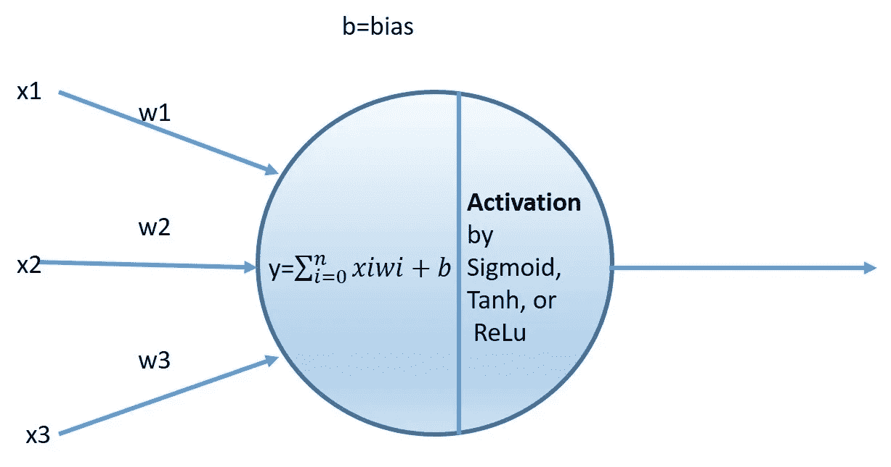
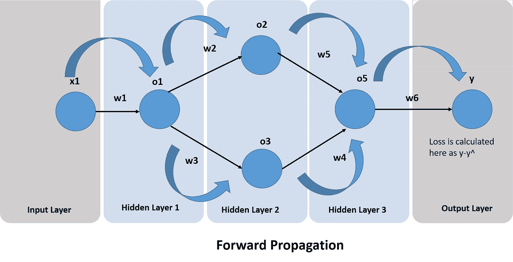
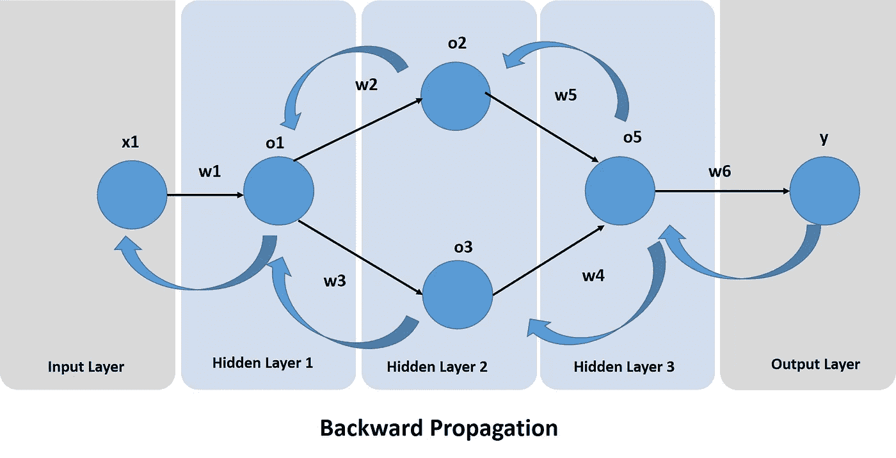
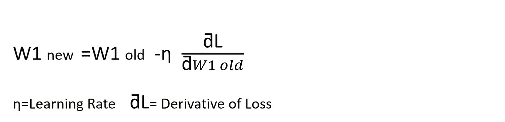
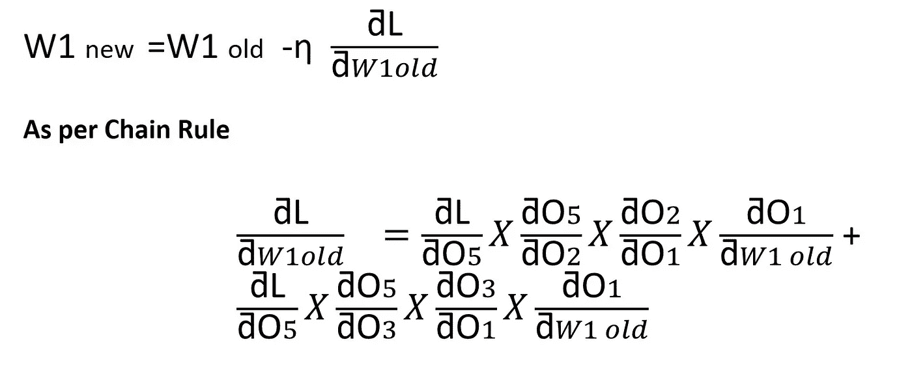
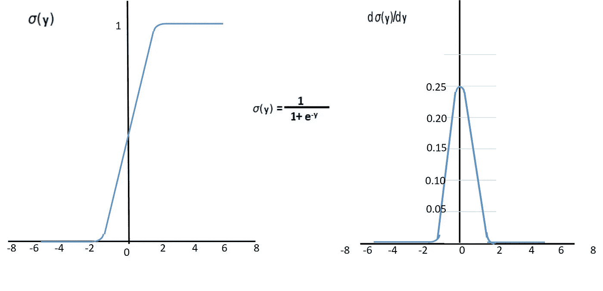
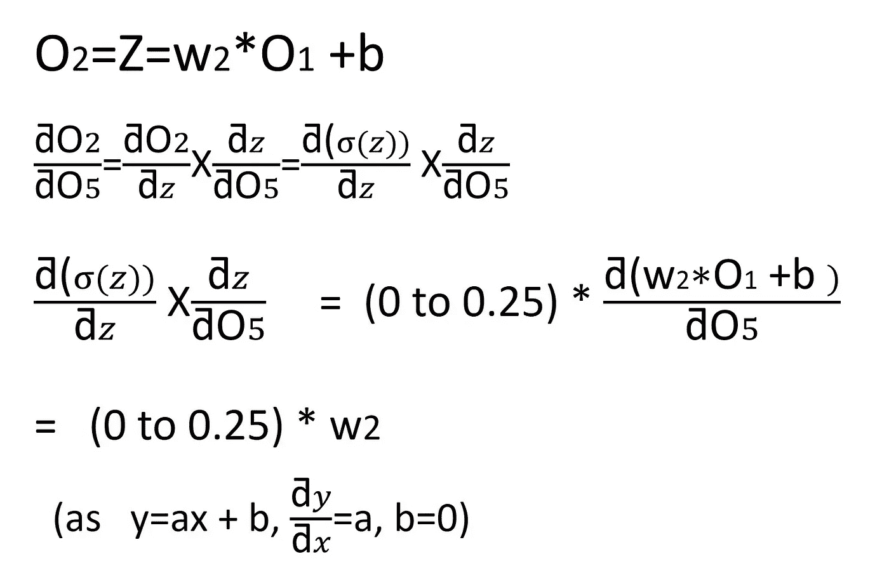
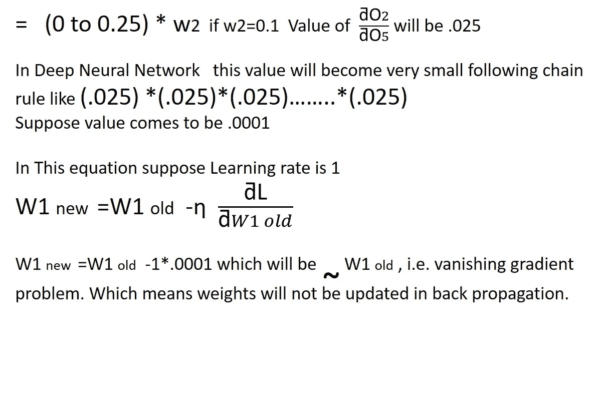
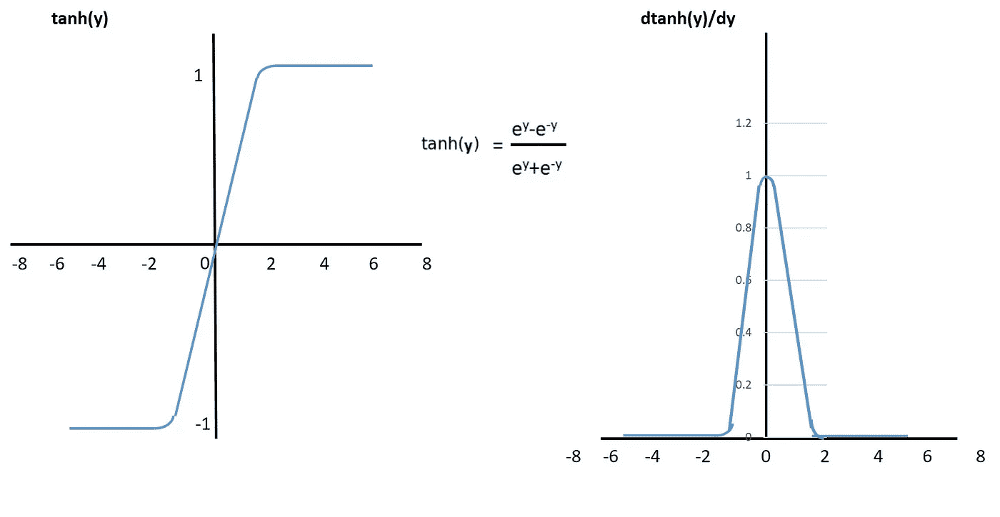

# 神经网络:其内部功能和用途

> 原文：<https://towardsdatascience.com/neural-network-its-internal-functioning-and-uses-7adc4d37f3d8?source=collection_archive---------40----------------------->

神经网络试图复制人类大脑及其神经元网络。ANN 人工神经网络由人工神经元或节点组成。人工神经网络主要用于解决人工智能(AI)问题。

当人脑从提供给它的信息中学习时，神经网络也做同样的事情。

神经元之间的连接被建模为权重。正值被称为令人兴奋的连接，而负值意味着避免连接。

一个神经元[来源](https://unsplash.com/photos/OH5BRdggi2w)

在神经网络中，工作分两步完成:

1)所有输入乘以一个权重并求和。此活动类似于线性方程，并添加一个偏差作为 b，y=∑xw+b。

2)激活函数被应用于输出，该输出决定该神经元在最终决策中是否将是激活的。例如，可接受的输出范围通常介于 0 和 1 之间，也可能是 1 和 1 或 0 或 1，具体取决于所用的激活函数，可能是 Sigmoid、tanh 或 ReLu。

作者图片

这些人工网络可用于预测建模，在数据集上进行训练。从经验中产生的自我学习可以发生在网络中，这有助于在数据集中看不到的重要问题上得出结论。

**神经网络的应用**

神经网络用于人工智能的各个领域，例如:

1)用时间序列对金融数据进行预测建模。

2)模式和序列识别中的分类。

3)聚类和过滤。

一个简单的神经网络有一个输入层，隐藏层和输出层。更复杂的神经网络或深层多层网络可以具有大量的隐藏层，在这些隐藏层中，计算具有权重和偏差的输入的乘积的总和，并且在第二步中，关于所使用的函数执行激活。

在这里，我要解释一个 3 隐藏分层网络，前向传播和反向传播。

**神经网络中的前向传播**

作者图片

在前向传播中，来自每个输入单元的输入被加载一些权重。在每个隐藏神经元层中，完成 2 个步骤:

1) x1 *w1 +b1，取权重和输入的乘积并加到偏差 b

2)激活功能应用于步骤 1 中的输出。o1=Act(x1 *w1 +b1)。

在隐藏的第 2 层中，输入将从第 1 层输出，即 o1，并且对于上层神经元，它将乘以 w2，对于下层神经元，它将乘以 w3，并且将偏置加到每一个上。

O2 = Act(O1 * w2+B2 ), O3 = Act(O1 * w3+B3)

在隐藏层 3 中，2 个输入将作为 o2 和 o3 到来，它们将分别乘以权重 w5 和 w4 并相加。

o5= Act((o2* w5 + o3*w4) +b4)

y=Act(o5*w6+b5)

考虑到预测值和实际值的简单相减，损失计算为 y-y^。

**神经网络中的反向传播**

作者图片

我们在神经网络中进行反向传播，以找到更新的权重值，这反过来有助于最小化损失。

这也是一种将反馈传播到神经网络中的方式，以了解每个节点对多少损失负责，并依次更新权重，从而通过给节点更高或更低的权重来最小化损失。

**梯度**是一种数值计算，它帮助我们知道如何调整**网络**的参数，以使其输出偏差最小化并达到全局最小值。

作者图片

原始图像[来源](https://unsplash.com/photos/XF0m9EL4AXE?utm_source=unsplash&utm_medium=referral&utm_content=creditShareLink)

用于有效训练一个**神经网络**的算法是通过**链规则**。在每次向前通过神经网络**之后，反向传播会执行一次向后传递，同时调整模型的权重和偏差。**

作者图片

**激活功能**

在人工神经网络中，节点的输出取决于激活函数，激活函数又根据所用函数的类型使节点开或关、不太活跃或更活跃。

这里我们将讨论几个最常用的激活函数，如 Sigmoid、tanh 和 ReLu。

**乙状结肠激活功能**

它是一个数学函数，具有典型的“S”形曲线或**S 形曲线**。sigmoid 函数的一个常见示例是逻辑函数。

公式如图所示。

该函数确保将神经元的输出值保持在 0 到 1 之间。

然而，它的导数范围在 0 到 0.25 之间。

作者图片

该函数可以用作不是很深的神经网络中的激活函数，即其中隐藏层的数量不是很大，因为如果层数更多，将导致消失梯度问题。

**消失梯度问题**是当等式 w1 new = w1 old-ƞƌl/("ƌw1old 中的(ƞ“ƌl”/("ƌ“w1old))的值很小时，得到的新权重几乎与旧权重相似，因此不进行权重更新。

这导致梯度下降中的值处于相同的位置，不会向全局最小值前进。

下面的等式显示了消失梯度是一个怎样的问题。

作者图片

作者图片

**Tanh 激活功能**

该激活函数具有与 sigmoid 相似的功能，其公式如下。在此函数中，输出值介于-1 到 1 之间，其导数范围为 0 到 1。

如上所述，它也有消失梯度问题，但它比 Sigmoid 好。

然而，在与非常深的神经网络一起工作时，它也开始出现问题。

作者图片

**ReLu 激活功能**

在这个函数中，输出的值是 0 或 1，这意味着它或者去激活神经元或者激活它。

它的公式很简单，如下所示。

这没有消失梯度的问题，因为数字是 0 或 1，但它可能会导致死亡的神经元。

作者图片

**结论**

我希望在读完这篇文章后，关于神经网络，它的工作以及为什么需要这些，很多事情一定是清楚的。

还有最常用的激活函数以及它们的优缺点。

这只是为了让学习者简单起见的一个概述。

感谢阅读！

*原载于 2020 年 10 月 30 日 https://www.numpyninja.com***。**