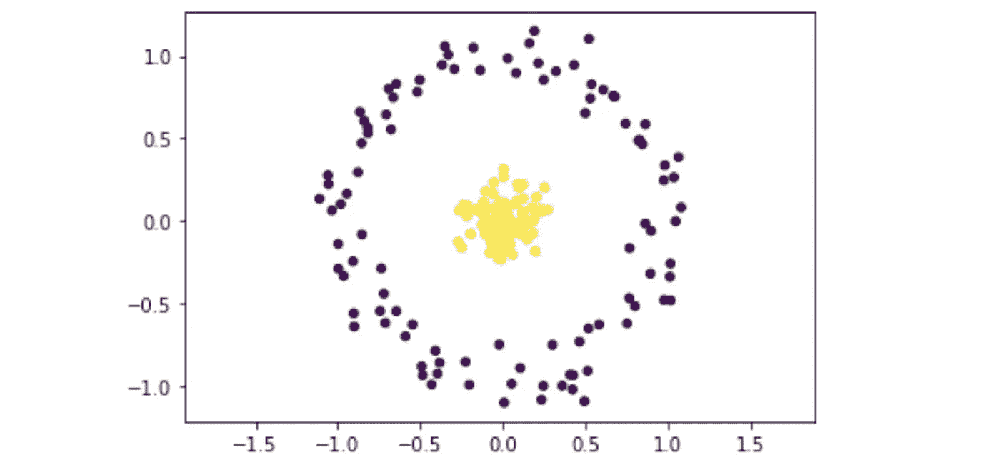
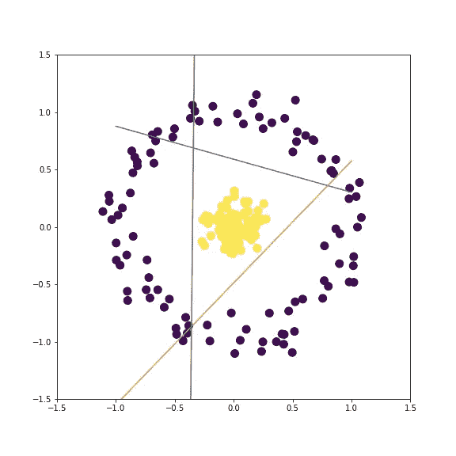
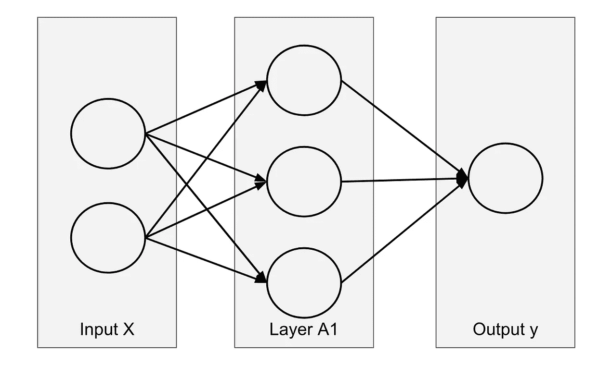
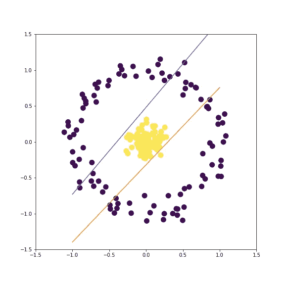
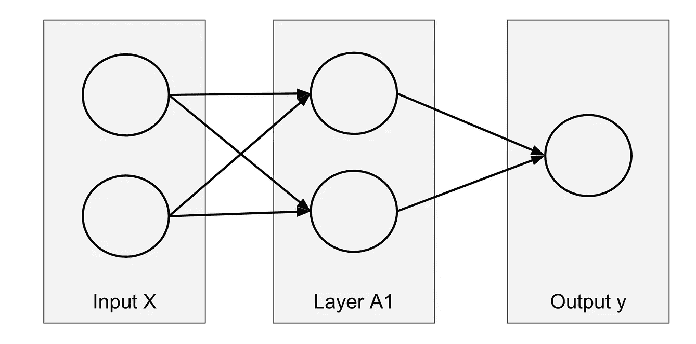
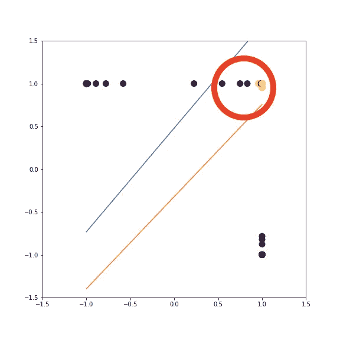

# 神经网络:为什么越深并不总是越好

> 原文：<https://towardsdatascience.com/neural-network-why-deeper-isnt-always-better-2f862f40e2c4?source=collection_archive---------39----------------------->

## 一个简单的例子来理解隐藏层如何工作

当创建神经网络时，人们不得不问:**需要多少个隐藏层**，以及**每层**需要多少个神经元？

当创建神经网络时，人们不得不问:**需要多少个隐藏层**，以及**每层**需要多少个神经元？

当涉及到复杂的真实数据时，吴恩达在 Coursera 的课程中建议: ***改进深度神经网络*** ，这是一个高度迭代的过程，因此我们必须运行许多测试来找到最佳的超参数。

但是，*隐藏层*和*神经元*如何影响最终模型背后的**直觉**是什么？


照片由 [Moritz Kindler](https://unsplash.com/@moritz_photography?utm_source=medium&utm_medium=referral) 在 [Unsplash](https://unsplash.com?utm_source=medium&utm_medium=referral) 拍摄

# 简单非线性可分数据

让我们使用 make_circles 创建一个数据集。

```
from sklearn import datasetsX,y=datasets.make_circles(n_samples=200,shuffle=True, noise=0.1,random_state=None, factor=0.1)
```

你可以将数据集可视化:

```
import matplotlib.pyplot as plt
plt.scatter(X[:, 0], X[:, 1], c=y,s=20)
plt.axis(‘equal’)
```



作者图片

# 有多少神经元和层数？

每个神经元创建一个线性决策边界。通过查看数据集，直觉是创建一个由 3 个神经元组成的层。我们应该能够创建一个完美的分类器。现在，如果只有两个神经元呢？这似乎还不够，如果我们尝试添加更多的层呢？

带着这些问题，我们试着做一些测试。

## 一个隐藏层中有 3 个神经元

如果我们使用 3 个神经元，代码如下:

```
from sklearn.neural_network import MLPClassifierclf =MLPClassifier(solver=’lbfgs’,hidden_layer_sizes(3,),
activation=”tanh”,max_iter=1000)clf.fit(X, y)
clf.score(X,y)
```

然后，我们能够在隐藏层内创建 3 个决策边界。并且我们可以注意到，创建这 3 条线有无限多种可能性(所以在这个神经网络的代价函数中有无限多种全局最小值)。



作者图片

为了创建隐藏层的决策边界的可视化，我们可以使用隐藏层的系数和截距。

```
n_neurons=3xdecseq=np.repeat(np.linspace(-1,1,100),n_neurons).reshape(-1,n_neurons)ydecseq=-(xdecseq*clf.coefs_[0][0]+clf.intercepts_[0])/clf.coefs_[0][1]
```

然后我们可以用原始数据集绘制这三条线:

```
fig, ax = plt.subplots(figsize=(8,8))ax.scatter(X[:, 0], X[:, 1], c=y,s=20)ax.plot(xdecseq[:, 0], ydecseq[:, 0])
ax.plot(xdecseq[:, 1], ydecseq[:, 1])
ax.plot(xdecseq[:, 2], ydecseq[:, 2])ax.set_xlim(-1.5, 1.5)
ax.set_ylim(-1.5, 1.5)
```

## 一个隐藏层中的两个神经元

如果我们只使用 2 个神经元，很容易看出我们将不能完美地对所有观察结果进行分类。

使用类似的代码，我们可以绘制出下图，其中包含隐藏层的两个决策边界。



作者图片

## 2 个神经元，每个神经元有许多层

如果我们在许多隐藏层中创建 2 个神经元会怎么样？为了更好地理解在第一个有 2 个神经元的隐藏层中发生了什么，我创建了这个可视化。


作者图片

> 很明显，无论你添加多少层，你都无法对下面红圈里的数据进行分类。



作者图片

可以自测一下:可以在参数 hidden_layer_sizes 中添加更多的图层。例如,( 2，3，2)表示 3 个隐藏层，每个层有 2、3 和 2 个神经元。

```
from sklearn.neural_network import MLPClassifierclf = MLPClassifier(solver=’lbfgs’,
hidden_layer_sizes=(2,3,2),
activation=”tanh”,max_iter=1000)clf.fit(X, y)
clf.score(X,y)
```

# 结论

从这个简单的例子中，我们可以用这个*直觉*来结束:

*   第一个隐藏层中神经元的数量创建尽可能多的线性决策边界来对原始数据进行分类。
*   如果第一层不包含必要数量的神经元，那么(理论上)创建更深的神经网络是没有帮助的。

如果想看其他动画了解神经网络是如何工作的，也可以看看这篇文章。

[](/animations-of-neural-networks-transforming-data-42005e8fffd9) [## 神经网络转换数据的动画

### 我们可以对神经网络为什么以及如何工作有更好的直觉

towardsdatascience.com](/animations-of-neural-networks-transforming-data-42005e8fffd9)