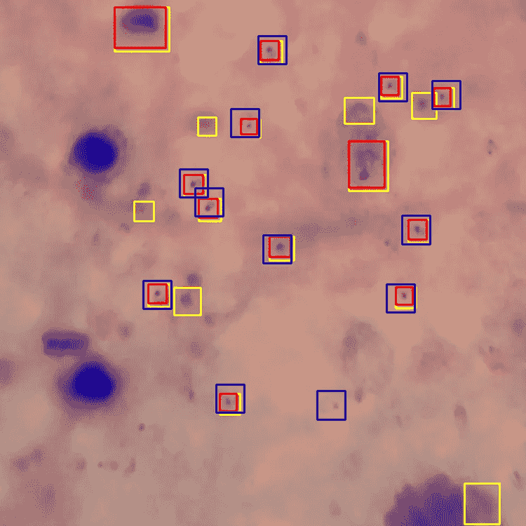

# 神经网络和疟疾

> 原文：<https://towardsdatascience.com/neural-networks-and-malaria-520a5b7fb6ed?source=collection_archive---------91----------------------->

## 生殖敌对网络和蚊子有什么关系

学分像素海湾

本文在简要回顾了疟疾和生殖神经网络(GANs)之后。我们深入研究了神经网络在血液涂片中检测疟疾疟原虫的可能应用，以及如何使用 GANs 生成用于人类训练和数据增强的合成血液涂片图像。特别地，所使用的架构的细节被讨论为上采样和 TensorLayer 的使用，而不是 Keras。

今年的特点是新冠肺炎和疫情。然而，在南半球*疟疾*造成的死亡人数超过了新冠肺炎，即使它没有造成死亡，它也代表着人们在失去工作天数或其他机会方面的负担([世卫组织 2018–2020](https://www.who.int/news-room/fact-sheets/detail/malaria))。

[**疟疾**](https://en.wikipedia.org/wiki/Malaria) 是一种蚊子传播的疾病，如果不治疗，会导致发烧、疲劳、头痛，最终死亡。根除疟疾在一些国家已经成为可能，但在大多数低收入国家却很麻烦。可以比喻为一个人减肥。不存在一个普遍的模式，每个国家都有自己的问题，由于基础设施、环境和其他因素，在一个国家行得通的方法在另一个国家可能行不通。在应对疟疾的方法中，早期诊断发挥着关键作用。最常见的诊断方法仍然是显微镜检查，这仅限于研究者的经验，研究者之间的协变性也是存在的( [Zimmerman et al. 2015](https://journals.lww.com/co-infectiousdiseases/Fulltext/2015/10000/Malaria_diagnosis_for_malaria_elimination.7.aspx) )。其他方法有快速检测(RDT)和聚合酶链反应(PCR)。RDT 价格低廉，但当寄生虫数量高于 50，000–200，000/mL 全血时，可以检测出疾病。基于 PCR 的测试是最准确的，因为它们甚至可以在血液中少于 1000 个寄生虫/mL 的情况下诊断病情，但是它需要非常有经验的人员。因此，在低收入国家，主要的实际应用仍然是显微镜血液涂片分析。血液涂片是通过在手指上切一个小口，然后在载玻片上使用染色剂来表征疟原虫的存在而获得的。涂片也可以是“厚的”或“薄的”，这取决于血滴是否在载玻片上扩散。厚血涂片主要用于检测寄生虫的存在，因为它们检查更大的血液样本。血液在载玻片上扩散的薄涂片允许分析更少的血液，但导致更高的准确性，并允许区分寄生虫菌株。

深度学习在组织病理学图像分析中的应用正在彻底改变该领域，通过以高准确度评估疾病进展，提供在从癌症分析到免疫疾病( [Niazi et al. 2019)](https://www.thelancet.com/journals/lanonc/article/PIIS1470-2045(19)30154-8/fulltext) 的多个领域中有效的定量模型。此外，人们相信人工智能将把数字病理学扩展到远远超出今天可能达到的程度。关于疟疾和光幕显微术，过去已经有了几种方法。一般来说，他们专注于背景-前景减法、特征提取，以及通过支持向量机(SVM)或随机森林( [Das et al. 2013](https://www.sciencedirect.com/science/article/pii/S0968432812002594?casa_token=Aaf6m3P4ZWEAAAAA:IBQLI41cig6hy_07sU_DVQDP87hRF6udAu5wFumfno3Bj7W7Nx70p-8WSCnnmyiS4P8f8KpqJ3M) )的进一步分类。在深度学习时代，已经研究了几种架构([董等 2017)](https://ieeexplore.ieee.org/abstract/document/7897215)

事实上，如下所示，通过使用深度学习库，如 Tensorflow 和重新训练的 VGG，即使只使用 10 个样本进行训练，也有可能获得 0.9 的曲线下面积的良好结果:

来自 Makere 大学的厚涂片图像，由 Rija Ramarolahy 分割(参见 Ramarolahy 和克里米)

生成式广告网络是一种特殊的架构，它可以生成数据，而不仅仅是对数据进行分类。解释它们最简单的方法是考虑两个相互竞争的系统:一个*发生器*和一个*鉴别器。他们可以被看作是骗子印刷假币和银行职员检查验证货币，前者试图创造最真实的假币，后者更善于区分假币和真币。GANs 架构已经达到了令人难以置信的精确水平(瓦罐肯定会赢)。下图显示了名为 [BigGAN](https://arxiv.org/abs/1809.11096) 的 GAN 架构的结果，该架构的初始得分(IS)为 166.3。*

[比根生成的合成图片](https://arxiv.org/abs/1809.11096)

在病理学中使用 GANs 的动机是与数据扩充相关的两个主要因素:1)为病理学家学习研究中图像的可能变化提供可变性，2)允许更好的迁移学习以增加更多图像。因此，一个完整的深度学习工具应该包括鉴别器和生成器部分，以使鉴别器也受益( [van Eyke et al. 2019](https://www.frontiersin.org/articles/10.3389/fmed.2019.00222/full) )。

我们使用传统的深度卷积架构如下。

典型的 DCGAN 架构【https://arxiv.org/abs/1511.06434 

这些是生成器的 1000 次迭代，创建与顶部真实图像相似的图像(输出 256x256 像素)

我们遇到了 GAN 生成图像的典型困难。首先，由于鉴别器的收敛速度比发生器快，通常很难产生真实的图像。一种解决方案是给出较小的学习率，例如(学习率鉴别器 0.00001 和生成器 0.0002)，替代的技巧包括使用软标签来促进生成器的收敛。

一个更重要的细节是如何执行扩展步骤，因为可能会出现典型的棋盘伪影。所采用的解决方案是简单地切换出标准去卷积层，用于最近邻尺寸调整，随后卷积导致不同频率的伪像消失([萨利曼等人，2016](http://papers.nips.cc/paper/6125-improved-techniques-for-training-gans.pdf) )。

这些视频展示了使用 GAN 的结果

去卷积(上)和最近邻调整大小(下)生成一个受疟疾疟原虫感染的单细胞。最近邻调整大小在质量上有明显的影响。

此外，建议的架构是使用 [TensorLayer](https://tensorlayer.readthedocs.io/en/latest/) 作为 Keras 的替代方案来实现的。Keras 是一个构建在 Theano 或 TensorFlow 之上的高级库。关键思想是通过快速原型化来促进实验，而不特别偏好特定的库，它被认为是 TensorFlow 的可靠抽象。因此，Keras 可能是最容易的选择。然而，Keras 在 TensorFlow 后端相对较低的性能不时被其用户提及，这可能与 Keras 最初为 Theano 设计有关。

因此，TensorLayer 与最近(2016 年)发布的 Keras 相比更加透明，因为它是直接为 TensorFlow 构建的，但目前其社区相对较小。下面显示了使用 TensorLayer 的代码片段

完整使用的代码可在[https://github . com/Alec rimi/malaria _ detection _ and _ generation](https://github.com/alecrimi/malaria_detection_and_generation)上获得

总之，数字病理学是一个新兴领域，它强烈使用深度学习和人工神经网络来检测血液涂片中的疟原虫。在这篇文章中，还显示了 GANs 可用于生成看起来逼真的合成感染血液涂片，并可用于增加关于病原体如何不同地出现的人类训练，以及用于进一步数据分析的数据扩充。此外，将来 GANs 可能会教给我们一些我们从组织学/病理学中所不知道的东西。我们正在努力使低收入国家也能获得这种服务。这是一个视频演示:

# 想连接就连接

[@ Dr _ Alex _ 克里米](https://twitter.com/Dr_Alex_Crimi)

[@阿列克里米博士](https://www.instagram.com/dr.alecrimi/)

[https://www.linkedin.com/in/alecrimi/](https://www.linkedin.com/in/alecrimi/)