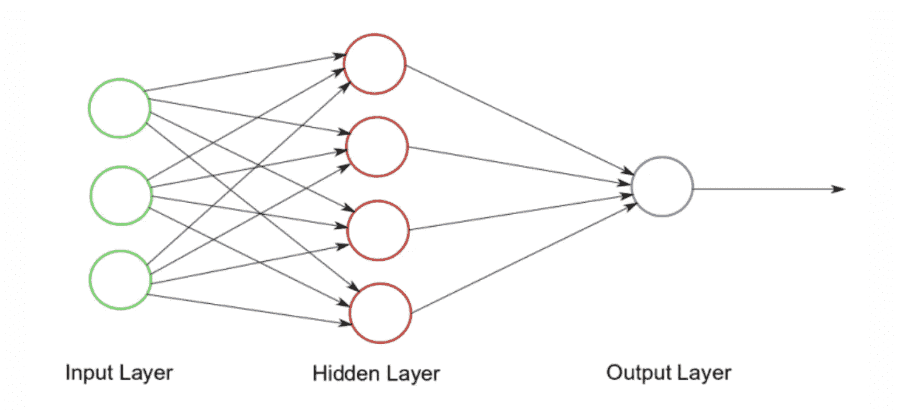
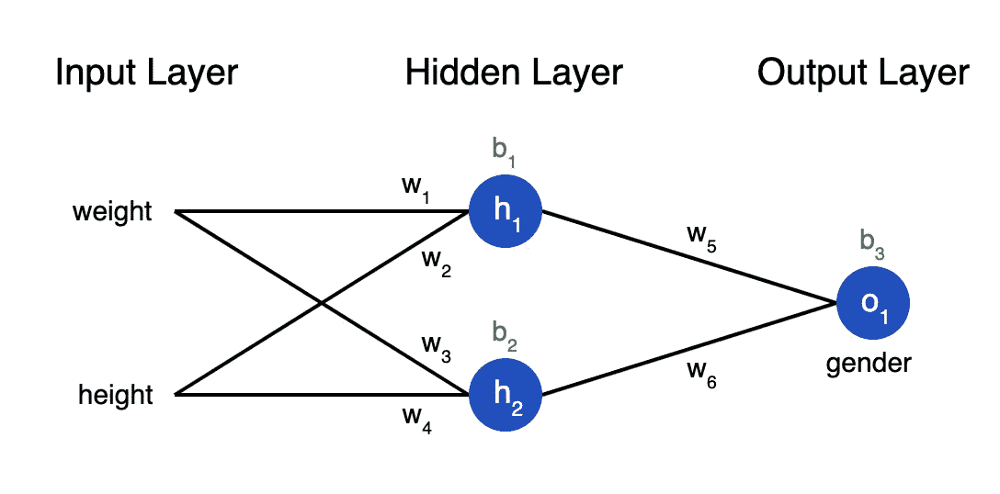
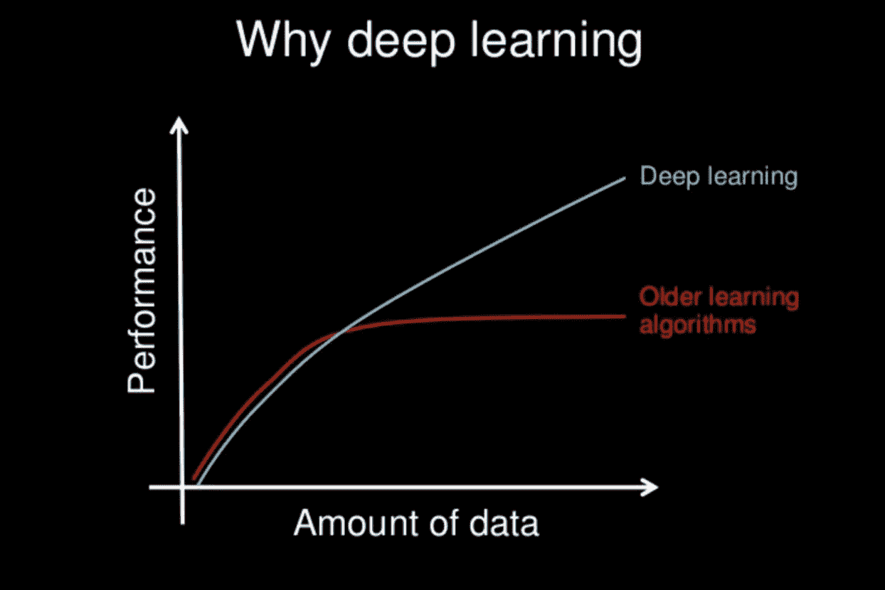

# 神经网络和通用逼近定理

> 原文：<https://towardsdatascience.com/neural-networks-and-the-universal-approximation-theorem-8a389a33d30a?source=collection_archive---------6----------------------->

## 以及最近深度神经网络的繁荣

Alex Kotliarskyi 在 [Unsplash](https://unsplash.com?utm_source=medium&utm_medium=referral) 上的照片

神经网络的概念已经存在了几十年。为什么要花这么长时间来加快步伐？神经网络和深度学习创造的这种突然繁荣是什么？是什么让神经网络如此值得炒作？我们来探索一下。

[神经网络的架构](https://www.kdnuggets.com/2017/10/neural-network-foundations-explained-gradient-descent.html)

为了得到什么是神经网络的简要概述，神经网络仅仅是神经元(也称为激活)的集合，这些神经元通过不同的层连接。在提供训练集的情况下，它试图学习输入数据到输出数据的映射。

神经网络的 ***训练*** 之后便于其对同一分布的测试数据进行预测。这种映射是通过分布在不同层上的一组称为 ***权重*** 的可训练参数来实现的。权重是由目的是最小化损失函数的[反向传播算法](http://neuralnetworksanddeeplearning.com/chap2.html)学习的*。损失函数测量网络所做的预测与实际值有多远*。神经网络中的每一层后面都有一个激活层，它对神经元执行一些额外的操作。**

## **通用逼近定理**

**从数学上讲，任何神经网络架构都是以寻找任何能够将属性(x)映射到输出(y)的数学函数 y= f(x)为目标。该函数(即映射)的准确性取决于数据集的分布和所采用的网络架构。函数 f(x)可以是任意复杂的。普适逼近定理告诉我们，神经网络有一种 ***普适性*** 即无论 f(x)是什么，都有一个网络可以近似逼近结果并完成工作！这个结果适用于任何数量的输入和输出。**

****

**[图像来源](https://victorzhou.com/blog/intro-to-neural-networks/)**

**如果我们观察上面的神经网络，考虑到作为身高和宽度提供的输入属性，我们的工作就是预测这个人的性别。如果我们从上述网络中排除所有激活层，我们认识到 h₁是重量和高度与参数 w₁、w₂和偏差项 b₁.的线性函数因此从数学上来说，**

**h₁ = w₁*weight + w₂*height + b₁**

**类似地，**

**h2 = w₃*weight + w₄*height + b₂**

**沿着这些思路，我们认识到 o1 也是 h₁和 h2 的线性函数，因此也线性依赖于输入属性体重和身高。这本质上归结为一个[线性回归](https://www.statisticssolutions.com/what-is-linear-regression/)模型。一个线性函数足以逼近通用逼近定理吗？答案是否定的。这就是激活层发挥作用的地方。**

**激活层紧接在神经网络中的线性层之后，以提供非线性。非线性有助于神经网络执行更复杂的任务。激活层对激活(h₁，在这种情况下是 h2)进行操作，并根据为该特定激活层提供的[激活函数](https://missinglink.ai/guides/neural-network-concepts/7-types-neural-network-activation-functions-right/)修改它们。激活函数通常是非线性的，除了[身份函数](https://openreview.net/pdf?id=ryxB0Rtxx)。一些常用的激活函数有 [ReLu](https://machinelearningmastery.com/rectified-linear-activation-function-for-deep-learning-neural-networks/) 、 [sigmoid](https://en.wikipedia.org/wiki/Sigmoid_function) 、 [softmax](https://en.wikipedia.org/wiki/Softmax_function) 等。随着非线性和线性项的引入，对于神经网络来说，在这种情况下，在具有适当的 parameters(w₁、w₂、b₁等的基础上近似地模拟任何给定的函数成为可能。参数适当地收敛到*适当性*。你可以从[这里](https://arxiv.org/pdf/2004.08867.pdf)更好地了解数学上的通用逼近定理。**

> **神经网络具有映射复杂函数的能力，并且永远是纸上谈兵。是什么让它突然成了机器学习的神童？**

## **繁荣**

**最近对深度学习模型的兴趣爆发归功于当今世界提供的高计算资源和丰富的数据。深度神经网络是数据饥渴模型。这种繁荣也主要归功于普通人手中的廉价高速计算。这种前所未有的数据增长和计算能力几乎在生活的所有领域创造了奇迹。**

**深度学习模型被坚定地认为可以自动从原始数据中提取特征，这一概念也被称为特征学习。无论你向一个足够大和足够深的神经网络输入什么，它都可以学习隐藏的特征和属性之间的关系，然后利用这些关系来预测结果。这非常方便，只需要最少的数据预处理。与此同时，用于设计和构建这些数据驱动模型的工具和框架(PyTorch、Tensorflow、Theano)与日俱增，水平相当高，并且很容易获得。它们要求对编程语言有一个微不足道的低级理解。最重要的是，顶级公司的研究证明，这个领域确实值得花费宝贵的时间和金钱。**

****

**[用数据缩放的模型](https://machinelearningmastery.com/what-is-deep-learning/)**

**深度学习模型确实可以随着数据进行扩展，这一点备受好评。这表明，随着数据的增加和采用更大的模型，结果几乎总是会变得更好。这些更大的模型需要更多的计算来训练。随着如今易于访问的有益计算环境的出现，实时实验和改进算法和架构变得更加容易，从而在短时间内产生越来越好的实践。也就是说，深度神经网络在许多领域都有广泛的应用，如计算机视觉、自然语言处理、推荐系统等等。各种跨领域的应用程序最近也加快了步伐。**

**2019 年 10 月，谷歌公布了其 54 量子位处理器“Sycamore”的量子优势实验结果。量子计算机在 200 秒内完成目标计算，这对世界上最快的超级计算机来说需要大约 1 万年。随着计算能力的日益增长，不知道机器学习何时会超越超人的界限。人们只能推测。**