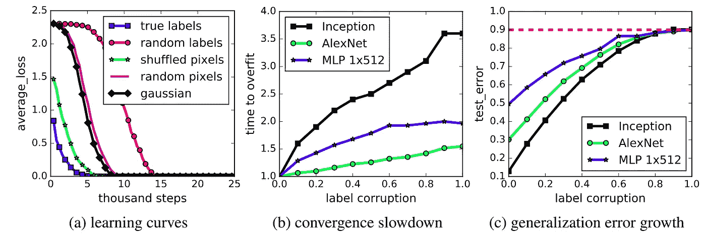
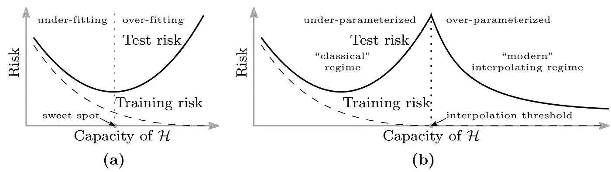

# 神经网络不会像你认为的那样进行归纳

> 原文：<https://towardsdatascience.com/neural-networks-dont-generalize-the-way-you-think-they-do-de520bed2053?source=collection_archive---------21----------------------->

来源: [Unsplash](https://unsplash.com/photos/sWlDOWk0Jp8)

## 彩票假说

神经网络是如何学习的？

或者，更具体地说:

神经网络究竟是如何对如此多的参数进行归纳的？

这是一个很好——看似简单——但大多数人都认为理所当然的问题。一个简单的神经网络可以有几千到几万个参数。每个额外的参数提供了额外的自由度，极大地增加了搜索空间。

> 除了必要的以外，我们不应该增加解释任何事物所需的实体的数量。
> - [奥卡姆剃刀](http://pespmc1.vub.ac.be/OCCAMRAZ.html)

众所周知——也是直觉——添加更多的参数可以让模型进一步记住数据点，而不是找到概括。有这么多参数，在数据集上训练的神经网络肯定会采取简单的方法，而不是学习。

人们可能会认为，对于完全随机的标签，一般化的算法会花费更多的时间或更少的成功(想象一下，如果你被告知学习识别带有完全随机标签的图像)。

令人惊讶的是，事实并非如此。

在这篇论文的[中，研究人员证明了神经网络可以在完全随机的标签上获得完美的训练分数——而所需的训练时间相同。如果它愿意，神经网络(一个标准的初始架构)可以存储整个数据集(所有的 CIFAR-10)。](https://arxiv.org/pdf/1611.03530.pdf)

a)在各种实验设置上的性能，如随机标签、混洗像素、添加高斯噪声等。b)显示了不同标签损坏率的相对收敛时间。c)具有不同标签损坏率的测试误差(一般化误差，因为测试误差为 0)。来源:[张等](https://arxiv.org/pdf/1611.03530.pdf)。

不知何故，神经网络在训练集和测试集中产生非常相似的结果。有一个标准的答案:以辍学或 L1/L2 的形式出现的正规化提高了普遍性。

由张等人进行的上述相同研究表明，通过常用方法(如数据扩充、权重衰减和剔除)进行的明确调节并不能减少泛化误差。

在下面的示例中，初始模型是在 CIFAR-10 数据集上训练的，正则化(特别是随机作物数据扩充)有助于提高准确性，但提高幅度不大。

来源:[张等](https://arxiv.org/abs/1611.03530)

如果是这样的话——没有正则化的模型并不比正则化的模型表现差多少——我们怎么能说正则化是泛化的基础呢？

此外，如果不是，那么神经网络是如何学习的？

一个答案可能来自神经网络修剪。

随着深度学习变得更加实用，神经网络修剪越来越受到关注。神经网络的大小可以减少五分之五，预测时间减少三分之二，精确度下降 1.2%(此处为)。在更多的工程设计下，有可能移除更多的网络——90%甚至 99%——而不会遭受性能损失。

如果网络的绝大部分贡献了性能增益的一小部分，那么它到底在做什么？监控任何神经网络的权重将显示它们不仅仅是被动的——它们几乎总是异常活跃。

一个答案是[彩票假说](https://arxiv.org/pdf/1803.03635.pdf)，它指出:

> 一个随机初始化的密集神经网络包含一个子网络，该子网络被初始化为当被隔离训练时，它可以在最多相同次数的迭代训练后匹配原始网络的测试精度。

换句话说，神经网络是一个巨大的包裹，里面有微小的产品和大量的填充物。绝大部分价值存在于网络的一小部分——子网中。这篇论文的作者将这些子网称为赢得“初始化彩票”的“中奖彩票”:它们的初始权重值正确，可以促进重要的增长。

然后，解释神经网络如何概括的一种方法是，实际的预测内容占用非常小的空间，但较大的神经网络运行较大的初始化彩票，找到强大子网的机会较高。

也许最重要的问题是:当我们知道神经网络足够好的时候，我们为什么要关心它们为什么要学习呢？

最明显的是，如果我们错误地将神经网络的过度参数化归因于更多的能力，我们正在占用比实际需要多得多的计算能力。如果更大的网络只是为了运行大型初始化实验，显然有更有效的方法来完成这项任务。

神经网络已经被接受为黑盒算法，只是工作时间太长了。如果理解了神经网络的工作方式和原因，深度学习的研究，特别是架构的构建和进一步开发，将会大大加快。

> 令人惊讶的是，从传统统计学习理论的角度来看，DNNs 在实践中推广得非常好，即使没有显式的正则化。这就提出了一个合适的框架来理解 DNNs 的一般化的问题。
> [*——深度学习中带参数个数的泛化的标度描述，盖格等*](https://arxiv.org/pdf/1901.01608.pdf)

在神经网络中，过度拟合的迹象，如训练精度为 100%，可能伴随着类似的高测试精度。这违背了经典机器学习的基本法则。

最近的论文[如本文](https://arxiv.org/pdf/1812.11118.pdf)探索了高度参数化模型表现不同的可能性，以及我们需要在深度学习中以不同的方式处理泛化和学习的概念。

偏差-方差权衡只是故事的一部分吗？来源:[贝尔金等人](https://arxiv.org/pdf/1812.11118.pdf)。图片免费分享。

即使围绕深度学习有这么多令人兴奋和慌乱的研究，但它在学习方面的成功并没有普遍的理论，而不仅仅是在建模方面(这可以用[通用逼近定理](https://medium.com/analytics-vidhya/you-dont-understand-neural-networks-until-you-understand-the-universal-approximation-theorem-85b3e7677126?source=your_stories_page-------------------------------------)来解释)。然而，彩票假说是理解这一点的重要一步。