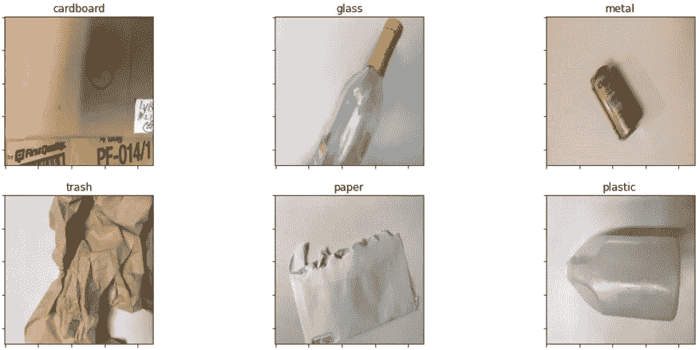
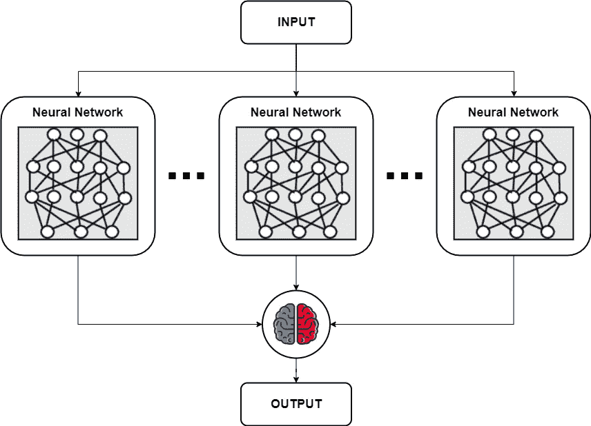
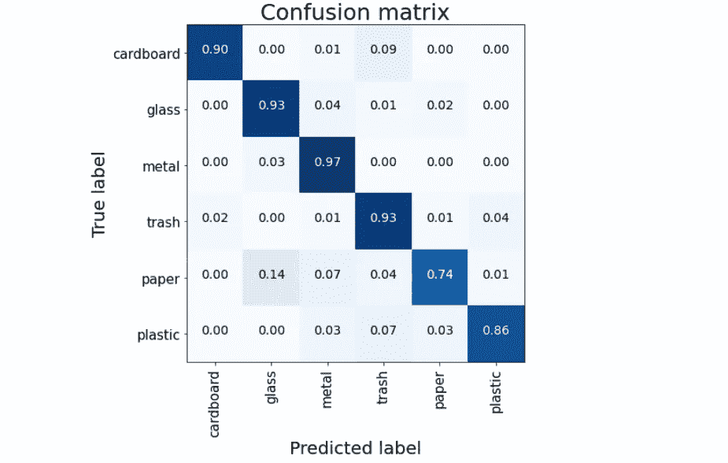
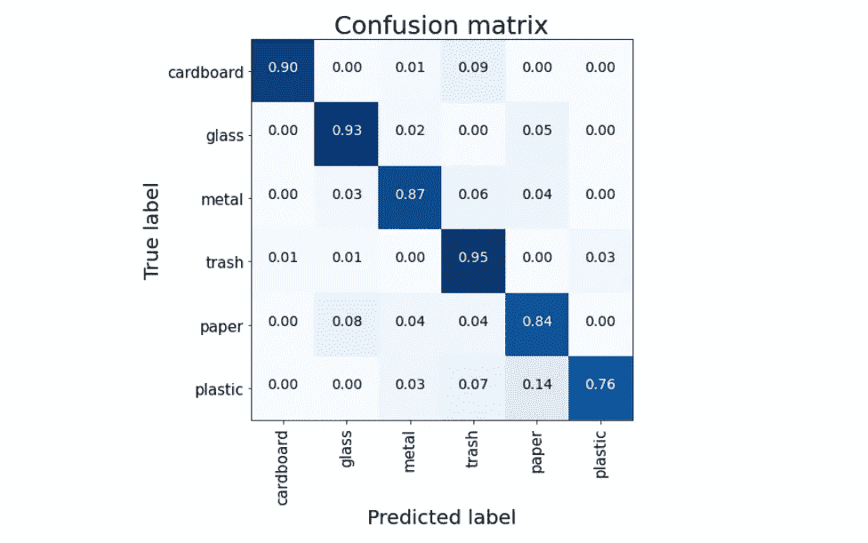
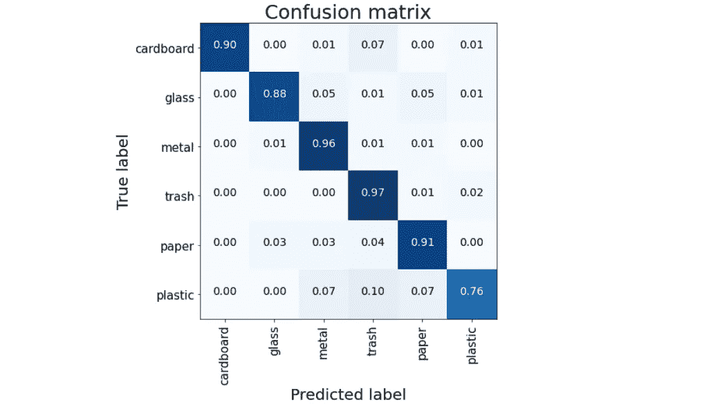

# 神经网络集成

> 原文：<https://towardsdatascience.com/neural-networks-ensemble-33f33bea7df3?source=collection_archive---------10----------------------->

## 结合深度学习模型的不同方法

诺亚·罗森菲尔德在 [Unsplash](https://unsplash.com?utm_source=medium&utm_medium=referral) 上的照片

“*集合*的概念在机器学习中很常见。不同的算法建立在这个机制上。仅举最著名的例子，随机森林用来组合可变数量的决策树。一般来说，集成可以被认为是一种学习技术，其中许多模型被结合起来解决一个问题。这样做是因为集成往往比单个执行得更好，提高了泛化能力。

合奏的方式没有任何限制。考虑的模型的数量和类型也是如此。要记住的习惯是选择低偏差和高方差的元件。这是可能的，只需选择具有多样化结构和格式的模型。

在这篇文章中，我们将集成机制应用于神经网络领域。更准确地说，我们提出了有效组合深度学习结构的各种方法。我们在图像分类领域举了一个例子，在这个领域中经常会遇到非常深的模型。同样的推理和过程也可以很容易地翻译成其他应用程序。

# 数据

我们从 Kaggle 收集数据。[垃圾分类数据集](https://www.kaggle.com/andreasantoro/split-garbage-dataset)包含 6 种分类:纸板、玻璃、金属、纸张、塑料和垃圾。还提供了对训练、验证和测试的划分。

每个班级的数据样本

我们的目标是尝试按照神经网络集成方法对我们的图像进行正确分类。更详细地说，我们提出 3 种不同的方法。我们所有的方法都遵循相同的结构，如下图所示。

有 N 个网络分类器，它们以不同的方式组合在顶部。在这个例子中，我们选择 3 个不同的分类器进行集成。它们是在不同数据集上预先训练的模型，但我们在任务中会重复使用它们。众所周知，这是图像分类领域的一种常见方法，其中大型模型适用于非常庞大的数据集，以便冻结它们的知识并将其重新导入其他场景。迁移学习的优点正是在正确的方向上初始化我们的新训练，适应先前学习的信息以获得更好的结果。这可以对我们的特定数据进行微调。在我们的上下文中，当我们合并 N 个系综组件时，我们对它们应用微调来操作系综。

在提出的所有方法中，我们使用 VGG16、VGG19 和 RESNET50 作为基本模型来操作系综。我们对它们进行微调，允许在它们各自的最后卷积块上进行重新训练。集合在 2D 维度上操作。我们从 3D 过渡到 2D 经营全球联营。对于通过具有固定维数的密集层中的汇集输出的所有网络，维数是相等的。

# 拼接系综

串联是合并不同数据源的最常见技术。串联系综接收不同的输入，不管它们的维度是什么，并且在给定的轴上串联它们。并排附加信息的缺点可能是维数爆炸。系综中的网络越多或越大，密集维度就越大，连接的输出就越大。这种操作可能是分散的，不允许网络的最后部分学习重要信息或导致过拟合。

我们的串联系综在测试数据上达到了 89%的准确率。

# 平均系综

平均系综可以被视为级联操作的相反。我们网络的汇集输出通过具有固定数量神经元的密集层，以使它们均衡。这样，我们可以计算平均值。结果是输出共享每个输入的相同维度，但这是它们的平均值。可以直观地理解，这种方法的缺点是平均运算的性质会导致信息丢失。

我们的平均系综在测试数据上达到了 89%的准确率。

# 加权系综

加权系综是一种特殊形式的平均运算，其中张量输出乘以权重，然后线性组合。来自我们模型的每个输入都被赋予一个权重。这些权重决定了每个模型对最终结果的贡献。特殊性在于**这些权重不是固定的，也不是预先设定的，但是它们的值可以在训练过程中进行优化**。唯一的约束是权重的总和必须为 1，但这很容易通过对它们应用 softmax 来实现。利用这种类型的集成，我们还可以通过提取集成权重来检索每个模型的贡献。

我们的加权集成在测试数据上达到了 89%的准确率。

# 摘要

在这篇文章中，我们介绍了一些类型的神经网络集成技术。最大的潜力是可以很容易地用其他操作来扩展它们。我们还将它们应用于分类问题的大型模型，但是没有什么可以阻止我们将它们应用于我们的定制模型场景中。我们还在微调操作过程中开发系综，但此处程序也可分为子任务。所有这些方法的最大好处是增加多样化，以便建立能够更好地概括的模型。

[**查看我的 GITHUB 回购**](https://github.com/cerlymarco/MEDIUM_NoteBook)

保持联系: [Linkedin](https://www.linkedin.com/in/marco-cerliani-b0bba714b/)