# 神经网络:你想知道的一切

> 原文：<https://towardsdatascience.com/neural-networks-everything-you-wanted-to-know-327b78b730ab?source=collection_archive---------23----------------------->

## 学习深度学习模型核心背后的数学！

图片来自 [Unsplash](https://unsplash.com/photos/so1L3jsdD3Y)

# 介绍

这篇文章的目标是:

*   简要介绍什么是神经网络以及它们是如何工作的
*   对他们如何学习做出详细的数学解释

# 神经网络

一般来说，神经网络是一种逼近函数的方法。遵循通用近似定理:

> 具有单个隐藏层的神经网络足以表示给定值范围内的任何函数，尽管隐藏层可能太大以至于不可能实现或者不可能找到适当的权重。

如果我们考虑到正常情况下你能想到的任何问题都可以以数学函数的形式分解和建模，根据这个定理，神经网络应该可以解决任何问题，对吗？

神经网络有两个主要限制:

*   它们只能逼近连续函数
*   并且在一定的数值范围内

粗略地说，有了神经网络，我们可以检测模式，并用它们来解决问题。此外，通过深度神经网络，我们可以转换数据空间，直到我们找到一种有助于实现所需任务的表示。

他们将执行类似于下图所示的操作:

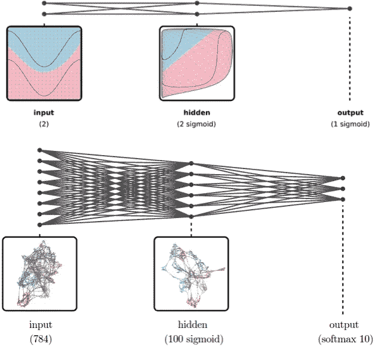

按作者分列的数字

基本上，它们将输入数据转换为其他空间表示，以便能够以更简单的方式区分它。

下面的例子很有代表性:

如果我们试图用线性分类器来解决以下数据集的分类问题，这将非常困难，因为数据点不是线性可分的。

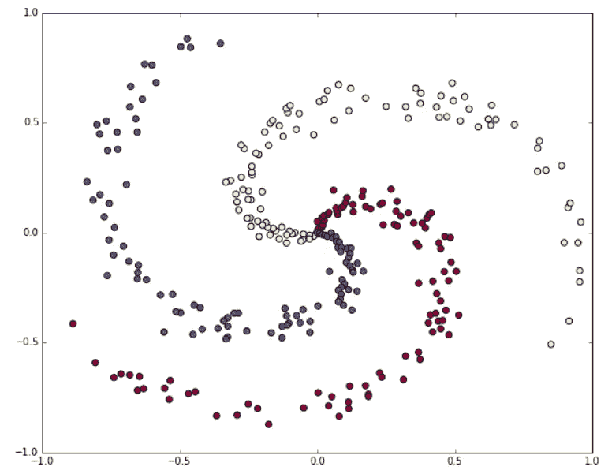

按作者分列的数字

我们将获得类似于以下内容的内容:

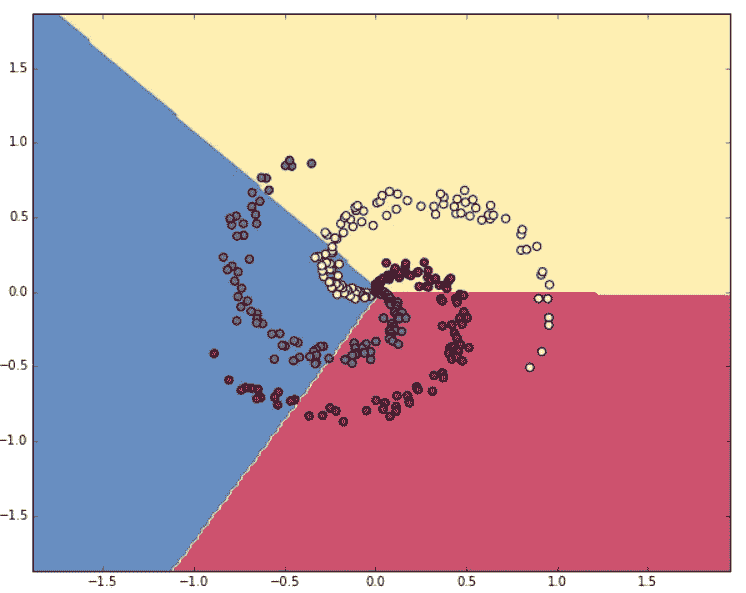

按作者分列的数字

但正如我们所看到的，它并不太好。你想看看神经网络的能力吗？

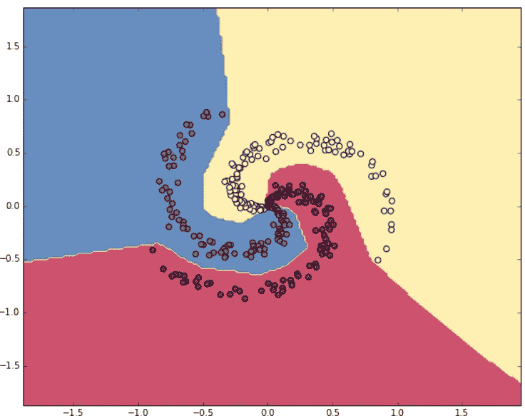

按作者分列的数字

这看起来好多了。)

## 神经网络不能做的事情

神经网络不能给出问题的精确解。例如，神经网络很难实现简单的乘法运算。

*   首先，因为我们需要它的精确值。
*   第二，因为我们之前说过，它们能够在给定的范围内逼近函数。乘法需要[-inf，+inf]的范围。

此外，他们也不能“思考”。他们只是非常强大的模式检测器，给人以智能的感觉，但他们没有。我们必须自己提供情报。

我们还必须考虑到，虽然它们非常有用，因为它们解决了迄今为止对计算机来说非常复杂的问题，例如检测不同类型的狗品种或交通标志，但很难从中提取知识。

换句话说，他们有能力做我们要求他们做的事情，但是很难发现他们到底是怎么做的。

# 神经网络是如何学习的？

基本上，神经网络的学习过程类似于人类的学习。他们通过重复学习。

他们看到一些东西，猜测是什么，其他代理告诉他们是否正确。如果他们错了，他们会调整自己的知识，避免重蹈覆辙。

## 让我们看一个具体的例子

你可能知道，神经网络是由层组成的，而层又是由神经元组成的。

在这个链接中可以看到完整的例子:[https://mattmazur . com/2015/03/17/a-逐步-反向传播-示例/](https://mattmazur.com/2015/03/17/a-step-by-step-backpropagation-example/)

在下图中，我们可以看到一个前馈型网络，其 iput 层由 2 个神经元组成，隐藏层由 2 个神经元组成，输出层由另外 2 个神经元组成。另外，隐藏层和输出层也有偏差。

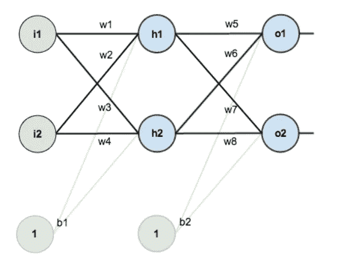

[https://mattmazur . com/2015/03/17/a-逐步-反向传播-示例/](https://mattmazur.com/2015/03/17/a-step-by-step-backpropagation-example/)

还有很多架构，但这是最常用的一种。在这种类型的架构中，I 层的每个神经元都与 i+1 层的所有神经元相连接。

也就是说，一层的神经元只允许连接到下一层的神经元。这些类型的层被称为密集层或全连接层。

为了简单起见，让我们假设我们的训练集只由 1 个元素组成:0.05，0.1，这是 1 类(如果神经元 o1 的概率大于神经元 o2 的概率，则可能是 0 类，或者如果相反，则可能是 1 类)。

在下图中，您可以看到具有随机初始化的权重、输入的训练集元素和所需输出的网络:

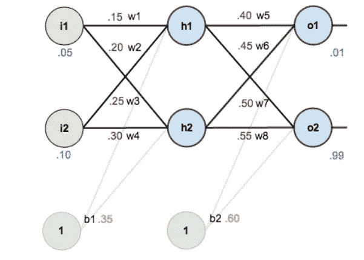

[https://mattmazur . com/2015/03/17/a-逐步-反向传播-示例/](https://mattmazur.com/2015/03/17/a-step-by-step-backpropagation-example/)

一旦我们的神经网络被定义并准备好接受训练，我们就来关注它们是如何学习的。

两种最常见的学习方法是:

*   前进传球
*   反向传播

## 前进传球

它包括用当前权重值计算网络的输出。为此，我们向网络输入我们的训练元素。

但是，首先，让我们看看神经元到底是怎样的:

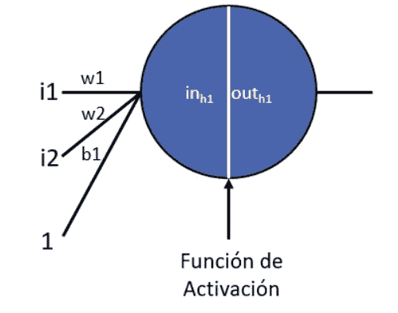

[https://towards data science . com/complete-guide-of-activation-functions-34076 e95d 044](/complete-guide-of-activation-functions-34076e95d044)

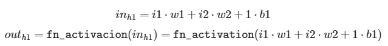

其中 **fn_activation** 是选择的 activation 函数。一些最流行的激活功能有:

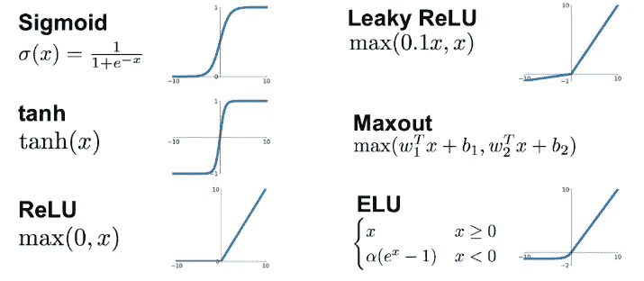

[https://towards data science . com/complete-guide-of-activation-functions-34076 e95d 044](/complete-guide-of-activation-functions-34076e95d044)

## 人工神经网络和真正的神经网络相似吗？

人工神经网络是受人脑的启发。事实上，我们有大约 100 亿个神经元，每个神经元都与其他 10，000 个神经元相互连接。

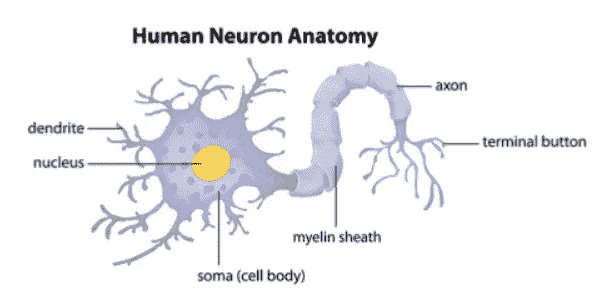

[https://training . seer . cancer . gov/anatomy/neural/tissue . html](https://training.seer.cancer.gov/anatomy/nervous/tissue.html)

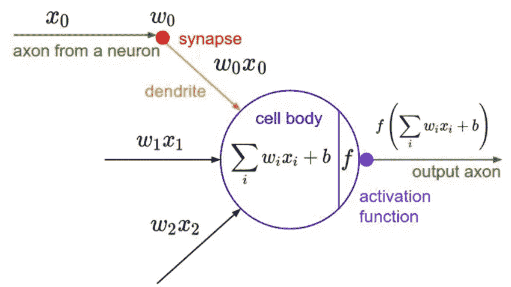

[https://mattmazur . com/2015/03/17/a-逐步-反向传播-示例/](https://mattmazur.com/2015/03/17/a-step-by-step-backpropagation-example/)

神经元的身体称为**胞体**，入口称为**树突**，出口称为**轴突**。大脑的神奇之处在于一些树突与其他神经元轴突的成千上万个连接。

其工作方式是，每个神经元通过其轴突(输出)和受体的树突(输入)接收来自其他神经元的电化学脉冲。

如果这些脉冲强到足以激活神经元，那么这个神经元就会将脉冲传递给它的连接。通过这样做，每个连接的神经元再次检查从树突到达细胞体的冲动(在我们之前的例子中为 **inh1** )是否足够强，以激活神经元( **fn_activation** 负责检查这一点)并扩展更多的神经元。

考虑到这种操作模式，我们意识到神经元真的就像一个开关:要么传递信息，要么不传递。

> 神经网络不是基于它们的生物伙伴，而是受到它们的启发。

## 正向和反向传播

现在，我们将了解网络如何计算输出 **outh1。**

再看一下网络:

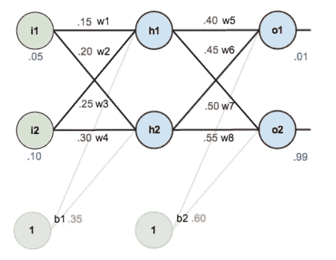

[https://mattmazur . com/2015/03/17/a-逐步-反向传播-示例/](https://mattmazur.com/2015/03/17/a-step-by-step-backpropagation-example/)

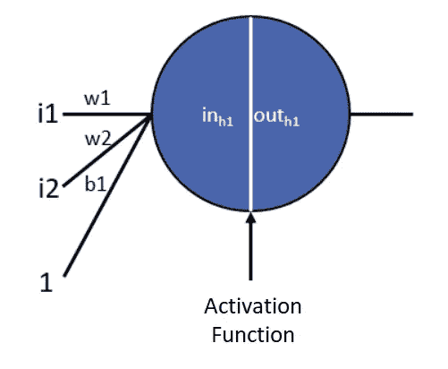

[https://mattmazur . com/2015/03/17/a-逐步-反向传播-示例/](https://mattmazur.com/2015/03/17/a-step-by-step-backpropagation-example/)

图像

为了计算 o1 和 o2，我们需要:

对于第一层，即隐藏层:

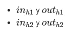

对于最后一层，输出层:

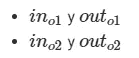

其中: **o1 = outo1** 和 **o2 = outo2。**

所以我们需要计算:

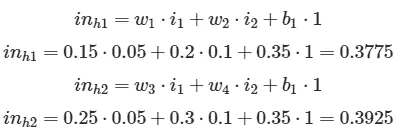

现在，要获得 outh1 和 outh2，我们需要应用 fn_activation。在这种情况下，我们选择物流功能作为激活功能:

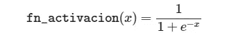

所以:

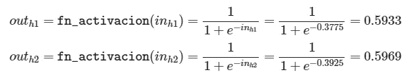

让我们看看我们在输出计算过程中的情况:

[https://mattmazur . com/2015/03/17/a-逐步-反向传播-示例/](https://mattmazur.com/2015/03/17/a-step-by-step-backpropagation-example/)

我们现在只需要计算 o1 和 o2:

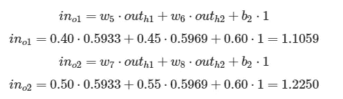

因此，应用激活函数:

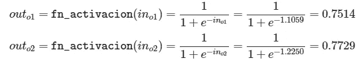

终于！我们已经计算出我们的神经网络预测！但是坚持住，我们的预测太可怕了！他们不像 0.01 和 0.99 期望！我们如何解决这个问题？

不如我们计算一下总误差，尽量把它减到最小？事实上，这正是反向传播算法所做的:它根据每个权重对总误差的影响程度来更新权重，以便最小化总误差

让我们计算总误差:

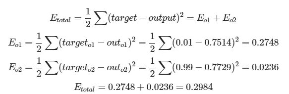

请注意，outo2 误差比 outo1 误差小得多。这是因为 0.7729 比 0.01 的 0.7514 更接近 0.99，所以参与 outo1 计算的神经元的变化应该比 outo2 更大。

我们如何根据影响总误差的因素来更新权重？很简单，只需计算给定重量的变化对总误差的影响，并根据这种关系进行更新。

例如，你能想出一种方法来计算权重 w5 对总误差的影响有多大吗？换句话说，w5 权重的变化对总误差的影响有多大？这听起来不耳熟吗？

我们说的是衍生品！看，我们可以把每个神经元理解为一个函数，应用链式法则，从总误差得到 w5 权重。但首先，你还记得链式法则是如何运作的吗？

让我们看一个例子:假设我们想对函数求导:

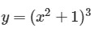

换句话说，我们想知道 **x** 变量的变化对 **y** 变量的影响有多大。

我们可以把这个函数理解为其他两个函数的组合，其中:

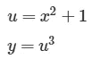

现在，我们需要分别对 **x** 求导 **y** 。为此，我们需要首先相对于 **u** 对 **y** 求导，然后相对于 **x** 对 **u** 求导。

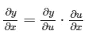

在我们的例子中:

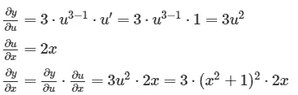

这就是应用的链式法则。现在让我们把它看成一个图表:

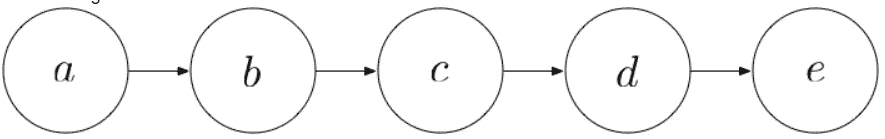

想象每个圆都是函数，每个箭头都是乘法。然后，利用链式法则，我们可以写出:

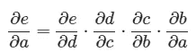

现在，让我们看看如何写出计算 Etotal 相对于权重 w5 如何变化的公式。

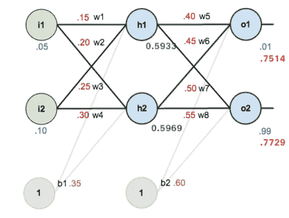

[https://mattmazur . com/2015/03/17/a-逐步-反向传播-示例/](https://mattmazur.com/2015/03/17/a-step-by-step-backpropagation-example/)

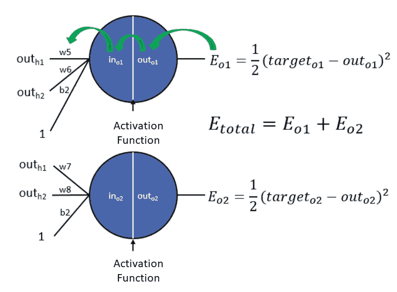

[https://mattmazur . com/2015/03/17/a-逐步-反向传播-示例/](https://mattmazur.com/2015/03/17/a-step-by-step-backpropagation-example/)

正如开膛手杰克所说:让我们去寻找零件。总误差定义为:

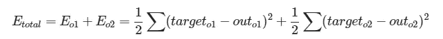

正如我们所见，w5 只影响 o1 神经元，所以我们只关心使我们的 **Etotal = Eo1 的 **Eo1** 。**

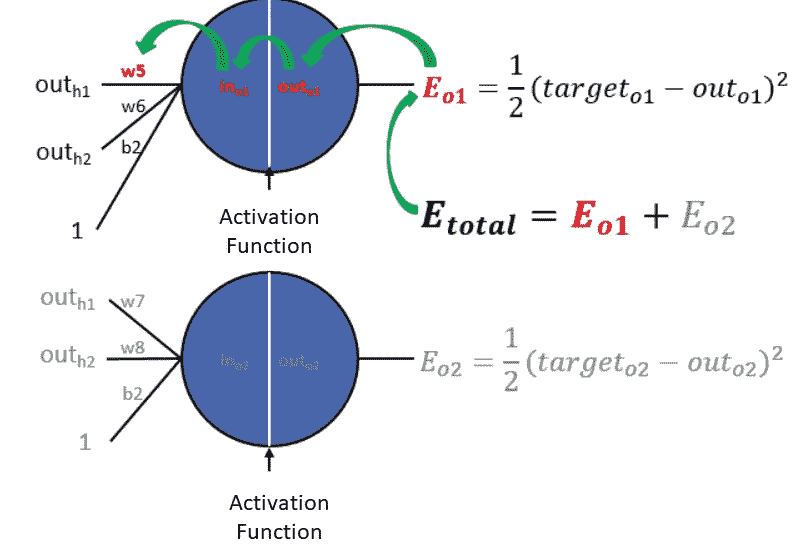

[https://mattmazur . com/2015/03/17/a-逐步-反向传播-示例/](https://mattmazur.com/2015/03/17/a-step-by-step-backpropagation-example/)

因此，我们可以将 w5 权重与 resepct to **Etotal** 的方差定义为:

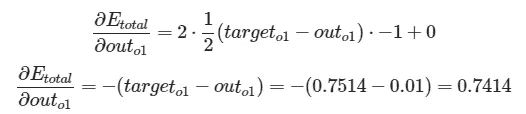

太好了！让我们看下一个术语:

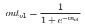

这可以表示为:

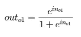

及其衍生物:

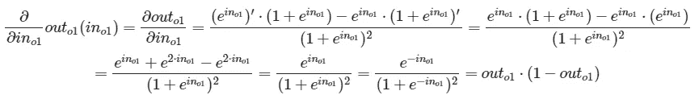

最后两步是可能的，因为逻辑函数的导数是一个偶函数，即 **f(x)=f(-x)** 。

好吧，让我们回到正题。我们已经有了导数，所以现在我们要计算它的值:

我们已经有了第一项和第二项，我们只需要计算突出显示的项就可以得到 **w5** :

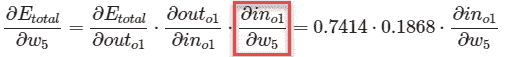

如果我们回忆一下，01 年的**是:**

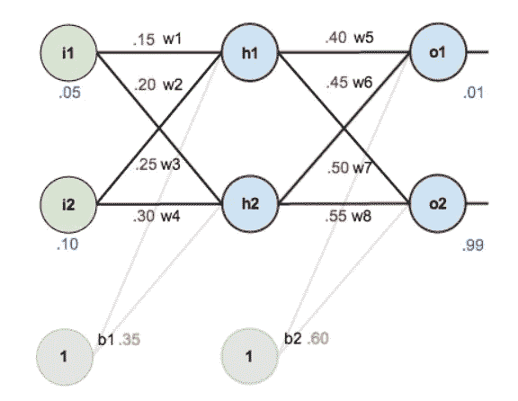

[https://mattmazur . com/2015/03/17/a-逐步-反向传播-示例/](https://mattmazur.com/2015/03/17/a-step-by-step-backpropagation-example/)

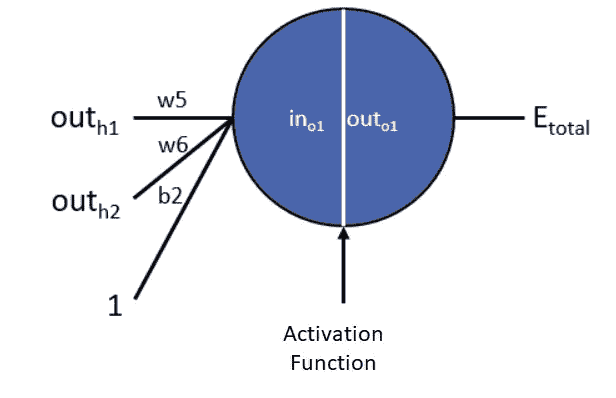

[https://mattmazur . com/2015/03/17/a-逐步-反向传播-示例/](https://mattmazur.com/2015/03/17/a-step-by-step-backpropagation-example/)

如果我们看一下 **o1** 神经元的输入，我们可以直接计算 in01 公式:

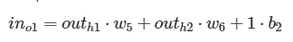

现在，我们能够计算我们的期限；

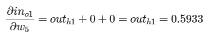

终于！我们已经有了所有必要的术语来了解 w5 对 Etotal 的影响程度:

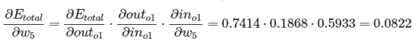

我们已经知道如何计算第二层和 terera(隐藏和退出)影响之间的权重。但是…我们如何发现第一层和第二层(入口和出口)之间的权重有什么影响呢？

很简单，和我们之前做的一样！

我们首先需要定义的是什么？

**Etotal** 相对于重量 **w1** 的导数。这是怎么定义的？

这里是网络:

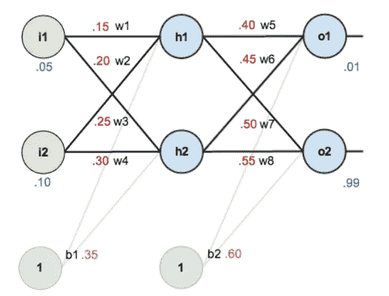

[https://mattmazur . com/2015/03/17/a-逐步-反向传播-示例/](https://mattmazur.com/2015/03/17/a-step-by-step-backpropagation-example/)

让我们将神经网络解构为神经元:

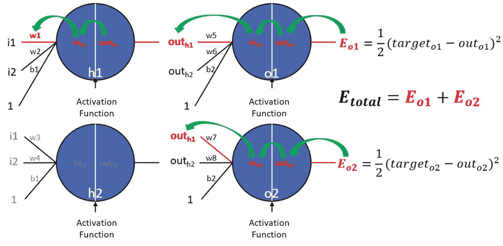

[https://mattmazur . com/2015/03/17/a-逐步-反向传播-示例/](https://mattmazur.com/2015/03/17/a-step-by-step-backpropagation-example/)

现在，我们有两条路可走:

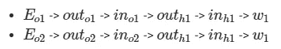

因此，我们需要计算对应于 1 和 2 神经元的误差:

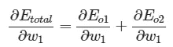

这意味着我们现在有两个影响权重 w1 的误差源，即 Eo1 和 Eo2。各自是如何定义的？很简单，如果我们在网络图中从 Eo1 走到权重 w1，我们会发现的第一个元素是什么？outo1，对吧？

有了它，我们已经不得不:

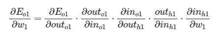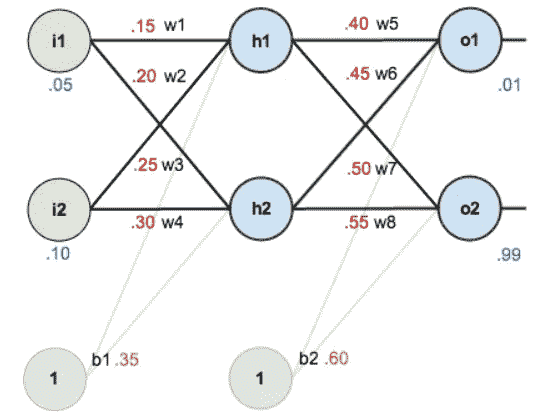

[https://mattmazur . com/2015/03/17/a-逐步-反向传播-示例/](https://mattmazur.com/2015/03/17/a-step-by-step-backpropagation-example/)

让我们求解到 **Eo1:**

现在我们有了 **Eo1** 相对于 **w1** 的变化量。但是我们缺少一些东西，如果我们再看看神经网络:

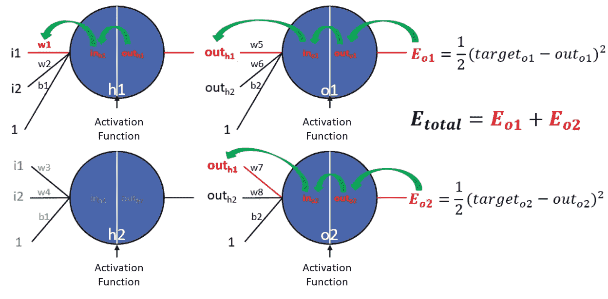

[https://mattmazur . com/2015/03/17/a-逐步-反向传播-示例/](https://mattmazur.com/2015/03/17/a-step-by-step-backpropagation-example/)

我们还需要对应于第二个神经元的误差， **Eo2** 。有了这个误差，我们就可以计算出重量 w1 对总量**的影响有多大，这就是我们感兴趣的:**

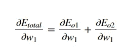

对每个权重重复这一过程，我们就可以对权重应用梯度下降，从而更新权重，参见:

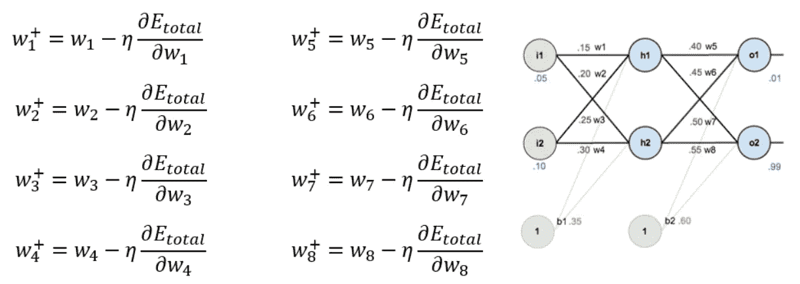

[https://mattmazur . com/2015/03/17/a-逐步-反向传播-示例/](https://mattmazur.com/2015/03/17/a-step-by-step-backpropagation-example/)

其中 **η** 是学习率，表示我们在梯度的反方向要走多大的一步。

# 最后的话

一如既往，我希望你喜欢这篇文章，你已经了解了神经网络以及它们如何利用数学来学习自己！

*如果你喜欢这篇文章，那么你可以看看我关于数据科学和机器学习的其他文章* [*这里*](https://medium.com/@rromanss23) *。*

*如果你想了解更多关于机器学习、数据科学和人工智能的知识* ***请在 Medium*** *上关注我，敬请关注我的下一篇帖子！*