# 神经网络:从零到英雄

> 原文：<https://towardsdatascience.com/neural-networks-from-hero-to-zero-afc30205df05?source=collection_archive---------13----------------------->

## 了解神经网络最重要的参数！


图片来自 [vectorstock](https://www.vectorstock.com/royalty-free-vector/super-hero-brain-cartoon-vector-17919284)

# 介绍

本文将涵盖以下主题:

*   最优化理论:梯度下降及其变化
*   学习率和批量大小
*   损失和激活功能
*   重量初始化

# 最优化理论:梯度下降及其变化

如果你想要梯度下降的详细解释，我建议你看看[这篇文章](/neural-networks-everything-you-wanted-to-know-327b78b730ab)，其中有对神经网络所基于的数学的深入研究。

总之，梯度下降计算训练集中每个样本的误差，然后在指向梯度的方向上更新权重。

换句话说，对于每个时代，我们都需要:

1.  计算每个预测(向前传递)。
2.  计算每一个误差。
3.  向后传播误差，以评估每个权重在该误差中的重要性。
4.  最后，相应地更新权重。

假设我们有:

*   包含 100，000 个样本的数据集
*   每次向前传递需要 2 毫秒
*   每次误差计算需要 1 毫秒
*   每次反向传播需要 3 毫秒

如果我们计算一下:

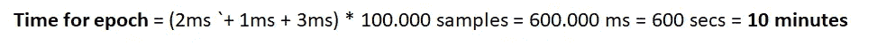

一个常规的神经网络可能需要数百甚至数千个时期来适当地收敛。假设我们需要 100 个历元，这是一个很低的数字。

我们的神经网络需要多少才能被训练好？

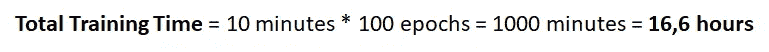

时间太长了。我们假设只有 100，000 个样本，这很好。例如，ImageNet 由 120 万幅图像组成，每个时期需要 2 小时，换句话说，需要 8.3 天。一个多星期来看一个网络的行为。

大幅减少训练神经网络所需时间的一种方法是，每次我们想要更新权重时，使用随机选择的单个样本。

这种方法被称为随机梯度下降(SDG)。使用 SDG，我们只需计算一个样本的预测、误差和反向传播来更新权重。

这将把总培训时间减少到:

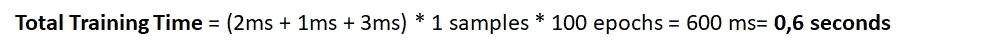

这是一个巨大的进步。但是这种方法有一个非常重要的缺点。

在这两条路径中，你认为哪一条是梯度下降路径？哪一个是随机梯度下降的？


图片来自[这里](https://www.fromthegenesis.com/gradient-descent/)

红色路径是沿着梯度下降的路径。它使用数据集的所有样本计算梯度(下降路径),并总是在最小化误差的方向上获得一致的更新。

紫色路径是 SGD 遵循的路径。这是怎么回事？每次权重更新都是为了通过仅考虑一个样本来最小化误差，因此我们最小化的是该特定样本的误差。

这就是为什么它有一个更混乱的行为，它的收敛成本更高，虽然，作为回报，它运行得更快，所以在 GD 需要运行一个纪元的时间里，SGD 可以运行数千个。

看起来最好的选择是平衡这两种方法。如果我们看一下前面的图片，最佳路径是绿线。

为了计算这条路径，让我们回顾一下到目前为止讨论过的方法:

*   计算我们的训练集的所有元素的预测和误差的方法:(香草)梯度下降
*   计算从我们的训练集中随机选择的 1 个元素的预测和误差的方法:随机梯度下降

如果我们选择的不是 1 个元素，而是 K 个元素呢？这样一来:

*   我们增加了算法的稳定性，因为我们不仅查看一个元素，而且查看 **K** (也就是说，我们减少了洋红色线方向的突然和混乱的变化)
*   我们减少了关于传统下降梯度的执行时间，因为我们从训练集的 N 个样本减少到 **K** ，其中 **K** < < **N**

这种方法被称为小批量随机梯度下降法，是实践中最常用的方法。

K**通常被选择为 2 的幂，因为这允许你利用一些针对这些情况的 GPU 实现的优化。一个典型的 **K** 可能是 **K** =32，但最终，这还是受到了 GPU 内存的限制。**

K 越低，它就越像纯 SGD，它需要收敛的纪元就越多，尽管它会更快地计算它们也是事实。

另一方面， **K** 越高，就越像纯 GD，每个历元的计算就越麻烦，但收敛所需的时间就越少。

# 学习率和批量大小

学习速率和批量大小是与下降梯度算法直接相关的两个参数。

## 学习率

你可能知道，(或者如果你不知道，[你可以在这里查看](/neural-networks-everything-you-wanted-to-know-327b78b730ab))更新神经权重的方法是通过这些公式:

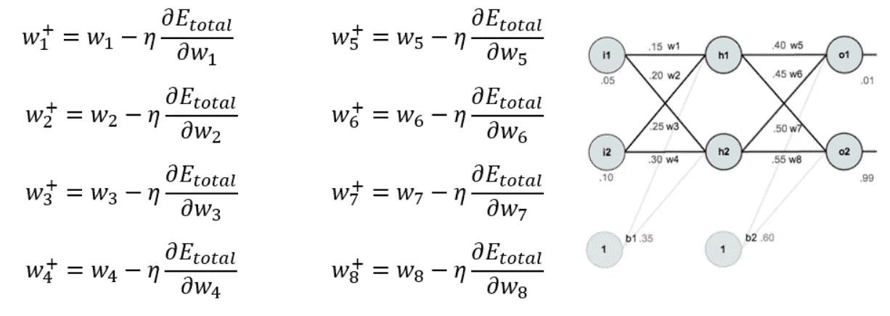

[https://mattmazur . com/2015/03/17/a-逐步-反向传播-示例/](https://mattmazur.com/2015/03/17/a-step-by-step-backpropagation-example/)

乘以∂Etotal/∂wn 的叫做 **η** ，就是学习率。学习率表示我们给予误差的重要性，以更新每个权重。也就是说，权重的变化有多快或多突然。

因此，一个非常高的 **η** ，将在从一个迭代到另一个迭代的巨大步骤中改变权重，这可能导致跳过最小值。

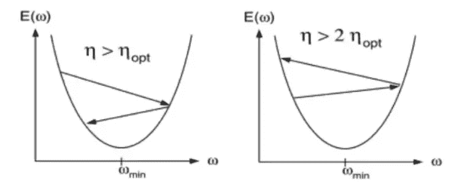

[https://www . quora . com/In-neural-networks-why-one-use-many-learning-rates-In-decay-steps-than-one-smooth-learning-rates-decay](https://www.quora.com/In-neural-networks-why-would-one-use-many-learning-rates-in-decreasing-steps-rather-than-one-smooth-learning-rate-decay)

另一种可能性是建立非常低的 **η** ，这将使我们的网络需要太多的历元来达到可接受的最小值。此外，我们可能会陷入比更高的**η**所能达到的最佳最小值更糟糕的最小值中。

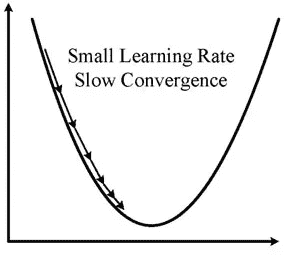

[https://www . researchgate . net/publication/226939869 _ An _ Improved _ EMD _ Online _ Learning-Based _ Model _ for _ Gold _ Market _ Forecasting/figures？lo=1](https://www.researchgate.net/publication/226939869_An_Improved_EMD_Online_Learning-Based_Model_for_Gold_Market_Forecasting/figures?lo=1)

让我们谈谈最小值:我们用神经网络实现的，通常不是我们函数的全局最小值，而是足以正确执行我们正在开发的任务的局部最小值。

我们想要的是一个最优的学习速率，它允许我们随着时间的推移减少误差，直到我们达到最小值。在图表中，这个学习率就是红线。

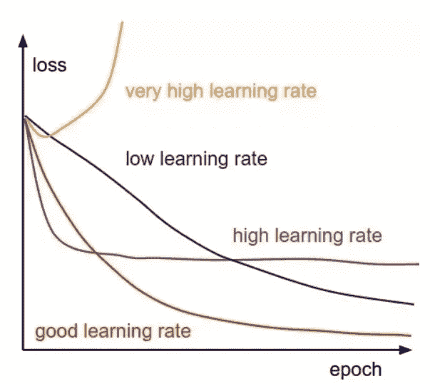

[https://towards data science . com/useful-plots-to-diagnostic-your-neural-network-521907 fa2f 45](/useful-plots-to-diagnose-your-neural-network-521907fa2f45)

为了让我们的学习率达到最优，我们可以对我们的学习率进行衰减。这种衰减会随着时间的推移降低学习速度，所以当我们达到最小值时，它会小到足以避免跳过它。

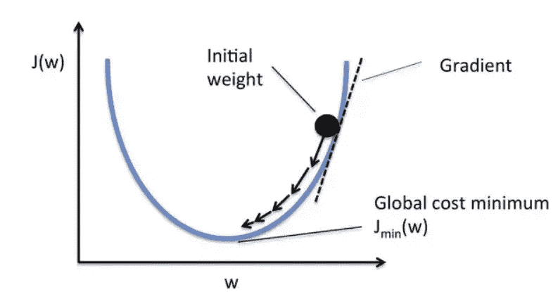

[https://www.pinterest.es/pin/825918019139095502/](https://www.pinterest.es/pin/825918019139095502/)

因此，我们通过选择一个非常低的学习率和跳过最小值来避免长时间等待收敛，因为我们越接近它，我们向它迈出的步伐就越小。

## 批量

回想一下上一节，SGD 是一个小批量 SGD，其中 K=1。

并且小批量 SGD 的 K 表示每次用于更新权重的样本数量。这不是一个关键参数，它通常被设置为我们的 GPU 可以容纳的最大样本数。

> 我们有一个 8GB 内存的 GPU，如果每个图像占用 1MB，我们可以容纳多少个样本？

嗯，没那么简单！这取决于网络的架构。密集或完全连接的层(在传统层中，所有神经元都与下一层中的所有神经元相互连接)具有更多参数，因此占据更多内存。

我们还有卷积层、汇集层、分离层和许多其他类型。因此在实践中，很难手工计算出我们可以使用的最大样本数。

我们所做的是尝试将批量大小设置为 2 的倍数，如果出现内存错误，就减少批量大小。例如，我们将从 512 开始，如果我们有一个错误，我们将下降到 256、128、64、32、16、8、4、2 甚至 1。

根据您的网络架构，您可能必须使用 K=1，因此 SGD。尽管通常优选的是将图像尺寸从 512×512 减小到 256×256 或 128×128 像素，并使用较大的 k

## 学习率和批量关系

记住学习速度与批量大小有关，这一点非常重要。

如果我们接近 K=1，我们必须降低学习率，使得权重的更新不那么重要，因为它更接近 SGD，换句话说，更接近用单个随机样本计算梯度。

因此，总之，如果我们使用较低的批量大小，建议使用较低的学习速率，但我们也会增加历元的数量，因为后面的条件会使我们的神经网络需要更多的时间来收敛。

# 损失和激活功能

## 损失函数

损失函数告诉我们我们的预测有多错误。

想象一下，我们只需要看一张照片就能猜出一栋房子的价格。我们的神经网络将以照片的像素作为输入，以显示价格的数字作为输出。

例如，假设我们想要预测一栋房子的价格，所以我们正在训练网络，而这栋房子就在我们的训练集中。当图片经过时，计算出一个预测，那就是它值 323567 美元。事实是房子价值 600，000 美元，因此很明显，一个合适的损失函数可以是:

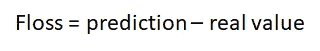

考虑到这一点，最常见的损失函数是:

**对于回归问题**

*   均方误差
*   绝对平均误差

**分类问题**

*   二元交叉熵
*   范畴交叉熵

正如我在[的上一篇文章](/supervised-learning-basics-of-linear-regression-1cbab48d0eba)中所写的那样，只关注回归问题，让我们来看看其中的每一个问题:

*   均方差:

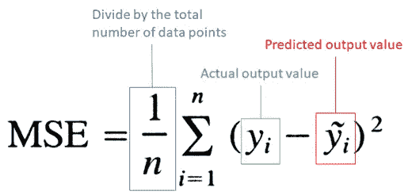

[https://towards data science . com/supervised-learning-basics-of-linear-regression-1 cbab 48 d0 EBA](/supervised-learning-basics-of-linear-regression-1cbab48d0eba)

均方差或 MSE 是真实数据点和预测结果之间的平方差的平均值。这种方法惩罚越大的距离，这是标准的回归问题。

*   平均误差

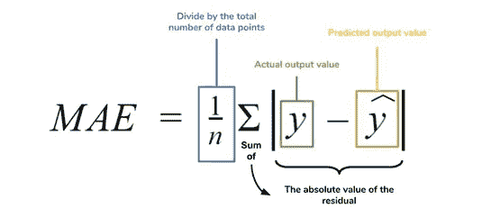

[https://towards data science . com/supervised-learning-basics-of-linear-regression-1 cbab 48 d0 EBA](/supervised-learning-basics-of-linear-regression-1cbab48d0eba)

平均绝对误差或 MAE 是真实数据点和预测结果之间的绝对差值的平均值。如果我们将此作为遵循的策略，梯度下降的每一步都将减少 MAE。

## 什么是交叉熵？

我们首先需要理解什么是熵。让我们用几个例子来说明这一点:

**例一**

想象一下，我们正在玩一个游戏:我们有一个装有不同颜色球的袋子，游戏的目标是猜一个志愿者用最少的问题数画出哪种颜色。

在这种情况下，我们有一个蓝色球、一个红色球、一个绿色球和一个橙色球:


[https://www . quora . com/Whats-an-intuitive-way-to-think-of-cross-entropy](https://www.quora.com/Whats-an-intuitive-way-to-think-of-cross-entropy)

也就是说每个球都有 1/4 的机会出去。

最好的策略之一是先问你发的球是蓝色的还是红色的。如果是，我们会问球是不是蓝色的。如果不是，我们会问它是否是绿色的。所以我们需要两个问题。

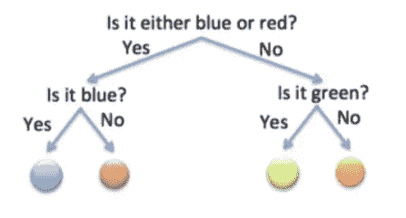

[https://www . quora . com/Whats-an-intuitive-way-to-think-of-cross-entropy](https://www.quora.com/Whats-an-intuitive-way-to-think-of-cross-entropy)

**例 2**

这次我们有一个装有球的包，其中 1/2 是蓝色的，1/4 是红色的，1/8 是绿色的，1/8 是红色的。现在，最佳策略是先问它是不是蓝色的，因为蓝色的可能性更大。如果是的话，我们就完了。如果不是，我们可以问它是否是红色的，这是下一个最有可能的类。如果是的话，我们就完了。如果不是，我们可以问它是绿色的(还是橙色的)。

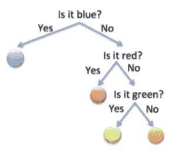

[https://www . quora . com/Whats-an-intuitive-way-to-think-of-cross-entropy](https://www.quora.com/Whats-an-intuitive-way-to-think-of-cross-entropy)

现在发生的情况是，一半的时间(1/2)是蓝色的，我们要花 1 个问题来猜测。1/4 的时间是红色的，它花了我们 2 个问题。1/8 是绿色的，要花我们 3 个问题，如果是橙色的也一样。

所以猜一个球的期望题数是:1/2⋅1(蓝色)+1/4⋅2(红色)+1/8⋅3(绿色)+1/8⋅3(橙色)=1.75

**例 3**

想象一下，现在我们有一个装满蓝色球的袋子。我们需要问多少题才能找出他们拿出的是什么颜色的球？无，0。

从这些例子中，我们可以得出一个表达式，它允许我们根据球的概率来计算问题的数量。因此，概率为 p 的球需要 log2(1/p)个问题。

例如，对于 p=1/8 的球，我们需要**n _ quest**= log2(1/(1/8)=**3**

因此，预期的问题总数是:

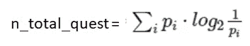

最后，理解熵的一种方法如下:

> 如果我们遵循最优策略，让我们猜测球的颜色的预期问题数量是多少？

所以，**游戏越复杂，熵**越高。在这种情况下，例 1 >例 2 >例 3。

好，现在我们知道了熵是什么，让我们看看交叉熵是什么。

## 交叉熵

假设我们对例 2 采用了例 1 的策略:

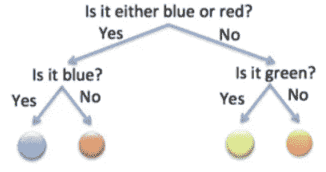

[https://www . quora . com/Whats-an-intuitive-way-to-think-of-cross-entropy](https://www.quora.com/Whats-an-intuitive-way-to-think-of-cross-entropy)

所以，我们必须问两个问题来确定它是不是任何颜色。如果我们计算所需问题的总数，考虑到这一次每个球都有一个概率，我们得出:

n_total_quest=1/2⋅2(blue)+1/4⋅2(red)+1/8⋅2(green)+1/8⋅2(orange)=2

所以这个策略比例 1 中的策略更差。

> 最后，直觉上，熵是使用最佳策略时预期的问题数量，交叉熵是不使用最佳策略时预期的问题数量。

为此，我们试图做的是最小化交叉熵。

在形式上，它被定义为:

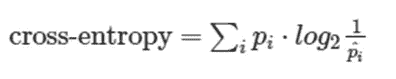

其中:

*   **pi** 是球的实际概率(在我们的例子中，蓝色是 1/2，红色是 1/4，绿色和橙色是 1/8)
*   **pi^** 是我们使用策略时假设的概率，在这种情况下，所有球的概率相等(所有颜色的概率为 1/4)

记住公式中什么在哪里的一个方法是，记住我们想做的是找出按照我们的策略需要多少个问题，这是 pi^，所以在 log2 里面是 pi^.

## 激活功能

如果我们没有激活功能，我们会有以下内容:

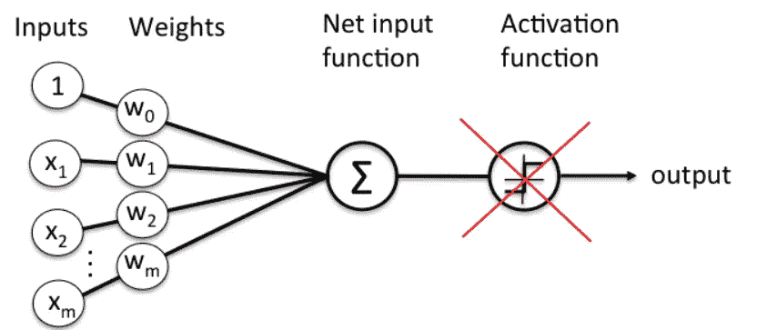

[https://towards data science . com/neural-representation-of-logic-gates-df 044 EC 922 BC](/neural-representation-of-logic-gates-df044ec922bc)

我们必须 y(x)=Wx+b，这是一个线性组合，甚至不能解决像 XOR 这样的问题。

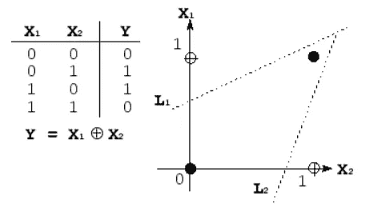

[http://www . ECE . utep . edu/research/web fuzzy/docs/kk-thesis/kk-thesis-html/node 19 . html](http://www.ece.utep.edu/research/webfuzzy/docs/kk-thesis/kk-thesis-html/node19.html)

因此，我们需要一种方法来引入非线性，这就是激活函数的作用。在下图中，您可以看到一些最典型的网络，以及它们在网络中的位置:

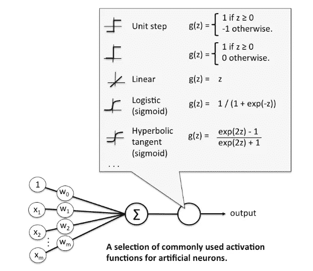

[https://towards data science . com/activation-functions-and-its-types-哪个更好-a9a5310cc8f](/activation-functions-and-its-types-which-is-better-a9a5310cc8f)

这里你可以看到最常用的:

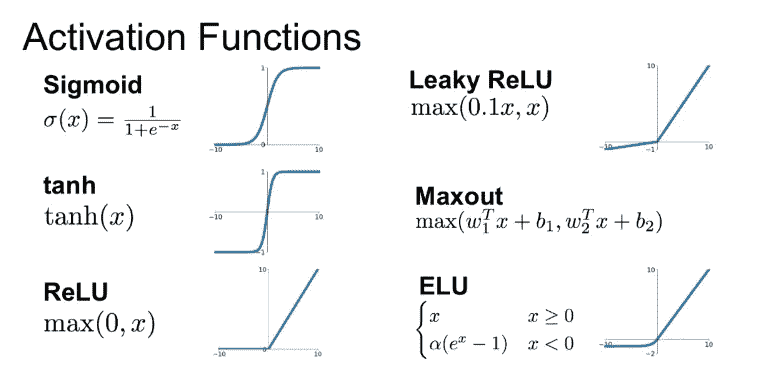

[https://towards data science . com/complete-guide-of-activation-functions-34076 e95d 044](/complete-guide-of-activation-functions-34076e95d044)

很难知道使用哪一种方法我们的网络会表现得更好，但是有一种方法通常几乎总能得到好的结果:ReLU。

因此，每当我们开始时，我们将使用 ReLU，一旦我们得到一些我们认为好的结果，我们可以尝试使用泄漏的 ReLU 或任何其他您想要的。每天都有新的出现，简单的谷歌搜索就能让你找到一些有趣的:比如 SELU([https://towards data science . com/卢瑟-make-fnns-great-again-snn-8d 61526802 a9](/selu-make-fnns-great-again-snn-8d61526802a9))。

这些激活函数中的许多需要权重初始化的特定方法，以便位于特定范围的值之间，并且梯度下降正常工作。

在输出图层的情况下，softmax 激活函数是使用最多的一个，因为它能够为每个类提供一个概率，使所有类的总和为 1。

由于这可能看起来有点复杂，请在下面找到推荐的食谱，作为以上所有内容的总结:

**配方**

1.  开始使用学习率为 0.01 或 0.001 的 ReLU，观察会发生什么。
2.  如果网络训练(收敛)但是很慢，可以试着提高一点学习速率
3.  如果网络不收敛且表现混乱，则降低学习速率
4.  一旦你的网络启动并运行，尝试一下漏热、最大或 eLU
5.  不要使用乙状结肠，实际上它通常不会给出好的结果

# 重量初始化

正如您之前看到的，权重和偏差初始化对于实现我们的网络收敛到适当的最小值非常重要。让我们来看看初始化权重的一些方法。

如果我们遵循 MNIST 数据集([正如我们在本文](/deep-learning-solving-problems-with-tensorflow-3722b8eeccb1)中所做的)，我们的权重矩阵将是 768(输入)x 10(输出)。

## 常数初始化

我们可以预先设定我们的重量

*   **零:**

```
W = np.zeros((768, 10))
```

*   **一:**

```
W = np.ones((768, 10))
```

*   **到常数 C :**

```
W = np.ones((768, 10)) * C
```

## 正态和均匀分布

我们还可以使用均匀分布来初始化权重，其中定义了[上界，下界]，并且该范围内的所有数字具有相同的被选中概率。

例如，对于[-0.2，0.2][-0.2，0.2]之间的分布:

```
W = np.random.uniform(low=-0.2, high=0.2, size=(768, 10))
```

利用该指令，我们将使用从[-0.2，0.2][-0.2，0.2]之间的范围中提取的值来初始化 WW 权重矩阵，在该范围中，它们都具有相同的被提取概率。

我们也可以用正态或高斯分布来计算，其定义为

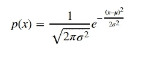

如你所知:

*   μ是平均值
*   σ是标准差，σ2σ2 是方差

因此，我们可以用正态分布初始化我们的权重，其中 **μ=0** 和 **σ=0.2** ，例如:

```
W = np.random.normal(0.0, 0.2, size=(768, 10))
```

## 初始化:正常和统一的 LeCun

另一种更先进的方法是 LeCun 方法，也称为“高效反向投影”。

该方法定义了 3 个参数:

*   Fin:该层的条目数(在我们的例子中是 768)
*   Fout:该层的出口数量(在我们的示例中为 10)
*   极限:根据 Fin 和 Fout 定义为:

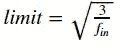

通过这种使用均匀分布的方法来初始化 **W** 的代码将是:

```
W = np.random.uniform(low=-limit, high=limit, size=(F_in, F_out))
```

对于一个普通人来说:

```
W = np.random.normal(low=-limit, high=limit, size=(F_in, F_out))
```

## 初始化:Glorot/Xavier 正常和统一

这可能是最广泛使用的初始化权重和偏差的方法。这是使用 Keras 时的默认设置。

在这种情况下，也定义了与 LeCun 相同的参数，但是极限的计算有所不同:

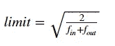

使用这个方法初始化 WW 的代码与使用 LeCun 的代码相同。

对于均匀分布，它将是:

```
W = np.random.uniform(low=-limit, high=limit, size=(F_in, F_out))
```

对于一个普通人来说:

```
W = np.random.normal(low=-limit, high=limit, size=(F_in, F_out))
```

## 初始化:何等人/和正常而统一

这种方法是以何的名字命名的，他是《深入研究整流器:在 ImageNet 分类上超越人类水平的性能》一书的第一作者。

通常，当我们训练使用特定类型的 ReLU 作为激活(如参数 ReLU)的非常深的神经网络时，使用这种方法。

制服的代码是这样的:

```
limit = np.sqrt(6 / float(F_ini))W = np.random.uniform(low=-limit, high=limit, size=(F_in, F_out))
```

在正常情况下，这个:

```
limit = np.sqrt(2 / float(F_ini))W = np.random.uniform(low=-limit, high=limit, size=(F_in, F_out))
```

## 食谱:

权重的初始化通常不是网络训练中的决定因素，但有时它会导致网络无法训练，因为它无法收敛。

所以推荐的建议是用 Glorot 的，如果那天你觉得运气好，想看看自己在准确率上能不能提高，那就和别人一起试试。

## 最后的话

一如既往，我希望你喜欢这个帖子，你现在是神经网络的专家了！

*如果你喜欢这篇文章，那么你可以看看我关于数据科学和机器学习的其他文章* [*这里*](https://medium.com/@rromanss23) *。*

*如果你想了解更多关于机器学习、数据科学和人工智能的知识* ***请在 Medium*** *上关注我，敬请关注我的下一篇帖子！*