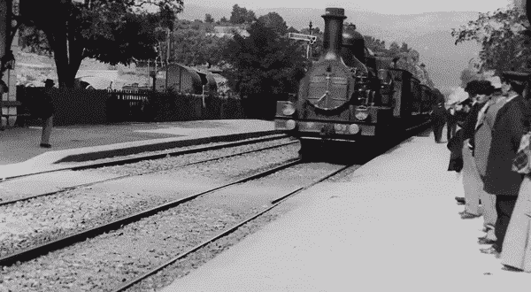

# 神经网络有助于将著名的 1896 年视频高档转换为 4K 质量

> 原文：<https://towardsdatascience.com/neural-networks-help-upscale-conversion-of-famous-1896-video-to-4k-quality-d2c3617310fe?source=collection_archive---------17----------------------->

## 艾使得在 4K 重现卢米埃尔兄弟的《火车抵达拉乔塔特车站》成为可能

火车到达拉乔塔特(卢米埃兄弟，1896 年)

随着时间的推移，神经网络变得越来越复杂。他们已经允许科学家们实时地从脑电波和许多其他事物中重建人类的思想。

在 **1896** 年，[卢米埃尔兄弟](https://en.wikipedia.org/wiki/Auguste_and_Louis_Lumi%C3%A8re)**电影 ***“火车到达拉乔塔特车站”*** ，持续 **50** 秒，激起了观众的情绪，神圣地迈出了电影院的第一步。它仍然是卢米埃尔兄弟作品的象征，更广泛地说，是第七艺术的开端。**

**最近，一个名叫 [**丹尼斯·希尔亚耶夫**](https://www.youtube.com/channel/UCD8J_xbbBuGobmw_N5ga3MA) 的人使用神经网络将 **1896** 电影缩放到 **4K** 分辨率使用 [**托帕斯实验室**](https://topazlabs.com/) 商业 [**千兆像素 AI**](https://topazlabs.com/gigapixel-ai/) 和 [**DAIN**](https://sites.google.com/view/wenbobao/dain) 图像编辑应用。他不仅将镜头增加到 **4K** ，还将帧率提高到**每秒 60** 帧。**

****Shiryaev** 使用 **Gigapixel AI** 以 **4K** 格式渲染了 **50** 秒静音短片 ***《一列火车抵达拉乔塔特车站》*** ，画面非常逼真。原始胶片的质量非常模糊，分辨率非常低。他的作品发表后，获得的结果令人惊讶。他的新视频似乎非常符合 21 世纪的视频标准。**

**尽管有一些不完美，比如图像跳跃或某些细节模糊，**这种体验的成果令人印象深刻**。为了完成他的工作， **Shiryaev** 还在这部无声电影中加入了**的声音**。**

****丹尼斯·希尔亚耶夫** [的电影复原版](https://www.youtube.com/channel/UCD8J_xbbBuGobmw_N5ga3MA)**

**这些图像的获得得益于一种人工神经网络形式:**生成对抗网络**，或 **GANs** 。这种技术在最近几个月得到了推广，特别是著名的 Kaggle 比赛[**【deep fake Detection Challenge】**](https://www.kaggle.com/c/deepfake-detection-challenge/overview)和由 **AI** 产生的艺术创作的出现。**

**提醒一下，**甘**方法在于**对抗两个神经网络**。第一个基于数据生成对象，第二个的作用是确定对象的真实性。第一个网络一次又一次地尝试，直到它的产品完美到足以欺骗第二个网络。通过这种方式，程序学习自己来生成最可能的图像。**

**[**Gigapixel AI**](https://topazlabs.com/gigapixel-ai/) 软件采用专有插值算法，分析图像，识别细节和结构，完成图像。它可以使图像更清晰，甚至在经过*600%放大后。***

********(深度感知视频帧插值)*** 另一方面，想象并在现有视频剪辑的关键帧之间插入帧。换句话说， **DAIN** 分析并映射视频剪辑，然后在现有图像之间插入生成的填充图像。和 ***4K TVs*** 的运动平滑功能是一个概念。为了在这个 **1896** 视频中实现相同的结果， **Shiryaev** 添加了足够多的图像，以将速率提高到 **60 FPS** 。因此，除了最初记录的 **24 张**图像之外， **DAIN** 每秒自动生成并添加了 **36 张**额外图像。*****

*****卢米埃尔兄弟的原创电影*****

*******Shiryaev 的** ***“火车抵达拉乔塔特站”*** 的改良版看起来像是最近用**智能手机**或 **GoPro** 制作的电影。与原版视频的对比**相当惊艳，尤其是在新版本中获得的流畅性**。太阳在行驶的火车上的反射和站台上的女性珠宝被很好地转录，这也许是最显著的改进之一。*****

*****神经网络也可以使用相同的基本技术进行着色:从一堆彩色照片开始，将它们转换为黑白照片，然后训练神经网络来重建彩色原件。 **Denis Shiryaev** 甚至有任务在 [***视频 YouTube 频道***](https://youtu.be/EqbOhqXHL7E) 上为他的改良版***火车抵达拉乔塔特站*** 添加色彩。*****

*****然而，人们相信，Shiryaev 的技术是经过深思熟虑的，非常有前途，因为它可以很好地激励其他热爱无声电影的人。*****

*****神经网络算法非常强大，并且每年都在改进。使用的可能性非常多，电视世界很可能是最大的受益者之一。*****

> *****“向神经网络展示一张低分辨率的人脸图像，它会识别出这是一张脸，并为受试者的眼睛、鼻子和嘴巴填入正确的细节。”托帕斯实验室说。*****

*****不幸的是，这些有用的技术有时被用于恶意目的，例如，它们可以用于制作“深度假货”并允许在视频中进行身份盗窃。*****

*****因此，有理由担心它可能被滥用，但技术可以很容易地成为一种利用人工智能更新旧电影并彻底改变行业本身的方式。*****

# *****参考资料:*****

*   *****[https://gizmodo . com/neural-networks-upgrade-film-from-1896-to-4k-make-it-l-1841449875](https://gizmodo.com/neural-networks-upscale-film-from-1896-to-4k-make-it-l-1841449875)*****
*   *****[https://ars technica . com/science/2020/02/someone-used-neural-networks-to-upgrade-a-famous-1896-video-to-4k-quality/](https://arstechnica.com/science/2020/02/someone-used-neural-networks-to-upscale-a-famous-1896-video-to-4k-quality/)*****
*   *****[https://www.youtube.com/watch?v=3RYNThid23g&feature = share&FB clid = iwar 1 pjwzhxp 86 _ 5 eqeghzflb 5 fu 3g 0 wvked D2 eosdwezpdgkdlhkhi5 nzlwu](https://www.youtube.com/watch?v=3RYNThid23g&feature=share&fbclid=IwAR1pJWZhxp86_5EqEGhZflb5fU3g0wvKEDd2eOSdwEzPdGKDlhKhI5NzLWU)*****
*   *****【https://sites.google.com/view/wenbobao/dain 号*****
*   *****【https://topazlabs.com/gigapixel-ai/ *****

*****如果你设法来到这里，恭喜你。感谢阅读，我希望你喜欢它。关于机器学习的个人接触或讨论，请随时在[**LinkedIn**](https://www.linkedin.com/in/kamal-chouhbi/)**上联系我，别忘了在 [**GitHub**](https://github.com/chouhbik) 和 **Medium** **上关注我。*********