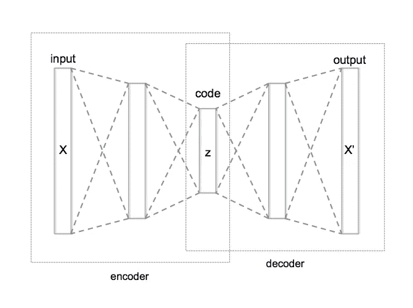
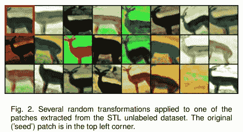
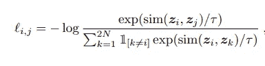

# 神经网络直觉-7。自我监督学习和 SimCLR 论文解释

> 原文：<https://towardsdatascience.com/neural-networks-intuitions-7-self-supervised-learning-and-simclr-paper-explanation-ba0101f10c99?source=collection_archive---------31----------------------->

## 大家好:-)

今天我将谈论深度学习领域最重要和最有趣的话题之一—*自我监督学习和最近一篇展示 SOTA 自我监督学习结果的论文— [*视觉表征对比学习的简单框架*](https://arxiv.org/pdf/2002.05709.pdf) *。**

*自我监督学习之所以至关重要，是因为在*规模下对数据进行*手动标记是非常非常昂贵和繁琐的。因此，焦点自动集中在*自我监督*和*非监督学习*领域——以减少对大量数据进行标记的需要。***

*让我们首先了解什么是自我监督学习，以及它如何帮助解决上述人工标记的问题(或者至少最小化它)。*

*在整篇文章中，我将从解决现实世界问题的角度来解释事情。*

# *问题:*

*让我们考虑有 1000 个类别的图像分类问题。我们有覆盖这 1000 类的未标记数据(比如 100 万张图片)。我们如何着手解决这个问题？*

1.  *首先，我们需要 ***手动标注*** 这些图像。*
2.  *如有必要，应用 ***增强*** 。*
3.  *然后简单地用 ***resnet50*** 骨干 ***训练一个分类器***——用 ***ImageNet*** 预训练的权重或者 ***随机*** 权重。*

*步骤 2 和 3 非常简单。如果您已经有了所需的框架，那么您可以快速扩充和训练分类器。*

> *当然，步骤 3 需要我们试验不同的主干、输入图像分辨率、优化器、损失函数、超参数，如学习速率、批量等等。*

*但是第一步也是最重要的一步是给数据贴上标签。手动标记如此大量的数据需要大量的资源，如时间和人力。最重要的是，我们需要确保 ***人为错误尽可能少。****

*因为标记所有的数据是乏味的，所以让我们只注释随机的数据子集。*

> *为了简单起见，我选择了一个随机子集，但我们可以优化这个选择。*

*既然我们要标注一小部分，我们如何减少手工标注的工作量或者完全消除这个标注过程？(*尽管这似乎是一个不切实际的目标:)*，或者至少利用这*大量未标记的数据*来帮助提高准确性。*

# *解决方案:*

# ***1。转移学习:***

*一个显而易见的方法是使用一些与我们的数据集非常相似的开源数据集(即使我们经常找不到)，在开源数据集上进行训练，然后在我们的数据集上微调网络。*

*这确实有助于提高分类器的准确性，但不是在很大程度上，并且总是比从随机权重开始更受欢迎。*

*Btw，为什么我说这个比随机初始化好？*

> *这是因为它有助于实现更高的精度和更快的收敛！*

*很好，但是怎么做？*

> *由于我们在类似于我们的目标数据分布的开源数据集上训练我们的网络，这意味着我们的网络已经学习了一些相关特征，而不是随机特征。因此，一旦我们在我们的目标数据集上再次训练网络，自然期望它表现良好并避免在小目标集上过度拟合。这可以被视为等同于“**在更多数据上训练网络”。***

> *但是，我们可以通过从我们的未标记目标数据分布中学习的表示来做得更好，而不是从不同的数据分布中学习的表示。*

*因此，我们的下一个方法是自动地从这个未标记的目标分布中学习表示！*

> *这种使用未标记的数据来帮助监督任务的技术被称为 ***自监督学习*** ，并且帮助从这种未标记的目标分布中学习表示的方法被称为 ***借口任务。****

*   *这里被监督的任务是*在标记数据上训练一个分类器，也称为* ***下游任务。****

# ***2。自我监督学习:***

*现在我们知道了什么是自我监督学习，让我们看看有哪些类型的借口任务，以及它们实际上如何帮助学习表征。*

*这篇文章将涉及多个借口任务。因此，我将只给出这些任务的概述，以及如何使用它们来解决我们手头的问题:-)*

## ****a .自动编码器:****

*Autoencoder 是一种神经网络，它试图重建输入，从而学习输入数据表示。*

*自动编码器看起来像:*

**

*[自动编码器的架构](https://en.wikipedia.org/wiki/Autoencoder#/media/File:Autoencoder_structure.png)*

*   *在我们的例子中，输入和输出将是一个图像。*

*网络接收图像并输出相同的图像。通常使用的损失是 MSE 损失。这里要注意的主要是 ***代码(或者嵌入)。*T3 表示从输入数据中学习到的特征。***

*这对解决我们的问题有什么帮助？*

> *我们可以在未标记的数据上训练一个自动编码器(resnet50 编码器，avgpool 的输出作为嵌入)，加载编码器的权重，并在标记的子集上训练。*

## *b.范例-CNN:*

*论文:- [*有判别力的无监督特征学习与样例卷积神经网络*](https://arxiv.org/pdf/1406.6909.pdf)*

*作者提出了以下方法:*

1.  *对于数据集中每个未标记的图像，应用随机变换，例如平移、旋转、缩放和其他颜色变换。*
2.  *得到的增强图像集被认为是一个类的一部分(称为*代理类)。**
3.  *之后，训练一个分类器来区分这些代理类。*

**

*图来自 [*利用样本卷积神经网络进行的判别无监督特征学习*](https://arxiv.org/pdf/1406.6909.pdf)*

> *请注意，可能有太多的代理类表示同一个基本事实类，因为不可能事先知道它们，所以我们可以首先对这些未标记的图像进行聚类(从相似数据集上的预训练模型或在同一数据集上使用 autoencoder 进行嵌入)，然后对这些聚类应用变换。*

*在理想的情况下，每个类(这是我们的*代理类)*只有一个样本，随机变换被应用于每个样本并进行训练。*

> *像自动编码器一样，我们可以将训练好的分类器的权重用于我们的下游任务。*

## *c.对比学习— SimCLR:*

*论文 [*视觉表征对比学习的简单框架*](https://arxiv.org/pdf/2002.05709.pdf) 提出了另一种机制，使用 ***对比学习*** 从未标记的数据集中学习有用的表征，该表征稍后可用于下游任务。*

*提议的方法:*

1.  *在训练期间，对 N 个 未标记图像中的一个 ***批次进行采样。****
2.  *对于每幅图像， ***应用两种变换——随机裁剪和调整大小，*** 生成两幅图像，这两幅图像被认为是 ***正*** 样本。同批剩余的 ***(N-1)张*** 被认为是 ***阴性*** 样本。现在用这两个类训练一个分类器。对该批中的每个图像重复该过程。*
3.  *使用的基本编码器是 Resnet50(2048)，后面是一个 2 层 MLP，它将表示从 2048 转换为 128 维。*
4.  *所用的损失是 NT-Xent(归一化温度标度交叉熵损失)*

**

*其中 sim =余弦相似度，𝟙 ∈ {0，1 } IFF*k*≦*I，*τ表示温度参数。*

*目标是学习两个正图像和其余 N-1 个负图像的相似表示，以具有与这两个图像完全不同的表示。但是这是如何实现的呢？*

1.  *为该批中的所有嵌入对计算 ***余弦相似度*** 。*
2.  *对于 ***每个正对(I，j)*** ，我们计算一个 ***归一化相似度得分*** ，并使用 ***log loss/CE loss 将其最小化。****
3.  *对批(2N)中的所有图像进行此操作，最后取一个 ***平均值*** 。*

*然而，这里有一点很重要:*

> *我们如何确保一批中用于阴性类别的(N-1)幅图像不包含阳性样本，因为我们首先不知道它们的标签？*

*可惜，文件没有清楚说明这点，我也不知道上述问题的答案。我们可以做的一件事是基于预训练的嵌入来挑选负面图像，但我不认为这种情况会发生！如果有人知道答案，请告诉我:-)*

## *其他常见借口任务:*

*所有上述借口任务直接学习分类底层类(除了自动编码器)，但也有任务试图*优化不同的目标，但学习有用的表示*为下游任务。*

1.  ***生成对抗网络:**我们可以训练 GAN 从我们的未标记数据分布中生成图像，使用*生成器(即编码器)的权重*并在我们的标记子集上重新训练。*
2.  *预测图像旋转— [*通过预测图像旋转进行无监督表示学习*](https://arxiv.org/abs/1803.07728)*
3.  *预测图像中一个面片 wrt 与另一个面片的相对位置— [*通过上下文预测的无监督视觉表示学习*](https://arxiv.org/abs/1505.05192)*

## *参考资料:*

1.  *[*用样例卷积神经网络进行判别性无监督特征学习*](https://arxiv.org/pdf/1406.6909.pdf) *。**
2.  *[*视觉表征对比学习的简单框架*](https://arxiv.org/pdf/2002.05709.pdf) *。**
3.  *[https://lilian Weng . github . io/lil-log/2019/11/10/self-supervised-learning . html](https://lilianweng.github.io/lil-log/2019/11/10/self-supervised-learning.html)*