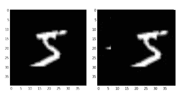
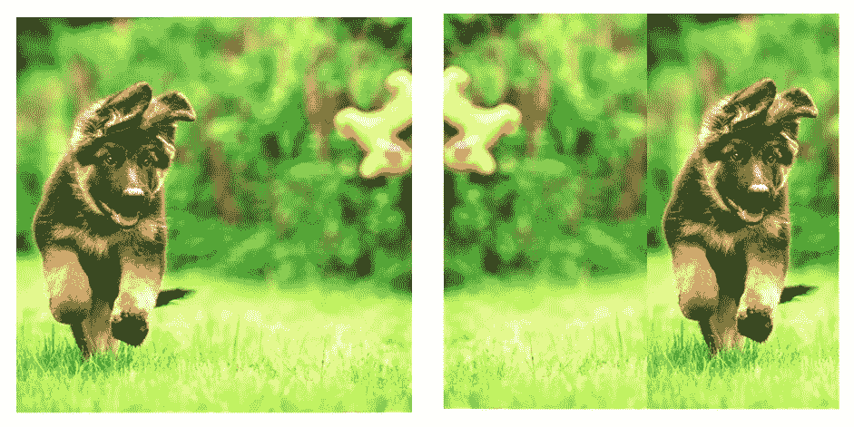
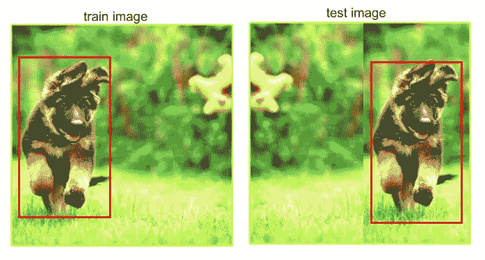

# 神经网络直觉:8。目标检测器中的平移不变性

> 原文：<https://towardsdatascience.com/neural-networks-intuitions-8-translation-invariance-in-object-detectors-21db6e27879c?source=collection_archive---------44----------------------->

大家好！

这篇文章将会很短，主要讨论对象检测器中一个不太重要但被高度忽视的概念，特别是在单次检测器中— ***平移不变性。***

*让我们理解什么是平移不变性，什么使得图像分类器/对象检测器平移不变性。*

*注:本文假设您对单级和两级检测器的工作原理有背景知识:-)

# 平移不变性:

*平移*在计算机视觉中是指 ***在空间中的位移*** ，*不变性*是指不变的 ***性质。***

因此，当我们说图像分类器或对象检测器是平移不变的时，它意味着:

> 图像分类器可以准确地预测一个类别，而不管该类别(更具体地说，模式)位于图像的空间维度的何处。类似地，检测器可以检测对象，而不管它出现在图像中的什么位置。

让我们看一个例子来说明每个问题。

**图像分类:**来自 MNIST 数据集的图像的未翻译和已翻译版本([量化卷积神经网络中的翻译不变性](http://cs231n.stanford.edu/reports/2016/pdfs/107_Report.pdf)

**物体检测:**狗的翻译版本——图像中的待检测物体。

在本文中，我们将只考虑*卷积神经网络*——无论是*分类器*还是*检测器*，看看它们是否是*平移不变量*！

# 卷积分类器中的平移不变性；

CNN 平移不变吗？如果是，是什么使它们对翻译不变？

> 首先，CNN 不是完全平移不变的，只是在一定程度上。其次，是“汇集”使它们平移不变，而不是卷积运算(应用过滤器)。

> 上述陈述仅适用于分类器，不适用于对象检测器。

如果我们阅读 ***辛顿在 CNN***中关于平移不变性的论文，他明确指出 ***池层*** 是为了降低计算复杂度****平移不变性*** 只是它的副产品。*

## *人们可以通过输入正确的数据使 CNN 完全翻译不变——尽管这可能不是 100%可行。*

**注意:我不会解决池如何使 CNN 翻译不变的问题。你可以在下面的链接中查看:-)**

* [## 杰弗里·辛顿谈 CNN 怎么了

### 我将在不同的生物启发的机器学习讲座上发布一些松散的笔记。在这个笔记中，我…

moreisdifferent.com](http://moreisdifferent.com/2017/09/hinton-whats-wrong-with-CNNs) 

【http://cs231n.stanford.edu/reports/2016/pdfs/107_Report.pdf 号* 

# *两级探测器中的平移不变性；*

*两级物体探测器具有以下部件:*

1.  *区域提议阶段*
2.  *分类阶段*

*第一阶段预测感兴趣对象的位置(即区域提议)，第二阶段对这些区域提议进行分类。*

> *我们可以看到，第一阶段预测前景物体的位置，这意味着问题现在简化为图像分类——由第二阶段执行。这种减少使得两级检测器**转换**不变，而没有对神经网络架构引入任何明显的改变。*

> ***对象的类预测**与**对象的边界框预测**的这种**解耦**构成了两阶段检测器**平移不变量**！*

# *单级探测器中的平移不变性；*

*既然我们已经研究了两阶段检测器，我们知道单阶段检测器需要耦合盒预测和类预测。一种方法是在特征图上进行*密集预测(锚点)*，即在特征图上的每个网格单元或一组单元上进行*。**

**阅读下面这篇文章，我将深入解释锚:* [*神经网络直觉:5。锚点和对象检测*](/neural-networks-intuitions-5-anchors-and-object-detection-fc9b12120830) *。**

> *由于这些密集预测是通过对特征图上的过滤器进行卷积而得到的，这使得网络能够在特征图上的不同位置检测到相同的模式。*

*例如，让我们考虑一个被训练来检测图像中存在的狗的神经网络。最终 conv 图层中的过滤器负责识别这些狗的图案。*

*我们向网络输入数据，使狗总是出现在图像的左侧，并用狗出现在右侧的图像进行测试。*

**

> *最后一层中的一个过滤器学习上面的狗模式，并且由于相同的过滤器一直被卷积，并且在特征图中的每个位置进行预测，所以它在不同的位置识别相同的狗模式！*

*最后来回答“为什么 ***滤镜*** 使 ***检测器平移不变而非量词平移不变？”****

> ***conv 网络中的滤波器在图像中学习局部特征，而不是在全局环境中学习。由于对象检测的问题是从图像中检测局部特征(对象),而不是从整个特征图中进行预测(这是在图像分类器的情况下发生的),所以滤波器有助于使它们对于平移不变。***

*这是我的系列文章的第八部分。我希望你们能够从总体上很好地理解平移不变性，以及是什么使得检测器对图像中的物体平移不变。如果我说错了，请随时纠正我:-)*

*干杯！*