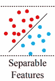
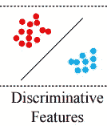
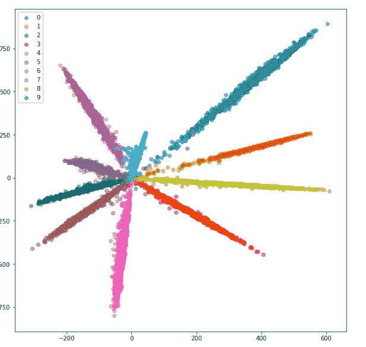
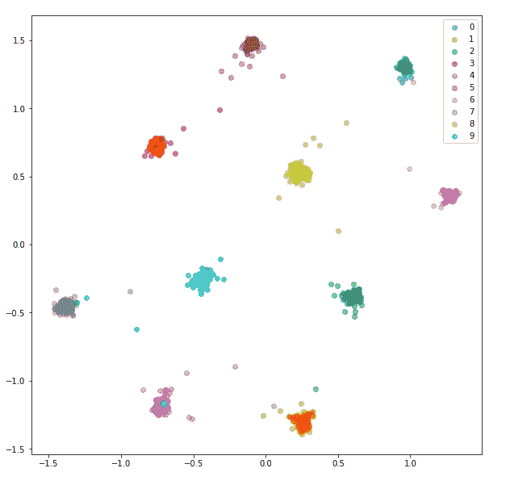
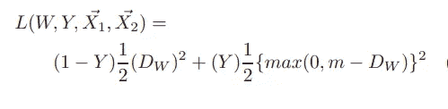
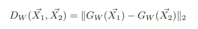
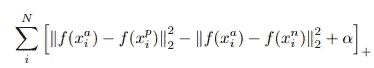
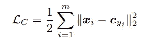

# 神经网络直觉:9。远程度量学习

> 原文：<https://towardsdatascience.com/neural-networks-intuitions-9-distance-metric-learning-dae7c3a0ebdf?source=collection_archive---------22----------------------->

## 远程度量学习

欢迎回到我的神经网络直觉系列。在第九部分中，我们将深入了解**远程度量学习*，使用它背后的动机，提出的各种方法及其应用。*

*注意:本文讨论的所有技术都属于 ***深度度量学习(DML)，即使用神经网络的距离度量学习。****

# ***距离度量学习:***

> *距离度量学习意味着*在低维空间中学习距离，这与语义相似性的概念一致。(如[* [中所给，使用代理](https://arxiv.org/pdf/1703.07464.pdf) *】的无争议距离度量学习)**

*上面的说法是什么意思 w.r.t 图像域？*

> *这意味着学习低维空间(非输入空间)中的距离，使得输入空间中的相似图像导致相似的表示(低距离)，而不相似的图像导致不同的表示(高距离)。*

*好的，这听起来正是分类器所做的。不是吗？是的。*

*那么这与监督图像分类有什么不同呢？为什么术语不同？*

> *度量学习解决了机器学习中的开集设置问题，即在测试时推广到新的示例。*

*这对于特征提取器之后是完全连接的层分类网络是不可能的。*

> *为什么？*

*这是一个非常重要的问题。答案如下:*

1.  *一个分类器学习***类特有特征而不一定是类属特征。****
2.  *具有 ***标准交叉熵损失的分类器最大化类间距离*** ，使得 FC 层之前的特征是**线性可分的。***

**

*由分类网络提取的特征(在 FC 层之前，有 CE 损失)是线性可分的*

*并且不旨在最小化导致期望的 ***区别特征的类内距离。****

**

*具有低类内距离和高类间距离的特征*

> *学习区别特征的这一方面是度量学习所实现的。*

**

*使用 Softmax 分类生成的嵌入*

**

*使用双/三重网络生成的嵌入*

*在研究度量学习中最广泛使用的方法之前，让我们看看它的应用，使问题陈述更加具体，以及为什么标准的分类方法可能不适合。*

*度量学习的应用如下:*

1.  **图像检索**
2.  **近似重复检测**
3.  **少/零投学习**

*太好了！*

*现在让我们看看度量学习中使用的突出方法:*

**a .具有对比损耗(对)的连体网络**

**b .具有三重损失的三重网络(三重网络)**

**c .分类基础方法。**

# *目标:*

*以产生对于相似图像在欧几里得空间中接近(假设)而对于不相似图像远离的嵌入。*

# *解决方案:*

# **a .有对比损耗的连体网络:**

*论文[通过学习不变映射进行降维](http://yann.lecun.com/exdb/publis/pdf/hadsell-chopra-lecun-06.pdf)通过将两幅图像作为输入并输出图像对是否相似来解决该问题。*

**方法:**

1.  *为数据集中的每个*图像*创建*相似*和*不相似*集合。*
2.  *将*两幅图像*(来自相似/不相似集合)传递到同一个神经网络，并提取低维*嵌入/表示。**
3.  *计算两个嵌入之间的欧几里德距离。*
4.  *将损失降至最低，以实现上述目标。*
5.  *对大量对重复 1–4(所有对可能都不可行)，直到模型收敛。*

*所以现在我们需要一个损失函数(包含欧几里德距离),对于相似的对来说是 0，对于不相似的对来说是 1。*

> *这正是对比损失函数的作用！*

## *对比损失:*

*设 ***(X1，X2)*** 为*输入图像对*， ***Gw*** 为产生低维表示的*函数映射*(其中 **w** 代表*参数*)，**Y**为表示*相似或不相似的*地面真实标签***

**

*对比损失函数([通过学习不变映射](http://yann.lecun.com/exdb/publis/pdf/hadsell-chopra-lecun-06.pdf)进行维度缩减)*

**

*Dw =表示之间的欧几里德距离*

> *对比损失与传统的交叉熵损失有相似之处。损失函数中的第一项处理相似对(Y=0 ),使得 Dw 变为 0。第二项处理不同的线对(Y=1 ),使得 Dw 至少变为 m。*

*这里 m 是余量，m 是 0。*

> *为什么我们需要在训练中展示不同的配对？为什么不简单地最小化一组相似对的损失函数呢？*

> *作者回答说，“涉及不同对的对比术语是至关重要的。简单地在所有相似对的集合上最小化 DW (X1，X2)通常会导致崩溃的解决方案，因为 DW 和损耗 L 可以通过将 GW 设置为常数而变为零。*

> *既然我们已经了解了什么是对比损失函数，那么什么是连体网络呢？*

> *这种架构被称为暹罗架构，其中相同的网络(即共享相同的参数集)被用于提取一对中的两个图像的低维表示。*

# *b.三重网络，三重损耗:*

*论文 [FaceNet:人脸识别和聚类的统一嵌入](https://arxiv.org/pdf/1503.03832.pdf)采用了与对比损失类似的方法——除了不是在每一步都处理成对图像，而是考虑三个一组的图像。*

> *三元组由锚、正面(类似于锚)和负面(不同于锚)图像组成。*

**进场:**

1.  *形成三元组(由具有共同锚图像的相似和不相似对组成)。*
2.  *通过相同的神经网络传递三元组，并提取低维嵌入。*
3.  *计算欧几里得距离并最小化损失。*
4.  *对大量的三个一组重复 1-3，直到收敛。*

## *三重损失:*

*设 ***f*** 为产生低维表示的函数映射， ***xa*** 为锚图像， ***xp*** 为正图像， ***xn*** 为负图像， ***α*** 为空白。*

**

*三重损失函数*

> *三重损失确保锚图像的表示比任何其他负图像更接近与其相似的所有图像。*

> *什么是三联体网络？*

> *其中相同的网络(即共享相同的参数集)用于提取三元组中所有图像的低维表示的架构被称为三元组架构/网络。*

## *对比损失法和三重损失法的问题:*

1.  *随着训练样本数量的增加，图像对和三元组的数量急剧增加，使得很难对所有可能的对或三元组进行训练。*
2.  *训练对和三元组(即简单样本)的不良选择会导致辨别特征的无效学习。*

> *那么，如何解决上述问题呢？*

> *通过仔细选择训练图像对和三元组——离线或在线，并使用较大的批量。*

**注意:有很多种技术有助于用对比和三元组方法解决采样问题，我希望在以后的文章中讨论这些技术:)*

# *c.基于分类:中心损失*

*论文[一种用于深度人脸识别的判别特征学习方法](https://kpzhang93.github.io/papers/eccv2016.pdf)通过引入一种新的损失(称为 ***【中心损失】*** )以及交叉熵损失(即 ***)来解决使用香草神经网络分类的目的。****

*本文解决了文章开头提到的问题——*“分类器没有最小化* ***类内*** ***距离*** *而只是最大化* ***类间距离*** *导致可线性分离的特征而不是可区分的特征”*。*

## *中心损耗:*

> *中心损失最小化每个类中心和类样本表示之间的距离-这确保了同一类中样本的表示除了保持类间距离之外还保持相似(由 ce 损失负责)。*

*设 ***x*** 为输入样本， ***c*** 为该样本的分类中心。*

**

*中心损失*

> *每次迭代计算类中心(嵌入)和样本嵌入之间的距离，并更新权重。*

## *基于分类的培训的问题:*

1.  *基于分类器的方法在目标类数量非常多的情况下变得不切实际——这是通常的情况，也是使用成对/三重损失背后的强大推理。*

*以上就是本文中关于 ***深度距离度量学习的全部内容。*** 我希望你们所有人都很好地理解了这个问题是什么，以及如何通过各种有趣的技术来解决这个问题:)*

*干杯！*

*其他资源:*

*[https://Neptune . ai/blog/content-based-image-retrieval-with-siamese-networks](https://neptune.ai/blog/content-based-image-retrieval-with-siamese-networks)*