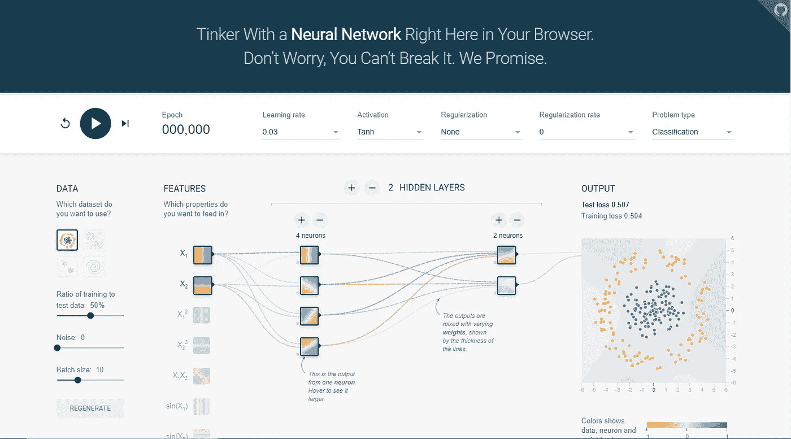
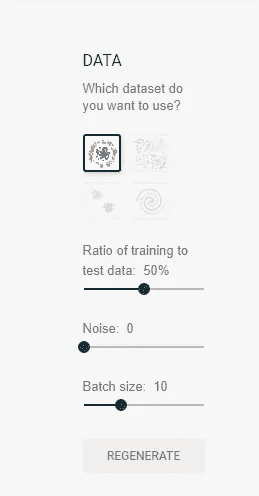
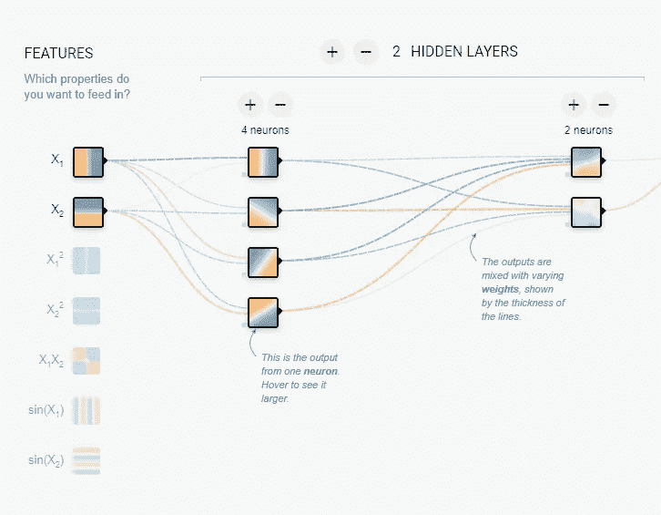
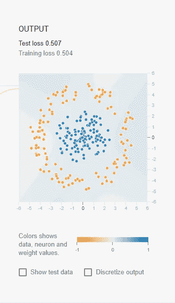
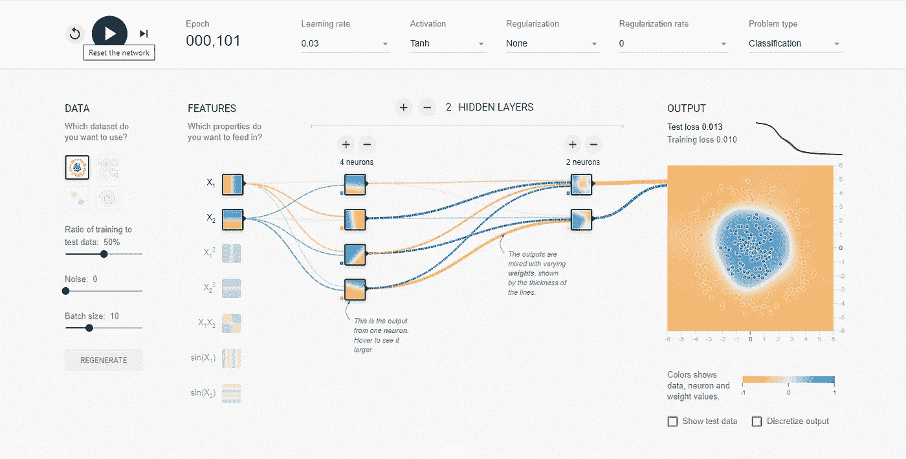
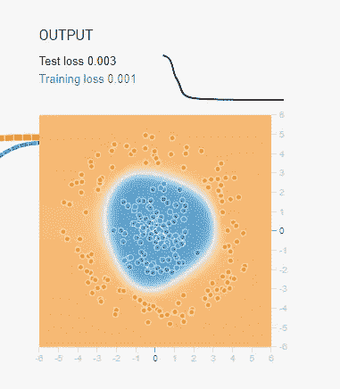

# 神经网络拿 TensorFlow 游乐场开玩笑！

> 原文：<https://towardsdatascience.com/neural-networks-made-fun-with-tensorflow-playground-4e681a0c4529?source=collection_archive---------30----------------------->

## 使用 TensorFlow Playground 探索神经网络并从中获得乐趣

彼得·康伦在 [Unsplash](https://unsplash.com?utm_source=medium&utm_medium=referral) 上的照片

TensorFlow Playground 是一个非常棒的网站，在这里您可以可视化并直观地了解神经网络是如何工作的。这个网站由谷歌的 TensorFlow 团队开发，是让你探索强大的深度神经网络的最佳平台之一。

这篇短文将在不到 5 分钟的时间内指导您如何在没有任何神经网络经验的情况下开始在 TensorFlow 操场上工作。

我强烈建议你们所有人从下面提供的链接在浏览器的一个新标签上打开这个网站，然后跟着做。读完这篇文章后，你会非常熟悉如何使用这个神奇工具的基本知识。

 [## 张量流-神经网络游乐场

### 这是一种构建从数据中学习的计算机程序的技术。它非常松散地基于我们如何思考…

playground.tensorflow.org](https://playground.tensorflow.org/#activation=tanh&batchSize=10&dataset=circle&regDataset=reg-plane&learningRate=0.03&regularizationRate=0&noise=0&networkShape=4,2&seed=0.33938&showTestData=false&discretize=false&percTrainData=50&x=true&y=true&xTimesY=false&xSquared=false&ySquared=false&cosX=false&sinX=false&cosY=false&sinY=false&collectStats=false&problem=classification&initZero=false&hideText=false) 

好吧！所以，让我们开始了解这个网站上不同的东西。

GIF 来自 [GIPHY](https://giphy.com/gifs/get-yelp-eat24-oS8pRFxbD0d44)

点击链接后，您应该能够找到 TensorFlow 游乐场平台，它应该类似于下图。

作者截图

在确认我们现在都在同一页上之后，我们可以相应地理解第一个小节。

好吧！现在让我们理解下面显示的栏上的所有功能。

作者截图

**运行和暂停**按钮用于开始连续运行 epochs，直到您决定停止。当纪元运行时，模型将继续训练。播放按钮左侧有一个**复位**按钮，用于复位整个网络。播放按钮的右侧是**步长增加**按钮，用于一次增加一个步长。此按钮很有用，因为运行/暂停按钮有时可能太快而达不到适当的结果。将鼠标悬停在这些按钮上，以了解它们到底是什么。

*   **学习速率:**神经网络学习正确拟合输出的速率。你可以根据自己的意愿改变它，并随时进行实验。但是，在本次演示中，我们将使用所有默认值。
*   **激活:**激活函数用于增强神经网络的性能。我们有四种选择，它们是 tanh、ReLU、Sigmoid 和 linear。
*   **正则化:**这是一种对学习算法进行轻微修改以使模型更好地泛化的技术。我们有 L1 和 L2 正则化选项可以使用，但我们将使用默认的无。
*   **正则化率:**如果我们选择正则化方法，该选项允许我们选择正则化率。
*   **题型:**我们有两个选项可以选择，即分类或回归型题型。在本次演示中，我们将使用分类类型。

现在，让我们继续了解我们正在处理的数据类型以及我们拥有的选项。

作者截图

您有四个难度递增的数据集选项，即圆形、异或、高斯和螺旋。我们可以选择将数据集分割成一个训练集，并以默认的 50%分割进行测试。如果您愿意，您可以引入多达 50 个噪声点。它还包含一个批处理大小按钮，为每个时期运行一个特定的批处理。最终重新生成按钮，再次生成数据。

橙色和蓝色在整个可视化中的使用方式略有不同，但一般来说，橙色显示负值，而蓝色显示正值。数据点(用小圆圈表示)最初是橙色或蓝色的，分别对应一个正值和一个负值。

让我们转到下一部分，即神经网络架构。

作者截图

默认情况下，我们有一个 1:2:1 的神经网络架构，这意味着输入层有 2 个节点，隐藏层有 2 个，第一层有 4 个节点，第二个隐藏层有 2 个节点，最后是输出层。你可以根据自己的选择随意修改。在本次演示中，我将使用所有默认设置。

在隐藏层中，线条由神经元之间连接的权重来着色。蓝色表示正权重，这意味着网络正在使用给定的神经元输出。橙色线表示网络正在分配负权重。

在输出图层中，点根据其原始值显示为橙色或蓝色。背景颜色显示网络对特定区域的预测。颜色的强度显示了预测的可信度。

作者截图

上图是我们将查看各个训练点的地方，您可以选择查看测试数据或离散化输出。

让我们运行网络 101 个纪元。

作者截图

在运行了 101 个时期之后，我们可以注意到损失已经显著减少，并且执行了几乎完美的分类。

作者截图

运行 300 个历元后，我们可以看到损耗降低到几乎可以忽略不计。

有很多不同的选择可以尝试，我强烈建议你们都去尝试一下。关于 TensorFlow 游乐场的简短说明和指南到此结束。

Robynne Hu 在 [Unsplash](https://unsplash.com?utm_source=medium&utm_medium=referral) 上的照片

# 结论:

TensorFlow 游乐场是以直观有趣的方式开始深度神经网络的最佳方式之一。你可以重新利用它，因为它在 [GitHub](https://github.com/tensorflow/playground) 上是完全开源的，希望它能让神经网络更容易访问和学习。你可以按照他们的 [Apache 许可](https://github.com/tensorflow/playground/blob/master/LICENSE)以任何方式自由使用它。如果您有任何关于添加或更改的建议，您可以在这里让他们知道[。](https://github.com/tensorflow/playground/issues)

对所有 TensorFlow 开发人员为这个令人惊叹的项目和他们所做的所有其他令人敬畏的项目大声喊出来。我希望你们在学习如何使用 TensorFlow 游乐场的基础知识的同时，喜欢阅读这篇文章。

点击这里查看我的其他文章:

 [## 神经网络的完整有趣和复杂的历史！

### 重温人工神经网络发展背后的迷人历史

towardsdatascience.com](/the-complete-interesting-and-convoluted-history-of-neural-networks-2764a54e9e76)  [## Python 从头编码:没有任何机器学习库的矩阵乘法！

### 从零开始了解如何在没有任何机器学习库的情况下实现矩阵乘法！

towardsdatascience.com](/python-coding-from-scratch-matrix-multiplication-without-any-machine-learning-libraries-463624fe8726)  [## 10+牛逼 Python 编辑器的简明指南，以及如何选择最适合你的编辑器…

### 帮助您在各种 python 开发环境中进行选择的简明指南

towardsdatascience.com](/a-concise-guide-of-10-awesome-python-editors-and-how-to-choose-which-editor-suits-you-the-best-465c9b232afd)  [## 5 个常见的 Python 错误以及如何避免它们！

### 从初学者到专家，每个人在 python 和机器学习中都容易出现这些错误。

towardsdatascience.com](/5-common-python-errors-and-how-to-avoid-them-63d9afc1a58f)  [## 5 个关于 Python、机器学习和深度学习的超棒的计算机视觉项目创意！

### 讨论 5 个很酷的计算机视觉项目，学习新的技能，增强你的简历

towardsdatascience.com](/5-awesome-computer-vision-project-ideas-with-python-machine-learning-and-deep-learning-721425fa7905) 

非常感谢你阅读这篇文章，我希望你们都有美好的一天！