# 神经网络概述

> 原文：<https://towardsdatascience.com/neural-networks-overview-c3e6ab3e366b?source=collection_archive---------31----------------------->

## 数学、代码、绘图、情节、类比和思维导图

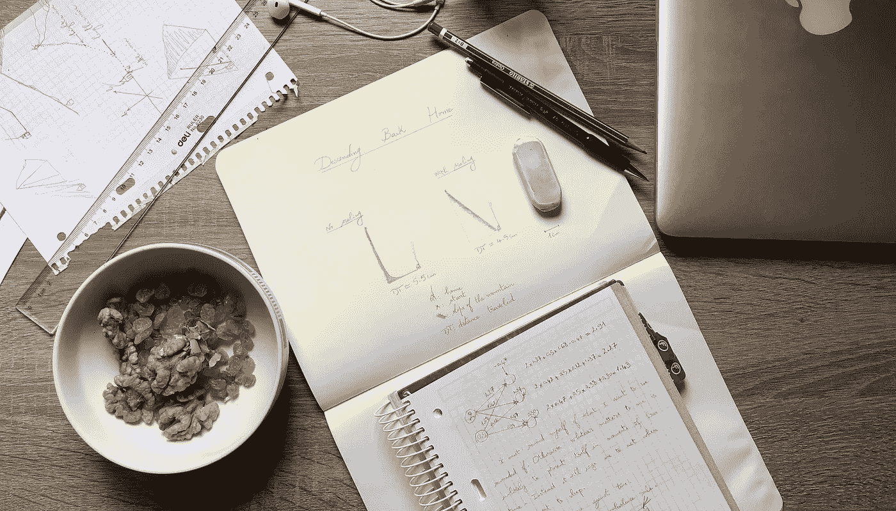

我桌子的照片。这项工作是由爱、核桃、葡萄干和茶推动的

我的意图是用类比、数学、代码、图表、绘图和思维导图与你一起走过神经网络的主要概念。我们关注神经网络的构建模块:感知器。

在整篇文章中，我们将直面令人生畏的数学，并使用 Python 代码和 Numpy 实现它。我们还将看看使用 Scikit-learn 的等效实现。我们的结果将使用 Matplotlib 和 Plotly 可视化。在每个概念的结尾，我们将使用思维导图来构建我们的理解。

# 感知器的结构

感知器的输入层是一个占位符。它包含的结点数与训练数据集中的要素数一样多。这些节点中的每一个都通过一条边连接到输出节点。我们将权重分配给边，将偏差分配给输出节点。

一个很好的类比是把感知器想象成一只乌贼。它的输入层有许多分支。臂的数量等于它需要的输入的数量。在这个类比中，让我们想象我们的数据集包含三种类型的配料:咸的、酸的和辣的。我们的鱿鱼需要三只手臂从每一种类型中抓取一种成分。手臂连接到头部，头部是鱿鱼混合配料的输出节点，并为它们的味道打分。

鱿鱼一生都生活在海里，很难注意到咸的成分，所以它们不会影响整体味道。然而，对于酸味和辣味，它可能是一个真正的势利小人。感知器中的权重可以理解为代表我们的配料类型对最终味道的贡献。这种偏见可以理解为影响鱿鱼味觉的一个因素，就像它的情绪或食欲一样。

输入乘以相应的权重，然后与偏差相加。这种具有各自权重的成分的混合和具有偏差的相加是一个**仿射函数:** *z=𝑤x+𝑏*

混合后，鱿鱼输出其对味道的印象分数。该分数被称为激活，并使用**激活函数**进行计算。激活可能只是结果 *z* ，因为它是*，*在这种情况下，我们可以使用**身份**函数。它可能是一个介于-1 和 1 之间的数字，在这种情况下，我们可以使用**双曲正切**函数。也可以是 0 到 1 之间的数字，在这种情况下，我们可以使用 **sigmoid** 函数。或者 0 和∞之间的一个数，在这种情况下，我们可以使用**整流器线性单元(ReLU)** 功能。最后，还可以要求 Squid 为相同的输入给出多个分数，每个分数基于不同的标准在 0 到 1 之间。在这最后一种情况下，我们可能会对将所有分数相加为 1 感兴趣，对于这个任务来说， **softmax** 函数将是理想的。

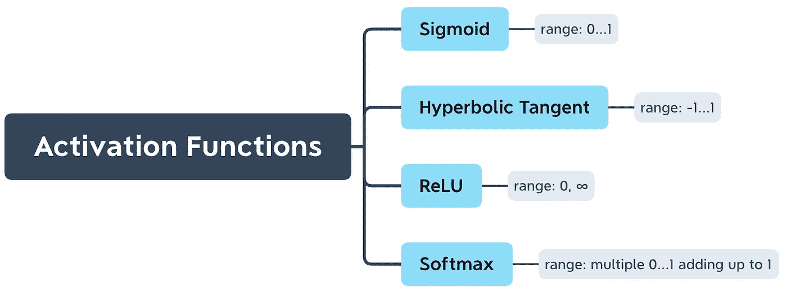

思维导图 1:激活功能

选择取决于任务和最适合您的输出间隔。利用权重 *𝑤* 和偏差 *𝑏* 从输入向量𝑎计算 sigmoid 激活𝑎′的示例:

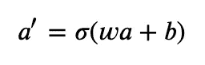

等式 1:乙状结肠活化

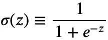

等式 2: sigmoid 函数

**术语:**

*   看到输入向量在等式 1 中用 *𝑎* 表示，而在 *z=𝑤x+𝑏.中用 *x* 表示，可能会令人困惑*原因是输入层中的节点也被称为激活。在多层感知器的情况下，有两层以上，每一层都被认为是下一层的输入层。
*   权重和偏差被认为是𝑎′.的参数可以将权重和偏差合并成一个参数向量。这可以通过在输入向量中预先加上 1，并在最初只包含权重的向量中预先加上偏差来实现。

**关于激活函数的注释:**因为仿射函数是线性的，所以它们不能表示非线性数据集。由于激活函数引入的非线性，神经网络被视为*通用函数逼近器*。

# 训练感知器

> 

**我们对朋友鱿鱼的产量不满意。它运行的参数似乎是随机的。果然，偏差和权重已经初始化为:**

**我们想训练鱿鱼获得更好的味道。我们对准确口味的标准是一个向量 *y* ,包含我们的配料数据集中每一行的实际分数。将根据 *y.* 中的分数对 Squid 的性能进行评估**

**评估 Squid 性能的目的是测量其相对于目标的误差 *y.* 有不同的函数来计算该误差:**

*   ****均方误差(MSE):** 如果任务是回归并且数据集不包含离群值，这是一个不错的选择。**
*   ****绝对平均误差(AME):** 如果任务是回归并且数据集包含异常值，这是一个不错的选择。**
*   ****胡伯损失:**中小企业和 AME 的组合**
*   ****交叉熵(对数损失):**如果任务是分类，这是一个很好的选择:感知机的输出是一个概率分布。**

**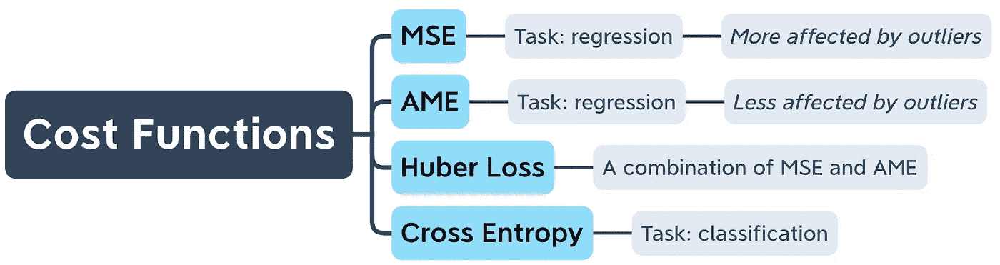**

**思维导图 2:成本函数**

**为了评估我们的感知器，我们将使用均方误差函数:**

**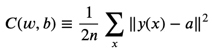**

**等式 3:均方误差**

**训练是通过调整参数 *w* 和 *b* 来最小化误差𝐶。最形象化的比喻是，当天太黑看不见的时候，你在一座山上试图下山回家。下方的 Home down 代表最小的误差𝐶。计算 MSE 的平方根，就可以得到你和家之间的直线距离。然而，知道这个距离对你在黑暗中没有任何帮助。相反，你想知道的是你下一步的方向。**

**3D 世界中的方向包括三个坐标 x、y 和 z。因此问题是“家在哪里？”必须相对于 x、y 和 z 来回答。同样，问题“最小误差𝐶在哪里？”必须根据参数 *w* 和 *b* 进行回答。这些方向的数学表示是𝐶.的**梯度**更具体地说，𝐶: -∇𝐶.的负梯度**

**∇𝐶是一个向量，包含 c 对每个参数的所有偏导数。对于 MSE，我们从推导等式 3 开始:**

**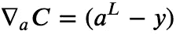**

**等式 MSE 的梯度等于层 L 的激活减去 y**

**我们仅仅推导了 MSE，在得到𝐶对参数的偏导数之前，我们还有一些工作要做。在等式 4 中，𝑎取决于激活函数的输出。在 sigmoid 激活的情况下，𝑎等价于等式 1 中的𝑎′。接下来是𝐶相对于 *z* 的梯度(回想一下 *z=𝑤x+𝑏* ):**

**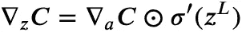**

**等式 5:**C**相对于 **z** 的梯度是 **C** 相对于 **a** 的梯度与 **z** 的 s 形导数的**的乘积****

**等式 5 令人生畏，直到您在 Python 代码中看到它的对等物**

**我们有𝐶相对于 z 的梯度。由于 *z* 中的偏差乘以 1，C 相对于偏差的偏导数为:**

**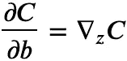**

**等式 6:C**相对于 b**的偏导数******

**并且由于权重乘以输入 *x，*C 相对于权重的偏导数为:**

**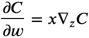**

**等式 7:C**相对于 w** 的偏导数**

**有了成本𝐶对参数的偏导数，我们现在就可以知道下一步回家的方向了。现在我们需要知道我们应该走多远。选择一个好的步长很重要。如果你的步子太窄，你将无法跳过你前进道路上的障碍。如果你的脚步太宽，你可能会越过下面的整个城镇，最终到达另一座山。一个好的步长介于两者之间，可以通过将偏导数(等式 6 和 7)乘以一个选定值来计算，该选定值称为**学习速率**或 **eta** : **𝜂** 。**

**现在我们可以走下山坡了。这相当于更新我们的坐标/参数:**

**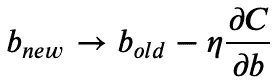**

**等式 8:更新偏差**

**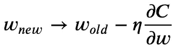**

**等式 9:更新权重**

**这就结束了**梯度下降:**在更新参数之前计算下一步的方向和大小的过程。通过梯度下降，我们可以训练鱿鱼获得更好的味道。我们通过让 Squid 以一些输入为食并使用等式 1 输出一个分数来做到这一点:这被称为**前馈**。分数作为𝑎代入方程 4，其结果作为𝐶相对于𝑎的梯度代入方程 5。然后，我们在等式 6 中计算𝐶相对于 z 的梯度。最后，我们计算𝐶相对于参数的梯度，并更新 Squid 的初始随机参数。这个过程被称为**反向传播**，因为它将误差从输出层反向传播到输入层。**

**梯度下降是迭代的。当满足以下条件之一时，它会停止:**

*   **已达到定义的最大迭代次数。**
*   **梯度达到 0 或接近 0 的某个定义值。**
*   **验证错误已达到最小值。这叫早停。**

**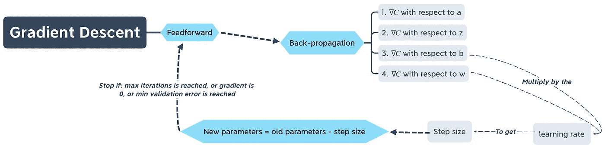**

**思维导图 3:梯度下降**

# **将碎片拼在一起**

**感知器的完整实现可以从我们看到的代码片段中构建。为了不让这篇文章被代码淹没，这里有一个链接指向一个感知器的完整实现。**

**为了看到我们的感知机在工作，让我们做一个非常简单的数据集。我们将随机生成包含一百行整数的两列。然后，我们将创建第三列来存储我们的标签。标签将等于第一列加上第二列值的一半。**

**[生成我们的数据集](https://gist.github.com/Mehdi-Amine/41e04f8faa8808ac655640f7c3ea55e2)**

**我们知道，为了达到目标，我们的感知器必须从随机参数开始，并优化它们，使偏差等于 0，第一个权重等于 1，第二个权重等于 0.5。让我们来测试一下:**

**[太好了！我们的感知机已经成功优化了所有参数。](https://gist.github.com/Mehdi-Amine/7032ccfd615eca0e4752e572a4db852c)**

## **在 Scikit-learn 中**

**我们从最基本的感知机开始。因为它正在执行回归，所以不需要激活函数。到目前为止，它所做的只是随机梯度下降。在 Scikit-learn 中，这可以通过使用 SGDRegressor 类来实现。虽然 Scikit-learn 包含一个感知器类，但它并不服务于我们当前的目的，因为它是一个分类器，而不是回归器。**

**[检验 SGDRegressor 优化参数前的训练](https://gist.github.com/Mehdi-Amine/4c74f9f7baa7b053dc9a97d498fd4088)**

## **可视化梯度下降**

**我们可以画出我们的感知器采取的步骤，看看它达到理想参数的路径。下面是使用 Matplotlib 绘制梯度下降的代码:**

**[使用 Matplotlib 可视化梯度下降](https://gist.github.com/Mehdi-Amine/d0889b465d4a32b8e4f474fc74b10ad7)**

**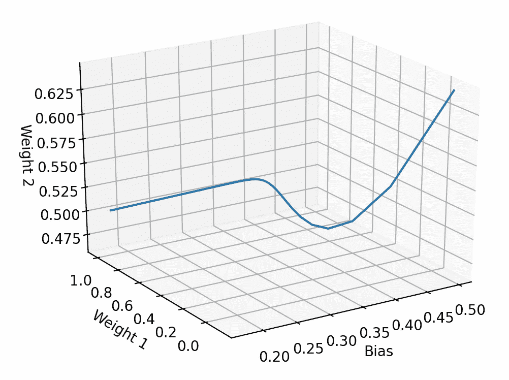**

**前面代码的输出:使用 Matplotlib 可视化梯度下降**

**这是从不同的角度和使用 Plotly 的同一个情节:**

**[使用 Plotly 可视化梯度下降](https://gist.github.com/Mehdi-Amine/905c695c17af1c44752a305a99b5dfac)**

**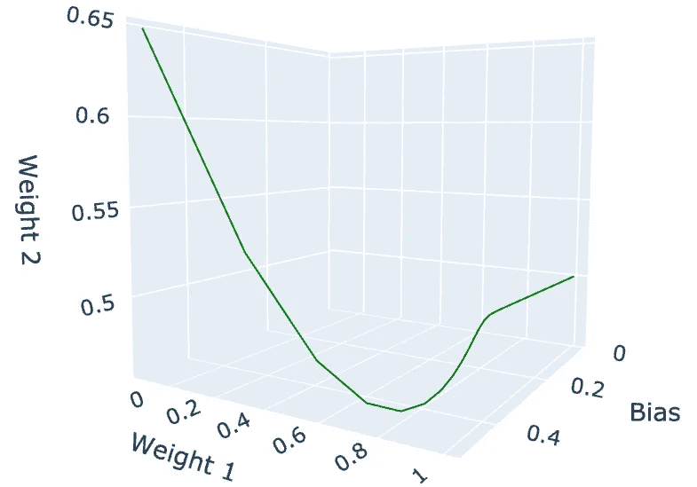**

**前面代码的输出:使用 Plotly 可视化的梯度下降**

**我想让你看到我们的感知机的下降导致它回家。但这不是最直的路，远非如此。我们引入了对**功能缩放**的改进。**

# **特征缩放**

**通常情况下，机器学习算法在缩放数字输入的情况下表现更好。如果没有缩放，梯度下降需要更长时间才能收敛。在 2D 的世界里，你仍然试图在黑暗中下山回家，你需要减少你离家的垂直和水平距离。如果两个距离在不同的范围内，您将花费更多的时间来缩短范围较大的距离。**

**例如，如果你需要减少的垂直距离是以千为单位，而水平距离是以个为单位，那么你的下降主要是向下爬。当你接近最小水平距离时，你仍然需要减少垂直距离。**

**将这两个距离缩放到相等的范围会使您的脚步同时影响这两个距离，这使您能够沿着直线直接向家行进。**

**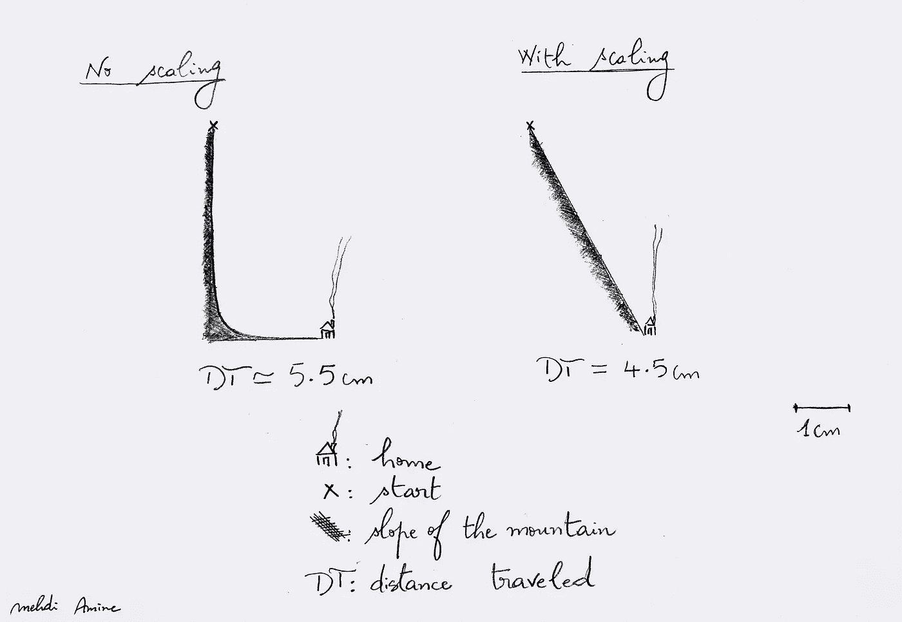**

**说明比例对梯度下降的影响的简单图形**

**两种最常见的数据缩放方式是**规范化**和**标准化**。我们将实现这两个方法，并可视化它们对梯度下降的影响。**

## **正常化**

**也被称为**最小-最大缩放**，是一种将数据压缩到 0 和 1 之间的方法:**

**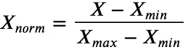**

**等式 10:最小-最大缩放或归一化**

**[使用 Numpy](https://gist.github.com/Mehdi-Amine/dc78714366a3aed1d1f9204e0b08e80a) 标准化我们的训练数据集**

****sci kit-learn 中的标准化:****

**[使用 Scikit-learn 标准化我们的训练数据集](https://gist.github.com/Mehdi-Amine/4cc3780057f37b63b4218863a514241c)**

## **标准化**

**也称为 **z 分数归一化，**是一种将数据集中在 0 附近，标准差等于 1 的方法。𝜇是平均值，𝜎是标准差:**

**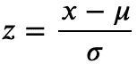**

**等式 11: Z 分数标准化或规范化**

**[使用 Numpy 标准化我们的训练数据集](https://gist.github.com/Mehdi-Amine/dee046527cb8a9ae117b37e5cbdd5478)**

****sci kit-learn 中的标准化:****

**[使用 Scikit-learn 标准化我们的训练数据集](https://gist.github.com/Mehdi-Amine/f19234372b93f1aa486bd79aa2f68eb0)**

**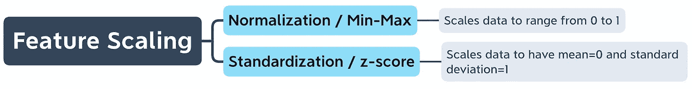**

**思维导图 4:功能扩展**

## **特征缩放对梯度下降的影响**

**为了研究特征缩放的效果，我们将再训练两个感知器。目的是比较缩放和不缩放时梯度下降中参数的收敛性。**

**我们的第一个感知机是在未缩放的数据集上训练的。第二个将在标准化数据上训练。第三个将接受标准化数据的训练。**

**[用标准化数据训练两个感知机](https://gist.github.com/Mehdi-Amine/f1577cfda558b38934738488c321f091)**

**我们现在可以想象我们的三个感知器所采取的路径。下面的代码使用 Plotly:**

**[可视化三个梯度下降](https://gist.github.com/Mehdi-Amine/6ef489a0afda130c13cc51cff45aa185)**

**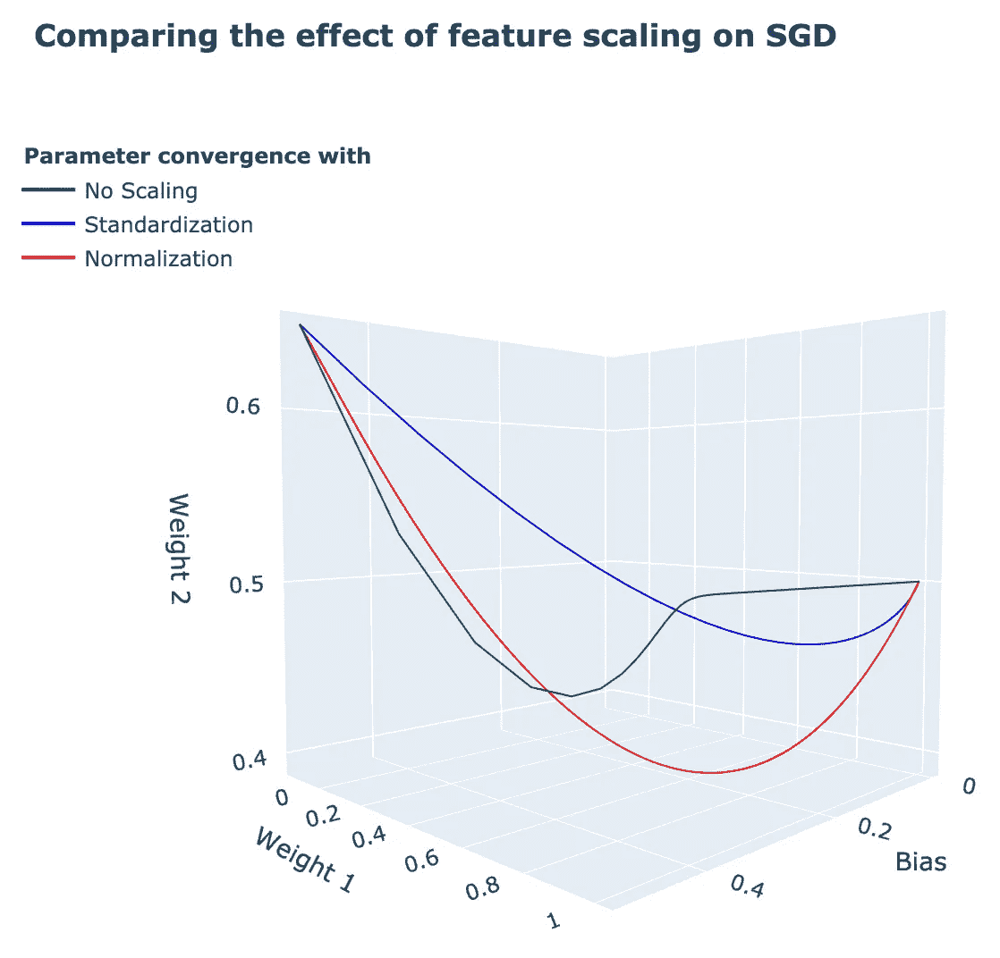**

**[上一段代码的输出:点击此处与图形](https://mehdi-amine.github.io/sgd-plot/sgdplot.html)交互**

**在缩放数据上训练的感知机采取了更直接的路径来收敛。直接路径使它们的下降速度更快，步幅更宽(可能通过增加学习速率`eta`实现)，步数更少(可能通过减少迭代次数`epochs`)。**

# **概括起来**

**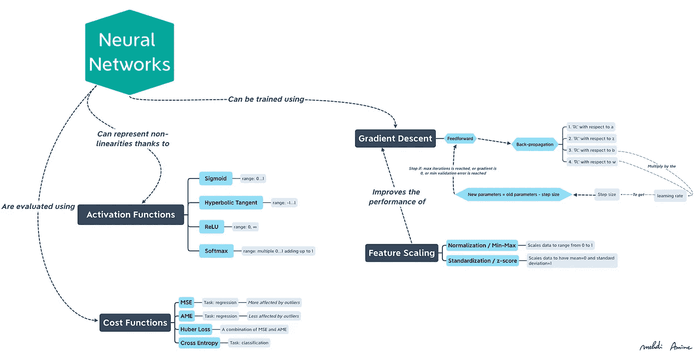**

**思维导图 5:概念总结**

# **参考**

**A.Géron，[使用 Scikit-Learn、Keras 和 TensorFlow 进行动手机器学习](https://www.oreilly.com/library/view/hands-on-machine-learning/9781492032632/) (2019)**

**I. Goodfellow，Y. Bengio 和 a .库维尔，[深度学习](http://www.deeplearningbook.org/) (2016)**

**米（meter 的缩写））尼尔森，[神经网络和深度学习](http://neuralnetworksanddeeplearning.com/index.html) (2019)**

**米（meter 的缩写））胺，*神经网络概述:* [Jupyter 笔记本和游乐场](https://github.com/Mehdi-Amine/neural-networks-overview-of-my-understanding/blob/gh-pages/perceptron-overview.ipynb)**

**米（meter 的缩写））胺，*神经网络概述:* [代码片段](https://gist.github.com/Mehdi-Amine)**

**XMind，[思维导图软件](https://www.xmind.net/)**