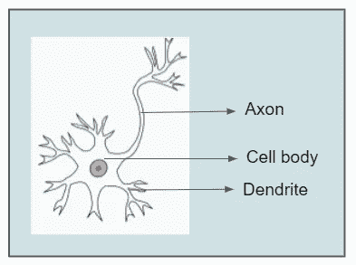
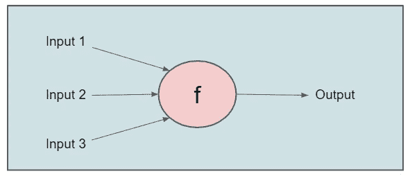
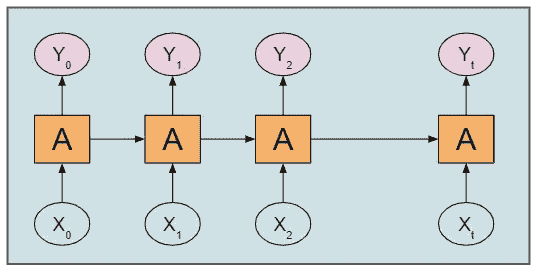
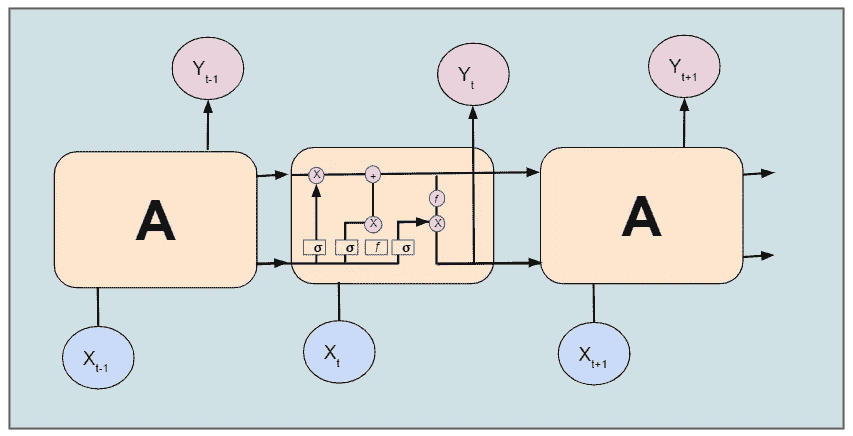

# 具有记忆的神经网络

> 原文：<https://towardsdatascience.com/neural-networks-with-memory-27528a242b78?source=collection_archive---------19----------------------->


[Infralist.com](https://unsplash.com/@infralist?utm_source=medium&utm_medium=referral)在 [Unsplash](https://unsplash.com?utm_source=medium&utm_medium=referral) 上拍照

## 深度学习

## 了解 LSTM RNN 不到 5 分钟

我们总是听说**神经网络** ( **NNs** )是受生物神经网络的启发。这个巨大的展示是以一种奇妙的方式完成的。

图 1 显示了单个神经元的解剖结构。中心部分称为细胞核所在的细胞体。有各种导线将刺激传递到细胞体，少数导线将输出发送到其他神经元。树突的厚度暗示了刺激的重量/偏向/力量。许多具有不同细胞体的神经元堆叠在一起，形成了生物神经网络。



图 1:单个神经元的解剖([来源](https://en.wikipedia.org/wiki/Unipolar_neuron#:~:text=A%20unipolar%20neuron%20is%20a,form%20dendritic%20and%20axonal%20processes.)，作者编辑)

在神经网络中也实现了同样的结构。输入通过带加权边的激活函数传递。生成的输出可以传递给另一个激活函数。许多激活功能可以堆叠起来，其中的每一个都被称为一个**层**。在一层中，我们可以有多个神经元。



图 2:单神经元神经网络(图片由作者创建)

这些激活函数可以像 sigmoid 函数一样简单

## 神经网络相对于传统机器学习算法的优势

*   可以处理各种类型和大小的数据
*   可以轻松配置多种功能
*   可以有效地处理非线性数据

# 具有记忆的神经网络

神经网络和生物神经网络的主要区别在于记忆。虽然人脑和神经网络都有能力从可用的记忆中读取和写入，但大脑也可以创建/存储记忆。[研究人员](https://www.bioinf.jku.at/publications/older/2604.pdf)发现这一关键差异是当今人工智能系统达到人类智能水平的主要障碍。

DeepMind 的研究人员旨在通过构建一个神经网络并将其连接到外部存储器来构建一台可区分的计算机。神经网络将充当带有存储器的 CPU。这种可微分计算机旨在从输入和输出数据中学习程序(算法)。

当数据量巨大时，使用神经网络。例如，文本数据具有大量的维度，或者图像数据被分割成大量的像素。

# 递归神经网络

一部电影由一系列场景组成。当我们观看一个特定的场景时，我们不会试图孤立地理解它，而是联系以前的场景来理解。以类似的方式，机器学习模型必须通过利用已经学习的文本来理解文本，就像人类神经网络一样。

在传统的机器学习模型中，我们无法存储模型的先前阶段。然而，递归神经网络(通常称为 RNN)可以为我们做到这一点。下面我们来仔细看看 RNNs。



图 3:基本 RNN 的工作原理(图片由作者提供)

RNN 有一个重复模块，它接收前一级的输入，并将其输出作为下一级的输入。然而，在 RNNs 中，我们只能保留最近阶段的信息。这就是 LSTM 的问题所在。

# 长短期记忆网络

为了了解长期依赖关系，我们的网络需要记忆能力。LSTMs 是可以做到这一点的 rnn 的特例。它们具有与 RNNs 相同的链状结构，但具有不同的重复模块结构。



图 4:LSTM 的工作(图片由作者提供)

LSTM 在序列到序列建模任务中有广泛的应用，如语音识别、文本摘要、视频分类等。

要想快速了解这些网络在现实生活中的应用，请阅读下面的文章。

[](/spam-detection-in-emails-de0398ea3b48) [## 检测电子邮件中的垃圾邮件

### 应用自然语言处理和深度学习进行垃圾邮件检测

towardsdatascience.com](/spam-detection-in-emails-de0398ea3b48) 

垃圾邮件检测模型可以通过将文本数据转换成向量、创建 LSTM 模型并用向量拟合该模型来实现。

# 履行

为了实现这些完整的神经网络，Keras 和 TensorFlow 将其简化。

我们正在实现一个带有 ReLU 激活功能的双向 LSTM。

```
#Importing necessary libraries
import tensorflow as tf
from keras.layers import LSTM, Activation, Bidirectional#Addding Bi-directional LSTM
model.add(Bidirectional(tf.keras.layers.LSTM(64)))#Relu allows converging quickly and allows backpropagation
model.add(Dense(16, activation='relu'))model.compile(loss='binary_crossentropy', optimizer='adam', metrics=['accuracy'])
```

创建每一层只是一行代码。

# 摘要

在这篇文章中，我们学习了神经网络如何与生物神经网络相联系，以及具有记忆的神经网络的工作原理(即 RNN，LSTM)。

谢谢你的阅读。我也将在未来写更多初学者友好的帖子。请在[媒体](https://medium.com/@ramyavidiyala)上关注我，以便了解他们。我欢迎反馈，可以通过 Twitter [ramya_vidiyala](https://twitter.com/ramya_vidiyala) 和 LinkedIn [RamyaVidiyala](https://www.linkedin.com/in/ramya-vidiyala-308ba6139/) 联系我。快乐学习！