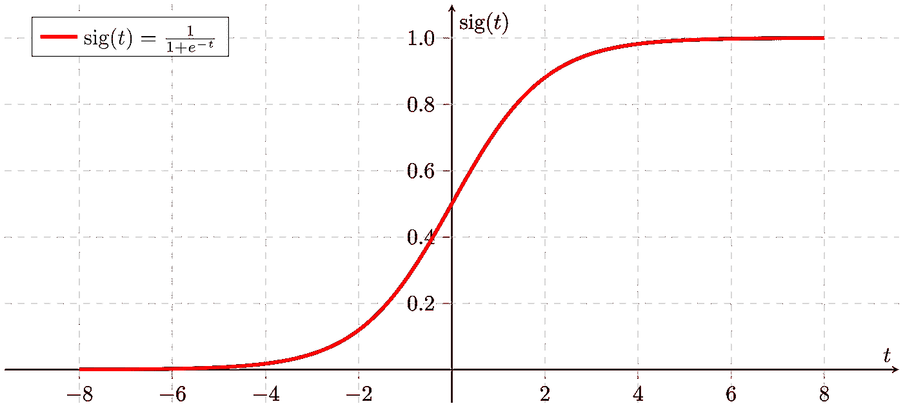
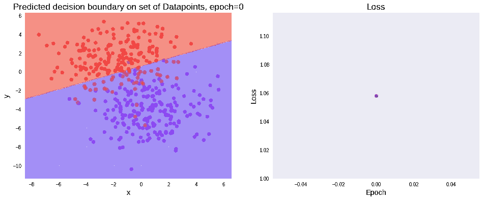

# 完全初学者用的神经网络从零开始第 3 部分:逻辑回归

> 原文：<https://towardsdatascience.com/neural-networks-with-numpy-for-absolute-beginners-part-3-logistic-regression-18b474096a4e?source=collection_archive---------32----------------------->

## sigmoid 激活函数是神经网络中最基本的概念。在本教程中，您将学习实现使用 sigmoid 激活函数和 Numpy 进行分类的逻辑回归。

无论是机器学习还是深度学习，都会遇到两种问题，分别是*和 ***分类*** 。*

*在 ***回归问题*** 中，你预测一个连续的实数值，而在 ***分类问题*** 中，你预测不同类别的对象。*

*在前面的教程中，我们深入探讨了什么是感知器，后来又学习了它如何使用线性回归来学习预测。如果你是这个领域的绝对初学者，我推荐你去看看我以前的简短教程。*

*[](/neural-networks-with-numpy-for-absolute-beginners-introduction-c1394639edb2) [## 神经网络与 Numpy 的绝对初学者:简介

### 在本教程中，您将简要了解什么是神经网络以及它们是如何发展起来的。在…

towardsdatascience.com](/neural-networks-with-numpy-for-absolute-beginners-introduction-c1394639edb2) [](/neural-networks-with-numpy-for-absolute-beginners-part-2-linear-regression-e53c0c7dea3a) [## 绝对初学者用的带 Numpy 的神经网络第 2 部分:线性回归

### 在本教程中，您将详细学习使用 Numpy 实现预测的线性回归，并可视化…

towardsdatascience.com](/neural-networks-with-numpy-for-absolute-beginners-part-2-linear-regression-e53c0c7dea3a) 

在本教程中，您将了解用于分类问题的逻辑回归。

像以前一样，会涉及到一些数学知识，但我会确保从基础开始，这样你就可以很容易地理解。

如果你不确定使用哪种环境来实现本教程中的代码，我推荐 [Google Colab](https://colab.research.google.com/) 。该环境已经安装了许多重要的软件包。安装新的包以及导入和导出数据非常简单。最重要的是，它还带有 GPU 支持。所以，开始编码吧！

最后，我建议您在开始之前先浏览前两个教程。然而，如果你已经对线性回归和神经网络有所了解，或者只是想学习逻辑回归，你可以马上开始！

# Sigmoid 激活函数

使用最早和最普遍的激活功能之一是*s 形函数*。

sigmoid 函数的等式如下:


该函数的图形如下:



Sigmoid 函数

因此，具有 sigmoid 激活函数的感知器对给定的数据集进行二元分类。这个二元分类的过程俗称 ***逻辑回归*** 。在下一节中，我们将深入研究*逻辑回归*，并了解模型是如何被训练的。

# 逻辑回归

> 那么，什么是逻辑回归呢？

逻辑回归是一种用于二元分类的技术。它在数据点之间创建一个决策边界，以便将它们归类到两个类别中的任何一个。下图就是这样一个例子。我们将通过实际操作来深入理解和训练一个*逻辑回归*模型。理解逻辑回归将为理解神经网络模型提供基础。


要实施的逻辑回归的计算图如下图所示。


我们有两个输入 ***x₁*** 和 ***x₂*** ，它们分别乘以权重 ***w₁*** 和 ***w₂*** 。将附加偏置 ***b*** 加到它们的和上，得到 ***z*** 。这些参数( ***w₁*** 、 ***w₂*** 、 ***b*** )是在梯度下降过程中学习到的。

> 现在让我们开始编码吧！

第一步是导入所需的包。

您将使用 sklearn 包来执行两项任务:

1.  生成 blobs 数据集
2.  将数据分成训练集和测试集。

您将使用 ***matplotlib*** 来可视化结果。

在你开始定义代码之前，在任何机器学习项目中，你的第一个任务将是定义超参数。超参数可以是数据集大小、学习率、时期数等。你一定想知道为什么这些变量被称为超参数！您稍后会发现，参数是在模型中学习到的，我们使用 hyperparameter 来微调模型，以实现更高的准确性。

在这里，我们还定义了创建数据集所需的输入要素数和聚类数。

继续定义它们吧！

接下来，我们用 make_blobs 函数从 ***scikit-learn*** 导入数据集，该函数创建类的 blob。我们也将同样想象。

现在，让我们绘制一个图形来可视化生成的数据。


这两组数据点属于这两类。我们的目标是找到一个区分这两类的最优决策边界。

下一步将把数据分成训练集和测试集。我们这样做是为了验证所学算法的准确性。

```
Shape of X_train (400, 2) 
Shape of y_train (400, 1) 
Shape of X_test (100, 2) 
Shape of y_test (100, 1)
```

现在，您将随机初始化参数 W 和 b，它们是在训练过程中学习到的。

```
Initializing weights... 
W: [[-0.59134456] [-0.31427067]] 
b: -1.6078558751252707
```

在我们随机初始化参数后，下一步是执行正向传播，并查看网络如何预测。

现在，您将利用`generate_mesh_grid`函数绘制数据集和等高线。


现在是时候定义损失函数了！！

# 成本/损失函数

与线性回归的 MSE 不同，这里我们使用逻辑损失函数。这是因为当我们通过 sigmoid 激活函数传递总和 ***z*** 时，输出是非线性的(因为 sigmoid 函数是非线性的)。这会导致非凸误差。

> 但是你说的非凸是什么意思？

简单来说，非凸函数看起来就像右图。

在这种情况下，虽然我们的目标是找到最小点，但由于波谷和波峰，找到一个点变得极其困难。相反，如果我们有一个简单的函数(就像左边的那个)，我们可以很容易地找到最小点，我们就可以使我们的问题变得简单。这是左边的凸函数。

因此，我们使用一个对数函数，它实际上将非线性函数转换回线性函数，从而产生一个凸函数！


凸优化和非凸优化。来源:[https://bit.ly/3d9ESRL](https://bit.ly/3d9ESRL)

损失可以定义为:


ￚ **测井曲线( *x* )** 如上图所示。可以推断给定 ***y = 1*** 如果***y→**0***，那么 ***loss → 0*** 而当 ***y' → 0*** 时，那么 ***loss →*** ∞。同样，如果***y’→0***，那么 ***loss → 0*** 而当***y’→1***，那么 ***loss →*** ∞给定 ***y = 0*** 。这意味着当预测错误时，参数会受到严重惩罚，而当预测正确时，参数不会受到惩罚。


在这里，函数简化为ￚ **log( *y'* )** 当 ***y = 1*** 和**log(*1****ￚ****y '*)**当 ***y = 0*** 正如我们

虽然以上只是一个例子(数据点)的错误，我们需要考虑所有的例子。因此，我们将所有误差相加，然后除以示例数量，得出误差的平均值，如下所示。


这方面的代码如下:

```
1.0579769986979133
```

让我们画出损失图。您将跟踪所有迭代(时期)的损失，之后您将能够可视化误差的减少。

```
[1.0579769986979133]
```


# 梯度下降

这通常是最难理解的部分，但是我用了非常简单的术语。


来源:[吉菲](https://gph.is/1SuKcy4)

用外行人的话说梯度下降就像走下一座小山。这座山指的是我们的错误。误差越大，山越高！！所以当你滚下山的时候，误差( ***损失*** )就下降了。


来源:[吉菲](https://gph.is/1NiQzpi)

因此，我们的目标是滚到误差最小的点。

> 嘿，但是等一下！我该如何改变损失？🤔

现在你必须观察到，如果你调整参数 ***W*** 和***b******损耗*** 也会改变！！

因此，我们找到关于参数***W***&***b***的导数(即变化率),并相应地更新它们。

嗯，那就简单了！只要找到它的导数或者斜率。数学上，斜率在极小点(minima)处为 ***零*** 【如果你不了解导数和斜率，可以参考这个精彩的可汗学院视频。]而如果你观察敏锐的话，斜率在极小值左边是负的，在极小值右边是正的。当 ***p*** 在最小值的左边时，我们需要增加一些值，以便它向最优值 ***p*** 移动，当 ***p*** 在右边时，减去一些值。


在我们的例子中，我们找到了 ***损失*** 相对于 ***W*** 和 ***b*** 的导数。


我跳过了几个不必要的步骤，但是如果感兴趣，你可以参考下面的视频。

## 更新参数

至于更新参数的最后部分，利用斜率，我们将斜率乘以阻尼因子 *α* ，使得参数在具有非常高的误差时不会过冲。


您现在将实现与下面相同的`gradient_descent`算法。

现在还有最后一件事要做，即将两个绘图功能合并为一个。



我们获得了一个美丽的决定边界以及损失的情节。

现在，作为你们的最后一项任务，让我们把你们到目前为止所做的一切汇总起来，自己看看结果。

所以，你首先要定义超参数。您可以摆弄这些值，尤其是学习率`l_r`和`epoch`，以观察模型如何学习预测。

现在，您可以一次性编写从创建数据集到训练逻辑回归模型的代码，如下所示。


```
Shape of X_train (400, 2) 
Shape of y_train (400, 1) 
Shape of X_test (100, 2) 
Shape of y_test (100, 1) 
Initializing weights... 
W: [[ 0.43753829] [-1.70958537]] 
b: -0.8793505127088026
--------------------------------------------------------------------
Iteration: 0 
W = [[ 0.43753829] [-1.70958537]] 
b = -0.8793505127088026 
Loss = 0.3991070405361789
```


```
-------------------------------------------------------------------- Iteration: 5 
W = [[ 0.09634223] [-1.73455902]] 
b = [[-0.87943027]] 
Loss = 0.10346899489337041
```


```
--------------------------------------------------------------------Iteration: 10 
W = [[-0.02440044] [-1.73555684]] 
b = [[-0.87945069]] 
Loss = 0.06810528539660123
```


```
--------------------------------------------------------------------Iteration: 15 
W = [[-0.09215724] [-1.73617853]] 
b = [[-0.87945614]] 
Loss = 0.0569509026646708
```


```
--------------------------------------------------------------------Iteration: 20 
W = [[-0.13607178] [-1.737859 ]] 
b = [[-0.87945457]] 
Loss = 0.05224655857924122
```


```
--------------------------------------------------------------------Iteration: 25 
W = [[-0.16649094] [-1.74055496]] 
b = [[-0.87944893]] 
Loss = 0.04996979153280091
```


# 预言；预测；预告

我们之前已经创建了一个测试数据集，现在您将根据它测试您的回归模型并确定其准确性。

精确度的公式为:


```
Prediction: Loss = 0.2929627097697204 Accuracy = 95.0%
```


```
Hence W = [[ 3.9538485] [-3.9152981]] b = [[-0.68703193]]
```

我们已经获得了 95%的准确率，这是相当不错的！

# 结论

在本教程中，您学习了

1.  Sigmoid 激活函数
2.  创建逻辑回归模型
3.  训练逻辑回归模型

在下一篇教程中，您将学习仅使用 Numpy 从头实现神经网络！*