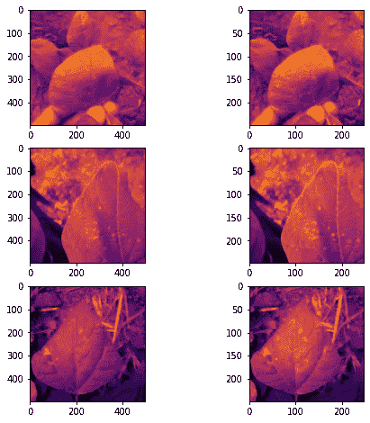
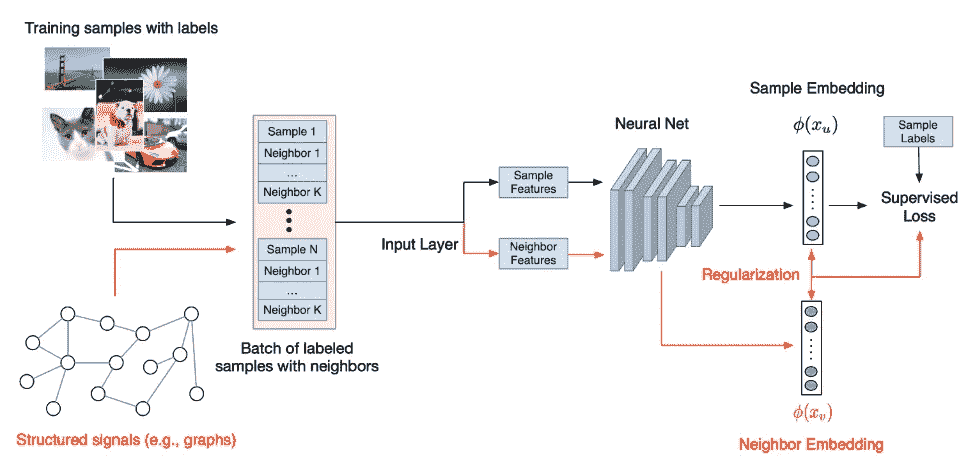
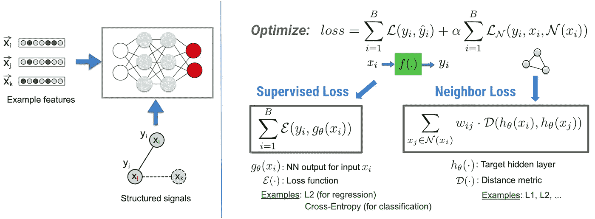
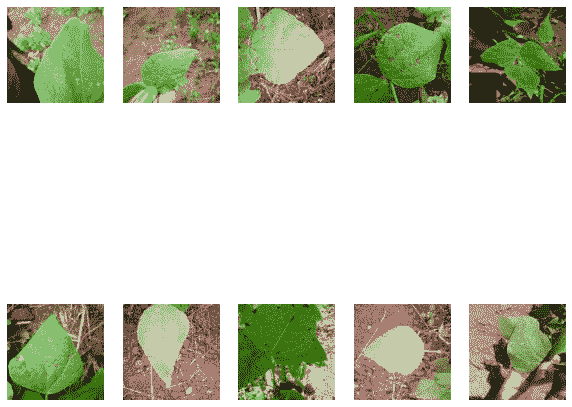
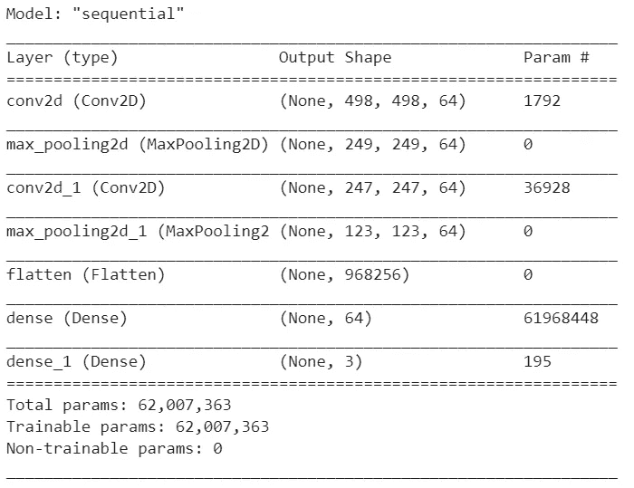
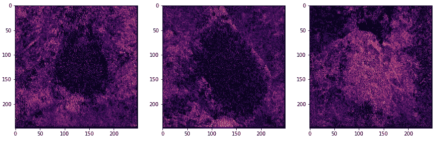

# 神经结构化学习和对抗正则化

> 原文：<https://towardsdatascience.com/neural-structured-learning-adversarial-regularization-378523dace08?source=collection_archive---------33----------------------->

## 张量流中用对立正则化提高分类模型的鲁棒性



作者拥有的图像

# 介绍

正如我们许多人无疑都知道的那样，计算机视觉领域取得的不变进展已经在多个学科领域取得了一些令人难以置信的成就，从[医疗保健](https://inews.co.uk/news/deepmind-google-ai-predict-eye-conditions-threatening-sight-429071)和自动驾驶汽车，到气候研究和游戏，不一而足。

从最先进的液氮冷却硬件形式的[张量处理单元(TPU)](https://cloud.google.com/tpu/docs/tpus) 到日益复杂的数百万参数深度卷积网络，如 [GoogLeNet](https://static.googleusercontent.com/media/research.google.com/en//pubs/archive/43022.pdf) 、 [AlexNet](https://en.wikipedia.org/wiki/AlexNet) 这种技术的能力继续打破以前无法逾越的障碍。

## 对抗性脆弱性

尽管取得了这些令人难以置信的成就，但事实证明，即使是最熟练的模型也不是绝对可靠的。多项研究表明，这些模型对**输入数据结构**中的微小变化非常敏感。最初是在谷歌和纽约大学的联合研究论文的发现中:[“神经网络的有趣特性，2014”](http://static.googleusercontent.com/media/research.google.com/en//pubs/archive/42503.pdf)模型易受对立例子影响的主题现在被认为是如此重要的主题，以至于现在存在解决它的[竞赛](https://ai.googleblog.com/2018/09/introducing-unrestricted-adversarial.html)。

这些错误的存在提出了各种各样的关于样本外泛化的问题，以及如何使用这样的例子来滥用已部署的系统。

# 神经结构化学习

在某些应用中，这些误差可能不是有意产生的，而且，它们可能是由于人为误差或仅仅是由于输入不稳定而产生的。在采矿业，计算机视觉有无数非常有用的应用，例如，从流式处理工厂传送带图像以预测矿石纯度，到使用卫星图像检测商品库存水平和非法运输/采矿。

我们经常会发现，由于相机未对准、振动或可能导致错误分类的非常独特的样本外示例，此类图像数据在收集过程中遭到破坏。

**为了克服诸如此类的例子，并总体上改进我们的模型以对抗损坏或扰乱的数据，我们可以采用一种形式的** [**神经结构化学习**](https://github.com/tensorflow/neural-structured-learning) **称为** [**对抗正则化**](https://www.tensorflow.org/neural_structured_learning/api_docs/python/nsl/keras/AdversarialRegularization) **。**

神经结构化学习(NSL) 是一个相对较新的开源框架，由 TensorFlow 的优秀人员开发，用于使用结构化信号训练深度神经网络(与传统的单一样本相反)。NSL 实现了[神经图形学习](https://ai.google/research/pubs/pub46568.pdf)，其中使用[图形](https://en.wikipedia.org/wiki/Graph_database)(见下图)训练神经网络，图形携带关于目标(节点)的信息和通过节点边缘连接的其他节点中的相邻信息。



[图片来自 TensorFlow 博客:在 TensorFlow 中引入神经结构化学习，2019](https://blog.tensorflow.org/2019/09/introducing-neural-structured-learning.html)

这样，这允许训练模型通过以下方式同时利用标记和未标记的数据:

1.  在标记数据上训练模型(任何监督学习问题中的标准程序)；
2.  偏置网络以学习图上相邻节点的相似隐藏表示(相对于输入数据标签)



[图片来自 TensorFlow 博客:神经结构化学习，对抗性例子，2019](https://blog.tensorflow.org/2019/09/introducing-neural-structured-learning.html) 。

与第二点一致，我们可以在上述表达式中观察到经验损失(即监督损失)和**邻居损失的最小化。**在上面的例子中，这被计算为目标隐藏层内的计算的权重向量与输入、 *X、*和添加了某种程度的噪声的相同输入之间的距离度量(即，L1、L2 距离)的点积:


典型地，通过计算输出相对于输入的梯度 x_i，然后最大化损失来创建对立的例子。例如，如果您有一个对吉娃娃和松饼进行分类的模型，并且您希望创建对立的示例，您可以将一个 128 x 128 像素的吉娃娃图像输入到您的网络中，根据输入计算损失的梯度(128 x 128 张量)，然后将负梯度(扰动)添加到您的图像中，直到网络将图像分类为松饼。通过使用正确的标签再次对这些生成的图像进行训练，网络变得对噪声/干扰更加鲁棒。

# 为什么用 NSL？

*   **更高的精度**:样本间的结构化信号可以提供在特征输入中并不总是可用的信息。
*   **更强的鲁棒性**:用对立的例子训练的模型[在对抗为误导模型的预测或分类而设计的对立扰动方面](https://arxiv.org/abs/1807.06732)明显更强。
*   **需要更少的标记数据** : NSL 使神经网络能够利用标记和未标记的数据，迫使网络学习类似的“邻近样本”的隐藏表示，这些样本可能有也可能没有标记。

# 对抗性规则

如果没有这样明确的结构作为输入，我们能做什么？

关于 TensorFlows 神经结构化学习库，*特别有用的是提供了一些方法，使用户能够通过对抗扰动，从原始输入数据中动态构建*诱导的*对抗示例作为隐式结构。NSL 的这种一般化被称为**对抗正则化，**在这种情况下，对抗示例被构造成在训练期间有意混淆模型，从而产生对小输入扰动具有鲁棒性的模型。*

# 实践中的对抗性规范

在下面的例子中，我们将比较基线图像分类模型(特别是卷积神经网络)与利用对抗正则化的变体的性能。不幸的是，我们无法在上述任何采矿数据上演示 AR 的使用，因为这是专有的。

相反，我们将对在著名的图像分类数据集— [Beans](https://www.tensorflow.org/datasets/catalog/beans) 上训练的两个模型进行分析。我们将比较基线模型的结果，与一个经过对抗性例子训练的结果，以充分理解对抗性规则对每个模型的能力和性能的影响。

包含本文所用代码的 Colab 笔记本可以在[这里](https://github.com/cmp1/computer_vision_neural_structured_learning/tree/master)找到。一个优秀的教程，这篇文章的灵感和一些代码的来源，可以在 [TensorFlow NSL 页面](https://www.tensorflow.org/neural_structured_learning/tutorials/adversarial_keras_cnn_mnist#conclusion)上找到。

在开始之前，我们必须先安装 TensorFlow 的神经结构学习包:

```
!pip install neural_structured_learning
```

## 进口

```
import matplotlib.image as mpimg
import matplotlib.pyplot as plt
import numpy as np
import keras_preprocessing
import neural_structured_learning as nsl
import tensorflow as tf
import tensorflow_datasets.public_api as tfdsfrom tensorflow.keras import models
from keras_preprocessing import image
from keras_preprocessing.image import ImageDataGenerator
```

## 加载和检查图像数据

TensorFlow 在其 [TensorFlow 数据集](https://www.tensorflow.org/datasets)集合中托管了许多著名的数据集。

我们可以使用`tfds.load()`方法加载我们想要训练模型的 Beans 数据集，该方法执行两个操作:

1.  下载数据集并将其保存为`[tfrecord](https://www.tensorflow.org/tutorials/load_data/tfrecord)`文件。
2.  加载`tfrecord`文件并返回`[tf.data.Dataset](https://www.tensorflow.org/api_docs/python/tf/data/Dataset)`的实例

```
# load dataset
dataset = 'beans' #@paramdataset = tfds.load(dataset, shuffle_files=True)
train, test = dataset['train'], dataset['test']IMAGE_INPUT_NAME = 'image'
LABEL_INPUT_NAME = 'label'
```

在执行任何图像缩放或图像增强/扰动之前，我们可以检查数据集中的图像样本，以了解卷积层可能作为特征提取的各种结构和组成，并了解数据集中各种类之间的差异:

```
# Get random batch
raw_images = train.take(10)# Tensor to np format
raw_images = [item['image'] for item in
raw_images.as_numpy_iterator()]# Plot batch
fig = plt.gcf()
fig.set_size_inches(10, 10)
for i, img in enumerate(raw_images):
  sp = plt.subplot(2, 5, i+1)
  sp.axis('Off')
  plt.imshow(img)plt.show()
```

默认情况下，`[tf.data.Dataset](https://www.tensorflow.org/api_docs/python/tf/data/Dataset)`对象包含一个由`[tf.Tensor](https://www.tensorflow.org/api_docs/python/tf/Tensor)`组成的`dict`，我们可以通过在我们的列表理解中调用`raw_images`上的`.as_numpy_iterator()`来迭代这批图像(tf.data.Dataset 键值)。该方法返回一个生成器，该生成器将数据集的批处理元素从`tf.Tensor`格式转换为`np.array`格式。然后，我们可以绘制生成的一批图像:



由作者生成的图像:“豆”数据集中的 10 个训练图像的样本批次，描绘了 3 个不同的类别:“健康”、“豆锈病”和“角斑病”

## 预处理

我们对图像数据执行简单的缩放操作，将输入映射到 0 和 1 之间的浮点张量(Beans 数据集是 500 x 500 x 3 图像的集合)。有益的是，TDFS 数据集将[要素属性](https://www.tensorflow.org/datasets/catalog/beans)存储为字典:

```
FeaturesDict({
    'image': Image(shape=(500, 500, 3), dtype=tf.uint8),
    'label': ClassLabel(shape=(), dtype=tf.int64, num_classes=3),
})
```

因此，我们可以访问各个图像及其标签，并使用我们的训练和测试`tf.Dataset`实例的`.map()`属性就地执行这些预处理操作**:**

```
def normalize(features):
  """Scale images to within 0-1 bound based on max image size."""
  features[IMAGE_INPUT_NAME] = tf.cast(
    features[IMAGE_INPUT_NAME], 
    dtype=tf.float32) / 500.0)
  return featuresdef examples_to_tuples(features):
  return features[IMAGE_INPUT_NAME], features[LABEL_INPUT_NAME]def examples_to_dict(image, label):
  return {IMAGE_INPUT_NAME: image, LABEL_INPUT_NAME: label}# Define train set, preprocess. (Note: inputs shuffled on load)
train_dataset = train.map(normalize)
                     .batch(28)
                     .map(examples_to_tuples)test_dataset = test.map(normalize)
                   .batch(28)
                   .map(examples_to_tuples)
```

功能`examples_to_dict`将在稍后解释。

## 基线模型

然后，我们构建一个简单的基线卷积神经网络模型，并使其适合我们的图像数据:

```
def conv_nn_model(img_input_shape: tuple) -> tf.keras.Model():
  """Simple Conv2D Neural Network.
    Args:
      img_input_shape: An (mxnxo) tuple defining the input image   
      shape.
    Returns:
      model: An instance of tf.keras.Model.
  """
  model = tf.keras.models.Sequential([
      tf.keras.layers.Conv2D(16, (3,3), activation='relu',   
          input_shape=input_shape),
      tf.keras.layers.MaxPooling2D(2, 2),
      tf.keras.layers.Conv2D(32, (3,3), activation='relu'),
      tf.keras.layers.MaxPooling2D(2,2),
      tf.keras.layers.Conv2D(32, (3,3), activation='relu'),
      tf.keras.layers.MaxPooling2D(2,2),
      tf.keras.layers.Flatten(),
      tf.keras.layers.Dense(64, activation='relu'),
      # Note to adjust output layer for number of classes
      tf.keras.layers.Dense(3, activation='softmax')])
  return model# Beans dataset img dims (pixel x pixel x bytes)
input_shape = (500, 500, 3)# Establish baseline
baseline_model = conv_nn_model(input_shape)
baseline_model.summary()baseline_model.compile(
    optimizer='adam',
    loss='sparse_categorical_crossentropy',
    metrics=['acc'])baseline_history = baseline_model.fit(
    train_dataset,
    epochs=5)
```



我们的基准 Conv2D 模型架构

```
results = baseline_model.evaluate(test_dataset)
print(f'Baseline Accuracy: {results[1]}')3/3 [==============================] - 0s 72ms/step - loss: 0.1047 - acc: 0.8934 
Baseline Accuracy: 0.8934375
```

我们可以看到，我们的基线模型在测试数据集上表现良好，达到了 89%的准确率。

## 对抗正则化模型

我们现在将检查该模型如何针对包括对立干扰示例的测试集执行，并将其与在包括所述示例的数据集上训练的模型进行比较。我们首先创建另一个卷积神经网络模型，只是这一次我们将把对抗性训练纳入其训练目标。

接下来，使用 TensorFlow 的 NSL 框架，我们用 NSL 的助手函数`[nsl.configs.make_adv_reg_config](https://www.tensorflow.org/neural_structured_learning/api_docs/python/nsl/configs/make_adv_reg_config)`定义一个配置对象:

```
#@title ADV Regularization Config# Create new CNN model instance
base_adv_model = conv_nn_model(input_shape)# Create AR config object 
adv_reg_config = nsl.configs.make_adv_reg_config(
    multiplier=0.2,
    adv_step_size=0.2,
    adv_grad_norm='infinity')# Model wrapper 
adv_reg_model = nsl.keras.AdversarialRegularization(
    base_adv_model,
    label_keys=[LABEL_INPUT_NAME],
    adv_config=adv_config)
```

我们可以注意到，这个函数要求我们设置许多超参数。其中一些不需要明确的值，其他的需要我们的输入:

*   `**multiplier**`:训练中对抗性损失相对于标签损失的权重，w.r.t 我们 AR 模型的目标函数。我们应用 0.2 作为正则化权重。
*   `**adv_step_size**`:训练中要应用的对抗性扰动的程度/幅度。
*   `**adv_grad_norm**`:归一化梯度的张量范数(L1 或 L2)，即对抗性扰动幅度的测量。默认为 L2。

然后，我们可以使用`nsl.keras.AdversarialRegularization`函数包装我们新创建的模型，这将把我们之前使用`adv_reg_config`对象配置的对抗性正则化添加到我们基本模型的训练目标(要最小化的损失函数)中。

**在这个阶段**需要注意的重要一点是，我们的模型*期望它的输入是特性名称到特性值的字典映射*。可以看到，当我们实例化我们的对抗性模型时，我们必须将`label_keys`作为参数传入。这使得我们的模型能够区分**输入数据**和**目标数据**。这里，我们可以使用我们的`examples_to_dict`函数，并将其映射到我们的训练和测试数据集:

```
train_set_for_adv_model = train_dataset.map(convert_to_dictionaries)
test_set_for_adv_model = test_dataset.map(convert_to_dictionaries)
```

然后，我们正常编译、拟合和评估我们的对抗性正则化模型:

```
4/4 [==============================] - 0s 76ms/step - loss: 0.1015 - sparse_categorical_crossentropy: 0.1858 - sparse_categorical_accuracy: 0.8656 - scaled_adversarial_loss: 0.1057  accuracy: 0.911625
```

类似地，我们的对抗性正则化模型很好地推广到我们的测试数据集，达到了与我们的`baseline_model`相似的精度(0.91%)。

## 针对不利扰动数据的评估

现在是有趣的部分。

就像我们在测试集上评估一个训练过的模型的能力一样，我们将在我们的两个模型上执行相同的操作。然而，在这种情况下，我们将比较我们的两个模型；基线 CNN，以及已经针对包含*对抗性扰动示例*的测试数据集对对抗性扰动输入数据进行训练的变体。

为了生成上述示例，我们必须首先创建一个参考模型，其配置(损耗、指标和校准/学习权重)将用于生成扰动示例。为此，我们再次用`nsl.keras.AdversarialRegularization`函数包装我们的性能基线模型并编译它。**请注意，我们并未将该模型应用于我们的数据集，我们希望保留与基础模型相同的学习权重**):

```
# Wrap baseline model
reference_model = nsl.keras.AdversarialRegularization(
    baseline_model,
    label_keys=[LABEL_INPUT_NAME],
    adv_config=adv_reg_config)reference_model.compile(
    optimizer='adam',
    loss='sparse_categorical_crossentropy',
    metrics=['acc']models_to_eval = {
    'base': baseline_model,
    'adv-regularized': adv_reg_model.base_model}metrics = {
    name: tf.keras.metrics.SparseCategoricalAccuracy()
    for name in models_to_eval.keys()}
```

如果此时你和我一样，喜欢理解这些事情背后的逻辑，你可以在这里找到包含对抗性正则化类[的**源代码**](https://github.com/tensorflow/neural-structured-learning/blob/v1.3.1/neural_structured_learning/keras/adversarial_regularization.py#L695-L747)。

然后我们存储我们的两个模型；字典中的基线和对抗性正则化变量，随后在我们的测试数据集的每一批上循环(成批评估是对抗性正则化模型的一个要求)。

使用我们新包装的`reference_model`的`.perturb_on_batch()`方法，我们可以生成与我们的`adv_reg_config`对象一致的对抗性扰动批处理，并在其上评估我们的两个模型的性能:

```
labels, y_preds = [], []# Generate perturbed batches, 
for batch in test_set_for_adv_model:
  perturbed_batch = reference_model.perturb_on_batch(batch)
  perturbed_batch[IMAGE_INPUT_NAME] = tf.clip_by_value(
      perturbed_batch[IMAGE_INPUT_NAME], 0.0, 1.0)
  # drop label from batch
  y = perturbed_batch.pop(LABEL_INPUT_NAME)
  y_preds.append({})
  for name, model in models_to_eval.items():
    y_pred = model(perturbed_batch)
    metrics[name](y, y_pred)
    predictions[-1][name] = tf.argmax(y_pred, axis=-1).numpy()for name, metric in metrics.items():
  print(f'{name} model accuracy: {metric.result().numpy()}')>> base model accuracy: 0.2201466 adv-regularized model accuracy: 0.8203125
```

## 结果

相对于 adv_reg_model，我们的基线模型在对抗扰动数据上的性能*显著降低，对抗学习在提高模型稳健性上的有效性立即变得明显。*

*我们的基线模型的性能下降了 **69%** 相比于我们的对抗性正则化模型，只实现了 14%的性能下降。*

*借助 Kera 的 Layers API，我们可以通过可视化卷积层来了解扰动前后提取的特征，从而检查恶意扰动数据对基线模型的影响:*

## *扰动前*

```
*# Random img & conv layer idxs
IDX_IMAGE_1=2
IDX_IMAGE_2=5
IDX_IMAGE_3=10
CONVOLUTION_NUMBER = 10# Get baseline_model layers 
layer_outputs = [layer.output for layer in baseline_model.layers]
activation_model = tf.keras.models.Model(
    inputs =baseline_model.input, 
    outputs = layer_outputs)# Plot img at specified conv
f, axarr = plt.subplots(3,2, figsize=(8, 8))
for x in range(0, 2):
  f1 = activation_model.predict(test_images[IDX_IMAGE_1].reshape(
      1, 500, 500, 3))[x]
  axarr[0,x].imshow(f1[0, : , :, CONVOLUTION_NUMBER],cmap='inferno')
  axarr[0,x].grid(False)
  f2 = activation_model.predict(test_images[IDX_IMAGE_2].reshape(
      1,500, 500, 3))[x]
  axarr[1,x].imshow(f2[0, : , :, CONVOLUTION_NUMBER],cmap='inferno')
  axarr[1,x].grid(False)
  f3 = activation_model.predict(test_images[IDX_IMAGE_3].reshape(
      1, 500, 500, 3))[x]
  axarr[2,x].imshow(f3[0, : , :, CONVOLUTION_NUMBER],cmap='inferno')
  axarr[2,x].grid(False)*
```

**

*由作者生成的图像:给定卷积层的中间图像表示*

*我们可以在上面的图像中观察到，我们的基线模型似乎已经确定了定义每个类别的相关区别特征:角叶锈病、健康叶锈病和豆状叶锈病，通过不同的颜色梯度变得可见。*

## *扰动后*

*现在，我们可以检查基线模型在扰动数据中识别的特征:*

```
*# Pertubed test data
perturbed_images = []
for batch in test_set_for_adv_model:
  perturbed_batch = reference_model.perturb_on_batch(batch)
  perturbed_batch[IMAGE_INPUT_NAME] = tf.clip_by_value(
  perturbed_batch[IMAGE_INPUT_NAME], 0.0, 1.0)
  perturbed_images.append(perturbed_batch)# Get images
pt_img = [item['image'] for item in perturbed_images]IDX_IMAGE_1=0
IDX_IMAGE_2=1
IDX_IMAGE_3=2
CONVOLUTION_NUMBER = 11base_mod_layer_out = [layer.output for layer in baseline_model.layers]base_mod_activ = tf.keras.models.Model(
  inputs = baseline_model.input,
  outputs = base_mod_layer_out)f1 = base_mod_activ.predict(pt_img[IDX_IMAGE_1].numpy())[x]
f2 = base_mod_activ.predict(pt_img[IDX_IMAGE_2].numpy())[x]
f3 = base_mod_activ.predict(pt_img[IDX_IMAGE_3].numpy())[x]*
```

**

*作者生成的图像:中间图像表示；敌对扰乱数据。*

*正如我们在上面的表示中所观察到的，网络很难表示每幅图像中的原始像素，并且由于扰动而变得更加抽象。在最右边的图像中，似乎网络成功地保留了代表‘角叶锈病’的特征，但是叶子的基本结构大部分丢失了。当然，这只是我们未经调整的网络中的一个卷积层，但它仍然是一个可信的演示，说明了一个以前熟练的模型是如何被敌对的输入数据推翻的。*

# *结论*

*在本文中，我们研究了如何使用对抗正则化显著提高卷积神经网络模型在对抗扰动数据上的鲁棒性和泛化性能。此外，我们还探索了:*

*   *如何在 Keras 模型中添加对抗性规则？*
*   *如何将一个对抗性的规范化模型与一个基线性能模型进行比较？*
*   *如何通过可视化中间层来检查敌对扰动数据对传统训练模型的影响。*

*如果您发现错误或有任何建设性的批评/构建，请评论。*

*感谢您的阅读。*

# *参考*

*   *[谷歌公司，NYU，2014 年，神经网络的有趣特性](http://static.googleusercontent.com/media/research.google.com/en//pubs/archive/42503.pdf)*
*   *[TensorFlow 博客，2019，神经结构化学习](https://blog.tensorflow.org/2019/09/introducing-neural-structured-learning.html)*
*   *[Gilmer 等人，2018 年，激励对抗性例子研究的游戏规则。](https://arxiv.org/abs/1807.06732)*