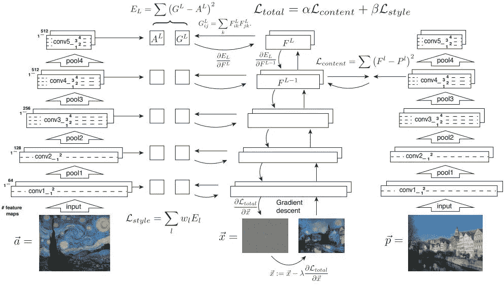
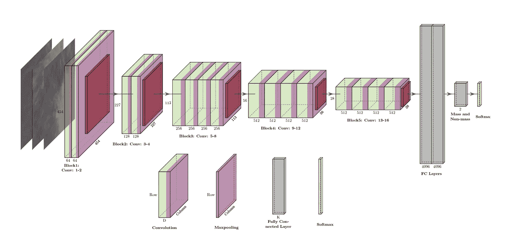
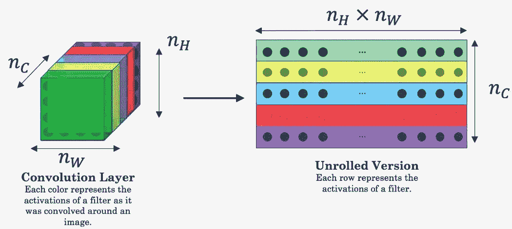
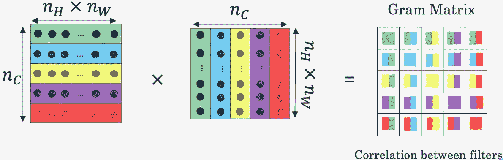

# 神经类型转移——一种高级方法

> 原文：<https://towardsdatascience.com/neural-style-transfer-a-high-level-approach-250d4414c56b?source=collection_archive---------20----------------------->

保罗·本丹迪[https://unsplash.com/photos/hZUlyk-EeuU](https://unsplash.com/photos/hZUlyk-EeuU)

今天我想谈谈神经风格转移和卷积神经网络(CNN)。已经有相当多的文章和教程可用。有时内容只是复制，有些提供了新颖的实现。所有的共同点是快速深入细节。在我看来太具体了。不仅如此，通常还有一些实现细节，这使得从整体上关注主要概念变得更加困难。

这篇文章可以被认为是对其他文章(列在我的“灵感”部分)的概述和理解，在更高的层次上理解这个概念。我的意图是去掉一些实现细节，对初学者来说足够高，并激发阅读原始研究论文和后续实现的好奇心。

# 目录

*   [免责声明](https://github.com/Createdd/Writing/blob/master/2020/articles/understandingCNN.md#disclaimer)
*   [要求](https://github.com/Createdd/Writing/blob/master/2020/articles/understandingCNN.md#requirements)
*   [神经风格转移](https://github.com/Createdd/Writing/blob/master/2020/articles/understandingCNN.md#neural-style-transfer)
*   [架构和流程概述](https://github.com/Createdd/Writing/blob/master/2020/articles/understandingCNN.md#architectural-and-process-overview)
*   [迁移学习和风格迁移](https://github.com/Createdd/Writing/blob/master/2020/articles/understandingCNN.md#transfer-learning-and-style-transfer)
*   [1。转移学习](https://github.com/Createdd/Writing/blob/master/2020/articles/understandingCNN.md#1-transfer-learning)
*   [2。风格转移](https://github.com/Createdd/Writing/blob/master/2020/articles/understandingCNN.md#2-style-transfer)
*   [风格和内容](https://github.com/Createdd/Writing/blob/master/2020/articles/understandingCNN.md#style-and-content)
*   [成本计算](https://github.com/Createdd/Writing/blob/master/2020/articles/understandingCNN.md#cost-calculation)
*   [内容成本](https://github.com/Createdd/Writing/blob/master/2020/articles/understandingCNN.md#content-cost)
*   [款式成本](https://github.com/Createdd/Writing/blob/master/2020/articles/understandingCNN.md#style-cost)
*   [总变更成本](https://github.com/Createdd/Writing/blob/master/2020/articles/understandingCNN.md#total-variation-cost)
*   [灵感](https://github.com/Createdd/Writing/blob/master/2020/articles/understandingCNN.md#inspriation)
*   [关于](https://github.com/Createdd/Writing/blob/master/2020/articles/understandingCNN.md#about)

# 放弃

我与本文中使用的任何服务都没有关联。

我不认为自己是专家。如果你觉得我错过了重要的步骤或者忽略了什么，可以考虑在评论区指出来或者联系我。

我总是乐于听取建设性的意见以及如何改进。

**这篇文章写于 2020 年 10 月 17 日。我无法监控我的所有文章。当你阅读这篇文章时，提示很可能已经过时，过程已经改变。**

如果你需要更多关于某些部分的信息，请在评论中指出来。

# 要求

我假设理解卷积神经网络(CNN)。架构对于计算机视觉和深度学习中的许多事情都非常关键。网上有很多可用的资源。作为复习，我建议这篇[文章](https://medium.com/@himadrisankarchatterjee/a-basic-introduction-to-convolutional-neural-network-8e39019b27c4)。

# 神经类型转移

研究论文[一种艺术风格的神经算法](https://arxiv.org/pdf/1508.06576.pdf)——Leon A . Gatys，Alexander S. Ecker，Matthias Bethge

> *在美术中，尤其是绘画，人类已经掌握了通过在图像的内容和风格之间构建复杂的相互作用来创造独特视觉体验的技能。到目前为止，这个过程的算法基础还是未知的，也不存在具有类似能力的人工系统。然而，在视觉感知的其他关键领域，如物体和人脸识别，最近一类被称为深度神经网络的生物启发视觉模型展示了接近人类的表现。在这里，我们介绍一个基于深度神经网络的人工系统，它可以创建高感知质量的艺术图像。*
> 
> 该系统使用神经表示来分离和重组任意图像的内容和风格，为艺术图像的创建提供神经算法。此外，鉴于性能优化的人工神经网络和生物视觉之间惊人的相似性，我们的工作提供了一条通往人类如何创造和感知艺术意象的算法理解的道路。

# 架构和流程概述

对于 CNN 如何处理神经类型转移，有许多很好的可视化。本来想自己画的，后来发现已经有很好看的了。所以我只展示这些并引用创建者。

以下是我认为很棒的。

首先是这个。它非常漂亮地展示了损失是如何计算的，以及它是如何在总体结果中组合在一起的。

来自迈克·高斯[的博客](https://www.mikegao.net/graphics/summary/neural_style.html)和[的知识共享许可](https://creativecommons.org/licenses/by-nc/4.0/)

这个也不错。示出了不同层上的重建过程。

来自 [arxiv 许可要求](https://arxiv.org/help/license)下的[原始研究论文](https://arxiv.org/pdf/1508.06576.pdf)

为了理解随后的计算，有必要说一下 CNN 的不同层代表什么。

*   CNN 的较浅层倾向于检测较低级别的特征，例如边缘和简单纹理。
*   更深的层倾向于检测更高级的特征，例如更复杂的纹理以及对象类别。

因为生成的图像应该具有与输入图像相似的内容。建议在中间使用一个层，高度表示内容。

研究论文[中的 VGG19 架构使用深度卷积神经网络和 SVM 分类器](https://www.researchgate.net/publication/334388209_Automatic_Mass_Detection_in_Breast_Using_Deep_Convolutional_Neural_Network_and_SVM_Classifier)和[知识共享许可](https://creativecommons.org/licenses/by/4.0/)进行乳房自动肿块检测

# 迁移学习与风格迁移

另一个重要的概念是使用预先训练的网络。最常见的是 VGG-19。值得注意的是，我们利用了所谓的“迁移学习”。

这里我们有两个概念需要区分:

1.  迁移学习
2.  风格转移

尽管两者都使用了“传输”这个词，但从实现的角度来看，它们是完全不同的。

# 1.迁移学习

这个概念本身非常有趣，并且可以通过使用已建立的模型来创建新的解决方案。

精彩的介绍，我可以推荐这篇文章:[https://machine learning mastery . com/transfer-learning-for-deep-learning/](https://machinelearningmastery.com/transfer-learning-for-deep-learning/)。

理解它在风格转换的概念中是如何使用的是至关重要的。

简而言之，我们可以说

> *迁移学习和领域适应指的是这样一种情况，在一种环境中所学的知识被用来提高在另一种环境中的概括能力*

这在计算机视觉中特别有用，因为这些模型的计算和训练非常耗费资源。使用一个在大型数据集上训练过的模型，其结果现在可以免费获得，实际上非常适合个人实验。

您可以将迁移学习用于:

1.  直接使用预先训练的模型
2.  预训练模型的特征提取
3.  改变预训练模型的最后一层的权重

在我们的例子中，我们将使用第二种方法。使用特征提取，其中来自输出层之前的层的模型输出被用作新分类器的输入。

# 2.风格转移

来自原始论文:

> *概念上最密切相关的是使用纹理转移来实现艺术风格转移的方法。然而，这些先前的方法主要依赖于非参数技术来直接操纵图像的像素表示。相比之下，通过使用在对象识别上训练的深度神经网络，我们在明确表示图像的高级内容的特征空间中执行操作。*

因此，这意味着深度学习方法的专长是提取图像的风格，而不是仅仅通过风格图片的像素观察，而是结合风格图像的内容提取预训练模型的特征。所以，本质上，为了发现图像的风格，我们

1.  通过分析样式图像的像素来处理样式图像
2.  将该信息馈送到预训练模型的层，以“理解”/将所提供的输入分类为对象

如何做到这一点，我们将在“风格成本”一节中探讨。

# 风格和内容

基本思想是将图像的风格转换为图像的内容。

因此，我们需要理解两件事:

1.  图像的内容是什么
2.  图像的风格是什么

不严格地说，图像的内容就是我们人类在图像中识别的对象。汽车、桥、房子等。风格更难定义。这很大程度上取决于形象。就是整体质感，选色，对比等。

这些定义需要以数学方式表达，以便在机器学习的世界中实现。

# 成本计算

一、为什么要进行成本/损失计算？重要的是要明白，在这种情况下，成本仅仅是原始图像和生成图像之间的差异。关于如何计算它有多种方法(MSE、欧几里德距离等)。通过最小化图像的差异，我们能够传递风格。

当我们开始在损失上有很大差异时，我们会看到风格转移并不是那么好。我们可以看到风格的转移，但这似乎是粗糙和不直观的。随着成本最小化的每一步，我们都朝着更好地融合风格和内容的方向前进，最终得到更好的图像。

正如我们所看到的，这个过程的核心要素是损失计算。需要计算 3 项成本:

1.  内容成本
2.  风格成本
3.  总(变动)成本

在我看来，这些步骤是最难理解的，所以让我们一个一个地深入研究。

请始终记住，我们是在将原始输入与生成的图像进行比较。这些差异就是成本。我们希望将这一成本降至最低。

理解这一点非常重要，因为在这个过程中还会计算其他差异。

# 内容成本

什么是内容成本？正如我们之前发现的，我们通过图像的对象来定义图像的内容。我们人类能够识别的事物。

了解了 CNN 的结构后，现在很明显，在神经网络的末端，我们可以访问一个层，它很好地代表了对象(内容)。通过池层，我们失去了图像的风格部分，但就获取内容而言，这是所期望的。

现在，在不同物体的存在下，CNN 的更高层中的特征地图被激活。因此，如果两幅图像具有相同的内容，它们在较高层中应该具有相似的激活。

这是定义成本函数的前提。

下图有助于理解图层是如何展开的，以便为计算做准备(本文不涉及):

来自[阿迪蒂亚·古普塔斯的文章](https://github.com/Adi-iitd/AI-Art)在[麻省理工学院的许可下](https://github.com/Adi-iitd/AI-Art/blob/add-license-1/LICENSE)

# 风格成本

现在它变得越来越复杂。

一定要理解图像的风格和图像的风格损失之间的区别。两种计算都不一样。一个是检测“风格表示”(纹理、颜色等)，另一个是将原始图像的风格与生成图像的风格进行比较。

总样式成本分两步计算:

1.  所有卷积层的样式开销。识别样式图像的样式

a.从卷积层获取特征向量

b.将这些向量与另一层的特征向量进行比较(找出其相关性)

2.原之间的风格成本(原风格形象！)和生成的图像。

为了找到风格，通过将特征图与其转置相乘来捕捉相关性，从而得到 gram 矩阵。

来自[Aditya Gupta 的文章](https://github.com/Adi-iitd/AI-Art)在[麻省理工学院的许可下](https://github.com/Adi-iitd/AI-Art/blob/add-license-1/LICENSE)

幸运的是，CNN 为我们提供了多个层次，我们可以选择找到正确的风格。比较不同的层和它们的相互关系，我们可以识别图像的风格。

因此，我们不使用层的原始输出，而是使用单个层的特征图的 gram 矩阵来识别图像的风格。

第一个成本是这些 gram 矩阵之间的差异，即相关性的差异。第二个成本也是原始图像和生成图像之间的差异。这实质上是“风格转移”。

# 总变动成本

它的作用就像一个正则化器，可以提高生成图像的平滑度。这在原始论文中没有使用，但是改进了结果。本质上，我们在生成的图像中消除了风格和内容传递之间的差异。

# 灵感

本节提供了撰写本文时使用的阅读材料。这是一个与风格转移相关的文章选集。

*   [https://towards data science . com/light-on-math-machine-learning-intuitive-guide-to-neural-style-transfer-ef88e 46697 ee](/light-on-math-machine-learning-intuitive-guide-to-neural-style-transfer-ef88e46697ee)
*   [https://towards data science . com/what-is-deep-transfer-learning-and-why-it-be-so-popular-91 acdcc 2717 a](/what-is-deep-transfer-learning-and-why-is-it-becoming-so-popular-91acdcc2717a)
*   [https://towards data science . com/neural-networks-intuitions-2-dot-product-gram-matrix-and-neural-style-transfer-5d 39653 e 7916](/neural-networks-intuitions-2-dot-product-gram-matrix-and-neural-style-transfer-5d39653e7916)
*   [https://towards data science . com/art-with-ai-neural-style-transfer-63d 0 ef 76596 a](/art-with-ai-neural-style-transfer-63d0ef76596a)
*   [https://medium . com/@ sanjivgautamoficial/understanding-neural-style-transfer-from-another-medium-post-c 61d 19 af df1d](https://medium.com/@sanjivgautamofficial/understanding-neural-style-transfer-from-another-medium-post-c61d19afdf1d)
*   [https://machine learning mastery . com/transfer-learning-for-deep-learning/](https://machinelearningmastery.com/transfer-learning-for-deep-learning/)
*   [https://machine learning mastery . com/how-to-use-transfer-learning-when-development-convolutionary-neural-network-models/](https://machinelearningmastery.com/how-to-use-transfer-learning-when-developing-convolutional-neural-network-models/)
*   [https://github . com/aleju/papers/blob/master/Neural-nets/A _ Neural _ Algorithm _ for _ Artistic _ style . MD](https://github.com/aleju/papers/blob/master/neural-nets/A_Neural_Algorithm_for_Artistic_Style.md)发表论文摘要
*   【https://www.mikegao.net/graphics/summary/neural_style.html】by[麦克高](https://www.mikegao.net/)
*   [https://github.com/Adi-iitd/AI-Art](https://github.com/Adi-iitd/AI-Art)

代码实现:

*   [https://towards data science . com/neural-style-transfer-4d 7c 8138 E7 f 6](/neural-style-transfer-4d7c8138e7f6)
*   [http://ziqing Guan . net/index . PHP/2020/05/30/deep-learning-art-neural-style-transfer/](http://ziqingguan.net/index.php/2020/05/30/deep-learning-art-neural-style-transfer/)
*   [https://www . tensor flow . org/tutorials/generative/style _ transfer](https://www.tensorflow.org/tutorials/generative/style_transfer)
*   [https://medium . com/tensor flow/neural-style-transfer-creating-art-with-deep-learning-using-TF-keras-and-eager-execution-7d 541 AC 31398](https://medium.com/tensorflow/neural-style-transfer-creating-art-with-deep-learning-using-tf-keras-and-eager-execution-7d541ac31398)
*   [https://medium . com/analytics-vid hya/NST-creating-artworks-with-the-help-of-the-machine-56 EBD 3 EB 780 c](https://medium.com/analytics-vidhya/nst-creating-artworks-with-the-help-of-machine-56ebd3eb780c)
*   [https://keras.io/examples/generative/neural_style_transfer/](https://keras.io/examples/generative/neural_style_transfer/)
*   [https://medium . com/gradient crescent/neural-art-style-transfer-with-keras-theory-and-implementation-91 b 7 FB 08 ee 81](https://medium.com/gradientcrescent/neural-art-style-transfer-with-keras-theory-and-implementation-91b7fb08ee81)

研究论文:

*   [https://arxiv.org/pdf/1508.06576.pdf](https://arxiv.org/pdf/1508.06576.pdf)一种艺术风格的神经算法
*   [https://arxiv.org/pdf/1701.01036.pdf](https://arxiv.org/pdf/1701.01036.pdf)揭秘神经类型转移

# 关于

丹尼尔是一名企业家、软件开发人员和商业法毕业生。他曾在各种 IT 公司、税务咨询、管理咨询和奥地利法院工作。

他的知识和兴趣目前围绕着编程机器学习应用程序及其所有相关方面。从本质上说，他认为自己是复杂环境的问题解决者，这在他的各种项目中都有所体现。

如果您有想法、项目或问题，请不要犹豫与我们联系。

你可以在 https://www.buymeacoffee.com/createdd[上支持我](https://www.buymeacoffee.com/createdd)

连接到:

*   [领英](https://www.linkedin.com/in/createdd)
*   [Github](https://github.com/Createdd)
*   [中等](https://medium.com/@createdd)
*   [推特](https://twitter.com/_createdd)
*   [Instagram](https://www.instagram.com/create.dd/)
*   [createdd.com](https://www.createdd.com/)