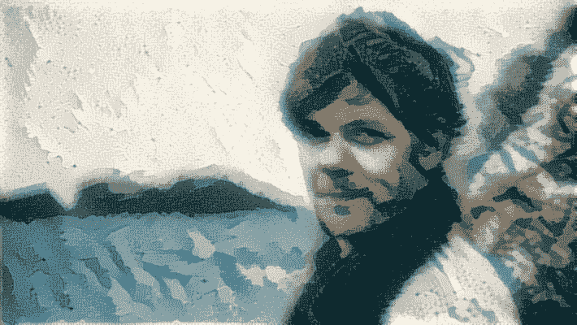

# 神经风格转移:乐队作为他们的专辑封面

> 原文：<https://towardsdatascience.com/neural-style-transfer-bands-as-their-album-covers-64a1dd12b71e?source=collection_archive---------80----------------------->

## 上帝保佑你！计算机视觉模型

我们头脑中的热芯片+*通过神经类型转移(第一帧致谢:立体树胶/热芯片)*

*最早在 [Gatys et al. (2015)](https://arxiv.org/abs/1508.06576) 提出的神经风格迁移方法，已经被广泛讨论和复制。这是一项非常酷的技术，通过这种方式可以将两幅图像组合在一起，从而保留一幅图像的大部分*内容*，同时向另一幅图像的*风格*移动。这使得创建两个图像的混合图像成为可能，人类将很难预先想象这两个图像，但是当该方法工作良好时，一旦人们看到它们，这两个图像就很有意义(即，“如果以 **B** 的风格完成，那*I*s*A**A**看起来会是什么样子”)。**

*我尝试了一下，按照 Keras 文档中的例子，使用 VGG16 卷积模型的中间层来计算图片在内容和风格上的相似性。我强烈推荐[这篇文章](/how-to-get-beautiful-results-with-neural-style-transfer-75d0c05d6489)，它展示了部分算法的改变如何影响结果。Keras 的例子在这方面已经做好了准备。我试验了内容、风格和总变化损失的相对权重，以及用于内容损失的层，但主要是我在这里利用了其他人已经完成的关于风格转移的探索工作。*

*对于我尝试的任何参数值来说，找出“什么有效”作为样式图像是很有趣的。该方法理想地适用于绘画风格，其由调色板和笔触技术的组合组成，后者被视觉捕捉并被模型捕捉为图像中的一个或多个中等大小的形状或结构。对于非绘画图像，如果图像太详细(太多的颜色或太小比例的图案)，这种方法就不好用了。要成功定义一种风格，图像需要有某种重复的结构和/或独特的配色方案。*

*我实现了这个算法，将我最喜欢的专辑的封面作为风格图像，将他们各自的艺术家作为内容图像，来重新设计乐队作为他们专辑封面的风格。在某些情况下，这非常有效。这里说明了这个想法:拍摄一个标准的 Go 波段图像！团队作为内容，并添加 [*的封面、雷霆、闪电、*](https://en.wikipedia.org/wiki/Thunder,_Lightning,_Strike) 的封面作为风格，使用 *TLS* 封面的调色板和一些结构方面，得到的结果不再是照片，而是乐队的“艺术家印象”:*

****

*图片鸣谢:1songday.com；维基百科等。*

**

*我的原始结果！团队+雷霆，闪电，打击*

*在这种情况下，也许不太清楚这张照片现在是不是相册封面的“风格”；相反，这只是一个我们以前没有想象过的新形象。在其他示例中，风格可以更容易地被描述，并且更明显地被转移到内容图像。*

*这种技术有很多很好的选择。我尝试了其中的一些，这里有一些效果不错的例子。我非常喜欢制作这些，所以我建立了一个网站来展示当前的一批和未来的补充:[乐队作为专辑封面](http://www.bandsasalbumcovers.com)。*

*这是 Idlewild 主唱罗迪·温布尔的风格 [*偏远地区*](https://en.wikipedia.org/wiki/The_Remote_Part) :*

**

*奥马尔和安凯臣从汽车电影院出来，按 [*的关系指挥*](https://en.wikipedia.org/wiki/Relationship_of_Command) *:**

**

*我真的很喜欢这首:祝你好运！黑皇，以 [*的风格，抬起瘦骨嶙峋的双拳像天线一样指向苍天*](https://en.wikipedia.org/wiki/Lift_Your_Skinny_Fists_Like_Antennas_to_Heaven) *:**

**

*这里使用了较高的内容权重来保留带的轮廓，因为红线样式相对较强。*

*以下是在 [*滑道太窄*](https://en.wikipedia.org/wiki/Chutes_Too_Narrow) *:* 的缤纷世界中玩耍的小腿*

**

*Joy Division 的 [*任逍遥的*](https://en.wikipedia.org/wiki/Unknown_Pleasures) 显然是这种技术的候选，正如所料，它工作得非常好:*

**

*这就好像乐队正在消失在电波信号中。*

*爱尔兰歌手丽莎·汉尼根，穿着针织风格的 [*海缝*](https://en.wikipedia.org/wiki/Sea_Sew) *:**

**

*她在麦克风前拿着一把尤克里里琴，但内容图像的细节被样式强烈修改了。*

*在户外玩耍的 Sigur Ros，被[*val tari*](https://en.wikipedia.org/wiki/Valtari)*:*的绿霾追上*

**

*最后，我最喜欢的，如上图所示，由我们头脑中的**:*参差不齐的颜色构成的热薯片**

****

**还值得展示一个内容权重更高的版本，它保留了乐队的面孔，让人想起*电咖* *中的[发电厂乐团。](https://www.hubertart.net/kraftwerk/5lk499k1i8nnpi8qhv5du91z9o4mmd)***

****