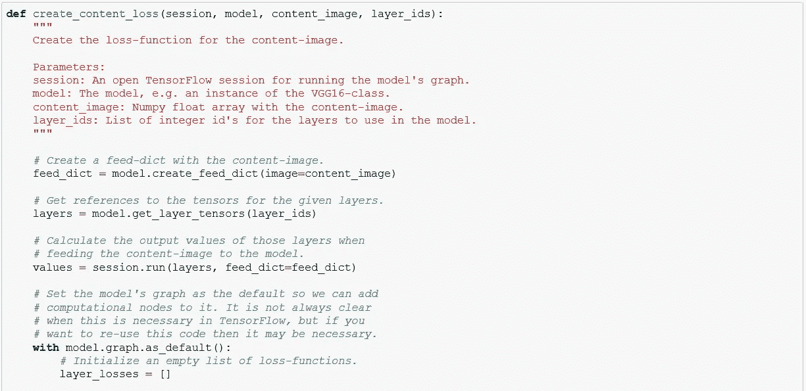

# 基于 VGG 模型的神经风格迁移

> 原文：<https://towardsdatascience.com/neural-style-transfer-using-vgg-model-ff0f9757aafc?source=collection_archive---------18----------------------->

## 一种采用不同图像风格的数字图像变换技术

**简介**:

在我们开始之前，让我们去[这个](https://deepart.io/)网站获取一些灵感。在网站上，我们从本地计算机中选择一张照片(假设图片名为 Joey.jpg)。我们姑且称之为内容图像。然后，我们选择另一个图像，说风格图像命名为 style1.jpg 从本地计算机。该网站所做的是生成一个混合图像，它保留了内容图像的轮廓，并将样式图像的纹理和颜色模式添加到内容图像中。以下是结果。

左:原始图像，右:风格图像，中间:混合图像

**描述**:

这被称为神经风格转移(NST)，通过使用深度学习，具体来说是卷积神经网络(CNN)来完成。我想你对 CNN 很熟悉。如果没有，我会强烈推荐 CNN[的吴恩达课程。](https://www.coursera.org/learn/convolutional-neural-networks?)

让我们借助下面的流程图来理解 NST 的基础知识。它显示了具有 13 个卷积层的样式转移算法(为简单起见，仅显示了几个)。两个图像被输入到神经网络，即内容图像和风格图像。我们的目的是生成一个混合图像，它包含内容图像的轮廓和样式图像的纹理、颜色模式。我们通过优化几个损失函数来做到这一点。

内容图像的损失函数最小化在一层或多层上为对应于混合图像(最初只是逐渐改善的噪声图像)的内容图像激活的特征的差异。这将内容图像的轮廓保留到合成的混合图像中。

而风格图像的损失函数最小化了风格图像和混合图像之间的所谓 Gram 矩阵之间的差异。这是在一层或多层完成的。Gram 矩阵的用途是识别在给定的层上哪些特征被同时激活。然后，我们模仿同样的行为，将其应用于混合图像。

使用 TensorFlow，我们将内容和风格图像的这些组合损失函数的梯度更新到令人满意的水平。Gram 矩阵的某些计算，存储效率的中间值，图像去噪的损失函数，归一化组合损失函数，使得两个图像相对于彼此缩放。

**编码**:

现在我们已经理解了算法，让我们开始编码。[原纸](https://arxiv.org/abs/1508.06576)用的是 VGG-19 型号。但是这里我们将使用公开的 VGG-16 模型。从[这里](https://s3.amazonaws.com/cadl/models/vgg16.tfmodel)下载 VGG-16 模型(请记住是~550MB 文件)。

在根目录下，新建一个文件夹，命名为 **vgg16** ，将上面的文件和 Github 链接中的 vgg.py 粘贴过来。此外，我们通过注释掉 **maybe_download** 函数修改了 vgg16.py 文件(因为您已经下载了 vgg16.tfmodel 文件)

让我们先导入库。然后导入 vgg16 型号。

让我们为图像操作定义几个辅助函数。

**load_image** 加载一个图像并返回一个 numpy 浮点数组。图像被调整到最大高度或宽度。

**save_image** 将图像保存为像素值在 0 ad 255 之间的 jpeg 文件

**plot_image_big** 绘制更大的图像。

**plot_images** 绘制内容、样式和混合图像。

接下来，我们将定义在 Tensorflow 中用于优化的损失函数。

**mean_squared_error** 运算将返回一个张量，即两个输入张量之间的均方误差(MSE)差。

**create_content_loss** 将计算内容和混合图像之间的 MSE。损失被最小化，使得内容的激活特征与混合图像相似，从而将轮廓从内容图像转移到混合图像。

接下来，我们的动机是捕捉混合图像的风格特征。为了做到这一点，我们将做一些类似的事情，即测量哪些功能同时激活的风格层，并复制这个模式到混合图像。一种有效的方法是计算 Gram 矩阵。Gram 矩阵本质上是特征激活层向量的点积。如果矩阵中的条目具有较小的值，则意味着给定层中的两个特征不会同时激活，反之亦然。

让我们首先将计算文法矩阵定义为 **gram_matrix** ，然后是 **create_style_loss** ，它计算 gram 矩阵的 MSE，而不是两个原始张量(正如我们在 **create_content_loss** 中所做的)。

为了减少合成混合图像中的噪声，我们使用一种称为“全变差去噪”的去噪滤波算法，使用以下代码。

下一段代码是核心。我们将定义计算损失函数梯度下降的风格转移算法。该算法使用归一化，使得损失值等于一，这有助于选择独立于内容和样式层的损失权重。

首先，我们将载入我们希望包含在混合图像中的具有轮廓特征的内容图像。在这里，我把它命名为 1.jpg

现在，我们将加载我们希望其颜色和纹理出现在混合图像中的样式图像。

此外，我们将定义我们想要匹配内容图像的层索引。通常是刚开始几层。VGG-16 中的第 5 层(指数为 4)似乎工作良好。类似地，样式图像的层索引。通常，它位于总图层的末尾。这里我们将定义第 13 层。

执行的最后一部分是将样式转换应用于我们定义的内容和样式图像。根据定义，它自动为内容和样式层创建损失函数，并根据迭代次数执行优化。最后，显示混合图像。

**结果**:

这个过程可能在 CPU 上运行缓慢(我用的是 CPU)。看看给出什么结果。

**结论**:

还不错！结果证明了组合两个图像的基本思想。他们并不像这些技术的先驱[迪帕克](https://deepart.io/)那样不相上下。也许更多的迭代、更小的步长、更高分辨率的图像、变化的样式和内容层索引或者更高的计算能力会提高混合图像的质量。

感谢您朗读这篇文章。希望有帮助。

你可以在[这个](https://github.com/darshanadakane/neuralStyleTransfer_usingVGG)链接找到 github repo。

**参考**:

[1] Hvass-Labs，TensorFlow 教程#15 Style Transfer (2018)，[来源](https://www.youtube.com/watch?v=LoePx3QC5Js&t=268s)