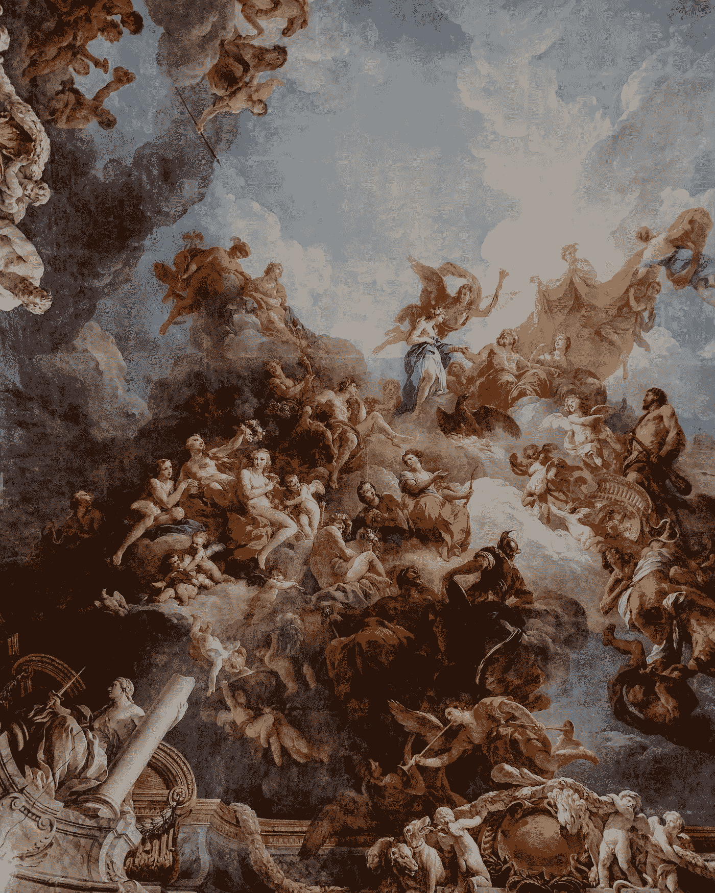
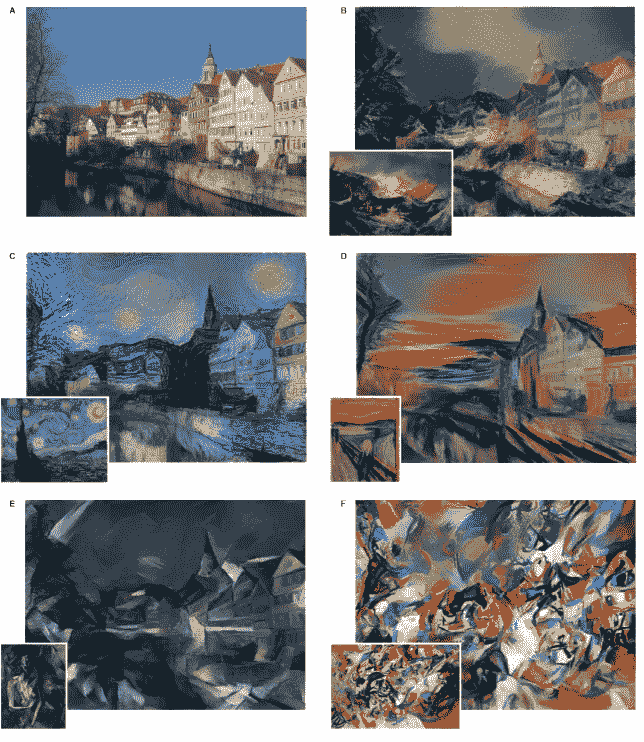
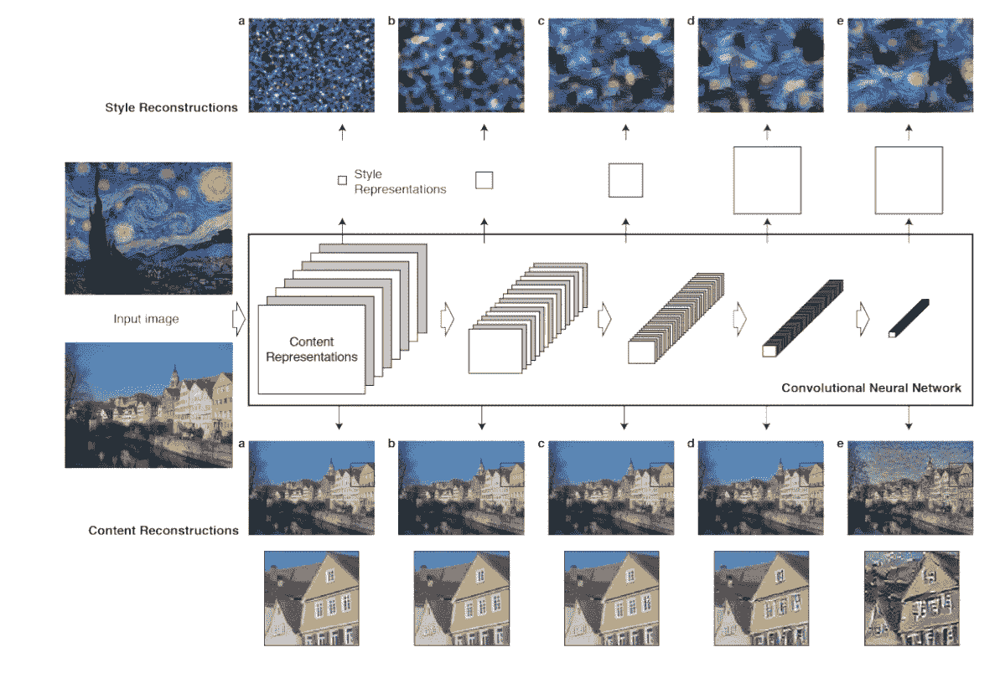
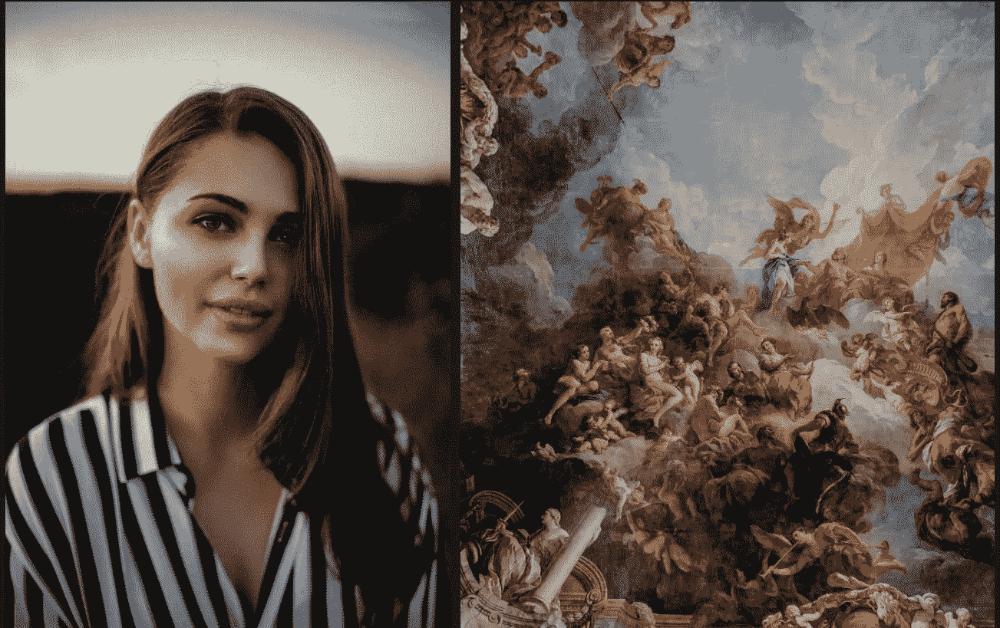
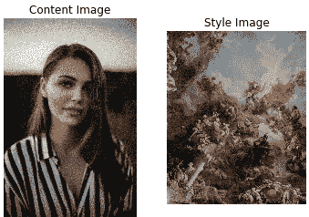
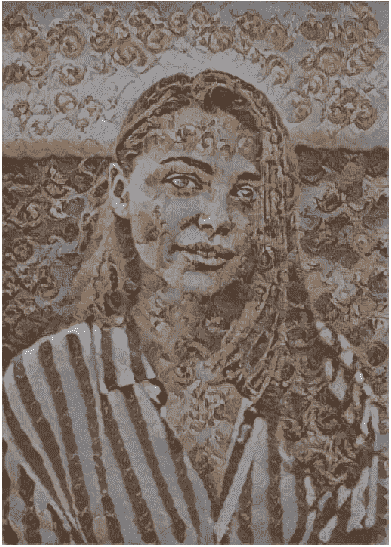

# 张量流中枢神经式传递

> 原文：<https://towardsdatascience.com/neural-style-transfer-with-tensorflow-hub-dfe003df0ea7?source=collection_archive---------22----------------------->

## 我不会画画，但是机器学习可以…



阿德里安娜 [geo](https://unsplash.com/@adrigeo_?utm_source=unsplash&utm_medium=referral&utm_content=creditCopyText) 在 [Unsplash](https://unsplash.com/s/photos/painting?utm_source=unsplash&utm_medium=referral&utm_content=creditCopyText) 拍摄的照片

# 介绍

我不是艺术鉴赏家，但上面这幅画看起来不错。

我也不是画家，但在本文结束时，我将创建一个与上面的图像具有相似绘画风格的图像。

**本文将涵盖以下内容:**

*   **神经类型转移的描述**
*   **神经类型转移如何工作**
*   **样式传递的代码实现**

*对于热心的读者，请随意向下滚动到* `*code*` *部分。*

# 什么是神经类型转移

神经风格转移(NST)是一种涉及利用深度卷积神经网络和算法从一幅图像中提取内容信息并从另一幅参考图像中提取风格信息的技术。在提取样式和内容之后，生成组合图像，其中所得图像的内容和样式源自不同的图像。

NST 是一种图像风格化的方法，这是一种涉及使用输入参考图像来提供具有从输入图像导出的风格差异的输出图像的过程。

NST 技术出现在 Leon A Gatys 等人的论文“艺术风格的神经算法”中。



# 它是如何工作的

深度神经网络(DNN)，更具体地说，卷积神经网络(CNN)具有一个至关重要的特征，即能够学习图像内内容和风格的空间表示。这一特性使得 NST 技术成为可能。

由 CNN 生成的输入图像的空间表示捕获了图像的风格和内容的统计信息。NST 将提取的样式和内容组合成一个生成的输出图像。

CNN 层结构内的中间层中的激活功能提供了捕获输入图像的内容和风格统计信息的能力。

在卷积操作之后，CNN 图层输出一个特征图，卷积操作包括在输入图像上滑动一个过滤器。**一幅图像的内容其实就在生成的每一层的特征图之内。**

从中间层的特征图中提取内容将提供输入图像的高级结构和几何信息。

特征图获得输入图像的风格。**为了获得图像的风格，需要评估中间层中特征图的均值和相关性。**该过程提供的信息提供了输入图像的纹理图案信息。



[风格和内容重建](https://arxiv.org/pdf/1508.06576.pdf)

# 密码

精彩的部分来了。

我们将创建一个图像的内容和下面的图像风格。



左:内容图片(在 [Unsplash](https://unsplash.com/s/photos/human?utm_source=unsplash&utm_medium=referral&utm_content=creditCopyText) 上由[斯特凡·斯特凡·基克](https://unsplash.com/@cikstefan?utm_source=unsplash&utm_medium=referral&utm_content=creditCopyText)拍摄)，右:风格图片(在 [Unsplash](https://unsplash.com/s/photos/painting?utm_source=unsplash&utm_medium=referral&utm_content=creditCopyText) 上由[阿德里安娜·吉奥](https://unsplash.com/@adrigeo_?utm_source=unsplash&utm_medium=referral&utm_content=creditCopyText)拍摄)

为了使用两个参考图像成功实现神经类型转移的过程，我们将利用 [TensorFlow Hub](https://www.tensorflow.org/hub) 上的模块

TensorFlow hub 提供了一套可重用的机器学习组件，如数据集、权重、模型等。

对于本文的实现部分，我们将利用一系列工具和库来加载图像和执行数据转换。

*   [**TensorFlow**](https://www.tensorflow.org/) :机器学习模型的实现、训练、部署的开源平台。
*   [**Matplotlib**](https://matplotlib.org/) :用于在 Python 中创建可视化绘图的工具，如图表、图形等
*   [**Numpy**](https://numpy.org/) :启用数组数据结构的几种数学计算和运算。
*   [**tensor flow Hub**](https://www.tensorflow.org/hub):模型、数据集等可重用机器学习组件的库

## 我们将使用 [Jupyter Notebook](https://jupyter.org/) 进行代码实现。本文末尾还包含了一个到笔记本 Github 资源库的链接。

首先，我们将导入所需的工具和库。

```
import tensorflow as tf
import matplotlib.pyplot as plt
import numpy as np
import PIL.Image
import tensorflow_hub as hub
```

接下来，我们声明两个变量，保存输出结果的内容和样式的图像的目录路径。此外，我们将显示图像。

```
content_path = 'images/human.jpg'
style_path = 'images/painting.jpg'content_image = plt.imread(content_path)
style_image = plt.imread(style_path)plt.subplot(1, 2, 1)
plt.title('Content Image')
plt.axis('off')
imshow(content_image)plt.subplot(1, 2, 2)
plt.title('Style Image')
plt.axis('off')
imshow(style_image)
```



内容和风格图像

要求将图像转换成张量表示。下一步，我们将利用 TensorFlow 的图像处理方法。

我们将创建一个接受图像路径的函数，然后使用“tf.io.read_file”将图像转换为张量。我们进一步使用“tf.image.decode_image”将张量中值的数据类型更改为介于 0 和 1 之间的浮点数。

```
def image_to_tensor(path_to_img):
    img = tf.io.read_file(path_to_img)
    img = tf.image.decode_image(img, channels=3, dtype=tf.float32)

    # Resize the image to specific dimensions
    img = tf.image.resize(img, [720, 512])
    img = img[tf.newaxis, :]
    return img
```

需要与上述相反的实现来可视化 TensorFlow Hub 模块的结果。我们需要将返回的张量转换成我们可以可视化的图像。

我们只是通过将每个元素乘以 255，将包含 0 和 1 之间的值的张量反规格化为实际像素值。下一步是使用 Numpy 创建一个数组，其中包含我们需要的适当数据类型。

我们从张量返回一个图像对象。

```
def tensor_to_image(tensor):
    tensor = tensor*255
    tensor = np.array(tensor, dtype=np.uint8)
    tensor = tensor[0]
    plt.figure(figsize=(20,10))
    plt.axis('off')
    return plt.imshow(tensor)
```

到目前为止，我们已经完成了以下工作:

*   查看内容和样式图像参考
*   创建一个函数，将图像转换为张量，并将张量转换为图像

现在我们将把图像转换成张量，并通过。TensorFlow Hub 包中的 load()'方法。

我们期望从我们的参考图像中得到样式和内容的组合结果；因此，我们将创建一个变量来保存模块的操作结果。

为了可视化结果，我们只需利用我们之前创建的“张量到图像”函数。

```
content_image_tensor = image_to_tensor(content_path)
style_image_tensor = image_to_tensor(style_path)hub_module = hub.load('[https://tfhub.dev/google/magenta/arbitrary-image-stylization-v1-256/2'](https://tfhub.dev/google/magenta/arbitrary-image-stylization-v1-256/2'))
combined_result = hub_module(tf.constant(content_image_tensor), tf.constant(style_image_tensor))[0]
tensor_to_image(combined_result)
```



神经类型转移结果

# 结论

我们已经成功地结合了两个参考图像的风格和内容，并生成了一个网格图像。

接下来，我建议你更详细地探讨神经类型转移的话题。

下面是一个 GitHub repo 的链接，它提供了本文中的代码。

[](https://github.com/RichmondAlake/tensorflow_2_tutorials/blob/master/03_neural_style_transfer.ipynb) [## Richmond alake/tensor flow _ 2 _ 教程

### permalink dissolve GitHub 是 4000 多万开发人员的家园，他们一起工作来托管和审查代码，管理…

github.com](https://github.com/RichmondAlake/tensorflow_2_tutorials/blob/master/03_neural_style_transfer.ipynb) 

我建议您探索的另一个主题是图像分类。下面是一篇文章的链接，其中我介绍了如何使用 TensorFlow 和 Keras 实现图像分类。

[](/in-depth-machine-learning-image-classification-with-tensorflow-2-0-a76526b32af8) [## 使用 TensorFlow 2.0 进行(深入)机器学习图像分类

### 理解实现用于图像分类的神经网络的过程。

towardsdatascience.com](/in-depth-machine-learning-image-classification-with-tensorflow-2-0-a76526b32af8)