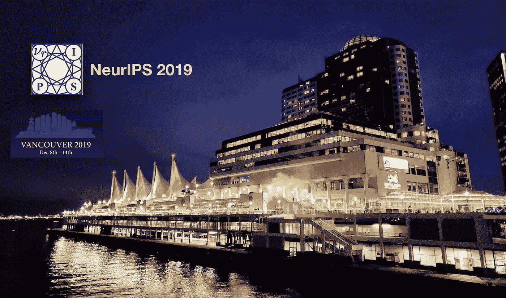
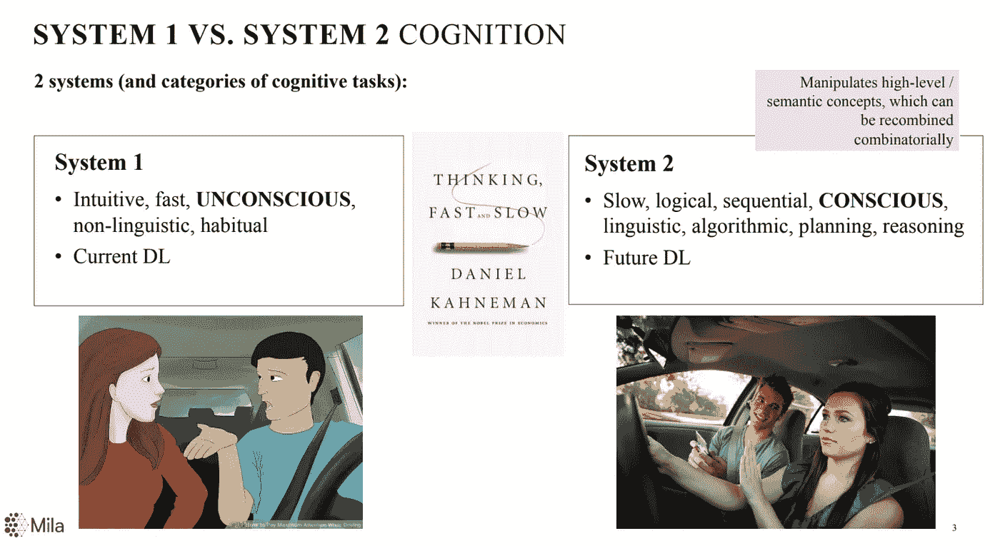
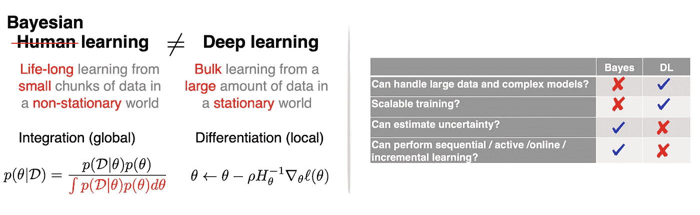
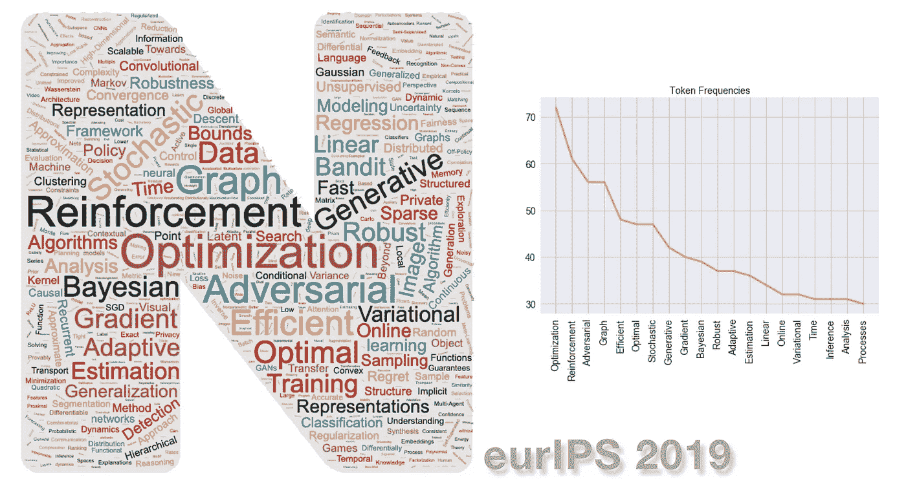
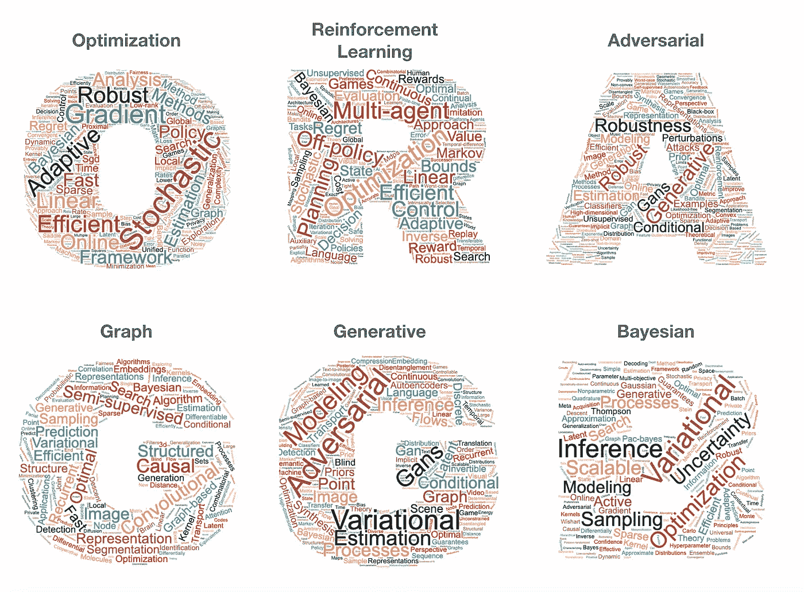
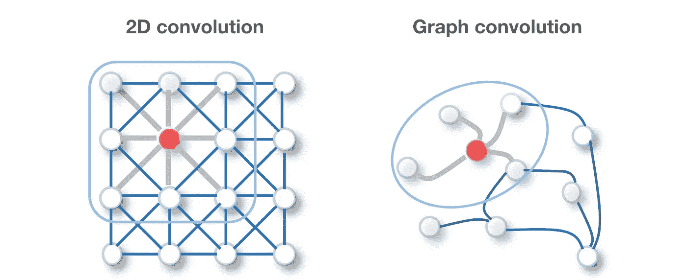
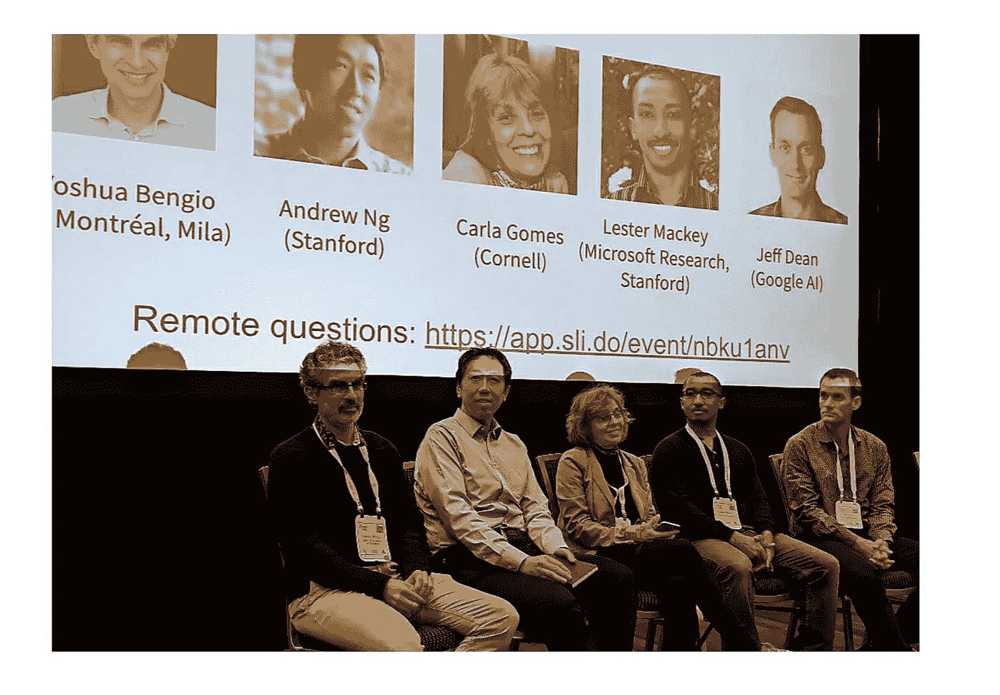
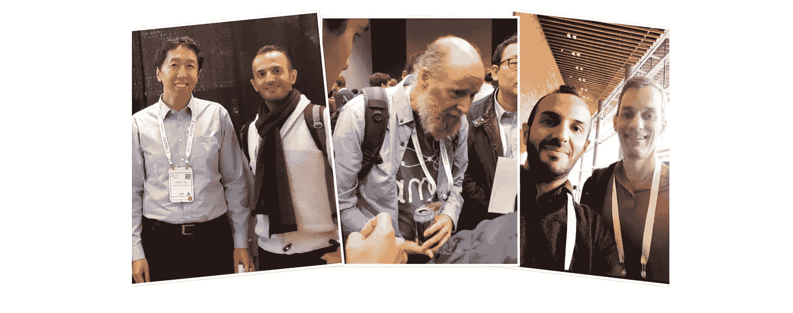

# NeurIPS 2019 亮点

> 原文：<https://towardsdatascience.com/neurips-2019-highlights-part-1-cc4acc46f8c2?source=collection_archive---------21----------------------->

## 我在最大的机器学习大会上学到的总结。

温哥华会议中心海滨景色[图片由本人拍摄]

NeurIPS 2019 有 13000 名参与者，1428 篇被接受的论文(来自 6743 篇提交的论文)，58 场研讨会，16K 页的会议记录，是我参加过的最具影响力也是最有成效的会议之一。主席们在“[我们从 NeurIPS 2019 数据](https://medium.com/@NeurIPSConf/what-we-learned-from-neurips-2019-data-111ab996462c)中学到了什么”上展示了一份精彩的会议数据分析。

考虑到会议的规模，要涵盖所有的曲目、演讲和海报几乎是不可能的。在这篇文章(以及后续文章)中，我将从我个人的角度提供一些大会的亮点。

# 1.专题讲座:

Yoshua Bengio | [*从系统 1 深度学习到系统 2 深度学习*](https://slideslive.com/38921750/from-system-1-deep-learning-to-system-2-deep-learning)
Vivienne Sze | [*深度神经网络的高效处理:从算法到硬件架构*](https://slideslive.com/38921492/efficient-processing-of-deep-neural-network-from-algorithms-to-hardware-architectures)
Celeste Kidd |[*如何知道*](https://slideslive.com/38921495/how-to-know)
Mohammad emti yaz Khan |[*深度学习与贝叶斯原理*](https://slideslive.com/38921489/deep-learning-with-bayesian-principles)
Blaise Aguera y Arcas |

[**从系统 1 深度学习到系统 2 深度学习**](https://slideslive.com/38921750/from-system-1-deep-learning-to-system-2-deep-learning) ( [幻灯片](https://drive.google.com/file/d/1zbe_N8TmAEvPiKXmn6yZlRkFehsAUS8Z/view) ): Yoshua Bengio 的演讲是大会最受欢迎的主题演讲。Yoshua 对深度学习的现状及其未来提供了一个奇妙的见解。受《思考 [*、快与慢*](https://www.amazon.com/Thinking-Fast-Slow-Daniel-Kahneman/dp/0374533555) *，*这本书的启发，他提出了一条从深度学习擅长的*系统 1* (直觉、快速无意识非语言、习惯性决策/推理)到其未来的*系统 2* (缓慢、逻辑、顺序、有意识、语言、算法、决策)的路径。他将*意识*(以及 [*注意力*](https://arxiv.org/abs/1706.03762) 作为其关键成分)作为*系统 2* 的基础，以[稀疏因子图作为意识先验](https://arxiv.org/abs/1709.08568)，以[元学习](https://lilianweng.github.io/lil-log/2018/11/30/meta-learning.html)作为理论框架，将深度学习从系统 1 扩展到系统 2。

系统 1 与系统 2 学习[图片取自 Yoshua Bengio 的[幻灯片](https://drive.google.com/file/d/1zbe_N8TmAEvPiKXmn6yZlRkFehsAUS8Z/view)

[**深度学习与贝叶斯原理**](https://slideslive.com/38921489/deep-learning-with-bayesian-principles) **(** [幻灯片](https://emtiyaz.github.io/papers/neurips_tutorial.pdf) **):** *深度学习*和*贝叶斯学习*被认为是两个完全不同的领域，经常在互补的设置中使用。Emtiyaz Khan 在他的演讲中介绍了现代贝叶斯原理来弥合这一差距，通过结合它们的优势来解决具有挑战性的现实世界问题。

贝叶斯 vs 深度学习[图片取自[https://emtiyaz.github.io/papers/neurips_tutorial.pdf](https://emtiyaz.github.io/papers/neurips_tutorial.pdf)

我们可以使用贝叶斯原则作为一般原则，通过计算后验近似来设计、改进和推广一系列学习算法。我们可以将现有的算法(例如 Adam optimizer)作为特例，或者设计新的深度学习算法，用于不确定性估计、小数据集上的推广和终身学习。训练贝叶斯神经网络特别是后验近似仍然是一个具有挑战性和计算昂贵的问题。因此，可以使用近似方法，如*变分推论* (VI)。

进一步阅读可以参考论文“[实用深度学习与贝叶斯原理](https://arxiv.org/abs/1906.02506)”、“[变分推理的自然梯度下降](https://arxiv.org/pdf/1807.04489.pdf)”、“[概率方法—变分推理](https://nips.cc/Conferences/2019/Schedule?showParentSession=15542)”。PyTorch 实现也是一个即插即用的优化器。

# 2.趋势:

下图显示了 NeurIPS 2019 所有已接受论文标题的最常用标记(单词)的[单词云](https://www.wordclouds.com/)(经过一些预处理，如删除自定义停用词，如“neural”&“network”)。获取标题和令牌频率的代码可以在 [Github](https://github.com/alirezadir/neurips-analysis/tree/master/notebooks) 上找到。

论文标题中最常见标记的词云和频率图—neur IPS 2019[源代码可在此处获得

最常用的 10 个词如下:*优化、强化、对抗、图、高效、随机、最优、生成、贝叶斯*。我对以下关键词进行了进一步分析:*优化、强化学习、对抗、图形、生成和贝叶斯神经网络*(代码可在此处找到)，发现了一些有趣的结果:

按主题分类的论文标题中最常见标记的词云—neur IPS 2019[源代码可在此处获得

从我的角度来看(基于会议出席人数和上述数据)，以下主题是会议的趋势:

*   **强化学习** : RL 仍然是人工智能会议中最热门的话题之一。彼得·阿比尔等人的[深度强化学习工作坊](https://sites.google.com/view/deep-rl-workshop-neurips-2019/home)。艾尔。Katja Hofmann 的教程[强化学习:过去、现在和未来的观点](https://slideslive.com/38921493/reinforcement-learning-past-present-and-future-perspectives) ( [幻灯片](https://www.microsoft.com/en-us/research/uploads/prod/2019/11/2019-12-09-Hofmann-NeurIPS-tutorial_no-video.pdf))是今年 Neurips 最受欢迎的课程之一。最近受到很多关注的一个非常有趣的话题是 ***多智能体 RL (MARL)*** *，*在复杂的环境中，多个智能体相互竞争和/或协调以实现一个目标。The Nature paper， [*星际争霸 2 中的特级大师级使用多智能体强化学习*](https://www.nature.com/articles/s41586-019-1724-z) ，是 DRL 工作坊的重头戏。Katja Hofmann 在她的演讲中概述了我们目前所处的位置，以及对未来研究和 RL 实际应用的关键机会的展望。关于 MARL 的介绍可以在这篇[博客文章](/modern-game-theory-and-multi-agent-reinforcement-learning-systems-e8c936d6de42)中找到，关于这个主题的论文的完整列表可以在[蓝涛宇的报告](https://github.com/LantaoYu/MARL-Papers)中找到。
*   **对抗网络**:gan 为知识获取提供了一个很好的机制，然而，它们也可以被用作[对抗例子](https://arxiv.org/abs/1312.6199)来产生对 DNN 模型的攻击(例如，来自攻击者的[对抗输入](https://openai.com/blog/adversarial-example-research/)可以在训练图像中引起难以察觉的变化来欺骗分类模型)。评估深度学习模型针对这种攻击的***对抗性*** ***健壮性*** 一直是 OpenAI、Google 和 IBM 等 AI 巨头(例如 IBM 的[对抗性健壮性工具箱](https://github.com/IBM/adversarial-robustness-toolbox))的优先事项，并且不出所料是该领域的主导话题。
*   【**新增****贝叶斯深度学习**:请参考第一节 [*深度学习与贝叶斯原理*](https://slideslive.com/38921489/deep-learning-with-bayesian-principles) 。
*   【**新**】**图形神经网络**:在这次 NeurIPS 大会上，图形几乎无处不在。图是非常强大的非欧几里得数据结构，可以表示对象之间的复杂关系和相互依赖性。因此，大量应用(如社交网络、物理科学、化学、电子商务、知识库、推荐系统和组合问题)中的数据可以用图来表示。图的*不规则结构*(可变大小和节点的无序邻居集)使得对它们执行诸如卷积的操作具有挑战性。因此，人们对*图形神经网络(GNNs)* 算法越来越感兴趣，以便推广深度学习方法，如针对图形数据的 CNN、RNNs 和自动编码器。gnn 可以分为四类:*递归图神经网络、卷积图神经网络(cgnn)、图自动编码器和时空图神经网络*，目前 cgnn 的权重最大。

左边的 2D 卷积与右边的图卷积(节点的邻居是无序的，大小可变)的比较[图片取自本文]。

要了解更多关于 GNNs 的知识，可以看看[关于图神经网络的温和介绍](/a-gentle-introduction-to-graph-neural-network-basics-deepwalk-and-graphsage-db5d540d50b3)的帖子或者下面的调查论文:
[关于图神经网络的全面调查](https://arxiv.org/abs/1901.00596)、
[Stanford SNAP 的图神经网络教程](http://snap.stanford.edu/proj/embeddings-www/files/nrltutorial-part2-gnns.pdf)和
[图神经网络:方法和应用回顾](https://arxiv.org/pdf/1812.08434.pdf)。
在[本次回购](https://github.com/thunlp/GNNPapers)中还收集了一份不错的 GNN 论文清单。图不仅可以用作数据结构，还可以表示神经网络的输出，例如，任何联合分布都可以表示为因子图，正如 Yoshua Bengio 在他的特邀演讲中所指出的。

# 3.新方向奖:

杰出新方向论文奖授予了 Vaishnavh Nagarajan 和 j .济科·科尔特的[统一收敛可能无法解释深度学习中的泛化](https://arxiv.org/abs/1902.04742)([幻灯片](https://www.cs.cmu.edu/~vaishnan/talks/neurips19_uc_slides.pdf)，[博客](https://locuslab.github.io/2019-07-09-uniform-convergence/)，[代码](https://github.com/locuslab/uniform-convergence-NeurIPS19))。

深度学习理论中最大的公开挑战之一是泛化难题，因为深度网络模型(与经典学习理论相反)尽管存在严重的过度参数化，但仍能很好地泛化。为了解释这种反直觉的行为，理论工作试图推导出深度网络的*泛化差距*(模型在训练数据和来自同一分布的未看到的数据上的表现之间的差距)的上限。这项工作退一步说，追求一致收敛为基础的界限可能不会真正导致我们对这个难题的完整解决方案。特别地，它表明 1)理论泛化界限随着训练集大小而增长(而经验差距减小)，以及 2)任何类型的一致收敛界限将被证明无法解释深度学习中某些情况下的泛化。

# 4.车间

在为期 3 天的 54 场研讨会中，以下是最受与会者欢迎的研讨会:

[深度强化学习](https://sites.google.com/view/deep-rl-workshop-neurips-2019/home)
[图形表征学习](https://grlearning.github.io/)
[元学习](http://metalearning.ml/2019/) ( [大卫·阿贝尔笔记](https://david-abel.github.io/notes/neurips_2019.pdf)，第 4 节，对本次工作坊有个牛逼的总结)
[贝叶斯深度学习](http://bayesiandeeplearning.org/)
[生物和人工强化学习](https://sites.google.com/view/biologicalandartificialrl/)
[用 ML 应对气候变化](https://www.climatechange.ai/NeurIPS2019_workshop.html)
以及对*对话式 AI 感兴趣的人*

关于[与 ML 一起应对气候变化的研讨会](https://www.climatechange.ai/NeurIPS2019_workshop.html)[图片来自 [Paul Save 的推特](https://twitter.com/PaulWSave/status/1205932047232929792?s=20) ]

# 5.民众

在会议期间的 28 个演示中，以下是我个人最喜欢的(有些偏向 NLP):
[ex BERT](http://exbert.net/):一个解释 BERT 的学习表示的可视化分析工具
[Streamlit](https://streamlit.io/)， 机器学习工具的新应用程序框架
[allenlp 解释器](https://allennlp.org/interpret):解释 NLP 模型的预测
[密码](http://word-game-ui-dev.mybluemix.net/play-guesser):人类和人工智能代理之间的合作猜字游戏
趣味演示: [*机器人辅助梳头*](https://www.youtube.com/watch?v=gqs2bSrFM4o) 、 [*旋律吃角子老虎机*](http://smc2019.uma.es/articles/D1/D1_02_SMC2019_paper.pdf) 互动音乐系统、 [*与人工智能化身的一对一健身训练*](https://twitter.com/twentybn/status/1204859719007002625)

# 6.社区、社交和聚会:

NeurIPS 2019 强调多样性和包容性。有 15 次正式的社交聚会把有共同兴趣的人聚集在一起。此外，与会者通过大会的官方移动应用程序(Whova)交流了大量信息。例如，有超过 300 个聚会由参与者组织和(几乎)无数的主题讨论！！

## AI 名人:

看到一些人工智能名人并与他们交谈是非常令人兴奋的，因为他们非常热情和谦逊:)

我和艾名人[图片由我自己]

# 8.其他摘要:

奇普·胡延的惊人之帖:[来自 NeurIPS 2019 的关键趋势](https://huyenchip.com/2019/12/18/key-trends-neurips-2019.html?utm_campaign=NLP%20News&utm_medium=email&utm_source=Revue%20newsletter)
大卫·阿贝尔的牛逼 [NeurIPS 2019 笔记](https://david-abel.github.io/notes/neurips_2019.pdf) (70 页)
罗伯特·兰格的优美[手记](https://github.com/RobertTLange/conference-school-notes/blob/master/2019-12-NeuRIPS/NeurIPS_1_compressed.pdf?utm_campaign=NLP%20News&utm_medium=email&utm_source=Revue%20newsletter)

# 9.相关链接

*   [neur IPS 2019 被接受论文的完整列表](https://papers.nips.cc/book/advances-in-neural-information-processing-systems-32-2019)
*   [NeurIPS 2019 实录会谈](https://slideslive.com/neurips)
*   [我们从 NeurIPS 2019 数据中学到了什么](https://medium.com/@NeurIPSConf/what-we-learned-from-neurips-2019-data-111ab996462c)
*   [NeurIPS 2019 |数字](https://medium.com/syncedreview/neurips-2019-the-numbers-c1808fba9480)
*   [NeurIPS 2019 综述:杰出论文、专题演讲、事实和数字](https://medium.com/syncedreview/neurips-2019-roundup-outstanding-papers-featured-talks-facts-and-figures-94aab6cfb8ce)
*   [深度 RL 工作坊论文](https://drive.google.com/file/d/1xdf3ia2VocviPR0q1uwH49h33bVVlNmp/view)