# 神经元，激活函数，反向传播，历元，梯度下降:这些是什么？

> 原文：<https://towardsdatascience.com/neurons-activation-functions-back-propagation-epoch-gradient-descent-what-are-these-c80349c6c452?source=collection_archive---------32----------------------->

如果你听到像深度学习、神经网络、激活函数、梯度下降、纪元这样的术语，但不知道它们真正的意思，那么这篇文章就是为你准备的。本文是对深度学习的介绍，其中您将了解什么是神经网络，它们如何学习，激活函数的类型，以及深度学习与机器学习的区别。让我们开始吧。

克里斯托夫·高尔在 [Unsplash](https://unsplash.com?utm_source=medium&utm_medium=referral) 上拍摄的照片

## 深度学习:为什么是现在

深度学习和神经网络自 80 年代以来就已经存在，但由于缺乏强大的处理能力和数据，直到最近才出现大的飞跃。回到 80 年代或 90 年代，存储内存有限且昂贵，这意味着我们无法加载大量数据进行处理。此外，CPU 和 GPU 非常昂贵，负担不起。如今，只需几美元，你就可以在 AWS 或 GCP 或 Azure cloud 上安装一个高端 NVIDIA GPU 和几千兆字节的内存。

直到最近，处理能力和内存还不足以进行深度学习。[来源](https://www.reddit.com/r/nostalgia/comments/a8zhi6/i_just_came_across_a_notebook_full_of_old/)。

为了让你知道 CPU 和内存有多贵，看看这些 90 年代中期的广告就知道了。2000 多美元的 16MB 内存和 120MHz CPU 是 90 年代中期的顶级产品。现在，在亚马逊或当地的百思买上查找 GPU 和内存，看看有多大的存储和强大的处理器可以以非常实惠的价格提供。

## 深度学习:它是什么

深度学习基于神经网络，它们旨在模仿人类大脑，这是地球上最强大的工具。

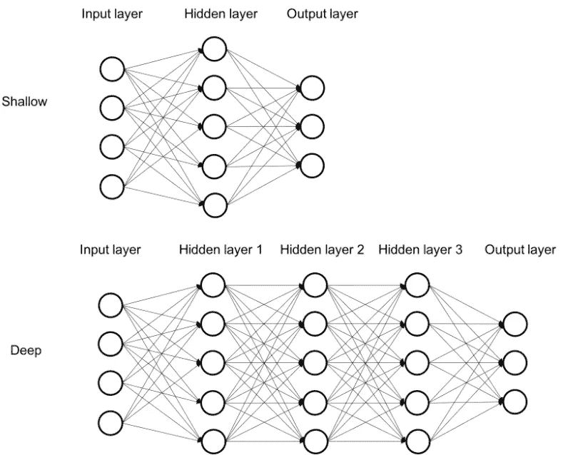

深层与浅层神经网络。[来源](https://subscription.packtpub.com/book/big_data_and_business_intelligence/9781785880360/1/ch01lvl1sec12/why-deep-learning)。

这些神经网络由许多神经元组成，它们有一个输入层、一个输出层和隐藏层。每个输入、输出或隐藏节点是一个神经元，具有一个 ***激活函数*** ，用于神经网络学习。我们将在本文后面讨论他们是如何学习的。

隐藏层越多，神经网络就越深。关于是什么使神经网络变浅和变深有不同的观点，但是拇指的作用是隐藏层越多，神经网络就越深，很少有隐藏层(有人说 2 或 3 层)使它变浅。

在学习时，这些神经元将具有不同的权重，这些权重在学习期间被调整。神经元的权重调整是学习的结果。使用 ***反向传播*** 和 ***梯度下降*** 来调整权重，这将在本文的后面介绍。

## 深度学习与机器学习

深度学习是机器学习的一个子集， ***每一个深度学习算法都被认为是机器学习但不是每一个机器学习算法都被认为是深度学习。***

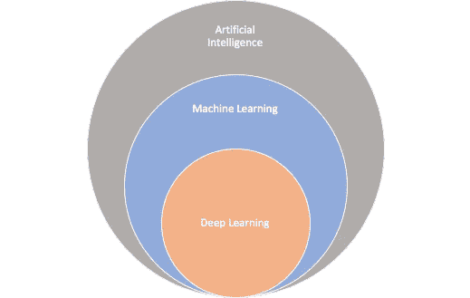

AI vs. ML vs. DL。[来源](https://medium.com/swlh/everything-you-wanted-to-know-about-machine-learning-but-were-too-afraid-to-ask-d7d92021038)。

机器学习和深度学习最大的区别在于它们是如何学习的。

**机器学习**:选择模型(例如某个分类器)进行训练，手动*对要学习的模型进行特征提取。*

***深度学习**:你选择神经网络的架构(层数、激活函数)和特征 ***自动从美联储标注的训练数据中提取*** 。*

*为了更好地理解这一点，让我们以汽车和公共汽车的分类为例。在**机器学习**中，您将定义您想要使用的分类器，然后执行特征提取，例如，您教导模型汽车的特征是某些尺寸、2 或 4 个门、4 个轮胎、4 个窗户等。对于公共汽车，你告诉模型，公共汽车的特征是有一定的尺寸，1 或 2 个门，8 个轮胎，10 个窗户，等等。在这里，您手动提取特征并将其输入到您的模型中。*

*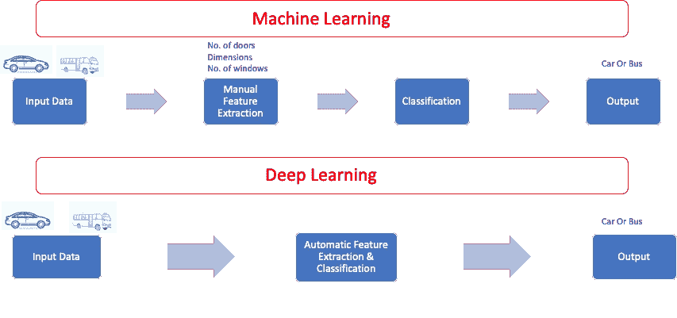*

*机器学习与深度学习*

*在**深度学习**中，不需要做特征提取，甚至不需要知道特征。你首先选择你的网络，例如卷积神经网络(CNN ),因为我们将处理图像。定义层数和要使用的激活函数，然后将你的网络指向一个贴有汽车和公共汽车标签的文件夹。神经网络将自动浏览图片并捕捉汽车和公共汽车的特征。就是这样，你的神经网络教会了自己如何区分汽车和公交车。*

## *激活功能*

****激活功能*** 是神经元中发生的事情，每个神经元都有一个激活功能，当神经元被激发时就起作用。*

*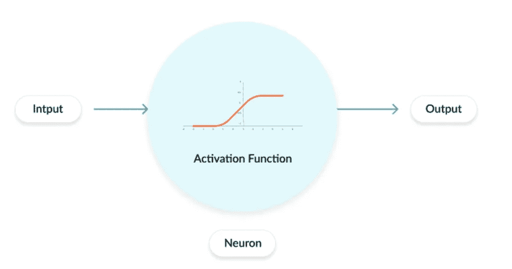*

*神经网络中的激活函数。[来源](https://missinglink.ai/guides/neural-network-concepts/7-types-neural-network-activation-functions-right/)。*

*神经元的输入将通过激活函数，得到处理，然后发送到下一层或输出神经元。这是神经网络学习的方式，并最终决定将什么发送给下一个神经元。*

*有许多不同的激活功能，但我在这里将涵盖主要的五个。*

*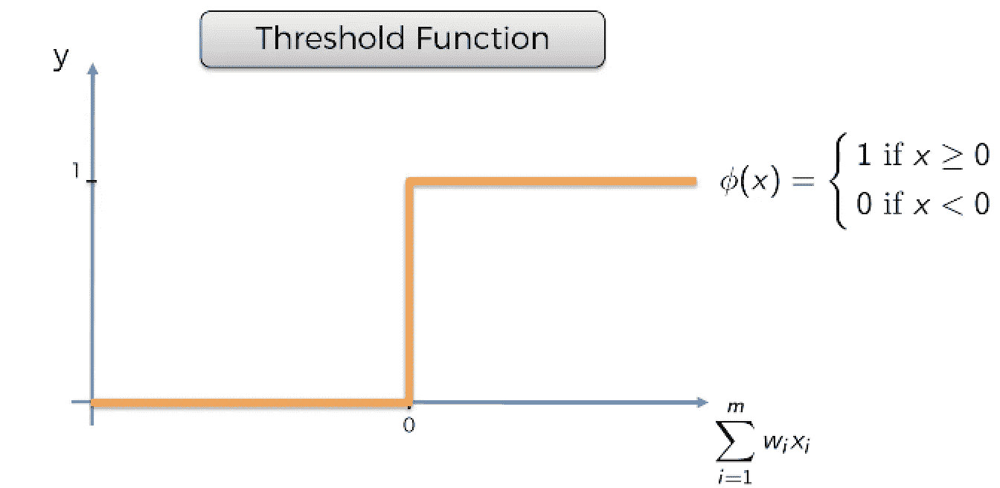*

*阈值(二进制步长)激活函数。[来源](https://www.superdatascience.com/blogs/artificial-neural-networks-the-activation-function)。*

***阈值函数***

*也称为二元阶跃函数，它是一个基于阈值的激活函数。如果输入值高于或低于某个阈值，神经元就会被激活，并向下一层发送完全相同的信号。这是一个是或不是的函数。*

*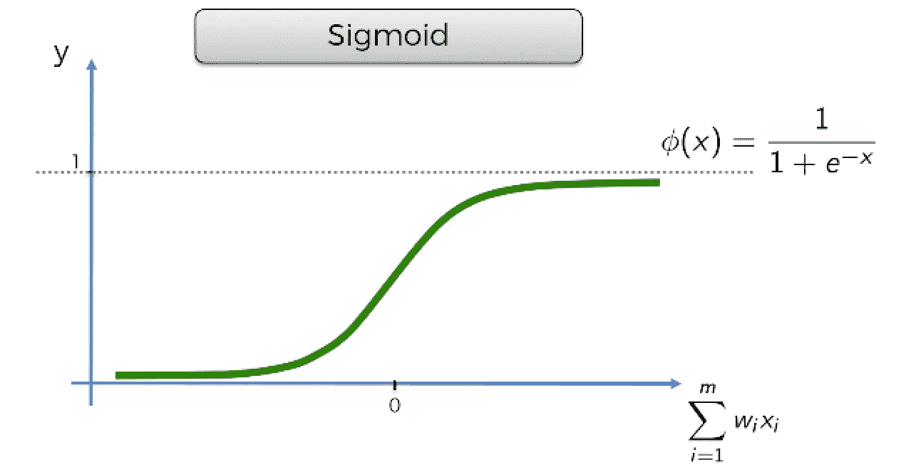*

*乙状结肠(逻辑)激活功能。[来源](https://www.superdatascience.com/blogs/artificial-neural-networks-the-activation-function)。*

***s 形函数***

*主要用于逻辑回归，比阈值函数平滑。它在神经网络的输出层也非常有用。一些数据科学家抱怨这种方法计算量很大。*

*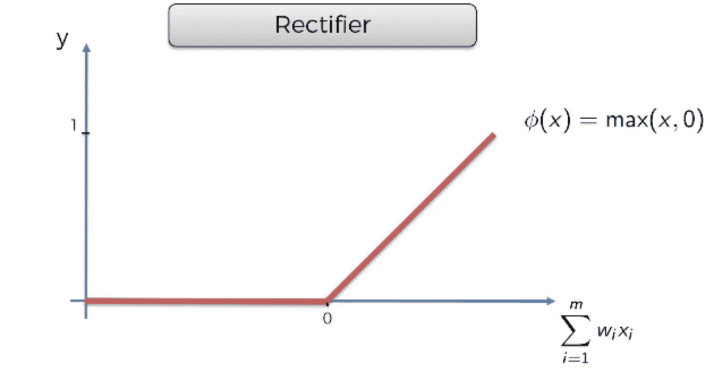*

*ReLU 激活功能。[来源](https://www.superdatascience.com/blogs/artificial-neural-networks-the-activation-function)。*

***整流器(ReLU)功能***

*这是神经网络最受欢迎的功能之一。它可以帮助减轻消失和爆炸梯度下降问题。ReLU 是一个非线性函数，计算效率很高。*

*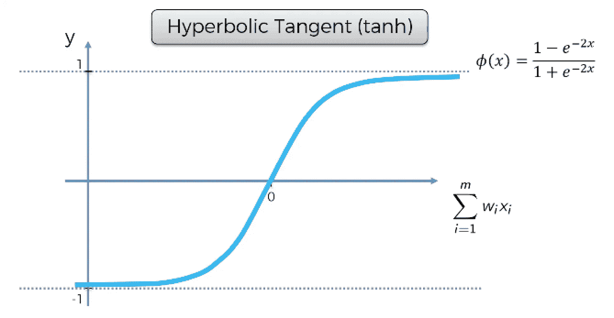*

*Tanh 激活函数。[来源](https://www.superdatascience.com/blogs/artificial-neural-networks-the-activation-function)。*

***双曲正切函数***

*它类似于乙状结肠，但它低于零，不像乙状结肠。它主要用于输入值为强负值、中性值或强正值的情况。*

*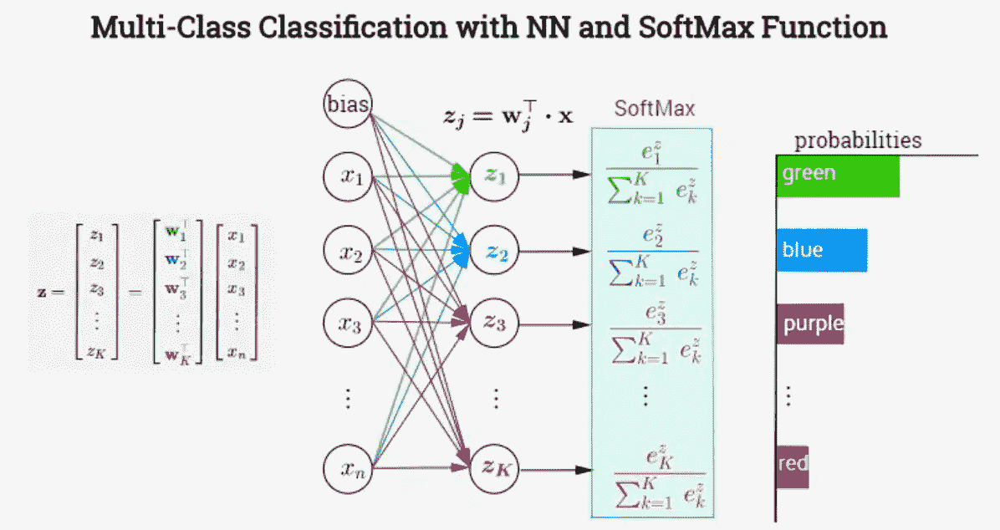*

*Softmax 激活功能。[来源](http://www.adeveloperdiary.com/data-science/deep-learning/neural-network-with-softmax-in-python/)。*

***Softmax 功能***

*这主要用于多类预测的分类问题。它通常位于神经网络的输出层。*

*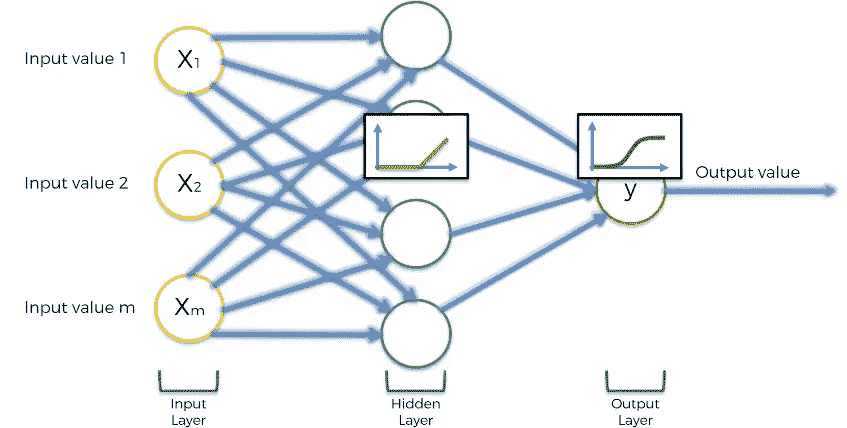*

*同一神经网络中的不同激活函数。[来源](https://www.slideshare.net/KirillEremenko/deep-learning-az-artificial-neural-networks-ann-the-activation-function)。*

*您可以对隐藏层和输出层应用不同的激活功能。在此图中，ReLU 应用于隐藏层，而 Sigmoid 应用于输出层。这是预测某事发生的概率的常见方法。*

## *神经网络:它们如何学习*

*学习是通过将带标签的数据从输入层一直传递到输出层，然后再返回来进行的。由于数据被标记，神经网络知道什么是预期输出，并将其与神经网络的实际输出进行比较。*

*在第一个 ***时期*** 中，被标记的数据在输入层被输入，并被传播到输出层，在那里你的神经网络将计算出一个输出。你的神经网络的实际输出与预期输出之间的差异被称为 ***成本函数*** 。你的神经网络的目标是尽可能地减少这个 ***成本函数*** 。因此，您的神经网络将 ***从输出层一直反向传播*** 到输入层，并相应地更新神经元的权重，以尝试最小化这个 ***成本函数*** 。*

*将数据从输入层发送到输出层，然后一路返回的行为称为 ***时期*** 。在每个时期，神经网络更新神经元的权重，这也被称为 ***学习*** 。在多个时期和权重更新之后，损失函数(神经网络输出与实际输出之间的差异)应该达到最小值。*

*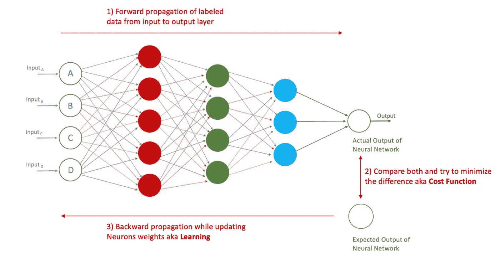*

*学习阶段的神经网络*

*在学习时，神经元将具有不同的权重，这些权重将决定未来的输出。例如，在我们之前的汽车与公共汽车分类场景中，神经元可以通过查看窗口的数量来确定该对象是汽车还是公共汽车，显然，该神经元比通过查看对象的颜色来确定该对象是汽车还是公共汽车的神经元具有更高的权重。这是对神经元功能的过度简化，但我希望你能根据重要性来理解神经元的权重。*

## *梯度下降*

*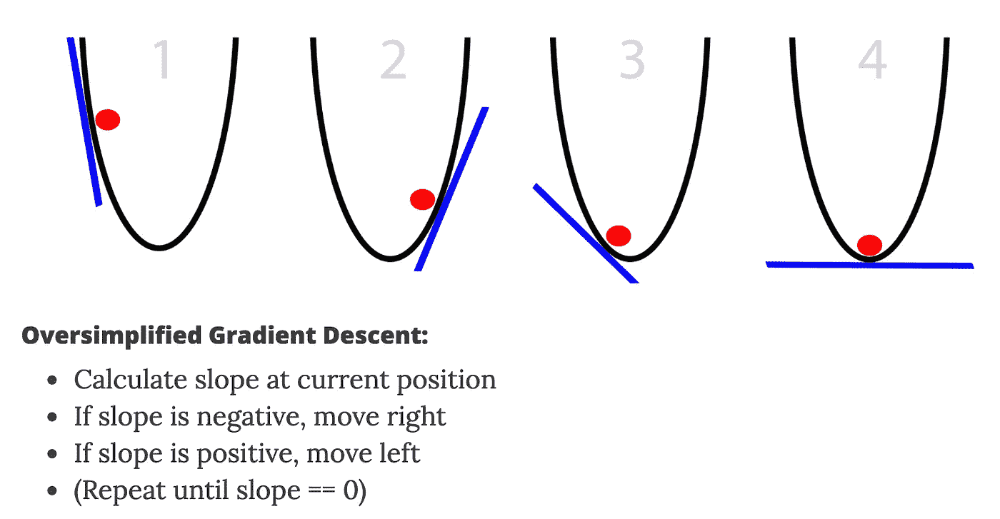*

*梯度下降。[来源](https://iamtrask.github.io/2015/07/27/python-network-part2/)。*

****梯度下降*** 是一种最小化代价函数以更新神经元权重的方法。此方法告诉您的神经网络如何以快速有效的方式计算成本函数，以最小化实际和预期输出之间的差异。*

*最容易理解也是最常见的例子是将您的成本函数比作一个球，通过更新其斜率来试图找到最低点。*

## *随机梯度下降*

****随机梯度下降*** 建立在梯度下降的基础上，可以处理复杂的成本函数。*

*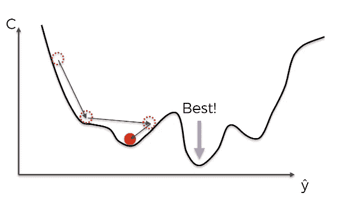*

*梯度下降陷入局部极小值，错过真正的极小值。[来源](https://www.slideshare.net/KirillEremenko/deep-learning-az-artificial-neural-networks-ann-stochastic-gradient-descent)。*

*梯度下降仅在只有一个最小值的凸成本函数的情况下工作良好。然而，在复杂的成本函数的情况下，梯度下降很容易陷入局部最小值，这破坏了你的神经网络学习。*

## *随机下降与梯度下降*

*为了理解随机下降和梯度下降有什么不同，让我们举个例子。我们将假设您已经将数据标记为行，并将它们输入到您的神经网络中进行训练。*

****梯度(批量)下降*** 当你的神经网络一次遍历一行数据，计算每一行的实际输出。然后，在完成数据集中的所有行后，神经网络将所有行的累积总输出与预期输出进行比较，并反向传播以更新权重。这意味着神经网络在作为一个大批量处理整个数据集之后更新一次权重，这是一个非常及时的时期。神经网络会这样做几次来训练网络。*

*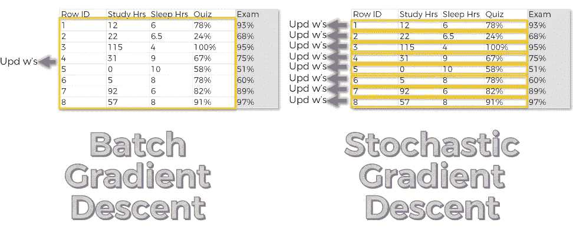*

*梯度下降与随机梯度下降。[来源](https://www.slideshare.net/KirillEremenko/deep-learning-az-artificial-neural-networks-ann-stochastic-gradient-descent)。*

****随机梯度下降*** 当你的神经网络一次遍历一行数据，计算每行的实际输出。神经网络立即将第一行的实际输出与预期输出进行比较，并反向传播以更新权重，从而完成一个时期。然后对第二行进行同样的操作，比较输出并反向传播以更新权重。一直到最后一行，因此多个历元和多个权重更新会贯穿整个数据集，而不是像梯度下降那样将其视为一个大批次。这有助于避免局部极小值，它比梯度下降法更快，因为它不需要将所有数据加载到内存中并一次遍历它们，而是一次加载一行并更新权重。*

*有一种两全其美的方法叫做 ***小批量梯度下降*** ，它基本上是将两者结合起来。您可以决定一次运行和更新多少行。因此，您可以灵活地选择运行任意数量的行，而不是将整个数据集作为一批运行，或者一次运行一行。*

## *反向传播*

*现在你应该知道什么是反向传播，如果你不知道，那么它只是在计算成本函数后调整你的神经网络中所有神经元的权重。反向传播是你的神经网络学习的方式，它是计算成本函数的结果。需要知道的重要概念是反向传播同时更新所有神经元的所有权重。*

*出于训练目的，在开始时，神经元的权重用小数字随机初始化，然后通过学习和反向传播，权重开始用有意义的值更新。*

***最后**，我希望你喜欢这个深度学习的快速介绍，现在你应该对一些常见术语有了更好的理解，如神经元、反向传播、权重、激活和成本函数。*

*机器学习、人工智能和深度学习是非常令人兴奋的话题，将改变每个行业，取决于你的工作职能，你需要对它们有一些了解。*